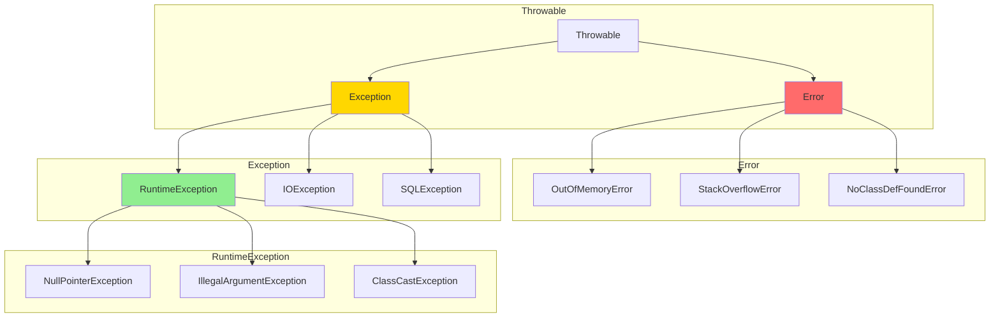

# 异常体系

**目标级别**：P5

## 快速自测

面试官问：「Error 和 Exception 的区别是什么？checked 和 unchecked 异常的区别？」

你能回答到第几层？

---

## 一、核心问题

### 🔴 Java 异常体系



### 异常分类

| 类型 | 说明 | 是否受检 |
|------|------|----------|
| **Error** | JVM 错误，无法恢复 | unchecked |
| **RuntimeException** | 运行时异常，程序逻辑错误 | unchecked |
| **Checked Exception** | 受检异常，必须处理 | checked |

---

## 二、checked vs unchecked

### 区别

```java
// Unchecked Exception（运行时异常）
// 不需要强制声明或捕获
public void divide(int a, int b) {
    if (b == 0) {
        throw new ArithmeticException("除数不能为0");
    }
    return a / b;
}

// Checked Exception（受检异常）
// 必须声明或捕获
public void readFile() throws IOException {
    FileReader reader = new FileReader("file.txt");
    reader.read();  // 必须处理 IOException
}
```

### 常见异常分类

```java
// RuntimeException (Unchecked)
NullPointerException          // 空指针
ArrayIndexOutOfBoundsException // 数组越界
IllegalArgumentException     // 非法参数
ClassCastException           // 类型转换异常
ArithmeticException          // 算术异常
ConcurrentModificationException // 并发修改

// IOException (Checked)
FileNotFoundException        // 文件未找到
EOFException                 // 文件结束
MalformedURLException        // URL 格式错误

// Other
SQLException                 // 数据库异常
NoSuchMethodException        // 方法未找到
```

---

## 三、异常处理

### try-catch-finally

```java
try {
    // 可能抛出异常的代码
    int result = 10 / 0;
} catch (ArithmeticException e) {
    // 处理 ArithmeticException
    System.out.println("算术异常: " + e.getMessage());
} catch (Exception e) {
    // 处理其他异常
    System.out.println("异常: " + e.getMessage());
} finally {
    // 无论是否异常都执行
    System.out.println("finally 执行");
}
```

### try-with-resources

```java
// JDK 7+ 自动关闭资源
try (FileReader reader = new FileReader("file.txt");
     BufferedReader br = new BufferedReader(reader)) {
    String line;
    while ((line = br.readLine()) != null) {
        System.out.println(line);
    }
} // 自动调用 close()

// JDK 9+ 可以使用已声明的变量
FileReader reader = new FileReader("file.txt");
try (reader) {  // 注意：这里需要外部变量名
    // ...
}
```

### 多异常捕获

```java
// JDK 7+ 可以合并 catch
try {
    // ...
} catch (IOException | SQLException e) {
    // e 必须是 final 或 effectively final
    System.out.println("IO 或 SQL 异常: " + e.getMessage());
}

// 不能捕获没有共同父类的异常
// catch (IOException | NullPointerException) // 编译错误
```

---

## 四、异常链

### 异常传播

```java
try {
    // 业务代码
    doSomething();
} catch (Exception e) {
    // 包装异常，保留原始异常
    throw new BusinessException("业务处理失败", e);
}

// 获取原始异常
try {
    // ...
} catch (BusinessException e) {
    Throwable cause = e.getCause();  // 获取原始异常
    cause.printStackTrace();
}
```

### 最佳实践

```java
// ✅ 正确：保留原始异常
throw new ServiceException("服务调用失败", e);

// ❌ 错误：丢失异常链
throw new ServiceException("服务调用失败");
// 原始堆栈丢失
```

---

## 五、面试题精讲

### 🔴 第一层：Error 和 Exception 的区别？

> **参考答案**：
>
> | 类型 | 说明 | 处理方式 |
> |------|------|----------|
> | **Error** | JVM 错误，如 OutOfMemoryError、StackOverflowError | 不需要处理，也无法处理 |
> | **Exception** | 程序异常，如 IOException、NullPointerException | 需要处理或声明 |
>
> Error 是程序无法恢复的错误，通常由 JVM 抛出；Exception 是程序可以处理的异常。

### 🟡 第二层：checked 和 unchecked 的区别？

> **参考答案**：
>
> | 类型 | 区别 | 编译检查 |
> |------|------|----------|
> | **Checked（受检异常）** | 必须声明或捕获 | 是 |
> | **Unchecked（非受检异常）** | RuntimeException 及其子类 | 否 |
>
> Checked 异常如 IOException、SQLException；Unchecked 异常如 NullPointerException、IllegalArgumentException。

### 🟡 第三层：finally 和 return 的执行顺序？

> **参考答案**：
>
> ```java
> public int test() {
>     try {
>         return 1;
>     } finally {
>         System.out.println("finally");
>     }
> }
> // 输出：finally
> // 返回值：1
> ```
>
> finally 块总是在 return 之前执行。如果 finally 中也有 return，会覆盖 try 中的返回值。

### 💡 第四层：异常处理的最佳实践？

> **参考答案**：
>
> 1. **不要捕获 Throwable**：Error 不应该被捕获
> 2. **不要忽略异常**：至少要记录日志
> 3. **不要吞掉异常**：catch 后要处理或重新抛出
> 4. **使用具体异常类型**：避免捕获 Exception
> 5. **使用异常链**：保留原始异常信息

---

## 六、常见错误与陷阱

### ⚠️ 陷阱 1：finally 中的 return

```java
// 错误：finally 中的 return 会覆盖 try 中的 return
public int bad() {
    try {
        return 1;
    } finally {
        return 2;  // 返回 2，不是 1
    }
}

// 错误：finally 中的异常会覆盖 try 中的异常
try {
    throw new RuntimeException("try");
} finally {
    throw new RuntimeException("finally");  // 抛出 finally 的异常
}
```

### ⚠️ 陷阱 2：资源关闭顺序

```java
// 错误：先开后关，后开的先关
OutputStream out1 = new FileOutputStream("a.txt");
OutputStream out2 = new FileOutputStream("b.txt");
// 应该先关 out2，再关 out1

// 正确：使用 try-with-resources
try (OutputStream out1 = new FileOutputStream("a.txt");
     OutputStream out2 = new FileOutputStream("b.txt")) {
    // ...
} // 自动按声明顺序反向关闭
```

### ⚠️ 陷阱 3：过度使用异常

```java
// 错误：用异常处理业务逻辑
try {
    int value = findUser(userId);
} catch (UserNotFoundException e) {
    // 用户不存在是正常流程，不应该用异常
}

// 正确：返回 null 或 Optional
User user = userMap.get(userId);
if (user == null) {
    // 用户不存在
}
```

---

## 七、对比总结表

| 维度 | Error | Exception | RuntimeException |
|------|-------|----------|------------------|
| **性质** | JVM 错误 | 程序异常 | 程序逻辑错误 |
| **处理** | 不需要处理 | 应该处理 | 可以不处理 |
| **编译检查** | 否 | 是（checked） | 否（unchecked） |
| **示例** | OOM, SOF | IOException | NPE, IAE |

| 异常处理方式 | 适用场景 |
|-------------|---------|
| try-catch | 捕获并处理异常 |
| throws | 方法声明向上抛出 |
| throw | 主动抛出异常 |
| try-with-resources | 自动关闭资源 |

---

## 八、扩展思考

### 异常性能影响

```java
// 创建异常有性能开销
try {
    doSomething();
} catch (Exception e) {
    // 每次创建 Exception 都有开销
}

// 高频场景可以使用预创建异常
private static final Exception CACHE_EXCEPTION = new Exception();
if (condition) {
    throw CACHE_EXCEPTION;  // 复用异常对象
}
```

---

## 延伸阅读

- [try-catch-finally 执行顺序](./try-catch)
- [checked vs unchecked](./checked-unchecked)
- [异常处理最佳实践](./exception-best-practices)
- [日志框架与异常](../java-basic/logging)
