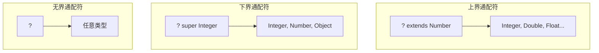

# 泛型

**目标级别**：P5 / P6

## 快速自测

面试官问：「什么是类型擦除？`List` 和 `List` 的区别是什么？」

你能回答到第几层？

---

## 一、核心问题

### 🔴 什么是泛型？

泛型是 JDK 5 引入的特性，允许在编译时进行类型检查，提高代码复用性。

```java
// 没有泛型
List list = new ArrayList();
list.add("hello");
String s = (String) list.get(0);  // 需要强制转型

// 有泛型
List<String> list = new ArrayList<>();
list.add("hello");
String s = list.get(0);  // 无需转型，编译时检查
```

### 泛型类/接口/方法

```java
// 泛型类
class Box<T> {
    private T value;
    public T get() { return value; }
    public void set(T value) { this.value = value; }
}

// 泛型接口
interface Generator<T> {
    T generate();
}

// 泛型方法
class Util {
    public static <T> T getFirst(List<T> list) {
        return list.get(0);
    }
}

// 使用
Box<Integer> intBox = new Box<>();
Util.<String>getFirst(list);
```

---

## 二、类型擦除

### 🔴 什么是类型擦除？

Java 的泛型是**编译时特性**，运行时会被擦除，虚拟机不保留泛型信息。

```java
List<String> stringList = new ArrayList<>();
List<Integer> intList = new ArrayList<>();

// 运行时比较
stringList.getClass() == intList.getClass();  // true！
// 都是 ArrayList.class
```

### 擦除规则

```java
// 1. 无界泛型擦除为 Object
class Box<T> {
    private T value;
    // 编译后：
    // private Object value;
}

// 2. 有界泛型擦除为上界
class Box<T extends Number> {
    private T value;
    // 编译后：
    // private Number value;
}
```

### 擦除后的桥方法

```java
class Node<T> {
    private T data;
    
    public void setData(T data) {
        this.data = data;
    }
}

// 编译后生成桥方法
class Node {
    private Object data;
    
    public void setData(Object data) {  // 桥方法
        this.setData((String) data);     // 调用泛型方法
    }
    
    // 泛型方法（编译器生成）
    public void setData(String data) {
        this.data = data;
    }
}
```

---

## 三、通配符

### 三种通配符

```java
// 1. 无界通配符 <?>
// 可以读取，不能写入（写入 null）
List<?> list = new ArrayList<String>();
Object obj = list.get(0);  // 读取 OK
list.add("hello");         // 编译错误

// 2. 上界通配符 <? extends T>
// 可以读取，不能写入
List<? extends Number> list = new ArrayList<Integer>();
Number num = list.get(0);  // 读取 OK
list.add(1);               // 编译错误

// 3. 下界通配符 <? super T>
// 可以写入（写入 T 或子类），读取为 Object
List<? super Integer> list = new ArrayList<Number>();
list.add(1);                // 写入 OK
Object obj = list.get(0);   // 读取 OK（类型是 Object）
```

### 通配符图解



### PECS 原则

```java
// PECS: Producer Extends, Consumer Super

// 生产者（读取数据）：用 extends
public double sumOfList(List<? extends Number> list) {
    double sum = 0;
    for (Number n : list) {  // 读取 OK
        sum += n.doubleValue();
    }
    return sum;
}

// 消费者（写入数据）：用 super
public void addNumbers(List<? super Integer> list) {
    list.add(1);  // 写入 OK
    list.add(2);
}
```

---

## 四、泛型约束

### 不能实例化

```java
// 错误：不能 new T()
class Box<T> {
    private T value = new T();  // 编译错误
}

// 正确：使用反射
class Box<T> {
    private T value;
    
    public Box(Class<T> clazz) throws Exception {
        value = clazz.newInstance();
    }
}
```

### 不能使用 primitive type

```java
// 错误：不能使用基本类型
List<int> list;  // 编译错误

// 正确：使用包装类型
List<Integer> list;
```

### 不能 throws 泛型异常

```java
// 错误
class Calculator<T extends Exception> {
    void calculate() throws T {  // 编译错误
    }
}
```

---

## 五、面试题精讲

### 🔴 第一层：泛型的类型擦除？

> **参考答案**：
>
> Java 泛型是编译时特性，运行时被擦除：
> - 无界泛型 `<T>` 擦除为 `Object`
> - 有界泛型 `<T extends Number>` 擦除为 `Number`
>
> 编译器会生成桥方法保证多态性。

### 🟡 第二层：`List` 和 `List` 的区别？

> **参考答案**：
>
> | 维度 | `List<String>` | `List<Integer>` |
> |------|---------------|-----------------|
> | **编译时** | 不同 | 不同 |
> | **运行时** | 相同（都是 List） | 相同 |
> | **类型安全** | 是 | 是 |
>
> 两者在编译后都变成 `List`，但编译器会检查类型一致性。

### 🟡 第三层：通配符的使用场景？

> **参考答案**：
>
> - `? extends T`：读取数据，不需要写入
> - `? super T`：写入数据，不需要读取具体类型
> - `?`：只用于方法参数，只读取

### 💡 第四层：为什么需要桥方法？

> **参考答案**：
>
> 为了保证类型擦除后的多态性：
> ```java
> class Node<T> {
>     public void set(T obj) { ... }
> }
>
> class StringNode extends Node<String> {
>     @Override
>     public void set(String obj) { ... }
> }
> ```
> 编译后：
> ```java
> class StringNode extends Node {
>     // 桥方法
>     public void set(Object obj) {
>         this.set((String) obj);
>     }
> }
> ```

---

## 六、常见错误与陷阱

### ⚠️ 陷阱 1：泛型数组

```java
// 错误：不能创建泛型数组
new List<String>[10];  // 编译错误

// 正确：使用通配符数组
List<String>[] array = (List<String>[]) new List<?>[10];
```

### ⚠️ 陷阱 2：静态方法不能访问泛型

```java
class Box<T> {
    private T value;
    
    // 错误：静态方法不能使用类泛型
    public static T getValue() {
        return value;  // 编译错误
    }
    
    // 正确：静态方法定义自己的泛型
    public static <T> T getValue(T defaultValue) {
        return defaultValue;
    }
}
```

### ⚠️ 陷阱 3：catch 子句不能使用泛型

```java
// 错误
try {
    // ...
} catch (T e) {  // 编译错误
}
```

---

## 七、对比总结表

| 通配符 | 读取 | 写入 | 使用场景 |
|--------|------|------|----------|
| `?` | Object | null | 只作为方法参数 |
| `? extends T` | T（安全） | null | 生产者/读取 |
| `? super T` | Object | T 或子类 | 消费者/写入 |

| 泛型擦除 | 擦除为 |
|---------|--------|
| `<T>` | Object |
| `<T extends Number>` | Number |
| `<T super Integer>` | 不合法 |

---

## 延伸阅读

- [Lambda 表达式原理](../new-features/lambda)
- [Stream 流操作](../new-features/stream)
- [注解](../java-basic/annotation)
- [Class 类与反射](../java-basic/reflection)
