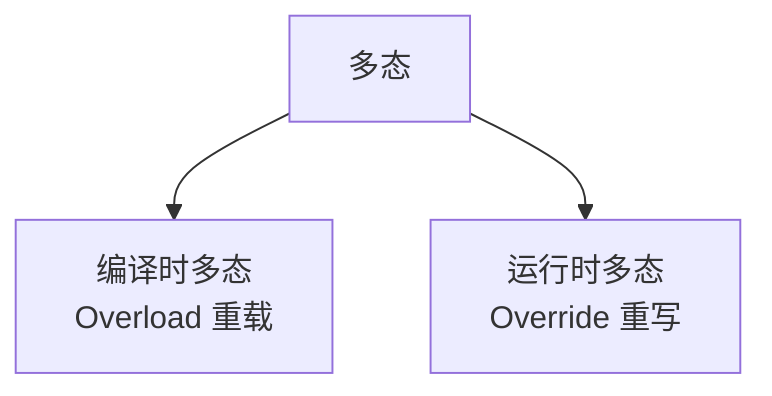
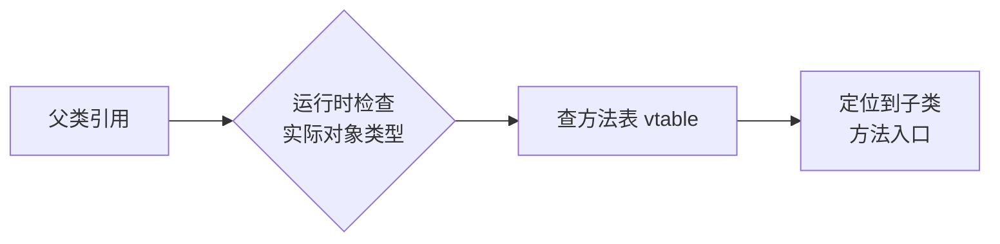

候选人小刘坐在字节跳动1-2级别的面试间里，面试官翻了翻简历，开口问道：

"面向对象的三大特性是什么？"

小刘脱口而出："封装、继承、多态。"

面试官点点头："分别说说你是怎么理解的。"

小刘开始背："封装是把属性和行为包装到类里...继承是子类继承父类...多态是..." 说到一半卡住了，支支吾吾。

面试官追问："多态怎么理解？运行时多态和编译时多态有什么区别？"

小刘彻底卡壳了。

【面试官心理】
这道题太基础了，90%的候选人能答出三个名字，但被追问到细节就原形毕露。我想知道的是：他有没有真正理解这三个特性背后的设计意图，能不能说出"为什么要有这些特性"，以及能不能结合实际项目讲清楚。

## 一、封装 🔴

### 1.1 问题拆解

**第一层：怎么用？**
面试官问："封装是什么？为什么要封装？"

**第二层：底层实现**
追问："Java 里怎么实现封装？private 关键字的作用范围是什么？"

**第三层：边界缺陷**
追问："全部用 private 就安全了吗？反射能不能破门而入？"

**第四层：选型 trade-off**
追问："你在项目里是怎么用封装的？什么情况下会故意暴露一些方法？"

### 1.2 ❌ 错误示范

**候选人原话**："封装就是把属性和方法藏起来，不让别人直接访问。"

**问题诊断**：
- 只说了"what"，没说"why"
- 把封装当成"藏起来"，完全不理解它是"边界控制"
- 不知道 `private` 只能防君子不防小人——反射可以破掉

**面试官内心 OS**："这个候选人肯定是在背八股，连封装的核心目的都没理解..."

### 1.3 标准回答

#### 什么是封装

封装不是"把东西藏起来"，而是**定义清晰的边界，控制谁能看到、谁能修改、谁能动**。

Java 里用访问修饰符实现这个边界：

```java
public class User {
    // 属性私有：外部不能直接访问
    private String name;
    private int age;

    // 方法公开：提供受控的访问入口
    public String getName() {
        return name;
    }

    public void setAge(int age) {
        // 可以在 setter 里加校验
        if (age < 0 || age > 150) {
            throw new IllegalArgumentException("年龄不合理");
        }
        this.age = age;
    }
}
```

#### 封装的真正价值

| 场景 | 没有封装的结局 | 封装后的保障 |
| --- | --- | --- |
| 直接暴露 `age` 字段 | 任何人可以设成负数 | setter 里加校验，非法值进不来 |
| 字段类型变了 | 所有调用方代码全要改 | 只需要改 getter/setter，调用方无感知 |
| 需要加日志/缓存 | 要改所有调用方 | 改动在类内部，调用方无感 |

:::tip 💡
封装的本质是**对修改关闭，对扩展开放**的第一次实践。把变化点隔离在一个类的内部，防止变化蔓延到整个代码库。
:::

### 1.4 追问升级

**面试官追问**："那 private 是不是就完全安全了？"

这道题是 P6/P7 分水岭。标准答案是：

```java
public class User {
    private String name;

    // 普通方式访问不了
    private String getSecret() { return "xxx"; }
}

// 但反射可以破门
public static void main(String[] args) throws Exception {
    User user = new User();
    Field field = User.class.getDeclaredField("name");
    field.setAccessible(true);  // 这一行绕过了访问检查
    field.set(user, "hacked");
}
```

所以 `private` 不是安全机制，是**代码规范机制**。真正的安全靠的是模块边界、接口设计、JVM 安全管理器。

【面试官心理】
能答出"反射可以破坏封装"的候选人，说明他真正写过代码、踩过坑，甚至看过一些底层的书。这种人通常不会被表面答案迷惑。

## 二、继承 🔴

### 2.1 问题拆解

**第一层：怎么用？**
面试官问："继承的作用是什么？子类能继承父类的什么？"

**第二层：底层实现**
追问："private 方法能被继承吗？构造方法呢？"

**第三层：边界缺陷**
追问："Java 为什么是单继承？接口为什么可以多继承？"

**第四层：选型 trade-off**
追问："继承和组合有什么区别？什么时候用继承，什么时候用组合？"

### 2.2 ❌ 错误示范

**候选人原话**："继承就是子类拥有父类的所有东西，包括属性和方法。"

**问题诊断**：
- 错误1：private 成员不能被继承访问，只能被继承持有（存在于子类对象中）
- 错误2：构造方法不能被继承
- 错误3：把继承当成"复制"，不理解它本质是"is-a"关系

**面试官内心 OS**："连继承能继承什么都说不对，可见从来没认真看过继承的细节..."

### 2.3 标准回答

#### 继承的本质：is-a 关系

```java
// Dog is an Animal，所以 Dog 继承 Animal
public class Animal {
    protected String name;

    public void eat() {
        System.out.println("Animal is eating");
    }
}

public class Dog extends Animal {
    // name 从父类继承过来了
    // eat() 方法也继承过来了

    public void bark() {
        System.out.println("Dog is barking");
    }
}
```

#### 继承能获得什么

| 父类成员 | 能继承吗 | 能直接访问吗 |
| --- | --- | --- |
| `public` 字段/方法 | ✅ | ✅ |
| `protected` 字段/方法 | ✅ | ✅ |
| `private` 字段/方法 | ✅ | ❌（但存在于对象中） |
| `default` 字段/方法 | ✅（同包） | ✅（同包） |
| 构造方法 | ❌ | ❌ |

:::warning ⚠️
子类对象在内存中**确实包含**父类的字段，哪怕父类字段是 private 的。子类不能直接访问，但可以通过 `super.xxx()` 间接访问（如果父类提供了方法）。
:::

#### Java 为什么是单继承

C++ 支持多继承，但带来了"菱形继承"问题：

```cpp
// C++ 的菱形继承问题
class A { public: int x; };
class B : public A {};
class C : public A {};
class D : public B, public C {};  // D 有两个 A 子对象，x 到底是谁的？
```

Java 砍掉了多继承，只允许**单继承 + 多接口**，完美绕开了这个问题：

```java
// 只能单继承
public class Dog extends Animal {}

// 但可以实现多个接口
public class Dog extends Animal implements Runnable, Serializable {}
```

### 2.4 追问升级

**面试官追问**："组合和继承有什么区别？"

这道题是 P7 的高频区分点：

```java
// 继承：is-a 关系，耦合度高
public class Dog extends Animal {
    // Dog IS an Animal，父类的变化直接影响子类
}

// 组合：has-a 关系，耦合度低
public class Dog {
    private Animal animal;  // Dog HAS an Animal，组合关系更灵活
    // 更推荐：多用组合，少用继承
}
```

**继承 vs 组合**：

| 维度 | 继承 | 组合 |
| --- | --- | --- |
| 耦合度 | 高（父子紧耦合） | 低（依赖接口） |
| 灵活性 | 低（编译时绑定） | 高（运行时可替换） |
| 复用方式 | 白盒复用（能看到父类实现） | 黑盒复用（只看接口） |
| 建议 | 优先避免 | 优先使用 |

:::tip 💡
GoF 设计模式有一条铁律：**优先使用组合而不是继承**。继承是白盒复用，组合是黑盒复用。后者更灵活，更符合"对修改关闭"的原则。
:::

## 三、多态 🔴

### 3.1 问题拆解

**第一层：怎么用？**
面试官问："多态是什么？Java 里怎么实现多态？"

**第二层：底层实现**
追问："重载（Overload）是多态吗？重写（Override）呢？"

**第三层：边界缺陷**
追问："父类引用指向子类对象时，调用方法看的是谁？访问字段呢？"

**第四层：选型 trade-off**
追问："你在项目里是怎么用多态的？有没有用过策略模式或者模板方法？"

### 3.2 ❌ 错误示范

**候选人原话**："多态就是父类引用指向子类对象，调用方法时调的是子类的方法。"

**问题诊断**：
- 把多态等同于"父类引用指向子类对象"，忽略了方法调用的绑定机制
- 不知道字段不存在多态，字段看的是引用类型，不是对象类型
- 完全混淆了编译时多态（重载）和运行时多态（重写）

### 3.3 标准回答

#### 多态的两大类型



**编译时多态（重载）**：方法名相同，参数不同。编译器根据参数类型决定调用哪个方法。

```java
public class Calculator {
    public int add(int a, int b) {
        return a + b;
    }

    public double add(double a, double b) {  // 重载：参数类型不同
        return a + b;
    }

    public int add(int a, int b, int c) {    // 重载：参数个数不同
        return a + b + c;
    }
}
```

**运行时多态（重写）**：父类引用指向子类对象，调用方法时执行的是子类的实现。

```java
public class Animal {
    public void sound() {
        System.out.println("Animal makes a sound");
    }
}

public class Dog extends Animal {
    @Override
    public void sound() {  // 重写：运行时决定
        System.out.println("Dog barks");
    }
}

// 调用
Animal animal = new Dog();  // 父类引用指向子类对象
animal.sound();  // 打印 "Dog barks"，不是 "Animal makes a sound"
```

#### 字段不存在多态

这是 P6 高频翻车点，记住一句话：**方法看对象，字段看引用**。

```java
public class Father {
    public String name = "Father";
    public void print() { System.out.println("Father"); }
}

public class Son extends Father {
    public String name = "Son";  // 字段不存在多态！

    @Override
    public void print() {
        System.out.println("Son");
    }
}

public static void main(String[] args) {
    Father f = new Son();
    System.out.println(f.name);  // 打印 "Father"，不是 "Son"！
    f.print();                   // 打印 "Son"
}
```

:::warning ⚠️
字段的访问在编译时就确定了，看的是引用类型 `Father`，而不是实际对象类型 `Son`。这是 90% 的候选人都会忽略的细节，也是 P6 面试的经典追问点。
:::

### 3.4 追问升级

**面试官追问**："运行时多态是怎么实现的？JVM 怎么找到正确的方法？"

这道题考察的是对 JVM 底层机制的理解：

1. **静态分派（重载）**：编译器根据参数的**静态类型**决定调用哪个重载方法，在编译阶段就确定了。
2. **动态分派（重写）**：运行时通过**方法表（vtable）** 找到实际对象的方法实现。



```java
// JVM 的实际过程（简化）
// 当调用 animal.sound() 时：
// 1. 栈帧里拿着一个 reference 类型的变量 animal
// 2. 通过 reference 找到堆里的实际对象（Son 类型）
// 3. Son 对象头部有类型指针，指向其类的方法表
// 4. 在方法表里找 sound() 方法，找到的是 Son.sound 的入口地址
// 5. 跳转执行
```

【面试官心理】
能说出"方法表 vtable"的候选人，说明他对 JVM 有过深入研究。这种底层认知是把 P6 和 P5 拉开差距的关键。

## 四、生产避坑

### 4.1 继承的坑：脆弱的基类

这是生产环境中继承翻车的经典场景：

```java
// 祖传代码
public class BaseDao {
    public void update(Object entity) {
        // 原有逻辑...
    }
}

// 某天有人改了基类
public class BaseDao {
    public void update(Object entity) {
        checkPermission();  // 新增了这个
        // 原有逻辑...
    }
}

// 子类继承了这个方法，但基类的变化导致了子类的行为改变
// 导致某条数据线上事故，因为权限检查的逻辑有问题
```

**教训**：继承是强耦合。基类的变化会像涟漪一样扩散到所有子类。优先用**组合 + 接口**，把依赖方向控制住。

### 4.2 多态的坑：NPE 杀手

```java
// 错误写法：父类引用指向了 null
Animal animal = null;
animal.sound();  // 运行时抛出 NullPointerException

// 正确写法：先判空
if (animal != null) {
    animal.sound();
}
```

## 五、工程选型

| 场景 | 推荐方案 | 原因 |
| --- | --- | --- |
| 类之间有明显的 is-a 关系 | 继承 | 语义清晰 |
| 想复用代码但不是 is-a | 组合 + 接口 | 降低耦合 |
| 需要多种实现可以替换 | 多态 + 接口 + 策略模式 | 符合开闭原则 |
| 需要扩展但不能改原有代码 | 组合优于继承 | 对修改关闭 |

:::tip 💡
记住一个设计原则的优先级：**组合 > 继承**。继承用得好是利器，用不好就是技术债务。一个简单的判断标准——如果你在写 is-a 关系时感到别扭，那就用组合。
:::

## 六、面试总结

| 级别 | 期望回答 | 判分标准 |
| --- | --- | --- |
| P5 | 能说出三大特性名字，简单解释含义 | 背书水平，不深入追问能过 |
| P6 | 能解释 how + why，知道 private 不等于安全，字段不看多态 | 追问 2-3 轮不崩，细节拿捏 |
| P7 | 能讲清 JVM 方法表、继承 vs 组合的工程代价，能结合项目讲实战 | 有架构视角，有生产踩坑经验 |

三大特性不是孤立的知识点，它们是 Java 设计思想的一体三面：**封装**定义了边界，**继承**实现了复用，**多态**实现了灵活。理解了这三个"为什么"，才算真正理解面向对象。
