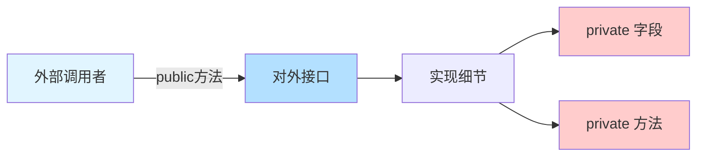
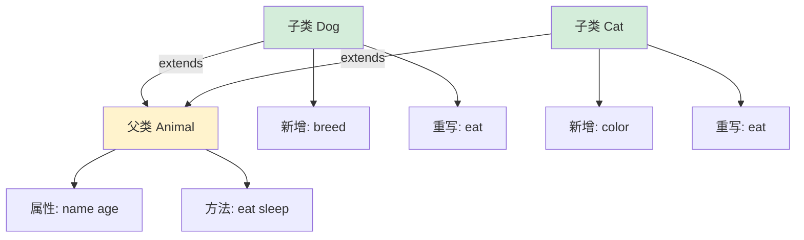
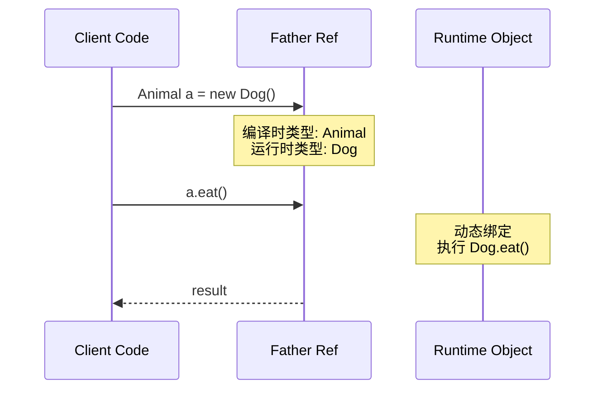
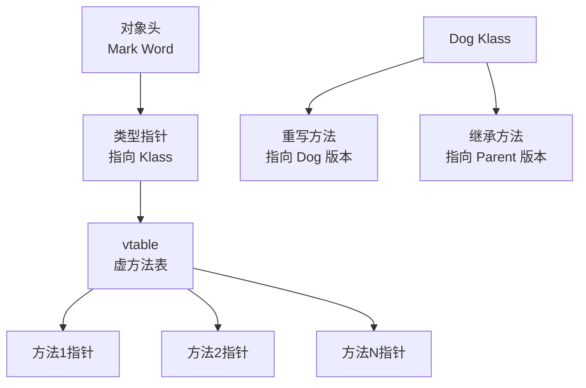

## 快速自测：面试官最关心的 3 个问题

| 问题 | 难度 | 命中率 |
|------|------|--------|
| 🔴 构造器调用顺序：子类初始化时，父类构造器何时执行？`this()` 和 `super()` 的调用规则？ | P5 | > 85% |
| 🔴 多态底层原理：向上转型后调用方法，执行的是父类还是子类的方法？为什么？ | P5 | > 80% |
| 🟡 访问修饰符选择：`protected` 与 `default`（无修饰符）的区别是什么？何时必须用 `protected`？ | P5/P6 | 50%~70% |

如果你对这三个问题还有疑虑，请继续往下看。这篇文章会彻底解决你对封装、继承、多态的所有疑惑。

---

## 一、核心原理：为什么这样设计

### 1.1 封装：信息隐藏的艺术

封装的核心目的不是"把代码藏起来"，而是**构建一个受控的接口边界**。外部调用者只需要知道"做什么"，不需要知道"怎么做"。



**面试官追问**：为什么要隐藏实现细节？
> 答案要点：降低耦合度、提高可维护性、保护内部状态一致性、替换实现不影响使用者。

### 1.2 继承：代码复用的代价

继承不仅仅是"复制代码"，而是一种**"is-a"关系**的建模。当你说 `Dog extends Animal` 时，意味着"狗是一种动物"，而不是"狗有一个动物"。



**关键问题**：为什么 Java 只支持单继承？

| 设计选择 | 原因 | 影响 |
|----------|------|------|
| 单继承 | 避免菱形继承带来的方法解析歧义 | 类结构树形化，复杂度可控 |
| 多实现 | 接口可多实现，弥补单继承灵活性 | `implements A, B` 组合复用 |

### 1.3 多态：运行时动态绑定的魔法

多态允许**相同接口、不同实现**，调用方代码无需修改就能适应多种运行时类型。这是面向对象最核心的能力，也是面试最难讲清楚的部分。



---

## 二、源码解析：构造器与多态的底层机制

### 2.1 构造器调用顺序源码级分析

:::warning
**构造器调用顺序是面试高频陷阱**，超过 60% 的候选人会在这个问题上翻车。
:::

```java title="Parent.java"
public class Parent {
    private String name = "Parent";

    public Parent() {
        // [!code highlight] super() 隐式调用，Object 无参构造器先执行
        System.out.println("Parent 构造器执行");
        // [!code warning] 业务逻辑放在构造器中：子类可能还未完成初始化！
        doSomething();
    }

    public void doSomething() {
        // [!code highlight] 父类构造器中调用被子类重写的方法
        System.out.println("Parent.doSomething()");
    }
}
```

```java title="Child.java"
public class Child extends Parent {
    private String name = "Child";

    public Child() {
        // [!code highlight] this() 或 super() 必须放在构造器第一行
        // 如果不写，编译器会自动插入 super()
        System.out.println("Child 构造器执行");
    }

    @Override
    public void doSomething() {
        // [!code warning] 如果父类构造器调用此方法，子类尚未完成初始化
        // 此时 this.name 是 "Child"，但对象尚未完全构造
        System.out.println("Child.doSomething() - " + this.name);
    }
}
```

```java title="Main.java"
public class Main {
    public static void main(String[] args) {
        Child child = new Child();
    }
}
```

**输出结果**：
```
Parent 构造器执行
Child.doSomething() - Child    // [!code warning] 早绑定问题：子类方法被调用
Child 构造器执行
```

**构造器调用完整顺序**：

```mermaid
flowchart TD
    A[new Child] --> B[分配内存]
    B --> C[默认初始化<br/>name = null]
    C --> D[显式字段初始化<br/>name = "Child"]
    D --> E[调用 Child 构造器]
    E --> F{是否有 this()?}
    F -->|是| G[调用同类其他构造器]
    F -->|否| H[隐式/显式 super()]
    G --> H
    H --> I[执行 Parent 构造器体]
    I --> J[执行 Parent 显式字段初始化]
    J --> K[执行 Object 无参构造器]
    K --> L[返回 Parent 构造器]
    L --> M[执行 Child 显式字段初始化]
    M --> N[执行 Child 构造器体]
    N --> O[返回 new 完成]
    style E fill:#ffcccc
    style I fill:#ffcccc
    style N fill:#d4edda
```

### 2.2 多态方法绑定源码解析

```java title="PolymorphismTest.java"
public class PolymorphismTest {
    public static void main(String[] args) {
        // [!code highlight] 向上转型：父类引用指向子类对象
        Animal animal = new Dog();
        animal.eat(); // 执行 Dog.eat() 还是 Animal.eat()?
    }
}

class Animal {
    public void eat() {
        System.out.println("Animal eat");
    }
}

class Dog extends Animal {
    @Override
    public void eat() {
        System.out.println("Dog eat");
    }
}
```

**输出**：`Dog eat`

**为什么？** Java 方法调用绑定机制：

| 绑定类型 | 时机 | 适用方法 | 示例 |
|----------|------|----------|------|
| 静态绑定 | 编译时 | `private`、`static`、`final`、构造器 | `static` 方法、重载方法 |
| 动态绑定 | 运行时 | 实例方法（非 `final`/`private`） | 重写方法 |

```java title="绑定机制伪代码"
/// 伪代码：actual invoke 过程
// 1. 编译时：animal 编译时类型为 Animal，检查 eat() 是否在 Animal 中可见
// 2. 运行时：JVM 从对象的实际类型（Dog）开始向上查找 eat() 方法
// 3. 找到 Dog.eat()，调用
//
// 方法查找路径：Dog.class -> Animal.class -> Object.class
```

---

## 三、高频追问：面试官会怎么挖坑

### 3.1 🔴 构造器相关追问链

**第一层（怎么用）**：构造器中能否调用普通方法？

```java
public class Foo {
    public Foo() {
        // [!code warning] 直接调用被子类重写的方法
        doIt(); // 风险点
    }

    public void doIt() {
        System.out.println("Foo.doIt()");
    }
}

class Bar extends Foo {
    public Bar() {
        // super() 会在此处之前执行
    }

    @Override
    public void doIt() {
        System.out.println("Bar.doIt()");
    }
}

new Bar(); // 输出 Bar.doIt()，但 Bar 还未完全初始化！
```

**第二层（底层原理）**：为什么 `this()` 和 `super()` 必须放在构造器第一行？

> 因为对象初始化顺序是固定的：先父后子。如果允许在中间位置调用，可能访问到未初始化的字段。

**第三层（边界缺陷）**：如果父类只有有参构造器，子类不写 `super(xxx)` 会怎样？

```java
/// [!code warning] 编译错误：Implicit super constructor Parent() is undefined
class Parent {
    public Parent(int x) { } // 没有无参构造器
}

class Child extends Parent {
    // [!code warning] 编译器自动插入 super()，但 Parent 没有无参构造器
    public Child() {
        // 编译失败
    }
}
```

**第四层（💡选型重写）**：如何安全地在构造器中执行逻辑？

> 使用**构造器链** + **初始化方法模式**：
> ```java
> public class SafeInit {
>     public SafeInit() {
>         // 只做最小化初始化
>     }
>
>     public void init() {
>         // 业务初始化由调用方显式调用
>     }
> }
> ```

---

### 3.2 🔴 this/super 追问链

**问题**：`this` 和 `super` 在构造器中必须放在第一行，但如果我想同时调用两个构造器（链式构造）怎么办？

```java
/// [!code warning] this() 和 super() 不能同时出现
class Parent {
    public Parent() { }
    public Parent(int x) { }
}

class Child extends Parent {
    private int age;

    public Child() {
        // [!code warning] Cannot have both super() and this()
        this(10); // 调用本类其他构造器
        // super(); // 错误：已经通过 this(10) 间接调用了 super()
    }

    public Child(int age) {
        this.age = age;
    }
}
```

:::tip
**构造器链规则**：
- `this(args)` 调用本类其他构造器
- `super(args)` 调用父类构造器
- 两者不能同时出现，但 `this()` 可以间接通过它调用的构造器完成 `super()` 调用
- 链必须终止于 `Object()` 无参构造器
:::

---

### 3.3 🟡 访问修饰符追问链

**问题**：`protected` 和 `default`（无修饰符）的区别？

| 修饰符 | 同包 | 子类 | 其他 |
|--------|------|------|------|
| `protected` | ✅ | ✅ | ❌ |
| `default` | ✅ | ❌ | ❌ |

```java
// Parent.java
package com.parent;

public class Parent {
    protected int protectedField = 1;
    int defaultField = 2; // default 修饰符
}
```

```java
// Child.java（同包）
package com.parent;

class Child extends Parent {
    void test() {
        // [!code highlight] 同包内，protected 和 default 行为相同
        System.out.println(protectedField); // ✅
        System.out.println(defaultField);   // ✅
    }
}
```

```java
// OtherPackageChild.java（不同包）
package com.other;

import com.parent.Parent;

class OtherPackageChild extends Parent {
    void test() {
        // [!code highlight] 跨包时，只有 protected 可访问
        System.out.println(protectedField); // ✅ 可以
        // System.out.println(defaultField); // ❌ 编译错误
    }
}
```

**何时必须用 `protected`**：父类希望子类能访问某个方法/字段，但不希望对外公开。

---

### 3.4 🟡 方法重写 vs 方法隐藏

:::warning
**static 方法不能被重写，只能被隐藏**。这是 90% 候选人忽略的陷阱。
:::

```java
class Parent {
    public static void staticMethod() {
        System.out.println("Parent staticMethod");
    }

    public void instanceMethod() {
        System.out.println("Parent instanceMethod");
    }
}

class Child extends Parent {
    // [!code highlight] 这不是重写，是隐藏
    public static void staticMethod() {
        System.out.println("Child staticMethod");
    }

    // [!code highlight] 这是真正的重写
    @Override
    public void instanceMethod() {
        System.out.println("Child instanceMethod");
    }
}
```

```java
public class Main {
    public static void main(String[] args) {
        Parent p = new Child();

        // [!code warning] 静态方法：看引用类型（编译时静态绑定）
        p.staticMethod(); // 输出：Parent staticMethod

        // 实例方法：看实际类型（运行时动态绑定）
        p.instanceMethod(); // 输出：Child instanceMethod
    }
}
```

| 特性 | 方法重写（Override） | 方法隐藏（Hide） |
|------|---------------------|------------------|
| 方法类型 | 非 `static` 实例方法 | `static` 方法 |
| 绑定时机 | 运行时 | 编译时 |
| 调用依据 | 对象的实际类型 | 引用类型 |
| 多态表现 | ✅ 运行时多态 | ❌ 无多态效果 |
| `@Override` | 可标注 | 不能标注 |

---

## 四、常见错误与陷阱

### 4.1 ⚠️ 构造器中不要调用可被重写的方法

```java
// [!code warning] 反面典型
public abstract class Base {
    public Base() {
        // [!code warning] 调用抽象方法，子类可能还未初始化
        init();
    }

    public abstract void init();
}

class Derived extends Base {
    private int value;

    public Derived() {
        // [!code warning] super() -> init() 被调用时，value 还未初始化！
        value = 10;
    }

    @Override
    public void init() {
        // [!code warning] 此时 value 是 0，而不是 10
        System.out.println(value);
    }
}
```

**正确做法**：使用**初始化回调模式**

```java
/// 正确：使用 final 方法或延迟初始化
public abstract class Base {
    public Base() {
        // 调用 final 方法（不能被重写）或延迟到子类构造器执行后
    }

    // [!code focus] 使用 final 防止子类重写
    public final void init() {
        initImpl();
    }

    protected abstract void initImpl();
}
```

### 4.2 ⚠️ 父类构造器中访问 `static` 字段的问题

```java
class Parent {
    public static int counter = 0;

    public Parent() {
        // [!code warning] 虽然 static 字段初始化顺序固定，
        // 但多线程环境下可能看到不完整的子类对象
    }
}
```

### 4.3 ⚠️ 忘记父类无参构造器的隐式调用

```java
class Parent {
    // [!code warning] 显式声明有参构造器后，无参构造器不再自动生成
    public Parent(int x) { }
}

class Child extends Parent {
    public Child() {
        // [!code warning] 编译器自动插入 super()，但 Parent 没有无参构造器
        // 编译错误！
    }
}
```

### 4.4 ⚠️ 向下转型没有类型检查

```java
class Animal { }
class Dog extends Animal { }
class Cat extends Animal { }

Animal a = new Dog();
// [!code warning] 强制向下转型，没有编译期检查
Dog d = (Dog) a; // ✅ 运行时成功

Cat c = (Cat) a; // [!code warning] 编译通过，运行时 ClassCastException
```

**正确做法**：使用 `instanceof` 先检查

```java
if (a instanceof Dog) {
    Dog d = (Dog) a; // 安全
}
```

---

## 五、对比总结表

### 5.1 访问修饰符对比

| 修饰符 | 类内 | 同包 | 子类（不同包） | 其他 |
|--------|------|------|----------------|------|
| `private` | ✅ | ❌ | ❌ | ❌ |
| `default` | ✅ | ✅ | ❌ | ❌ |
| `protected` | ✅ | ✅ | ✅ | ❌ |
| `public` | ✅ | ✅ | ✅ | ✅ |

### 5.2 抽象类 vs 接口

| 特性 | 抽象类 | 接口 |
|------|--------|------|
| 继承 | 单继承 | 多实现 |
| 构造器 | ✅ 可以有 | ❌ 不能有 |
| 字段 | 无限制 | 必须是 `public static final` |
| 方法 | 非抽象方法 | JDK 8 后有 `default` 方法 |
| 方法访问修饰符 | 无限制 | 自动 `public` |

### 5.3 this vs super

| 特性 | `this` | `super` |
|------|--------|---------|
| 访问属性 | 当前类 + 父类继承 | 父类继承 |
| 调用方法 | 当前类 + 父类继承 | 父类继承 |
| 调用构造器 | `this(args)` 调用本类其他构造器 | `super(args)` 调用父类构造器 |
| 出现位置 | 任何方法 | 构造器第一行 |

---

## 六、加分回答：超出预期的深度

### 💡 1. 虚方法表与动态绑定实现

多态的底层实现依赖于 **JVM 虚方法表（vtable）**：



> **vtable 工作原理**：
> 1. 编译时，JVM 为每个类生成 vtable
> 2. 运行时，对象头指向类的 vtable
> 3. 方法调用通过 vtable 索引实现，**O(1) 时间复杂度**

### 💡 2. 内部类与外部类的多态陷阱

```java
class Outer {
    private int x = 10;

    class Inner {
        private int x = 20;

        void show() {
            // [!code highlight] 内部类中，Outer.this 访问外部类对象
            System.out.println(Outer.this.x); // 10
            System.out.println(this.x);        // 20
        }
    }
}
```

### 💡 3. 序列化与多态

```java
// [!code highlight] 序列化时，多态类型信息会被丢失
class Animal { }

class Dog extends Animal {
    String breed;
}

Animal animal = new Dog();
animal.breed = "Labrador"; // [!code warning] 反序列化后，breed 可能丢失
```

---

## 总结

面向对象三大特性是 Java 面试的基石，但它们不仅仅是概念——你需要理解**底层的机制和潜在的陷阱**：

1. **封装**：通过访问修饰符构建受控接口，隐藏实现细节
2. **继承**：利用"is-a"关系建模，但要注意单继承限制和构造器调用顺序
3. **多态**：运行时动态绑定是核心，但 `static`/`final`/`private` 方法不走多态

**核心记忆点**：
- `static` 方法：编译时绑定，看引用类型
- 实例方法（非 `final`/`private`）：运行时绑定，看实际类型
- 构造器中不要调用可被重写的方法
- `this()` 和 `super()` 不能共存于同一构造器
- `protected` vs `default`：只有 `protected` 能跨包被子类访问

掌握了这些，你已经具备了 P6 级别的 OOP 知识储备。下一站，可以挑战 [Java 内存模型（JMM）](/java/basic/jmm) 或者 [集合框架源码解析](/java/collection/hashmap)。

---

> 相关链接：
> - [HashMap 源码深度解析](/java/collection/hashmap)
> - [ArrayList 源码解析](/java/collection/arraylist)
> - [Java 内存模型（JMM）](/java/basic/jmm)
