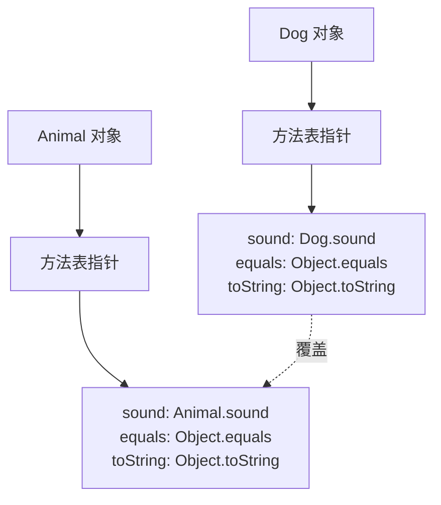

字节跳动P0面试间里，面试官看了看候选人小陈的简历，上面写着"扎实的Java基础"。

"好，那我来问个基础的。"面试官说，"重载和重写有什么区别？"

小陈松了口气，这种题太简单了："重载是同一个类里方法名相同参数不同，重写是子类重写父类的方法。"

面试官点点头，继续追问："那 `int add(int a, int b)` 和 `double add(double a, double b)` 是重载还是重写？"

小陈："重载。"

"为什么？"

小陈："因为...参数类型不同。"

面试官没说话，又问："`void method(List<String> list)` 和 `void method(ArrayList<String> list)` 是重载吗？"

小陈犹豫了一下："...是的？"

面试官放下笔："为什么？或者为什么不是？"

小陈开始擦汗。

【面试官心理】
这道题看似简单，但 60% 的候选人会在第二个追问就卡住——他们只知道"参数不同"是重载，但不知道参数类型的继承关系会不会影响重载的判断。细节决定成败，这道题能稳稳答到最后的，说明真的写过代码、看过编译器的行为。

## 一、核心区别 🔴

### 1.1 问题拆解

**第一层：怎么用？**
面试官问："重载和重写分别是什么？"

**第二层：底层实现**
追问："编译器怎么区分重载的方法？运行时怎么找到正确的方法？"

**第三层：边界缺陷**
追问："`void method(List list)` 和 `void method(ArrayList list)` 是重载吗？返回值不同能重载吗？"

**第四层：选型 trade-off**
追问："你在项目里什么时候用重载，什么时候用重写？"

### 1.2 ❌ 错误示范

**候选人原话**：
- "重载就是方法名相同，重写就是方法名相同但子类有不同实现"
- "重载和重写都是多态的表现"
- "返回值不同也可以重载"

**问题诊断**：
- 把重载和重写混为一谈，都是"方法名相同"
- 不知道重载是编译时多态、重写是运行时多态
- 不清楚重载只看参数，不看返回值
- 不理解"参数类型在继承关系下"的判断规则

**面试官内心 OS**："连重载和重写都分不清，还敢写'扎实的Java基础'..."

### 1.3 标准回答

## 二、重载（Overload）🟡

### 2.1 什么是重载

重载发生在**同一个类**中，方法名相同但**参数列表不同**（参数个数、类型、顺序至少有一项不同）。

```java
public class MathUtil {

    // 重载1：参数个数不同
    public int add(int a, int b) {
        return a + b;
    }

    // 重载2：参数类型不同
    public double add(double a, double b) {
        return a + b;
    }

    // 重载3：参数顺序不同（但必须是不同类型，否则和上面冲突）
    public int add(int a, double b) {
        return (int)(a + b);
    }

    public double add(double a, int b) {  // 重载：顺序不同
        return a + b;
    }
}
```

#### 编译器怎么判断重载

编译器做的是**静态分派**——根据参数的**编译时类型**（静态类型）来选择调用哪个方法：

```java
MathUtil util = new MathUtil();
util.add(1, 2);       // 调用 add(int, int)
util.add(1.0, 2.0);    // 调用 add(double, double)
util.add(1, 2.0);      // 调用 add(int, double)
util.add(1.0, 2);      // 调用 add(double, int)
```

编译器只看**参数声明的类型**，不看实际运行时的对象类型。

### 2.2 重载的边界：继承关系

这是面试官最爱的追问陷阱。来看这道经典题：

```java
public void method(List<String> list) {
    System.out.println("List");
}

public void method(ArrayList<String> list) {
    System.out.println("ArrayList");
}

// 调用
List<String> list = new ArrayList<>();
method(list);  // 打印什么？
```

答案是 **"List"**。因为编译器做静态分派时，看的是变量的**声明类型** `List`，不是**实际类型** `ArrayList`。

:::warning ⚠️
重载判断依赖参数的**静态类型**（声明类型），而不是**动态类型**（实际对象类型）。这是 90% 候选人都会掉进去的坑。
:::

### 2.3 重载的常见翻车

**问题1：返回值不同能重载吗？**

```java
// 编译错误！
public int add(int a, int b) { return a + b; }
public double add(int a, int b) { return a + b; }
```

**不能**。因为编译器在调用 `add(1, 2)` 时无法判断该调用哪个——两个方法都能匹配，编译器会报"reference to add is ambiguous"。

**问题2：为什么需要重载？**

答案是**提高 API 的可用性**。不用重载的话：

```java
// 没有重载的话，Java 程序员要记住四个不同的方法名
int sumInteger(int a, int b);
double sumDouble(double a, double b);
int sumTriple(int a, int b, int c);
double sumTriple(double a, double b, double c);

// 用重载，只需要记一个名字
int sum(int a, int b);
double sum(double a, double b);
int sum(int a, int b, int c);
double sum(double a, double b, double c);
```

## 三、重写（Override）🔴

### 3.1 什么是重写

重写发生在**父子类**之间，子类提供父类方法的**另一个实现**。运行时通过**动态分派**决定调用哪个。

```java
public class Animal {
    public void sound() {
        System.out.println("Animal makes a sound");
    }

    // 私有方法不能被重写
    private void eat() {
        System.out.println("Animal is eating");
    }
}

public class Dog extends Animal {
    @Override  // @Override 注解：让编译器帮你检查是否真的是重写
    public void sound() {
        System.out.println("Dog barks");
    }

    // 这不是重写，是定义了一个新的私有方法
    private void eat() {
        System.out.println("Dog is eating");
    }
}
```

### 3.2 重写的规则

| 规则 | 说明 |
| --- | --- |
| 方法名 | 必须与父类完全相同 |
| 参数列表 | 必须与父类完全相同（这是和重载的本质区别） |
| 返回类型 | 可以是父类返回类型的子类（协变返回） |
| 访问修饰符 | 不能比父类更严格（父 public，子不能 protected/private） |
| 异常 | 不能抛出比父类更宽的检查异常 |
| static 方法 | static 方法不存在重写，是隐藏（hide） |

#### 协变返回类型（P6+ 考点）

```java
public class Animal {
    public Animal create() { return new Animal(); }
}

public class Dog extends Animal {
    @Override
    public Dog create() {  // 返回类型是 Animal 的子类 Dog——这是协变返回
        return new Dog();
    }
}
```

#### static 方法的隐藏（不是重写！）

```java
public class Parent {
    public static void staticMethod() {
        System.out.println("Parent static");
    }

    public void instanceMethod() {
        System.out.println("Parent instance");
    }
}

public class Child extends Parent {
    public static void staticMethod() {  // 这不是重写，是隐藏（hide）
        System.out.println("Child static");
    }

    @Override
    public void instanceMethod() {  // 这才是真正的重写
        System.out.println("Child instance");
    }
}

public static void main(String[] args) {
    Parent p = new Child();
    p.staticMethod();     // 打印 "Parent static"——static 方法看引用类型
    p.instanceMethod();   // 打印 "Child instance"——实例方法看对象类型
}
```

:::warning ⚠️
static 方法没有多态！调用 `p.staticMethod()` 看到的是 `Parent` 的方法，因为 static 方法属于类，不属于对象。这是 P6 面试的经典翻车点。
:::

### 3.3 JVM 怎么实现重写：方法表

运行时多态通过**虚方法表（vtable）** 实现：



当执行 `animal.sound()` 时，JVM 拿着对象的引用找到堆里的对象，通过对象头部的类型指针找到**实际类的方法表**，然后在方法表里找 `sound` 方法的地址——这个地址指向的是 `Dog.sound`。

### 3.4 @Override 注解的价值

```java
public class Child extends Parent {
    @Override  // 加上这个注解
    public void parentMethod() {  // 编译器报错！因为父类没有这个方法
        System.out.println("child");
    }
}
```

`@Override` 的作用是**强制编译器检查这是否真的是一个重写**。如果父类没有匹配的方法签名，编译器直接报错，防止你不小心定义了一个新方法而不是重写。

## 四、重载 vs 重写对比 🔴

| 维度 | 重载（Overload） | 重写（Override） |
| --- | --- | --- |
| 发生位置 | 同一个类 | 父子类 |
| 方法名 | 必须相同 | 必须相同 |
| 参数列表 | 必须不同 | 必须相同 |
| 返回类型 | 无关 | 可以协变（子类） |
| 访问修饰符 | 无关 | 不能更严格 |
| 异常限制 | 无关 | 不能抛出更宽的检查异常 |
| static 方法 | 可以重载 | static 不重写，是隐藏 |
| 多态类型 | 编译时多态（静态分派） | 运行时多态（动态分派） |
| 绑定时期 | 编译器 | 运行时 |

## 五、生产避坑

### 5.1 重载的坑：可变参数

```java
public void print(String... args) {
    System.out.println("varargs");
}

public void print(String s) {
    System.out.println("single");
}

// 调用
print("hello");  // 打印什么？
```

答案是 **"single"**。Java 的优先级是：精确匹配 > 可变参数。所以不会走 varargs 版本。

### 5.2 重写的坑：构造方法

```java
public class Parent {
    public Parent() {
        System.out.println("Parent constructor");
        // 这里调用了一个被子类重写的方法！
        method();
    }

    public void method() {
        System.out.println("Parent method");
    }
}

public class Child extends Parent {
    private String s = new String("init");  // 关键：在父类构造器调用时，子类字段还没初始化

    public Child() {
        System.out.println("Child constructor");
    }

    @Override
    public void method() {
        System.out.println("Child method " + s.length());  // s 可能是 null！
    }
}

public static void main(String[] args) {
    new Child();
}
```

输出是：
```
Parent constructor
Child method 0  // 不是 null！原因见下方解释
Child constructor
```

:::warning ⚠️
这是**构造器中调用被重写方法的坑**。在父类构造器中调用 `method()` 时，虽然 `Child` 还没构造完（`s` 应该是 null），但JVM 为了保证多态，**已经初始化了 `s` 为默认值 `null`**，所以不会 NPE，只会是 0。这反而是一个更隐蔽的 bug——你可能以为数据正确，实际上是在用未完成构造的对象。
:::

### 5.3 重写的坑：finally 块中的 return

```java
public class Parent {
    public int method() {
        return 1;
    }
}

public class Child extends Parent {
    @Override
    public int method() {
        try {
            return 2;
        } finally {
            return 3;  // 吞掉了异常！finally 里的 return 覆盖了 try 中的 return
        }
    }
}
```

finally 里 return 会导致 try 中的 return 被静默覆盖，同时异常也会被吞掉。这是生产中非常隐蔽的 bug。

## 六、工程选型

| 场景 | 用重载还是重写 | 原因 |
| --- | --- | --- |
| 同一个操作对不同类型参数有合理行为 | 重载 | API 友好，调用方无需关心类型差异 |
| 子类需要提供不同于父类的行为 | 重写 | 实现 is-a 关系的多态 |
| 想复用父类逻辑但做部分扩展 | 重写 + `super.method()` | 先调用父类逻辑，再做扩展 |
| 需要运行时动态切换行为 | 重写 + 策略模式/模板方法 | 比单纯重写更灵活 |

:::tip 💡
一个设计建议：如果你的重载方法体几乎完全一样，那应该用泛型或者策略模式，而不是重载。重载应该是给不同类型提供**语义一致但实现不同**的方法。
:::

## 七、面试总结

| 级别 | 期望回答 | 判分标准 |
| --- | --- | --- |
| P5 | 能区分重载和重写的定义，能举出简单例子 | 基本概念正确即可 |
| P6 | 能说出静态分派 vs 动态分派，知道参数类型继承关系下重载的判断，知道 static 方法的特殊性 | 追问 2-3 轮不崩 |
| P7 | 能讲清方法表 vtable 的结构和查找过程，能结合生产案例（构造器中的重写方法坑） | 有深度，有实战 |

这道"送分题"其实是很好的筛选器。能稳过三轮追问的候选人，说明他不只背了结论，还动手写过 demo、研究过编译器行为、理解了 JVM 机制。这才是 P6+ 该有的样子。
