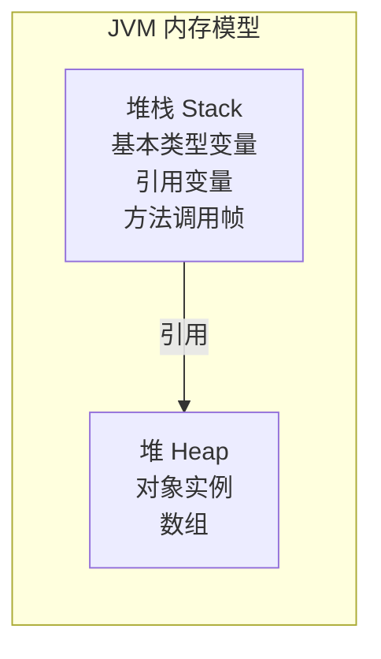
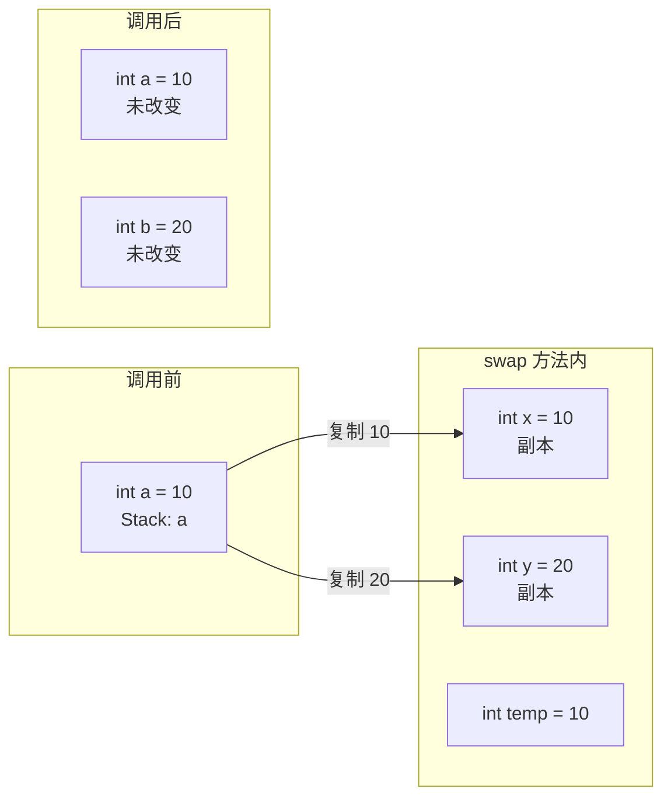
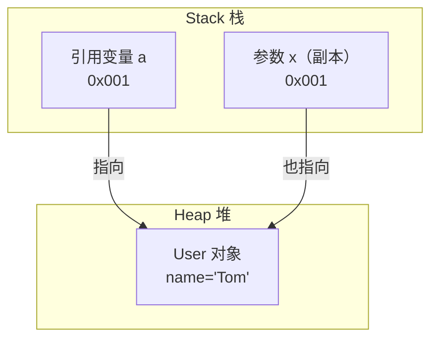
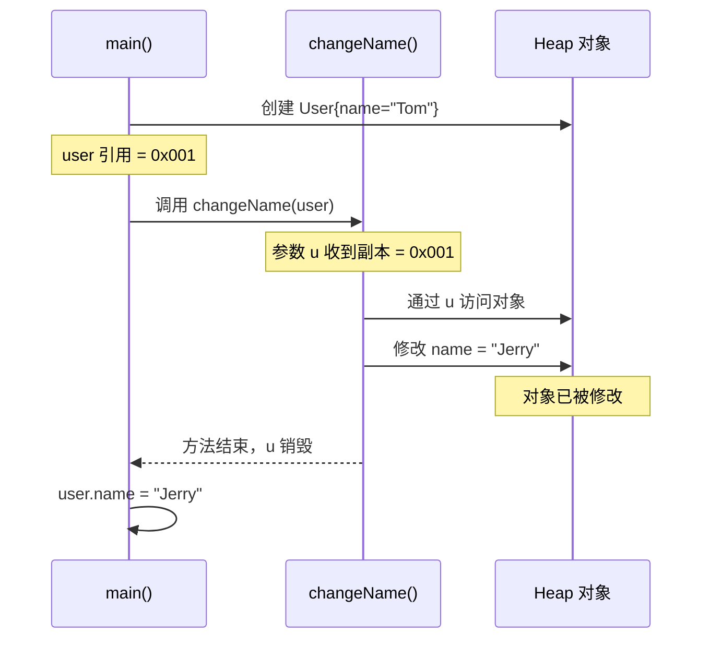
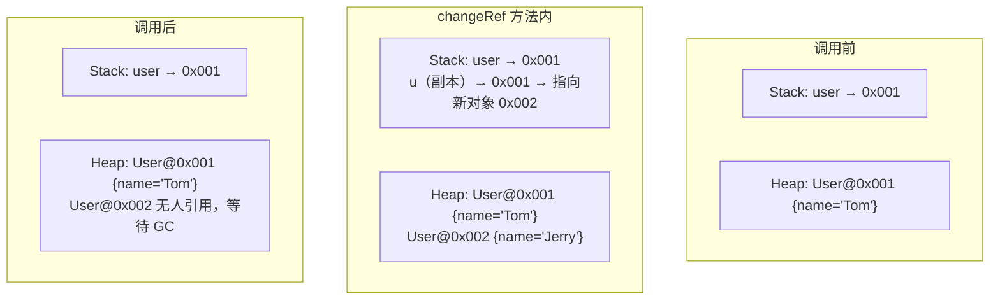

## 面试官最关心的 3 个问题（快速自测）

| 问题 | 难度 | 你的答案 |
|------|------|----------|
| Java 是值传递还是引用传递？ | 🔴 高频必考 | - |
| 为什么 String 修改不影响外部？ | 🔴 高频必考 | - |
| 在方法内能修改外部对象的引用吗？ | 🟡 中频常考 | - |

如果你对以上问题还有疑虑，接下来的内容将为你彻底解答。

---

## 一、从一道坑过 99% 程序员的面试题开始

```java title="SwapTest.java"
public class SwapTest {
    public static void main(String[] args) {
        Integer a = 10;
        Integer b = 20;
        swap(a, b);
        System.out.println("a = " + a + ", b = " + b);  // 输出什么？
    }

    public static void swap(Integer x, Integer y) {
        Integer temp = x;
        x = y;
        y = temp;
    }
}
```

很多人认为会输出 `a = 20, b = 10`，但实际输出是 `a = 10, b = 20`。为什么？

再来看另一道题：

```java title="StringTest.java"
public class StringTest {
    public static void main(String[] args) {
        String str = "Hello";
        change(str);
        System.out.println(str);  // 输出什么？
    }

    public static void change(String s) {
        s = "World";
    }
}
```

输出仍然是 `Hello`，而不是 `World`。这似乎"印证"了 Java 是引用传递的观点——但事实恰恰相反。

要理解这一切，我们需要从计算机内存模型说起。

---

## 二、核心原理：Java 只有值传递

### 2.1 内存布局基础

在 Java 中，内存主要分为两大部分：



- **Stack（栈）**：存放基本类型变量、引用变量、方法调用栈帧
- **Heap（堆）**：存放所有 new 创建的对象、数组

### 2.2 什么是值传递？

> **值传递（Pass by Value）**：将参数的副本传递给方法，方法内修改的是副本，不影响原始变量。

### 2.3 什么是引用传递？

> **引用传递（Pass by Reference）**：将变量的本身引用（地址）传递给方法，方法内可以直接修改外部变量。

关键区别在于：**值传递传的是副本，引用传递传的是本体**。

---

## 三、基本类型：传递值的副本



看这段代码：

```java title="PrimitivePass.java"
public class PrimitivePass {
    public static void main(String[] args) {
        int a = 10;
        int b = 20;
        swap(a, b);
        System.out.println("a = " + a + ", b = " + b);  // a = 10, b = 20
    }

    public static void swap(int x, int y) {  // [!code focus]
        int temp = x;
        x = y;
        y = temp;
    }
}
```

执行流程分析：

| 步骤 | Stack 变化 | 说明 |
|------|-----------|------|
| 1 | `main()` 帧：`a=10, b=20` | 原始变量 |
| 2 | `swap()` 帧：`x=10(副本), y=20(副本), temp=10` | 创建副本 |
| 3 | `swap()` 帧：`x=20, y=10, temp=10` | 交换的是副本 |
| 4 | `swap()` 帧结束，栈帧销毁 | 原始变量不受影响 |

**结论**：基本类型传递的是值的副本，方法内修改不影响原始变量。

---

## 四、引用类型：传递引用地址的副本

这是最容易混淆的地方。引用类型的传递，**传递的是引用地址的副本**，而不是引用本身。

### 4.1 引用类型内存模型



### 4.2 经典案例：修改对象属性

```java title="ReferencePass.java"
public class ReferencePass {
    public static void main(String[] args) {
        User user = new User();
        user.name = "Tom";
        changeName(user);
        System.out.println(user.name);  // 输出什么？ // [!code focus]
    }

    public static void changeName(User u) {
        u.name = "Jerry";  // 修改的是堆中的对象
    }
}
```

输出：`Jerry`。这似乎证明了"引用传递"——但实际上，这是**值传递**的经典表现。

### 4.3 为什么能修改对象属性？



**关键点**：
- `user` 持有对象的地址：0x001
- `u` 收到的是地址的**副本**，也是 0x001
- 两个引用指向**同一个对象**
- 通过 `u` 修改对象，**main 中的 user 也能看到变化**

### 4.4 修改引用本身——不影响外部

```java title="ChangeReference.java"
public class ChangeReference {
    public static void main(String[] args) {
        User user = new User();
        user.name = "Tom";

        changeRef(user);  // [!code focus]

        System.out.println(user.name);  // 输出什么？
    }

    public static void changeRef(User u) {
        u = new User();  // 让 u 指向新对象
        u.name = "Jerry";
    }
}
```

输出：`Tom`。为什么？



**解释**：
1. `user` 指向 0x001
2. `u` 收到地址副本，也是 0x001
3. `u = new User()` 让 `u` 指向新对象 0x002
4. 但这只是改变了 `u` 本身，`user` 不受影响，仍然指向 0x001

:::warning

**⚠️ 区分两种修改**

| 修改类型 | 是否影响外部 | 示例 |
|---------|-------------|------|
| 修改对象属性 | ✅ 会影响 | `u.name = "Jerry"` |
| 修改引用本身 | ❌ 不影响 | `u = new User()` |

**口诀**：引用副本可以修改对象，修改引用只是改变了副本的指向。
:::

---

## 五、解答开篇三道面试题

### 5.1 为什么 swap 方法不能交换两个 Integer？

```java title="IntegerSwap.java"
public class IntegerSwap {
    public static void main(String[] args) {
        Integer a = 10;
        Integer b = 20;
        swap(a, b);
        System.out.println("a = " + a + ", b = " + b);
    }

    public static void swap(Integer x, Integer y) {  // [!code focus]
        Integer temp = x;
        x = y;
        y = temp;
    }
}
```

**原因分析**：

| 步骤 | 实际发生的事 |
|------|-------------|
| 1 | `a` 持有 Integer 对象的引用，假设是 0x001 |
| 2 | `x` 收到 0x001 的副本 |
| 3 | `x = y` 让 `x` 指向 0x002（新副本） |
| 4 | `y = temp` 让 `y` 指向 0x001 |
| 5 | 方法结束，`x`、`y` 销毁，`a`、`b` 不受影响 |

**Integer 是不可变类**，内部没有 `setValue()` 方法，只能通过赋值重新指向新对象。`swap` 方法只是改变了副本的指向，真正的 `a`、`b` 纹丝不动。

### 5.2 String 为什么看起来像值传递？

```java title="StringPass.java"
public class StringPass {
    public static void main(String[] args) {
        String str = "Hello";
        change(str);
        System.out.println(str);  // Hello
    }

    public static void change(String s) {
        s = "World";  // [!code warning]
    }
}
```

**原因分析**：

String 也是引用类型，但 String 是不可变类。`s = "World"` 实际上：

1. 在字符串常量池创建了新字符串 `"World"`
2. 让 `s` 指向新的字符串对象
3. 原始的 `str` 仍然指向 `"Hello"`

这和 Integer 的情况一模一样。

:::tip

**💡 理解不可变类**

String、Integer、Long、BigDecimal 等都是不可变类：
- 没有提供修改内部状态的方法
- 所有"修改"操作都会创建新对象
- 在方法参数传递时，表现为"值传递"的特征

**如果你想在方法内修改 String，可以这样做**：

```java title="StringBuilderPass.java"
public class StringBuilderPass {
    public static void main(String[] args) {
        StringBuilder sb = new StringBuilder("Hello");
        change(sb);
        System.out.println(sb);  // HelloWorld
    }

    public static void change(StringBuilder s) {
        s.append("World");  // 修改的是同一个对象
    }
}
```
:::

---

## 六、高频追问：面试官会怎么挖坑

### 第一层追问：Java 是值传递还是引用传递？

**标准答案**：Java 只有值传递，没有引用传递。

**面试官想听到的**：
- 能准确说出"值传递"的定义
- 能解释引用类型传递的是地址副本
- 能用图示说明内存模型

### 第二层追问：基本类型和引用类型在传递时有什么区别？

| 类型 | 传递内容 | 修改影响 |
|------|---------|---------|
| 基本类型 | 值的副本 | ❌ 不影响原始变量 |
| 引用类型 | 引用地址的副本 | ✅ 修改对象属性会影响<br/>❌ 修改引用本身不影响 |

### 第三层追问：为什么 String 修改不会影响外部？

**完整解释**：
1. String 是不可变类，没有提供修改内部值的方法
2. `s = "World"` 实际上是让 s 指向新的字符串对象
3. 原始引用指向的对象没有改变
4. 这不是 String 特有的，而是所有不可变类的共同特征

:::warning

**⚠️ 经典错误说法**

> ❌ "String 是值传递，因为它是基本类型"

String 是引用类型，上述说法完全错误。String 的表现是由不可变性决定的，而非值传递。
:::

### 第四层追问：如何在方法内修改外部对象的状态？

**答案**：直接修改对象的属性，而不是重新赋值引用。

```java title="ModifyObject.java"
public class ModifyObject {
    // 方法内无法修改外部引用指向
    public static void cantSwap(Integer a, Integer b) {
        // 这种操作只能改变副本的指向
        Integer temp = a;
        a = b;
        b = temp;
    }

    // 方法内可以修改外部对象的状态
    public static void canModify(User user) {
        user.setName("Modified");  // 直接修改对象属性
    }

    // 方法内可以通过数组或容器修改
    public static void modifyArray(String[] arr) {
        arr[0] = "Modified";  // 修改的是堆中数组的内容
    }
}
```

---

## 七、常见错误与陷阱

### ⚠️ 陷阱 1：混淆"引用副本"和"引用传递"

```java
// 错误理解：Java 是引用传递，所以能修改外部引用
public static void wrongSwap(User a, User b) {
    User temp = a;
    a = b;      // 只能改变副本 a 的指向
    b = temp;   // 原始的 a、b 不受影响
}
```

**正解**：Java 传递的是引用的副本，不是引用本身。

### ⚠️ 陷阱 2：认为 String 是基本类型

String 是引用类型，但表现像"值传递"。这是因为 String 不可变，不是因为它是基本类型。

### ⚠️ 陷阱 3：在方法内创建新对象期望影响外部

```java
public static void resetUser(User user) {
    user = new User();  // 只能改变副本的指向
    // 外部的 user 不会指向新对象
}
```

---

## 八、对比总结表

| 特性 | 值传递 | 引用传递 | Java 实际行为 |
|------|--------|---------|--------------|
| 传递内容 | 值的副本 | 变量本身 | 引用地址的副本 |
| 修改局部变量 | 不影响原始 | 影响原始 | ❌ 不影响原始引用 |
| 修改引用本身 | 不影响原始 | 影响原始 | ❌ 不影响原始引用 |
| 修改对象属性 | - | - | ✅ 会影响 |

| 场景 | 基本类型 | String | 其他引用类型 | 可变包装类 |
|------|---------|--------|-------------|-----------|
| 传参表现 | 传值副本 | 不可变，表现像值传递 | 传引用副本 | 传引用副本 |
| 方法内修改属性 | 不可能 | 不可能 | ✅ 可行 | ✅ 可行 |
| 方法内重新赋值 | 不影响原始 | 不影响原始 | ❌ 不影响原始 | ❌ 不影响原始 |

---

## 九、加分回答（超出预期的深度）

### 💡 1. 理解 C++ 的引用传递

C++ 中有真正的引用传递：

```cpp
void swap(int& a, int& b) {  // 引用传递
    int temp = a;
    a = b;
    b = temp;
}
```

这里的 `a`、`b` 就是外部变量本身，没有副本。Java 没有这个机制。

### 💡 2. 为什么 Java 这样设计？

Java 选择值传递而非引用传递，主要原因：

1. **安全性**：方法无法直接修改外部变量，避免副作用
2. **简单性**：不需要区分引用传递和值传递
3. **性能**：引用副本比对象副本小得多

### 💡 3. 在 Java 中模拟"引用传递"效果

如果你想让方法能修改外部引用，可以使用数组或容器：

```java title="RefSwap.java"
public class RefSwap {
    public static void main(String[] args) {
        User[] users = { new User("A"), new User("B") };
        swap(users, 0, 1);
        System.out.println(users[0].name + ", " + users[1].name);
    }

    public static void swap(User[] arr, int i, int j) {
        User temp = arr[i];
        arr[i] = arr[j];  // 修改数组元素
        arr[j] = temp;
    }
}
```

通过数组包装，间接实现了修改外部引用的效果。

---

## 十、结论

> **Java 只有值传递，没有引用传递。**
>
> - 基本类型传递值的副本
> - 引用类型传递引用地址的副本
> - 副本指向同一个对象，所以可以修改对象属性
> - 重新赋值引用只影响副本，不影响原始引用
> - String 等不可变类表现像值传递，是因为不可变性，而非值传递

记住这个核心口诀：**Java 传的是地址副本，不是地址本身。**

---

## 延伸阅读

- [HashMap 源码深度解析](/java/collection/hashmap)
- [ArrayList 源码深度解析](/java/collection/arraylist)
- [ThreadLocal 内存泄漏详解](/java/concurrent/threadlocal)
