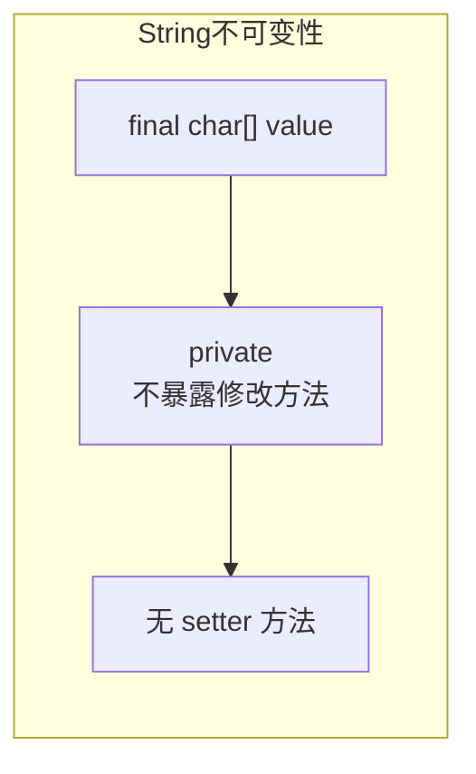

# String/StringBuilder/StringBuffer

**目标级别**：P5

## 快速自测

面试官问：「String 为什么是不可变的？StringBuilder 和 StringBuffer 的区别是什么？」

你能回答到第几层？

---

## 一、核心问题

### 🔴 String 的不可变性

String 是不可变类（Immutable Class），一旦创建就不能被修改。

```java title="String.java"
public final class String
    implements java.io.Serializable, Comparable<String>, CharSequence {
    
    // String 内部存储字符的数组
    // 被 final 修饰，且 private，不对外暴露
    private final char value[];
    
    // 哈希值缓存
    private int hash;
    
    // 缓存序列长度
    private final byte[] value;
}
```

### String 不可变的原因



| 原因 | 说明 |
|------|------|
| **安全性** | 用于网络连接、文件路径等安全敏感场景 |
| **线程安全** | 不可变对象天然线程安全 |
| **字符串常量池** | 节省内存，复用字符串对象 |
| **哈希缓存** | 可以缓存 hashCode |
| **类加载器** | ClassLoader 使用 String 作为 key |

---

## 二、字符串常量池

### StringTable

```mermaid
flowchart LR
    subgraph 字符串常量池
        A["\"hello\""]
        B["\"java\""]
        C["\"world\""]
    end
    
    subgraph 堆内存
        D["new String(\"hello\")"]
    end
    
    D -.->|"intern()"| A
```

### 字面量 vs new String

```java
// 字面量：直接使用常量池
String s1 = "hello";
String s2 = "hello";
s1 == s2  // true，共用常量池中的对象

// new String：创建新对象
String s3 = new String("hello");
s1 == s3  // false，s3 在堆中
```

### intern 方法

```java
// intern() 返回常量池中的字符串
String s1 = new String("hello");
String s2 = s1.intern();

s1 == s2  // false vs true

// JDK7+ intern() 会将字符串复制到常量池
// JDK6 会将字符串移动到 PermGen
```

### 经典面试题

```java
String s1 = new String("a") + new String("b");
// 创建了几个对象？
// 1. new String("a")
// 2. new String("b")
// 3. StringBuilder (用于拼接)
// 4. new String("ab") (toString()生成)
// "a" 和 "b" 进入 StringTable
// "ab" 不进入 StringTable

String s2 = s1.intern();  // "ab" 进入常量池
String s3 = "ab";

s2 == s3  // true
```

---

## 三、StringBuilder

### 可变字符串

```java
StringBuilder sb = new StringBuilder();
sb.append("hello");
sb.append(" world");
sb.insert(0, "say: ");
sb.delete(0, 4);
String result = sb.toString();
```

### StringBuilder vs StringBuffer

| 维度 | StringBuilder | StringBuffer |
|------|---------------|--------------|
| **线程安全** | 否 | 是（synchronized） |
| **性能** | 更快 | 较慢（需要同步） |
| **使用场景** | 单线程 | 多线程 |
| **API** | 完全相同 | 完全相同 |

### StringBuilder 源码

```java title="AbstractStringBuilder.java"
abstract class AbstractStringBuilder {
    char[] value;  // 存储字符的数组（无 final）
    int count;     // 实际字符数量
    
    // 扩容
    private void ensureCapacityInternal(int minimumCapacity) {
        if (minimumCapacity - value.length > 0) {
            expandCapacity(minimumCapacity);
        }
    }
    
    void expandCapacity(int minimumCapacity) {
        int newCapacity = value.length * 2 + 2;
        if (newCapacity - minimumCapacity < 0)
            newCapacity = minimumCapacity;
        value = Arrays.copyOf(value, newCapacity);
    }
}
```

---

## 四、字符串拼接优化

### JDK 9 的 Compact Strings

```java
// JDK 8: char[] (2 bytes per char)
// JDK 9+: byte[] + coder (1 byte for LATIN1, 2 bytes for UTF16)
public final class String
    implements Serializable {
    private final byte[] value;
    private final byte coder;  // LATIN1 or UTF16
}
```

### 字符串拼接对比

```java
// 反面教材：大量字符串拼接
String result = "";
for (String s : list) {
    result += s;  // 每次创建新的 StringBuilder
}

// 正确做法
StringBuilder sb = new StringBuilder();
for (String s : list) {
    sb.append(s);
}
String result = sb.toString();

// JDK 5+ 编译器自动优化
// result += s 会被优化为 StringBuilder.append(s)
```

### StringJoiner

```java
// StringJoiner (JDK 8+)
StringJoiner joiner = new StringJoiner(", ", "[", "]");
joiner.add("a");
joiner.add("b");
joiner.add("c");
System.out.println(joiner.toString());  // [a, b, c]

// String.join()
String result = String.join(", ", "a", "b", "c");  // a, b, c
```

---

## 五、面试题精讲

### 🔴 第一层：String 为什么是不可变的？

> **参考答案**：
>
> String 不可变的原因：
> 1. **final class**：String 类被 final 修饰，不能被继承
> 2. **final char[] value**：存储字符的数组被 final 修饰
> 3. **private**：value 字段私有且没有提供修改方法
>
> 不可变的好处：线程安全、字符串常量池复用、哈希缓存、安全性。

### 🟡 第二层：StringBuilder 和 StringBuffer 的区别？

> **参考答案**：
>
> | 维度 | StringBuilder | StringBuffer |
> |------|---------------|--------------|
> | **线程安全** | 否 | 是（synchronized） |
> | **性能** | 更快 | 较慢 |
> | **使用场景** | 单线程 | 多线程 |
> | **JDK 版本** | JDK 5 | JDK 1.0 |

### 🟡 第三层：字符串拼接 "+" 和 StringBuilder 哪个快？

> **参考答案**：
>
> 在循环中，StringBuilder 更快：
> - `str += s` 每次循环都创建新的 StringBuilder
> - StringBuilder.append() 在同一对象上操作
>
> 但对于少量拼接，编译器会优化两者性能相近。

### 💡 第四层：字符串常量池的原理？

> **参考答案**：
>
> 字符串常量池是堆中的特殊区域（JDK 7 后移入堆）：
> - 字面量字符串自动放入常量池
> - `String.intern()` 方法将字符串放入常量池
> - 相同内容的字符串字面量共享同一个对象
> - 节省内存，提高性能

---

## 六、常见错误与陷阱

### ⚠️ 陷阱 1：String.intern() 的 OOM

```java
// JDK 6: 常量池在 PermGen，容易 OOM
// JDK 7+: 常量池在堆，但仍需谨慎使用

// 大量数据 intern 可能导致 OOM
List<String> list = new ArrayList<>();
for (long i = 0; i < 10_000_000; i++) {
    list.add(String.valueOf(i).intern());  // 可能 OOM
}
```

### ⚠️ 陷阱 2：字符串截取不创建新数组

```java
String s = "hello world";
String sub = s.substring(0, 5);  // "hello"

// JDK 6 及之前：共享原始 char[]，可能造成内存泄漏
// JDK 7+: 创建新的 char[]

// 建议：
String sub = new String(s.substring(0, 5));
```

### ⚠️ 陷阱 3：字符串 == 比较

```java
String s1 = "hello";
String s2 = "hello";
String s3 = new String("hello");

s1 == s2  // true：字面量共享
s1 == s3  // false：new String 新建对象
s1.equals(s3)  // true：内容相同

// 始终使用 equals() 比较字符串
```

---

## 七、手写简化版 StringBuilder

```java title="SimpleStringBuilder.java"
public class SimpleStringBuilder {
    
    private char[] value;
    private int count;
    
    public SimpleStringBuilder() {
        value = new char[16];
    }
    
    public SimpleStringBuilder(int capacity) {
        value = new char[capacity];
    }
    
    public SimpleStringBuilder append(String str) {
        if (str == null) {
            appendNull();
        } else {
            int len = str.length();
            ensureCapacityInternal(count + len);
            str.getChars(0, len, value, count);
            count += len;
        }
        return this;
    }
    
    private void ensureCapacityInternal(int minimumCapacity) {
        if (minimumCapacity - value.length > 0) {
            expandCapacity(minimumCapacity);
        }
    }
    
    private void expandCapacity(int minimumCapacity) {
        int newCapacity = value.length * 2;
        if (newCapacity - minimumCapacity < 0)
            newCapacity = minimumCapacity;
        value = Arrays.copyOf(value, newCapacity);
    }
    
    private void appendNull() {
        int len = 4;
        ensureCapacityInternal(count + len);
        "null".getChars(0, len, value, count);
        count += len;
    }
    
    public String toString() {
        return new String(value, 0, count);
    }
    
    public int length() {
        return count;
    }
}
```

---

## 八、对比总结表

| 维度 | String | StringBuilder | StringBuffer |
|------|--------|---------------|--------------|
| **可变性** | 不可变 | 可变 | 可变 |
| **线程安全** | 是 | 否 | 是 |
| **性能** | 拼接慢 | 快 | 较快 |
| **存储** | char[]/byte[] | char[] | char[] |
| **使用场景** | 字符串常量 | 字符串拼接 | 多线程拼接 |

---

## 延伸阅读

- [equals 与 hashCode](../java-basic/equals)
- [final 关键字](../java-basic/final)
- [Java 新特性-文本块](../java-new-features/text-block)
- [StringTable 大小配置](../jvm/string-intern)
