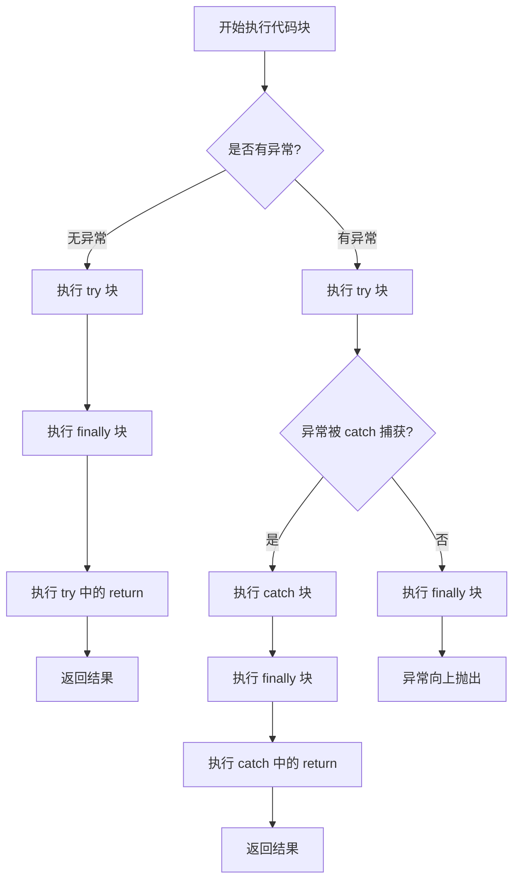
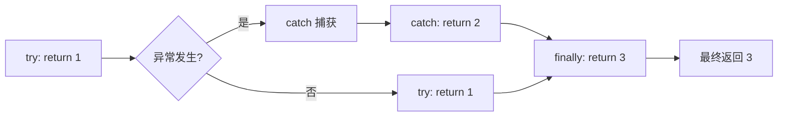

## 面试官最关心的 3 个问题

| 问题 | 难度 | 命中率 |
|------|------|--------|
| try-catch-finally 的执行顺序是什么？ | 🔴 高频必考 | `>` 70% |
| finally 一定执行吗？什么情况不执行？ | 🔴 高频必考 | `>` 70% |
| finally 中的 return 会覆盖 try/catch 中的 return 吗？ | 🟡 中频常考 | 40%~70% |

## 一、开场：一道"纸老虎"面试题

```java
public class TryCatchTest {
    public static void main(String[] args) {
        System.out.println(test());
    }

    public static int test() {
        try {
            return 1;
        } catch (Exception e) {
            return 2;
        } finally {
            return 3;
        }
    }
}
```

这段代码输出什么？大多数候选人会脱口而出 `1`，但正确答案却是 `3`。

这道题考察的不仅是"知不知道"，更是"理解的深度"。很多工作多年的开发者写完这段代码后，对输出结果"凭记忆"而非"凭理解"。今天我们就来彻底拆解 try-catch-finally 的执行机制。

## 二、执行顺序流程图

### 2.1 正常情况下的执行流程



### 2.2 三种典型场景

| 场景 | 执行顺序 | 备注 |
|------|----------|------|
| **正常无异常** | try → finally → 后续代码 | catch 不执行 |
| **异常被捕获** | try → catch → finally → 后续代码 | 异常已处理 |
| **异常未捕获** | try → finally → 异常向上抛出 | 异常穿透 |

## 三、源码级解析：JVM 如何处理异常

### 3.1 异常表结构

JVM 在编译时为每个方法生成**异常表（Exception Table）**，记录了异常处理的元信息。

```java title="ExceptionTable 结构伪代码"
/*
 * 异常表项包含：
 * - start_pc: 异常处理起始位置
 * - end_pc: 异常处理结束位置
 * - handler_pc: 异常处理代码位置
 * - catch_type: 捕获的异常类型（0 表示 finally）
 */
public class ExceptionTableEntry {
    int startPc;       // try 块起始位置
    int endPc;         // try 块结束位置
    int handlerPc;     // catch 块位置
    int catchType;     // 0 = finally, 其他 = 具体异常类型
}
```

### 3.2 伪代码解析执行流程

```java title="JVM 执行伪代码"
public int test() {
    int result = 0;
    try {
        result = 1;
        goto finally;  // [!code highlight]
    } catch (Exception e) {
        result = 2;
        goto finally;  // [!code highlight]
    } finally {
        result = 3;     // [!code highlight]
        // 如果 finally 有 return，会直接返回 result
        return result;
    }
}
```

:::tip
**为什么 finally 先于 return 执行？**

JVM 将 finally 块的代码复制到了 try 和 catch 的所有出口处。这意味着 finally 并不是"在 return 之后执行"，而是"return 之前执行"——它插入到了 return 之前的位置。
:::

## 四、finally 的五个高级陷阱

### 4.1 陷阱一：finally 里的 return 覆盖一切

```java
// 面试高频题：输出结果是？
public static int test1() {
    try {
        int x = 10 / 0;  // 抛出 ArithmeticException
        return 1;
    } catch (NullPointerException e) {
        return 2;
    } finally {
        return 3;  // [!code warning] 覆盖了所有返回值
    }
}
// 输出: 3
```

**根本原因**：finally 块中的 return 语句会**无条件覆盖** try/catch 中的返回值。



### 4.2 陷阱二：finally 中的异常覆盖之前的异常

```java
public static void test2() {
    try {
        throw new RuntimeException("try 异常");  // [!code warning]
    } catch (Exception e) {
        throw new RuntimeException("catch 异常");
    } finally {
        throw new RuntimeException("finally 异常");  // [!code warning]
    }
}
```

**执行结果**：只有 `finally 异常`会被抛出，之前的异常信息**全部丢失**。

:::warning
**生产事故预警**

在生产环境中，这种异常覆盖可能导致原始错误的上下文信息丢失，造成排查困难。生产代码中应避免在 finally 中抛出异常。
:::

### 4.3 陷阱三：finally 不执行的四种情况

| 情况 | 说明 | 示例 |
|------|------|------|
| **System.exit()** | JVM 强制退出 | `System.exit(0)` |
| **Runtime.getRuntime().halt()** | JVM 强制终止 | `halt(0)` |
| **守护线程被杀死** | 非守护线程还在执行 | Daemon thread 场景 |
| **CPU 断电/硬件故障** | 物理层面 | 不可抗力 |

```java
public static void test3() {
    try {
        System.out.println("try");
        System.exit(0);  // [!code warning] finally 不执行
    } finally {
        System.out.println("finally");  // 不会输出
    }
}
```

### 4.4 陷阱四：return 值被修改的假象

```java
public static int test4() {
    int result = 0;
    try {
        return result;  // [!code focus] 返回的是 0
    } finally {
        result = 100;   // [!code warning] 修改的是局部变量
    }
}
// 输出: 0
```

:::tip
**原理**：return 时 JVM 会将返回值**复制**一份，finally 修改的是原始变量，不影响已返回的副本。
:::

### 4.5 陷阱五：finally 块中的资源泄漏

```java
// 反面教材
Connection conn = null;
try {
    conn = DriverManager.getConnection(url);
    return conn;
} finally {
    // [!code warning] 如果 close() 抛异常，return 会被中断
    conn.close();
}
```

## 五、try-with-resources 原理

### 5.1 基本语法

```java
try (BufferedReader br = new BufferedReader(new FileReader("test.txt"))) {
    return br.readLine();
} catch (IOException e) {
    e.printStackTrace();
}
```

### 5.2 编译后生成的字节码

```java title="反编译后的等价代码"
BufferedReader br = null;
Throwable primaryException = null;
try {
    br = new BufferedReader(new FileReader("test.txt"));
    return br.readLine();
} catch (Throwable t) {
    primaryException = t;
    throw t;
} finally {
    if (br != null) {
        if (primaryException != null) {
            try {
                br.close();
            } catch (Throwable t) {
                primaryException.addSuppressed(t);  // [!code focus] 异常抑制
            }
        } else {
            br.close();
        }
    }
}
```

:::details
**为什么需要异常抑制（Suppressed Exception）？**

当 try 块和 close() 都抛出异常时，JVM 会保留 try 块的异常，而将 close() 的异常作为"被抑制的异常"附加到主异常上。通过 `getSuppressed()` 可以获取所有被抑制的异常。
:::

### 5.3 AutoCloseable 接口

```java
public interface AutoCloseable {
    void close() throws Exception;
}
```

所有实现 `AutoCloseable` 接口的资源都可以使用 try-with-resources，包括：
- `java.io.Closeable`（如 `InputStream`、`OutputStream`）
- `java.sql.Connection`
- `java.nio.channels.Channel`

## 六、对比总结

| 特性 | try-catch-finally | try-with-resources |
|------|-------------------|-------------------|
| **资源释放** | 需手动在 finally 释放 | 自动释放 |
| **异常抑制** | 无 | 有（addSuppressed） |
| **代码简洁度** | 较繁琐 | 简洁 |
| **适用场景** | 非资源场景 | IO、网络、数据库等 |
| **关闭顺序** | 按代码顺序 | 后创建先关闭 |

## 七、面试官追问路径

### 第一层（怎么用）
**Q：try-catch-finally 的基本执行顺序是什么？**

A：正常情况执行 try → finally；异常被捕获执行 try → catch → finally；异常未捕获执行 try → finally 后异常向上抛出。

### 第二层（底层实现）
**Q：JVM 层面是如何保证 finally 一定执行的？**

A：编译器在编译时将 finally 块的代码复制到所有可能的出口处，包括正常 return 和异常抛出的路径。

### 第三层（边界缺陷）
**Q：finally 一定执行吗？什么情况不执行？**

A：以下情况不执行：
1. `System.exit()` 强制退出
2. `Runtime.getRuntime().halt()` 强制终止
3. 守护线程被终止
4. 物理不可抗力（断电等）

### 第四层（选型重写）
**Q：try-with-resources 和传统 try-finally 相比有什么优势？**

A：1. 代码更简洁；2. 自动管理资源关闭；3. 支持异常抑制（Suppressed Exception）；4. 避免因 close() 抛异常导致的资源泄漏。

## 八、高频真题

### 真题 1：输出结果是什么？

```java
public class InterviewTest {
    public static void main(String[] args) {
        System.out.println(test());
    }

    public static String test() {
        try {
            throw new RuntimeException("try");
        } catch (Exception e) {
            throw new RuntimeException("catch");
        } finally {
            return "finally";  // [!code focus]
        }
    }
}
```

**答案**：`finally`（字符串）

### 真题 2：返回值是多少？

```java
public static int test() {
    int i = 0;
    try {
        return i++;  // [!code focus] 先返回 0，然后 i 自增
    } finally {
        ++i;
    }
}
```

**答案**：`0`（因为 return 时已保存当前值）

## 九、常见错误与最佳实践

| 错误写法 | 问题 | 推荐写法 |
|----------|------|----------|
| finally 里抛异常 | 覆盖原始异常 | 记录日志后重新抛出 |
| finally 里 return | 丢失异常信息 | 使用 throw 或不 return |
| 资源在 finally 外关闭 | 可能泄漏 | 使用 try-with-resources |
| catch 里忽略异常 | 隐藏错误 | 至少记录日志或重新抛出 |

:::tip
**最佳实践**：优先使用 try-with-resources 管理资源，它不仅简化了代码，还能正确处理异常抑制问题。
:::
