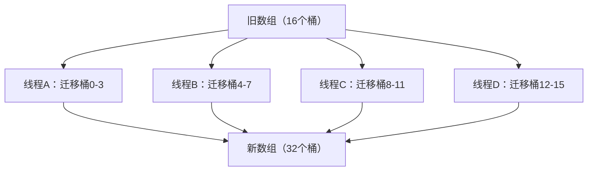

# ConcurrentHashMap 扩容机制

面试官问小张："ConcurrentHashMap 扩容时会发生什么？"

小张说："会创建新数组，迁移数据。"

面试官追问："JDK8 支持并发扩容，你知道多个线程是怎么分工迁移数据的吗？"

小张愣了一下："好像...是把桶分配给不同线程？"

面试官点点头："那 ForwardingNode 是干什么用的？"

小张彻底卡住。

【面试官心理】

这道题我用来测试候选人对 ConcurrentHashMap JDK8 最核心创新的理解。JDK8 的并发扩容是其最重要的改进之一，JDK7 的扩容是阻塞的，JDK8 支持多线程并行扩容，效率提升数倍。能讲清楚 ForwardingNode、分段迁移、`sizeCtl` 控制的候选人，基本都深入看过源码。

## 一、为什么需要并发扩容 🔴

### 1.1 JDK7 的问题

JDK7 的 ConcurrentHashMap 扩容是**阻塞的**：

```java
// JDK7 Segment.resize()
private void resize() {
    lock();  // 加锁，所有操作暂停
    // ... 迁移数据 ...
    unlock();
}
```

当 ConcurrentHashMap 容量不足时，需要扩容，但此时所有 put 操作都会被阻塞，直到扩容完成。在大数据量场景下，这个阻塞时间可能很长。

### 1.2 JDK8 的解决方案

JDK8 支持**多线程并行扩容**：



多个线程同时参与扩容，每个线程负责一段桶的迁移。扩容期间，put 和 get 操作仍然可以正常进行。

## 二、并发扩容核心机制 🔴

### 2.1 sizeCtl 的控制作用

`sizeCtl` 是 ConcurrentHashMap 的核心控制变量：

```java
// sizeCtl 的不同取值
private transient volatile int sizeCtl;

// -1：正在初始化
// < -1：-(1 + N)，N 为正在扩容的线程数
// 正数：扩容阈值（当 table 已初始化时）
```

扩容时的 `sizeCtl` 编码：

```java
// 扩容时 sizeCtl = -(1 + 并行线程数)
sizeCtl = -(1 + n);  // n 是参与扩容的线程数
```

### 2.2 tryPresize：触发扩容

```java
private final void tryPresize(int size) {
    int c = (size >= (MAXIMUM_CAPACITY >>> 1)) ? MAXIMUM_CAPACITY :
            tableSizeFor(size + (size >>> 1) + 1);  // 1.5倍 + 1

    int sc;
    while ((sc = sizeCtl) >= 0) {
        // sc >= 0 表示不在扩容
        Node<K, V>[] tab = table;
        int n;

        if (tab == null || (n = tab.length) == 0) {
            n = (sc > c) ? sc : c;
            // CAS 设置 sizeCtl = -1，表示初始化
            if (U.compareAndSwapInt(this, SIZECTL, sc, -1)) {
                // ... 初始化 table ...
            }
        }
        else if (c <= sc || n >= MAXIMUM_CAPACITY)
            break;  // 不需要扩容
        else if (tab == table) {
            // 触发并发扩容
            int rs = n << 1;  // 新容量 = 旧容量 * 2
            if (rs < MIN_CAPACITY || n >= MAXIMUM_CAPACITY >>> 1)
                rs = MAXIMUM_CAPACITY;

            // sizeCtl 设为负数，高位存储新容量
            if (U.compareAndSwapInt(this, SIZECTL, sc, (rs << RESIZE_STAMP_SHIFT) + 2)) {
                transfer(tab, null);  // 启动并发扩容
                break;
            }
        }
    }
}
```

### 2.3 transfer：核心迁移方法

```java
private final void transfer(Node<K, V>[] tab, Node<K, V>[] nextTab) {
    int n = tab.length, stride;

    // 计算每个线程负责的桶数
    // 单核：n，多核：n / 8，最小 16
    if ((stride = (NCPU > 1) ? (n >>> 3) / NCPU : n) < MIN_TRANSFER_STRIDE)
        stride = MIN_TRANSFER_STRIDE;

    // 第一个调用 transfer 的线程，创建新数组
    if (nextTab == null) {
        @SuppressWarnings("unchecked")
        Node<K, V>[] nt = (Node<K, V>[]) new Node<?, ?>[n << 1];
        nextTab = nt;
        nextTable = nt;
        transferIndex = n;  // 从后往前分配桶
    }

    int nextn = nextTab.length;

    // ForwardingNode：占位节点，表示该桶正在迁移
    ForwardingNode<K, V> fwd = new ForwardingNode<K, V>(nextTab);

    boolean advance = true;
    boolean finishing = false;

    // 自旋迁移
    for (int i = 0, bound = 0;;) {
        Node<K, V> f;
        int fh;

        // 获取下一个要处理的桶
        while (advance) {
            int nextIndex, nextBound;
            if (--i >= bound || finishing)
                advance = false;
            else if ((nextIndex = transferIndex) <= 0) {
                i = -1;
                advance = false;
            }
            else if (U.compareAndSwapInt(this, TRANSFERINDEX, nextIndex,
                    nextBound = (nextIndex > stride ? nextIndex - stride : 0))) {
                bound = nextBound;
                i = nextIndex - 1;
                advance = false;
            }
        }

        if (i < 0 || i >= n || i + n >= nextn) {
            // 所有桶都处理完了
            if (finishing) {
                nextTable = null;
                table = nextTab;
                sizeCtl = (n << 1) - (n >>> 1);  // 新阈值 = 1.5n
                return;
            }
            // CAS 设置 sizeCtl，最后一个完成的线程负责收尾
            if (U.compareAndSwapInt(this, SIZECTL, sc = sizeCtl, sc - 1)) {
                if ((sc - 2) != resizeStamp(n) << RESIZE_STAMP_SHIFT)
                    return;
                finishing = advance = true;
                i = n;
            }
        }
        else if ((f = tabAt(tab, i)) == null)
            // 桶为空，用 CAS 放置 ForwardingNode，然后继续
            advance = casTabAt(tab, i, null, fwd);
        else if ((fh = f.hash) == MOVED)
            // 该桶已经迁移过了，跳过
            advance = true;
        else {
            // 该桶有数据，需要迁移
            synchronized (f) {
                if (tabAt(tab, i) == f) {
                    Node<K, V> ln = null, hn = null;
                    for (Node<K, V> e = f, next; e != null; e = next) {
                        next = e.next;
                        int runBit = e.hash & n;  // 决定放在低位还是高位
                        if (runBit == 0) {
                            if (ln == null) ln = new Node<>(e.hash, e.key, e.value, next);
                            else ln.next = e;
                        } else {
                            if (hn == null) hn = new Node<>(e.hash, e.key, e.value, next);
                            else hn.next = e;
                        }
                    }
                    // 用 CAS 放置 ForwardingNode，然后写入新数组
                    setTabAt(nextTab, i, ln);
                    setTabAt(nextTab, i + n, hn);
                    setTabAt(tab, i, fwd);  // 原桶标记为已迁移
                    advance = true;
                }
            }
        }
    }
}
```

## 三、ForwardingNode 的设计 🔴

### 3.1 什么是 ForwardingNode

```java
static final class ForwardingNode<K, V> extends Node<K, V> {
    final Node<K, V>[] nextTable;
    ForwardingNode(Node<K, V>[] tab) {
        super(MOVED, null, null, null);  // hash = MOVED = -1
        this.nextTable = tab;
    }

    // ForwardingNode 自己的 find 方法会帮助迁移
    Node<K, V> find(int h, Object k) {
        OuterLoop: for (Node<K, V>[] tab = nextTable;;) {
            Node<K, V> e;
            int n;
            if (tab == null || (n = tab.length) == 0 || (e = tabAt(tab, (n - 1) & h)) == null)
                return null;
            // ...
        }
    }
}
```

ForwardingNode 是**占位节点**，表示该桶正在迁移或已迁移完成。

### 3.2 ForwardingNode 的三个作用

```java
// 1. 占位：CAS 放入原数组，表示正在迁移
setTabAt(tab, i, fwd);

// 2. 迁移完成标志：后续线程看到 MOVED 哈希，跳过该桶
if ((fh = f.hash) == MOVED)
    advance = true;

// 3. 帮助迁移：如果其他线程发现正在迁移，调用 helpTransfer
else if (f instanceof ForwardingNode)
    tab = ((ForwardingNode<K, V>) f).nextTable;
```

### 3.3 迁移过程中的读写

```java
public V get(Object key) {
    Node<K, V>[] tab;
    Node<K, V> e, p;
    int n, eh;
    int h = spread(key.hashCode());

    if ((tab = table) != null && (n = tab.length) > 0 &&
        (e = tabAt(tab, (n - 1) & h)) != null) {
        if ((eh = e.hash) == h) {
            if ((ek = e.key) == key || (ek != null && key.equals(ek)))
                return e.value;
        }
        else if (eh < 0) {
            // eh < 0：可能是 ForwardingNode 或 TreeBin
            // ForwardingNode.find 会去新数组查找
            return (p = e.find(h, key)) != null ? p.value : null;
        }
        while ((e = e.next) != null) {
            // ...
        }
    }
    return null;
}
```

**读操作**：如果桶是 ForwardingNode，会自动去新数组查找，保证读到最新数据。

```java
public V put(K key, V value) {
    // ...
    if ((fh = f.hash) == MOVED)
        // 正在扩容，帮助扩容而不是阻塞等待
        tab = helpTransfer(tab, f);
    // ...
}
```

**写操作**：如果桶是 ForwardingNode，会帮助扩容，然后继续写入新数组。

## 四、桶的分配策略 🟡

### 4.1 从后往前分配

```java
transferIndex = n;  // 初始值 = 旧数组长度

// 分配策略：每次分配 stride 个桶
nextIndex = transferIndex;  // 当前要处理的桶
nextBound = nextIndex > stride ? nextIndex - stride : 0;  // 分配范围

// 线程A：处理桶 12-15
// 线程B：处理桶 8-11
// 线程C：处理桶 4-7
// 线程D：处理桶 0-3
```

从后往前分配的好处：前面的桶可能还在被 put 操作写入，后面的桶更稳定。

### 4.2 链表的高位/低位拆分

```java
int runBit = e.hash & n;  // n = 旧数组长度

// 例如：旧数组长度 16 = 0b00010000
// hash & 16 = 0：在低位桶（原桶位置）
// hash & 16 = 16：在高位桶（原桶位置 + 16）
```

和 HashMap JDK8 类似，ConcurrentHashMap 用 `hash & n` 判断节点应该放在低位桶还是高位桶：

```java
if (runBit == 0) {
    // 低位桶：原位置
    if (ln == null) ln = new Node<>(...);
    else ln.next = e;
} else {
    // 高位桶：原位置 + n
    if (hn == null) hn = new Node<>(...);
    else hn.next = e;
}
```

## 五、生产避坑指南 🟡

### 5.1 避免频繁触发扩容

```java
// ❌ 生产翻车代码：大量小批次写入，每次都可能触发扩容
Map<String, Object> map = new ConcurrentHashMap<>();
for (String key : keys) {
    map.put(key, computeValue(key));  // 每次 put 都可能检查扩容
}

// ✅ 正确：预估容量，预分配
Map<String, Object> map = new ConcurrentHashMap<>(expectedSize);
// 或者使用 bulk 方法减少检查次数
map.putAll(batchMap);
```

### 5.2 扩容期间的性能影响

扩容期间，部分操作会变慢：
- `size()` 需要遍历 CounterCell
- 迁移中的桶需要两次查找（先找 ForwardingNode，再去新数组）

但不会阻塞，这是和 JDK7 的本质区别。

### 5.3 监控扩容状态

```java
// 通过反射可以获取扩容状态
Field sizeCtlField = ConcurrentHashMap.class.getDeclaredField("sizeCtl");
sizeCtlField.setAccessible(true);
int sizeCtl = sizeCtlField.getInt(map);

if (sizeCtl < 0) {
    // 正在扩容，参与线程数 = -(sizeCtl + 1)
    int threads = -(sizeCtl + 1);
    System.out.println("正在扩容，参与线程数：" + threads);
}
```

## 六、面试追问链 🟢

### 追问一：多个线程同时触发扩容会怎样？

```java
if (U.compareAndSwapInt(this, SIZECTL, sc, (rs << RESIZE_STAMP_SHIFT) + 2)) {
    transfer(tab, null);  // 只有第一个线程会执行 transfer
}
```

只有第一个触发扩容的线程会真正调用 `transfer`，其他线程会：
1. 发现 `sizeCtl < 0`，CAS 失败
2. 在 `putVal` 中被 `helpTransfer` 引导到新数组

### 追问二：最后一个完成的线程负责什么？

```java
if (U.compareAndSwapInt(this, SIZECTL, sc = sizeCtl, sc - 1)) {
    if ((sc - 2) != resizeStamp(n) << RESIZE_STAMP_SHIFT)
        return;  // 不是最后一个线程
    finishing = advance = true;
    i = n;  // 最后一个线程做收尾工作
}
```

最后一个完成的线程会：
1. 将 `finishing` 设为 true
2. 再次遍历所有桶，确保迁移完成
3. 将 `table` 指向新数组，更新 `sizeCtl`

【面试官心理】

问到 ConcurrentHashMap 并发扩容的候选人，通常对并发编程有深入研究。这道题的关键在于理解 ForwardingNode 的设计意图：它是一个占位节点，让读操作可以去新数组查找，让写操作知道要帮助扩容。能讲清楚这个设计细节的候选人，基本都值得给 offer。
