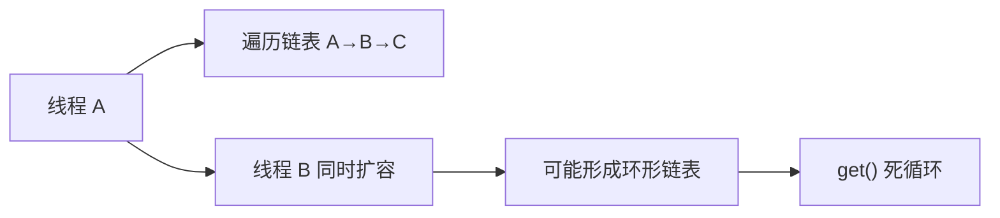
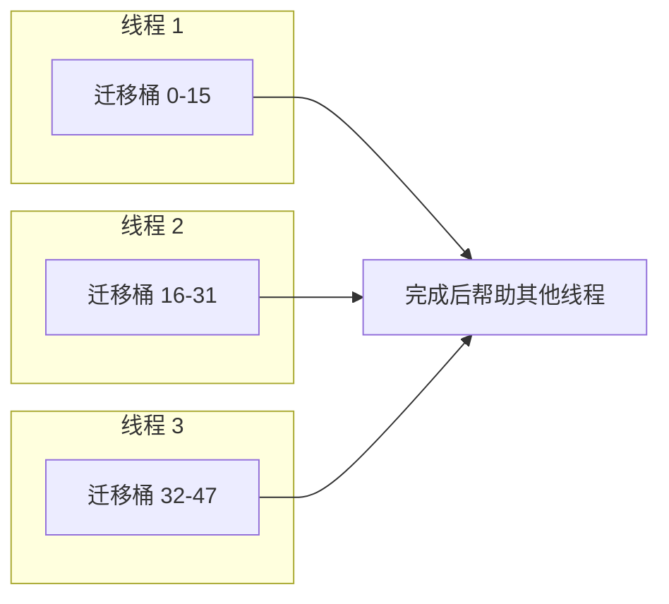

# ConcurrentHashMap 扩容机制

面试官问："ConcurrentHashMap 的扩容机制是怎样的？"

候选人小李答："扩容时创建新数组，然后把元素迁移过去。"

面试官追问："JDK8 的 ConcurrentHashMap 扩容和 JDK7 有什么区别？"

小李说："JDK8 支持多线程协助扩容？"

面试官继续追问："ForwardingNode 是干什么的？"

小张彻底答不上来了。

【面试官心理】
ConcurrentHashMap 的并发扩容是 Java 并发编程的精华所在。能够说清楚多线程协助扩容、ForwardingNode 作用、以及为什么不会像 JDK7 HashMap 那样死循环的候选人，说明真正理解了 Java 并发。

## 一、为什么需要并发扩容 🔴

### 1.1 HashMap 扩容的问题

JDK 7 的 HashMap 在扩容时会有严重问题：

```java
// JDK 7 HashMap 扩容
void transfer(Entry[] newTable) {
    for (Entry<K,V> e : table) {
        while (null != e) {
            Entry<K,V> next = e.next;
            int i = indexFor(e.hash, newCapacity);
            e.next = newTable[i];  // 头插法，可能反转链表！
            newTable[i] = e;
            e = next;
        }
    }
}
```

**并发场景下的问题**：



:::warning ⚠️
JDK 7 HashMap 扩容在多线程环境下可能导致环形链表，形成死循环。这是经典的并发问题。
:::

### 1.2 ConcurrentHashMap 的设计目标

```
设计目标：
1. 多线程可以同时协助扩容
2. 扩容过程中，读操作可以正常进行
3. 不会形成环形链表
4. 扩容完成后自动切换到新表
```

## 二、扩容触发条件 🔴

### 2.1 sizeCtl 控制变量

```java
// sizeCtl 是控制并发操作的关键变量
// 不同值的含义：
// -1：表示正在初始化
// -n：表示正在扩容（n = 1 + 参与扩容的线程数）
// 正数：表示扩容阈值（capacity × loadFactor）

private transient volatile int sizeCtl;

// 默认值
static final int DEFAULT_CAPACITY = 16;
static final float DEFAULT_LOAD_FACTOR = 0.75f;

// sizeCtl = capacity × loadFactor = 12
```

### 2.2 触发扩容的时机

```java
// 在 addCount 方法中检查
private final void addCount(long x, int check) {
    // ...
    if (check >= 0) {
        Node<K, V>[] tab, nt;
        int n, sc;
        while (s >= (long)(sc = sizeCtl) &&
               (tab = table) != null &&
               (n = tab.length) < MAXIMUM_CAPACITY) {
            // s（元素数量）>= sizeCtl（阈值），触发扩容
            if (sc < 0) break;  // 已经在扩容

            if (U.compareAndSwapInt(this, SIZECTL, sc, sc - 1)) {
                // 扩容
                nt = ((Node<K, V>[]) new Node<?, ?>[n << 1]);
                transfer(tab, nt);
                // ...
            }
        }
    }
}
```

### 2.3 扩容流程图

```mermaid
graph TD
    A["addCount()"] --> B{"s >= sizeCtl?"]
    B -->|否| C["直接返回"]
    B -->|是| D{"sc < 0?"]
    D -->|是| E["已经在扩容"]
    D -->|否| F["CAS 设置 sizeCtl = sc - 1"]
    F --> G["transfer() 开始扩容"]
    G --> H["创建新数组<br/>容量翻倍"]
    H --> I["迁移元素"]
    I --> J["设置 nextTable"]
    J --> K["切换到新表"]
```

## 三、ForwardingNode 🔴

### 3.1 ForwardingNode 的定义

```java
// ForwardingNode 是一个特殊节点，表示正在扩容
static final class ForwardingNode<K, V> extends Node<K, V> {
    final Node<K, V>[] nextTable;  // 指向新数组

    ForwardingNode(Node<K, V>[] tab) {
        super(MOVED, null, null, null);  // hash = MOVED = -1
        this.nextTable = tab;
    }

    // 查找方法：去新表中查找
    Node<K, V> find(int h, Object k) {
        Node<K, V>[] tab = nextTable;
        // ...
    }
}
```

### 3.2 ForwardingNode 的作用

```java
// 1. 标记作用：表示该桶已经迁移完成
//    hash = MOVED = -1

// 2. 导航作用：如果需要访问已迁移的桶
//    通过 ForwardingNode 找到新表

// 3. 扩容协助：如果 put 时发现 ForwardingNode
//    帮助扩容，而不是等待
```

### 3.3 ❌ 错误示范

**候选人原话**："ForwardingNode 是用来加速查找的。"

**问题诊断**：
- 不理解 ForwardingNode 的真正作用
- 不理解它在扩容过程中的角色

**面试官内心 OS**："ForwardingNode 是理解并发扩容的关键。这个候选人可能只是背过概念，没有深入理解。"

【面试官心理】
ForwardingNode 是 ConcurrentHashMap 并发扩容的核心机制。它既是"已迁移"的标记，又是"去新表查找"的导航器。

## 四、transfer 方法详解 🔴

### 4.1 transfer 方法签名

```java
private final void transfer(Node<K, V>[] tab, Node<K, V>[] nextTab) {
    // tab: 旧数组
    // nextTab: 新数组（容量翻倍）
}
```

### 4.2 初始化 nextTable

```java
// 如果 nextTab 为空，需要创建
if (nextTab == null) {
    try {
        @SuppressWarnings("unchecked")
        Node<K, V>[] nt = (Node<K, V>[]) new Node<?, ?>[n << 1];
        nextTab = nt;
    } finally {
        // sizeCtl = -(1 + 参与扩容的线程数)
        // 初始时 sc = sizeCtl（扩容阈值），-1 表示正在初始化
        sizeCtl = (n << 1) - (n >>> 1);  // 新阈值 = 1.5 × 旧容量
    }
    nextTable = nextTab;
}
```

### 4.3 迁移任务分配

```java
// 每个线程负责一段桶的迁移
// stride = 每次迁移的桶数
int stride = (n >>> 3) / NCPU * 6;
if (stride < MIN_TRANSFER_STRIDE)
    stride = MIN_TRANSFER_STRIDE;  // 最小 16

// 计算当前线程负责的区间
int nextn = nextTab.length;
for (int i = 0; i < n; i += stride) {
    // 分配 [i, i + stride) 区间给当前线程
}
```

### 4.4 单个桶的迁移

```java
// 遍历当前线程负责的每个桶
for (int i = 0; i < n; i += stride) {
    Node<K, V> f = tabAt(tab, i);

    // 如果桶为空，直接标记 ForwardingNode
    if (f == null)
        casTabAt(tab, i, null, new ForwardingNode<K, V>(nextTab));

    // 如果桶已经是 ForwardingNode，说明已迁移
    else if ((fh = f.hash) == MOVED)
        ; // 已经是 ForwardingNode，跳过

    // 否则，迁移这个桶
    else {
        synchronized (f) {  // 锁住桶头
            if (tabAt(tab, i) == f) {
                // 分裂 lo 和 hi 两部分
                Node<K, V> ln, hn;
                if (fh >= 0) {
                    // 普通链表节点
                    int runBit = fh & n;  // 关键：判断在新表的哪个位置
                    Node<K, V> lastRun = f;

                    // 遍历链表
                    for (Node<K, V> e = f.next; e != null; e = e.next) {
                        int b = e.hash & n;
                        if (b != runBit) {
                            runBit = b;
                            lastRun = e;
                        }
                    }

                    if (runBit == 0) {
                        ln = lastRun;
                        hn = null;
                    } else {
                        hn = lastRun;
                        ln = null;
                    }

                    // 再次遍历，分裂链表
                    for (Node<K, V> e = f; e != lastRun; e = e.next) {
                        int b = e.hash & n;
                        Node<K, V> p = new Node<K, V>(e.hash, e.key, e.val, null);
                        if (b == 0) {
                            // 保持原位置
                            p.next = ln;
                            ln = p;
                        } else {
                            // 移动到新位置（原位置 + n）
                            p.next = hn;
                            hn = p;
                        }
                    }

                    // 设置新数组
                    setTabAt(nextTab, i, ln);
                    setTabAt(nextTab, i + n, hn);

                    // 旧数组标记 ForwardingNode
                    setTabAt(tab, i, new ForwardingNode<K, V>(nextTab));
                }
            }
        }
    }
}
```

### 4.5 JDK 8 的优化：lastRun

```java
// JDK 8 的优化：记录 lastRun
// 减少新节点的创建

Node<K, V> lastRun = f;
for (Node<K, V> e = f.next; e != null; e = e.next) {
    int b = e.hash & n;
    if (b != runBit) {
        runBit = b;
        lastRun = e;  // lastRun 之后的节点位置相同
    }
}

// lastRun 之后的节点不需要重新创建节点
// 只需要设置 next 指针
```

## 五、多线程协助扩容 🟡

### 5.1 helpTransfer 方法

```java
// 当 put 时发现 ForwardingNode，帮助扩容
else if ((fh = f.hash) == MOVED)
    tab = helpTransfer(tab, f);

// helpTransfer 实现
final Node<K, V>[] helpTransfer(Node<K, V>[] tab, Node<K, V> f) {
    Node<K, V>[] nextTab;
    int sc;
    if (tab != null && f instanceof ForwardingNode &&
        (nextTab = ((ForwardingNode<K, V>) f).nextTable) != null) {
        // 新表已经创建
        while (nextTab == nextTable && table == tab &&
               sc == sizeCtl) {
            // sizeCtl < 0 表示正在扩容
            // sizeCtl 的绝对值 = 1 + 参与线程数
            if ((sc >>> RESIZE_STAMP_SHIFT) != (rs & RESIZE_MAX_STAMPS))
                break;

            if (U.compareAndSwapInt(this, SIZECTL, sc, sc + 1)) {
                // 参与扩容
                transfer(tab, nextTab);
                return nextTab;
            }
        }
    }
    return table;
}
```

### 5.2 sizeCtl 的编码

```java
// sizeCtl 的编码规则
// 正数：扩容阈值
// -1：正在初始化
// -(1 + n)：正在扩容，n = 参与线程数 - 1

// RESIZE_STAMP 用于生成唯一的戳
private static int RESIZE_STAMP(int size) {
    return Integer.numberOfLeadingZeros(size) | (1 << (RESIZE_STAMP_SHIFT));
}
```

### 5.3 线程参与条件

```java
// 线程参与扩容的条件
// 1. sizeCtl < 0（正在扩容）
// 2. 扩容戳匹配
// 3. CAS 更新 sizeCtl 成功

while (nextTab == nextTable && table == tab && sc == sizeCtl) {
    if ((sc >>> RESIZE_STAMP_SHIFT) != (rs & RESIZE_MAX_STAMPS))
        break;  // 扩容戳不匹配

    if (U.compareAndSwapInt(this, SIZECTL, sc, sc + 1)) {
        transfer(tab, nextTab);  // 参与扩容
        return nextTab;
    }
}
```

## 六、读操作在扩容期间的处理 🟡

### 6.1 读操作可以并发

```java
// get 方法
public V get(Object key) {
    Node<K, V>[] tab;
    Node<K, V> e, p;
    int n, eh;
    K ek;

    if ((tab = table) != null && (n = tab.length) > 0 &&
        (e = tabAt(tab, (n - 1) & hash)) != null) {
        // 普通节点，直接查找
        if ((eh = e.hash) == hash) {
            // ...
        }
        else if (eh < 0) {
            // ForwardingNode 或 TreeBin
            // ForwardingNode.find() 去新表查找
            return (p = e.find(hash, key)) != null ? p.val : null;
        }
        // 链表遍历
    }
    return null;
}
```

### 6.2 ForwardingNode.find

```java
// ForwardingNode.find 在新表中查找
Node<K, V> find(int h, Object k) {
    Node<K, V>[] tab = nextTable;  // 新表
    // 在新表中查找
    // ...
}
```

:::tip 💡
读操作在扩容期间可以正常进行，因为它可能读旧表也可能读新表。ForwardingNode 提供了去新表查找的能力。
:::

## 七、与 JDK 7 HashMap 扩容的本质区别 🟡

### 7.1 对比表

| 维度 | JDK 7 HashMap | JDK 8 ConcurrentHashMap |
| --- | --- | --- |
| 锁 | 无锁 | synchronized（桶级别） |
| 链表反转 | 可能（头插法） | 不会（尾插法 + lastRun 优化） |
| 多线程 | 不支持，并发会死循环 | 支持，多线程协助 |
| 读操作 | 可能读到死循环 | 正常，读 ForwardingNode |
| 死循环风险 | 有 | 无 |

### 7.2 JDK 8 不会死循环的原因

```java
// JDK 8 的扩容不会反转链表

// 1. 使用尾插法（或者 lastRun 优化）
for (Node<K, V> e = f; e != lastRun; e = e.next) {
    // ...
    p.next = ln;  // 尾插
    ln = p;
}

// 2. lo 和 hi 分开处理
// 不再有 A->B->C 变成 C->B->A 的问题

// 3. ForwardingNode 标记
// 迁移完成后标记，旧表不再使用
```

### 7.3 并发扩容示意



## 八、生产避坑清单 🟡

### 8.1 避免频繁扩容

```java
// ❌ 错误：循环内频繁 put
ConcurrentHashMap<Integer, String> map = new ConcurrentHashMap<>();
for (int i = 0; i < 1000000; i++) {
    map.put(i, "value" + i);
    // 触发约 20 次扩容
}

// ✅ 正确：预设容量
ConcurrentHashMap<Integer, String> map =
    new ConcurrentHashMap<>(1000000 * 2);
```

### 8.2 扩容期间的性能

```java
// 扩容期间：
// 1. 读操作基本不受影响
// 2. 写操作会协助扩容
// 3. 整体性能可能下降 20-30%

// 扩容完成：
// 性能恢复正常
```

### 8.3 容量预估公式

```java
// 预估 ConcurrentHashMap 的初始容量
// 考虑负载因子 0.75

int expectedSize = 1000000;
int initialCapacity = (int)(expectedSize / 0.75) + 1;

// 或者直接
int initialCapacity = expectedSize * 4 / 3;
```

## 九、面试高频追问 🟡

### 9.1 第一层追问

**面试官**："ConcurrentHashMap 扩容时，其他线程还能正常读吗？"

**候选人**：...

**正确回答**：能。如果读到的桶已经是 ForwardingNode，会去新表查找。如果桶还在迁移，读到的是旧值，也是正确的。

### 9.2 第二层追问

**面试官**："ForwardingNode 的 hash 值是多少？"

**候选人**：...

**正确回答**：`MOVED = -1`。ForwardingNode 的 hash 是 -1，表示这个桶已经迁移完成。

### 9.3 第三层追问

**面试官**："JDK 8 的 ConcurrentHashMap 为什么不会出现死循环？"

**候选人**：...

**正确回答**：
1. 不使用头插法，使用尾插法或 lastRun 优化
2. lo 和 hi 分开处理，链表不会反转
3. ForwardingNode 标记已完成迁移的桶
4. 多线程协助扩容，不是单线程串行

### 9.4 第四层追问

**面试官**："ConcurrentHashMap 的 sizeCtl 变量有什么含义？"

**候选人**：...

**正确回答**：
- 正数：扩容阈值（capacity × loadFactor）
- -1：正在初始化
- 负数（-n）：正在扩容，n = 1 + 参与扩容的线程数

【学习小结】
ConcurrentHashMap 扩容核心要点：
- ForwardingNode（hash = -1）标记已迁移的桶
- transfer 方法负责元素迁移
- 多线程可以同时协助扩容
- sizeCtl 控制并发扩容，参与线程数
- 读操作在扩容期间可以正常进行
- JDK 8 不会像 JDK 7 HashMap 那样死循环
