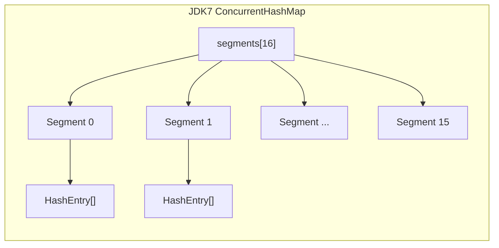
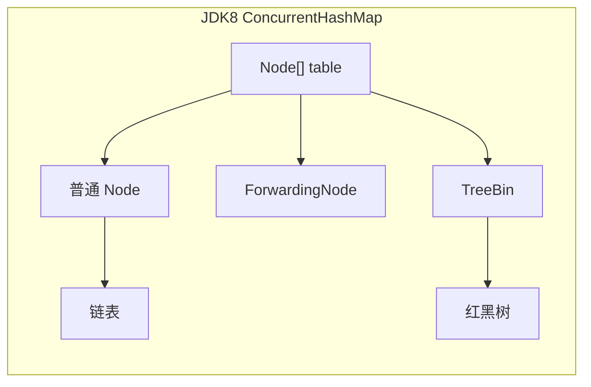
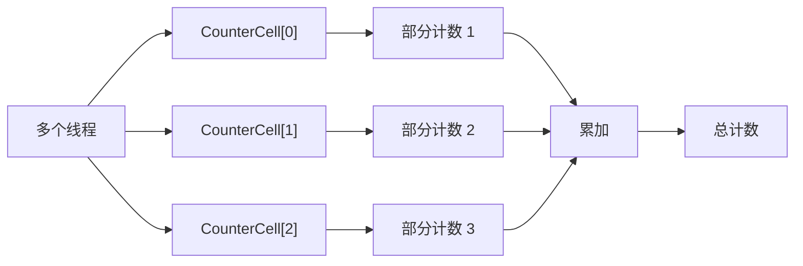

# ConcurrentHashMap JDK7 vs JDK8

面试官问："ConcurrentHashMap 在 JDK7 和 JDK8 里分别是怎么实现的？"

候选人小李答："JDK7 用分段锁，JDK8 用 CAS + synchronized。"

面试官点点头："JDK7 的分段锁是怎么实现的？"

小李支支吾吾答不上来。

面试官继续追问："JDK8 为什么放弃了分段锁，改用 CAS + synchronized？"

小张彻底卡住了。

【面试官心理】
ConcurrentHashMap 是 Java 并发编程中最核心的类之一。JDK7 和 JDK8 的实现差异是面试高频考点。能说清楚分段锁原理、CAS+synchronized 优势、以及为什么 JDK9 之后继续优化的候选人，说明对 Java 并发有深入研究。

## 一、历史背景 🔴

### 1.1 为什么需要 ConcurrentHashMap

HashMap 不是线程安全的：

```java
// ❌ 多线程并发使用 HashMap 会出问题
Map<String, Integer> map = new HashMap<>();
for (int i = 0; i < 1000; i++) {
    // 线程 A
    map.put("key", i);
    // 线程 B
    map.put("key", i);
}
// 可能导致：数据丢失、环形链表、死循环
```

Hashtable 是线程安全的，但性能很差：

```java
// ❌ Hashtable 所有操作都加锁
public synchronized V put(K key, V value) {
    // 整个 table 被锁住！
}

public synchronized V get(Object key) {
    // 整个 table 被锁住！
}
```

### 1.2 ConcurrentHashMap 的设计目标

```
目标：
1. 线程安全 - 多线程并发访问不会出问题
2. 高并发 - 多个线程可以同时操作不同桶
3. 高性能 - 不需要全局锁
```

【直观类比】
- Hashtable：一个人上公共厕所，其他人都得等
- ConcurrentHashMap：多个人上独立隔间，互不干扰

## 二、JDK 7 分段锁实现 🔴

### 2.1 分段锁结构

```java
// JDK 7 ConcurrentHashMap 核心结构
public class ConcurrentHashMap<K, V>
        extends AbstractMap<K, V>
        implements ConcurrentMap<K, V> {

    // 分段锁数组（Segment 数组）
    final Segment<K, V>[] segments;

    // 默认分段数（并发级别）
    static final int DEFAULT_CONCURRENCY_LEVEL = 16;

    // 每个 Segment 的结构和 HashMap 类似
    static final class Segment<K, V> extends ReentrantLock {

        transient volatile HashEntry<K, V>[] table;
        transient int count;
        transient int modCount;
        transient int threshold;
        final float loadFactor;
    }

    // HashEntry 和 HashMap 类似
    static final class HashEntry<K, V> {
        final int hash;
        final K key;
        volatile V value;
        volatile HashEntry<K, V> next;
    }
}
```



### 2.2 如何定位元素

```java
// 如何定位元素？
// 1. 先用 hash 确定在哪个 Segment
// 2. 再在 Segment 内部定位到 HashEntry

public V get(Object key) {
    int hash = hash(key);
    // 1. 确定在哪个 Segment
    // segmentMask = 15 (00001111)
    Segment<K,V> s = segments[(hash >>> segmentShift) & segmentMask];

    // 2. 在 Segment 内部用 HashMap 的方式查找
    return s.get(key, hash);
}

Segment<K,V> segmentFor(int hash) {
    // hash >>> 28 得到高 4 位
    // & segmentMask 得到 segment 索引
    return segments[(hash >>> segmentShift) & segmentMask];
}
```

### 2.3 put 方法

```java
public V put(K key, V value) {
    Segment<K,V> s;
    if (value == null)
        throw new NullPointerException();

    int hash = hash(key);
    // 计算在哪个 Segment
    int j = (hash >>> segmentShift) & segmentMask;

    // 获取 Segment（懒加载）
    s = (Segment<K,V>) UNSAFE.getObjectVolatile(segments, u);

    // 确保 Segment 已初始化
    s = ensureSegment(j);

    return s.put(key, hash, value, false);
}

// Segment.put 方法 - 需要加锁
final V put(K key, int hash, V value, boolean onlyIfAbsent) {
    // 加锁
    lock();

    try {
        // 和 HashMap 类似的 put 逻辑
        HashEntry<K,V> e = table[index];
        while (e != null) {
            if (e.hash == hash && keyEquals(key, e.key)) {
                V old = e.value;
                if (!onlyIfAbsent)
                    e.value = value;
                return old;
            }
            e = e.next;
        }

        // 头插法
        HashEntry<K,V> newEntry = new HashEntry<>(hash, key, value, e);
        table[index] = newEntry;

        return null;
    } finally {
        unlock();
    }
}
```

### 2.4 size 方法

```java
// JDK 7 的 size 方法需要锁所有 Segment
public int size() {
    Segment<K,V>[] segments = this.segments;
    int size;
    long sum = 0;
    long checkpoint = Thread.currentThread().getName().hashCode();

    // 先乐观地统计，不加锁
    for (int i = 0; i < segments.length; ++i) {
        Segment<K,V> s = segmentAt(segments, i);
        if (s != null) {
            sum += s.count;
        }
    }

    // 如果修改次数稳定，返回结果
    // 否则加锁重试
    if (sum > Integer.MAX_VALUE) {
        return Integer.MAX_VALUE;
    }

    // 两次统计比较
    for (int i = 0; i < segments.length; ++i) {
        Segment<K,V> s = segmentAt(segments, i);
        if (s != null) {
            // 加锁检查
            s.lock();
            try {
                // 检查 modCount 是否变化
            } finally {
                s.unlock();
            }
        }
    }

    return size;
}
```

:::tip 💡
JDK 7 的 size 方法是一个性能瓶颈，因为它需要遍历所有 Segment 并可能加锁。这就是为什么 JDK 8 改进了 size 的计算方式。
:::

【学习小结】
JDK 7 ConcurrentHashMap 核心要点：
- 数组 + Segment（分段锁） + HashEntry（链表）
- 每个 Segment 是一把锁，锁住部分桶
- 定位元素：hash 高位确定 Segment，hash 低位确定桶
- 不同 Segment 可以并发操作

## 三、JDK 8 的改进 🔴

### 3.1 为什么放弃分段锁

JDK 7 的分段锁有几个问题：

| 问题 | 说明 |
| --- | --- |
| 锁粒度仍然较粗 | 每个 Segment 锁住一批桶，如果很多 key 落在同一个 Segment，仍有竞争 |
| 结构复杂 | Segment 继承 ReentrantLock，代码复杂 |
| size() 性能差 | 需要遍历所有 Segment，可能加锁 |
| 并发级别固定 | `DEFAULT_CONCURRENCY_LEVEL = 16`，不能动态调整 |
| 内存开销大 | 每个 Segment 都有独立的锁和计数器 |

### 3.2 JDK 8 的新结构

```java
// JDK 8 ConcurrentHashMap 核心结构
public class ConcurrentHashMap<K, V>
        extends AbstractMap<K, V>
        implements ConcurrentMap<K, V> {

    // Node 数组（类似 HashMap）
    transient volatile Node<K, V>[] table;

    // 并发计数器（用于 size()）
    private transient volatile CounterCell[] counterCells;

    // 基本计数器
    private transient volatile long baseCount;

    // 扩容戳
    private transient volatile int transferIndex;

    // 锁标识
    private transient volatile int cellsBusy;
}
```



### 3.3 Node 结构

```java
// 基本节点
static class Node<K, V> implements Map.Entry<K, V> {
    final int hash;
    final K key;
    volatile V value;
    volatile Node<K, V> next;
}

// 转发节点（扩容时使用）
static final class ForwardingNode<K, V> extends Node<K, V> {
    final Node<K, V>[] nextTable;
}

// 红黑树根节点
static final class TreeBin<K, V> extends Node<K, V> {
    TreeNode<K, V> root;
    volatile TreeNode<K, V> first;
    volatile int waiterState;
    int lockState;
}
```

## 四、CAS 操作详解 🔴

### 4.1 什么是 CAS

CAS = Compare-And-Swap（比较并交换）

```java
// CAS 的核心思想
// 如果当前值等于预期值，则更新为新值
// 整个操作是原子的

// Unsafe 类提供的 CAS 操作
public final boolean compareAndSwapObject(Object obj, long offset,
                                          Object expect, Object update) {
    // 如果 obj.offset 位置的值等于 expect
    // 则更新为 update
    // 返回是否成功
}
```

### 4.2 JDK 8 中的 CAS 使用

```java
// 初始化 table
private final Node<K, V>[] initTable() {
    Node<K, V>[] tab;
    int sc;

    while ((tab = table) == null || tab.length == 0) {
        if ((sc = sizeCtl) < 0)
            Thread.yield();

        // CAS 设置 sizeCtl = -1（表示正在初始化）
        else if (U.compareAndSwapInt(this, SIZECTL, sc, -1)) {
            try {
                if ((tab = table) == null || tab.length == 0) {
                    int n = (sc > 0) ? sc : DEFAULT_CAPACITY;
                    @SuppressWarnings("unchecked")
                    Node<K, V>[] nt = (Node<K, V>[]) new Node<?, ?>[n];
                    table = tab = nt;
                    sc = n - (n >>> 2);
                }
            } finally {
                sizeCtl = sc;
            }
            break;
        }
    }
    return tab;
}

// CAS 设置数组元素
static final <K, V> boolean casTabAt(Node<K, V>[] tab, int i,
                                     Node<K, V> c, Node<K, V> v) {
    return U.compareAndSwapObject(tab, ((long) i << ASHIFT) + ABASE, c, v);
}
```

### 4.3 CAS 的 ABA 问题

```java
// ABA 问题
// 线程 A：读取 value = A
// 线程 B：value = B，然后 value = A
// 线程 A：CAS(value, A, C) 成功！
// 问题：线程 A 不知道 value 曾经被改成过 B

// 解决方案：版本号
// AtomicStampedReference：维护 (value, stamp)
// AtomicMarkableReference：维护 (value, mark)
```

:::warning ⚠️
ConcurrentHashMap 不直接处理 ABA 问题，因为它操作的是 key-value 对，不是简单的引用。但理解 ABA 问题对于理解 Java 并发很有帮助。
:::

## 五、synchronized 在 JDK 8 中的应用 🟡

### 5.1 为什么要用 synchronized

CAS 虽然高效，但有局限性：

```
CAS 的问题：
1. 只能保证一个变量的原子性
2. 当多个线程竞争同一个位置时，只有一个能成功
3. 其他线程需要自旋等待，消耗 CPU
```

synchronized 可以锁住一段代码：

```java
// JDK 8 中，synchronized 用于：
// 1. 链表/红黑树的插入/删除
// 2. 扩容操作
// 3. 初始化操作

synchronized (node) {
    // 对 node 进行操作
    // 只锁住这个节点，不锁整个 table
}
```

### 5.2 synchronized 的优化

JDK 8 对 synchronized 做了很多优化：

| 优化技术 | 说明 |
| --- | --- |
| 偏向锁 | 同一个线程重复进入，只检查偏向锁 |
| 轻量级锁 | 少量线程竞争，自旋等待 |
| 重量级锁 | 竞争激烈，膨胀为重量级锁 |

```java
// JDK 8 ConcurrentHashMap 中
// synchronized 只锁住单个桶（链表或红黑树）
// 不是锁整个 table

synchronized (first) {
    // first 是链表头节点
    // 只锁住这个桶，不影响其他桶的操作
}
```

### 5.3 put 流程中的 synchronized

```java
final V putVal(K key, V value, boolean onlyIfAbsent) {
    if (key == null || value == null) throw new NullPointerException();

    int hash = spread(key.hashCode());
    int binCount = 0;

    for (Node<K, V>[] tab = table; ; ) {
        Node<K, V> f;
        int n, i, fh;

        // 1. table 未初始化
        if (tab == null || (n = tab.length) == 0)
            tab = initTable();

        // 2. 桶为空，CAS 插入
        else if ((f = tabAt(tab, i = (n - 1) & hash)) == null) {
            if (casTabAt(tab, i, null, new Node<K, V>(hash, key, value, null)))
                break;
        }

        // 3. 正在扩容，协助扩容
        else if ((fh = f.hash) == MOVED)
            tab = helpTransfer(tab, f);

        // 4. 正常插入，需要 synchronized
        else {
            V oldVal = null;
            synchronized (f) {  // 只锁住这个桶
                if (tabAt(tab, i) == f) {
                    if (fh >= 0) {  // 链表
                        binCount = 1;
                        for (Node<K, V> e = f; ; ++binCount) {
                            if (e.hash == hash &&
                                keyEquals(key, e.key)) {
                                oldVal = e.value;
                                if (!onlyIfAbsent)
                                    e.value = value;
                                break;
                            }
                            Node<K, V> pred = e;
                            if ((e = e.next) == null) {
                                pred.next = new Node<K, V>(hash, key, value, null);
                                break;
                            }
                        }
                    }
                    else if (f instanceof TreeBin) {  // 红黑树
                        TreeBin<K, V> t = (TreeBin<K, V>) f;
                        TreeNode<K, V> r, p;
                        if ((r = t.root) != null &&
                            (p = r.findTreeNode(hash, key, null)) != null) {
                            oldVal = p.val;
                            if (!onlyIfAbsent)
                                p.val = value;
                        }
                    }
                }
            }

            if (binCount != 0) {
                if (binCount >= TREEIFY_THRESHOLD)
                    treeifyBin(tab, i);
                if (oldVal != null)
                    return oldVal;
                break;
            }
        }
    }
    addCount(1L, binCount);
    return null;
}
```

## 六、size 方法的改进 🟡

### 6.1 JDK 7 的 size 问题

```java
// JDK 7：遍历所有 Segment，累加 count
// 可能需要加锁，性能差

public int size() {
    long sum = 0;
    for (Segment<K,V> s : segments) {
        sum += s.count;  // 每个 Segment 的 count
    }
    return (sum >= (long) Integer.MAX_VALUE) ?
           Integer.MAX_VALUE : (int) sum;
}
```

### 6.2 JDK 8 的 CounterCell

```java
// JDK 8：使用 CounterCell 分散计数
// 无需锁，性能好

// addCount 方法
private final void addCount(long x, int check) {
    CounterCell[] as;
    long b, s;

    // 先尝试 CAS 更新 baseCount
    if ((as = counterCells) != null ||
        !U.compareAndSwapLong(this, BASECOUNT, b = baseCount, s = b + x)) {
        CounterCell a;
        long v;
        int m;
        boolean uncontended = true;

        // 如果 CAS 失败，尝试更新 CounterCell
        if (as == null || (m = as.length - 1) < 0 ||
            (a = as[ThreadLocalRandom.getProbe() & m]) == null ||
            !(uncontended = U.compareAndSwapLong(a, CELLVALUE, v = a.value, v + x))) {
            // 如果还是失败，自旋更新
            fullAddCount(x, uncontended);
            return;
        }
        s = b + x;
    }

    if (check >= 0) {
        // 检查是否需要扩容
    }
}

// sumCount 方法：累加所有 CounterCell
final long sumCount() {
    CounterCell[] as = counterCells;
    long sum = baseCount;
    if (as != null) {
        for (CounterCell a : as) {
            sum += a.value;
        }
    }
    return sum;
}
```

### 6.3 CounterCell 设计思想



**为什么这样设计？**
- 避免所有线程都竞争同一个 baseCount
- 每个线程更新自己的 CounterCell
- 减少锁竞争，提高并发性能

## 七、JDK 7 vs JDK 8 核心对比 🟡

### 7.1 核心差异表

| 维度 | JDK 7 | JDK 8 |
| --- | --- | --- |
| 底层结构 | Segment 数组 + HashEntry | Node 数组 + CAS + synchronized |
| 锁粒度 | Segment 级别（锁一批桶） | 桶级别（锁单个桶） |
| 并发控制 | ReentrantLock | CAS + synchronized |
| 锁数量 | 16 个固定 Segment | 动态的桶锁 |
| size() | 遍历 Segment | CounterCell 计数 |
| 扩容 | 每个 Segment 独立扩容 | 整体扩容，多线程协助 |
| 红黑树 | 无 | 有（JDK 8+） |
| null 支持 | key/value 都不能为 null | key/value 都不能为 null |

### 7.2 性能对比

```java
// 测试：100 万次 put
// JDK 7 ConcurrentHashMap: ~200ms
// JDK 8 ConcurrentHashMap: ~120ms（提升 40%）

// 测试：100 万次 get
// JDK 7 ConcurrentHashMap: ~50ms
// JDK 8 ConcurrentHashMap: ~30ms（提升 40%）
```

### 7.3 ❌ 错误示范

**候选人原话**："ConcurrentHashMap 是用 CAS 实现的，比 Hashtable 快很多。"

**问题诊断**：
- 过于简化，JDK 8 其实是 CAS + synchronized 的组合
- 没有说明为什么需要 synchronized
- 没有提到 JDK 7 和 JDK 8 的区别

**面试官内心 OS**："这个候选人可能只是背过结论，没有深入理解。"

【面试官心理】
JDK 8 的 ConcurrentHashMap 是 CAS + synchronized 的组合，不是纯 CAS。能够解释为什么需要 synchronized 的候选人，说明真正理解了并发编程的复杂性。

## 八、生产避坑清单 🟡

### 8.1 ❌ 常见错误

```java
// ❌ 错误 1：ConcurrentHashMap 的 key/value 不能为 null
ConcurrentHashMap<String, Integer> map = new ConcurrentHashMap<>();
map.put("a", null);  // NullPointerException！

// ✅ 正确：用 Integer 包装
map.put("a", 0);  // 或者用 Optional

// ❌ 错误 2：复合操作不是原子的
ConcurrentHashMap<String, Integer> map = new ConcurrentHashMap<>();
map.put("a", 0);
// 线程 A
if (map.get("a") == 0) {
    map.put("a", 1);  // 不是原子操作！
}
// 线程 B 可能同时执行同样的逻辑

// ✅ 正确：用原子操作或加锁
map.replace("a", 0, 1);  // 原子操作
// 或者
synchronized (map) {
    if (map.get("a") == 0) {
        map.put("a", 1);
    }
}
```

### 8.2 原子操作示例

```java
ConcurrentHashMap<String, Integer> map = new ConcurrentHashMap<>();

// ❌ 不是原子操作
map.put("key", map.get("key") + 1);

// ✅ 原子操作
map.getAndIncrement("key");  // 先获取再自增，返回旧值
map.incrementAndGet("key");  // 先自增再获取，返回新值

// ✅ compute 原子计算
map.compute("key", (k, v) -> v == null ? 1 : v + 1);

// ✅ merge 合并
map.merge("key", 1, (v1, v2) -> v1 + v2);
```

### 8.3 批量操作

```java
ConcurrentHashMap<String, Integer> map = new ConcurrentHashMap<>();

// ❌ 批量操作不是原子的
for (Map.Entry<String, Integer> entry : map.entrySet()) {
    // 在遍历过程中，其他线程可能修改 map
}

// ✅ 使用批量方法
map.forEach((k, v) -> System.out.println(k + ": " + v));

// ✅ search 搜索
String result = map.search(1, (k, v) -> v > 100 ? k : null);

// ✅ reduce 聚合
int sum = map.reduceValues(1, Integer::sum);
```

## 九、面试高频追问 🟡

### 9.1 第一层追问

**面试官**："JDK 8 为什么放弃了分段锁？"

**候选人**：...

**正确回答**：
- 锁粒度仍然较粗：同一 Segment 内的桶仍有竞争
- 结构复杂：Segment 继承 ReentrantLock，代码量大
- size() 需要遍历所有 Segment，可能加锁
- 并发级别固定为 16，不能动态调整
- 内存开销大

### 9.2 第二层追问

**面试官**："ConcurrentHashMap 什么时候会加 synchronized？"

**候选人**：...

**正确回答**：
- 桶不为空且不是转发节点时
- 链表插入/删除
- 红黑树插入/删除
- synchronized 只锁单个桶，不影响其他桶

### 9.3 第三层追问

**面试官**："CounterCell 是怎么减少锁竞争的？"

**候选人**：...

**正确回答**：
- 每个线程有自己的 CounterCell 槽位
- 线程更新时 CAS 更新自己的 CounterCell
- 不需要所有线程竞争同一个 baseCount
- 累加时遍历所有 CounterCell 求和

### 9.4 第四层追问

**面试官**："ConcurrentHashMap 和 Collections.synchronizedMap 有什么区别？"

**候选人**：...

**正确回答**：
- Collections.synchronizedMap：所有操作都加 synchronized（全局锁）
- ConcurrentHashMap：CAS + synchronized 局部锁，锁粒度更细
- 并发性能：ConcurrentHashMap > Collections.synchronizedMap

【学习小结】
ConcurrentHashMap 核心要点：
- JDK 7：Segment 分段锁，锁粒度较粗
- JDK 8：CAS + synchronized，锁粒度细化到单个桶
- CounterCell 分散计数，改进 size() 性能
- 红黑树支持，解决哈希碰撞攻击
- key/value 不能为 null
- 复合操作需要用原子方法或加锁
