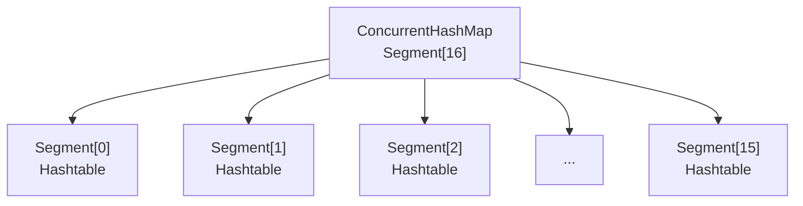

# ConcurrentHashMap JDK7 vs JDK8

小李在面试时被问到："ConcurrentHashMap 是怎么保证线程安全的？"

小李说："用分段锁。"

面试官追问："JDK7 和 JDK8 的实现一样吗？"

小李愣了一下："好像...JDK8 改进了？"

面试官："JDK8 改成了什么？"

小李支支吾吾："用...CAS？"

面试官点点头："那 JDK8 的 size() 方法还需要分段锁吗？"

小张彻底卡住。

【面试官心理】

这道题我用来测试候选人对 JDK 版本演进的了解。ConcurrentHashMap 是 Java 并发包中最复杂的类之一，JDK7 和 JDK8 的设计差异巨大。知道分段锁的占 40%，知道 JDK8 用 CAS+synchronized 的占 20%，能讲清楚 JDK8 为什么放弃分段锁的占 5%。这道题能答到最后的，基本都看过源码或者研究过并发设计。

## 一、历史背景：从 Hashtable 到分段锁 🔴

### 1.1 Hashtable 的问题

```java
public class Hashtable<K, V> {
    // 所有方法都用 synchronized，所有操作都要抢同一把锁
    public synchronized V put(K key, V value) { ... }
    public synchronized V get(Object key) { ... }
    public synchronized V remove(Object key) { ... }
    public synchronized int size() { ... }
}
```

Hashtable 的问题是：**所有操作都要竞争同一把锁**。在高并发下，所有线程都在抢同一把锁，变成了串行执行，性能极差。

### 1.2 JDK7 的解决方案：分段锁（Segment）

```java
public class ConcurrentHashMap<K, V> extends AbstractMap<K, V>
        implements ConcurrentMap<K, V>, java.io.Serializable {

    // 分段数组，每个 Segment 是一把独立的锁
    final Segment<K, V>[] segments;

    // 默认分段数 16
    static final int DEFAULT_CONCURRENCY_LEVEL = 16;

    // Segment 继承 ReentrantLock
    static final class Segment<K, V> extends ReentrantLock {
        transient volatile HashEntry<K, V>[] table;
        transient int count;
    }
}
```



ConcurrentHashMap 把整个哈希表分成 16 个段（Segment），每个段是独立的锁。不同段的 key 可以并发操作，互不干扰。

**并发度 = 16**，理论上最多 16 个线程同时操作不冲突。

## 二、JDK7 分段锁详解 🔴

### 2.1 put 方法

```java
public V put(K key, V value) {
    Segment<K, V> s;
    if (value == null) throw new NullPointerException();

    int hash = hash(key);
    int j = (hash >>> 16) ^ hash;  // 二次 hash
    int segmentIndex = (j >>> 28) * 16;  // 计算落在哪个 Segment

    // 初始化 Segment（懒初始化）
    if ((s = (Segment<K, V>)UNSAFE.getObject(segments, (j << 2) + SBASE)) == null) {
        s = ensureSegment(j);
    }
    return s.put(key, hash, value, false);
}

// Segment.put
final V put(K key, int hash, V value, boolean onlyIfAbsent) {
    // 加锁
    lock();
    try {
        // 和 HashMap 类似的插入逻辑
        // ...
    } finally {
        unlock();
    }
}
```

### 2.2 get 方法

```java
public V get(Object key) {
    Segment<K, V> s;
    HashEntry<K, V>[] tab;
    int h = hash(key);

    // 二次 hash
    int u = (((h >>> 16) ^ h) << 2) + segmentIndex;
    int c = count - 1;

    // get 不需要加锁！
    if ((s = (Segment<K,V>)UNSAFE.getObjectVolatile(segments, u)) != null &&
        (tab = s.table) != null) {
        // 遍历链表
        for (HashEntry<K,V> e = (HashEntry<K,V>) UNSAFE.getObjectVolatile(tab, ((long)(((tab.length - 1) & h)) << TSHIFT) + TBASE);
             e != null; e = e.next) {
            if (e.hash == h && key.equals(e.key))
                return e.value;
        }
    }
    return null;
}
```

**JDK7 的 get 不需要加锁**，因为 HashEntry 的 value 和 next 都是 volatile 的，保证可见性。

:::warning ⚠️
JDK7 的 ConcurrentHashMap 有两个问题：
1. Segment 数组大小是固定的，不能动态扩容（并发度固定为 16）
2. 如果某些 key 集中在同一个 Segment，其他 Segment 空闲，并发度退化
:::

### 2.3 size 方法

```java
public int size() {
    // 先不加锁统计，期望大部分情况下不冲突
    long sum = 0;
    int check = 0;
    for (int i = 0; i < SEGMENTS; ++i) {
        Segment<K, V> s = segments[i];
        if (s != null) {
            sum += s.count;  // 每个 Segment 的 count
            check++;
        }
    }

    // 如果两次结果不一致，说明有并发修改，加锁重试
    if (sum != lastAddCount) {
        lock();  // 加锁重算
        try {
            sum = 0;
            lastAddCount = 0;
            for (int i = 0; i < SEGMENTS; ++i) {
                Segment<K, V> s = segments[i];
                s.lock();
                sum += s.count;
                lastAddCount += s.modCount;
            }
        } finally {
            unlock();
        }
    }
    return (int) sum;
}
```

**JDK7 的 size() 需要加锁**，因为统计 count 时其他线程可能正在修改。

## 三、JDK8 的革命：CAS + Synchronized 🔴

### 3.1 为什么放弃分段锁？

JDK7 的分段锁有几个问题：
1. **并发度固定**：16 个 Segment，不能动态调整
2. **实现复杂**：Segment 是独立的类，需要两层寻址
3. **内存开销**：Segment 对象本身就有额外开销
4. **扩容复杂**：Segment 不能扩容，只能整体扩容

JDK8 做了彻底的重构：

```java
public class ConcurrentHashMap<K, V> extends AbstractMap<K, V>
        implements ConcurrentMap<K, V>, Serializable {

    // JDK8：统一的数组，不再有 Segment
    transient volatile Node<K, V>[] table;

    // JDK8：使用 CAS + synchronized
    // put 操作用 synchronized 锁住单个桶（链表头或红黑树根节点）
    // get 操作用 volatile 保证可见性，不需要加锁
}
```

### 3.2 JDK8 的三种锁粒度

```java
// 1. 空数组：用 CAS 设置
if (casTabAt(tab, i, null, new Node<K,V>(hash, key, value, null)))

// 2. 链表头：用 synchronized 锁住头节点
synchronized (f) {
    if (tabAt(tab, i) == f) {
        // 遍历链表
    }
}

// 3. 红黑树：用 synchronized 锁住 TreeBin
synchronized (root) {
    // 红黑树操作
}
```

| 场景 | JDK8 策略 | 说明 |
| --- | --- | --- |
| 数组初始化 | CAS | 保证只有一个线程初始化成功 |
| 插入到空桶 | CAS | 保证只有一个线程插入成功 |
| 插入到非空桶 | synchronized | 锁住链表头/树根，避免并发修改 |
| 读取 | volatile | 不加锁，利用 volatile 保证可见性 |
| 扩容 | synchronized + 多线程 | 多个线程并行扩容 |

### 3.3 JDK8 的 get 不需要锁

```java
public V get(Object key) {
    Node<K, V>[] tab;
    Node<K, V> e, p;
    int n, eh;
    K ek;
    int h = spread(key.hashCode());

    if ((tab = table) != null && (n = tab.length) > 0 &&
        (e = tabAt(tab, (n - 1) & h)) != null) {
        if ((eh = e.hash) == h) {
            if ((ek = e.key) == key || (ek != null && key.equals(ek)))
                return e.value;
        } else if (eh < 0) {
            // 红黑树节点
            return (p = e.find(h, key)) != null ? p.value : null;
        }
        // 遍历链表
        while ((e = e.next) != null) {
            if (e.hash == h && ((ek = e.key) == key || (ek != null && key.equals(ek))))
                return e.value;
        }
    }
    return null;
}
```

get 不需要加锁，因为：
1. `table` 是 `volatile`，保证可见性
2. 节点的 `next` 是 `volatile`，插入时对其他线程立即可见
3. synchronized 只在 put/remove 时锁住链表头

## 四、版本对比 🟡

### 4.1 核心差异

| 维度 | JDK7 | JDK8 |
| --- | --- | --- |
| 底层结构 | Segment[] + HashEntry[] | Node[] (统一数组) |
| 并发机制 | 分段锁（ReentrantLock） | CAS + synchronized |
| 锁粒度 | Segment 级别 | 桶级别（链表头/树根） |
| 并发度 | 固定 16（可配置） | 动态（和容量相关） |
| get 性能 | 无锁 | 无锁 |
| put 性能 | 加锁 | 加锁（但粒度更细） |
| size() | Segment 锁 | 不用锁（CounterCell） |
| 扩容 | 整体扩容 | 多线程并行扩容 |

### 4.2 为什么 JDK8 用 synchronized？

JDK8 放弃 ReentrantLock，改用 synchronized 的原因：

1. **JVM 优化**：JDK6 之后 synchronized 引入了偏向锁、轻量级锁优化，性能和 ReentrantLock 相当
2. **内存占用**：ReentrantLock 需要额外的 `AQS` 对象，`synchronized` 直接用对象头
3. **JIT 友好**：`synchronized` 的锁升级路径对 JIT 优化更友好

:::tip 💡
JDK8 的 synchronized 只锁住链表头/树根，而不是整个桶数组，所以锁粒度更细。如果两个线程同时操作不同的桶，不会冲突。JDK7 的 Segment 锁住了整个段，如果两个 key 落在同一个 Segment，就会冲突。
:::

### 4.3 JDK8 的 CounterCell

JDK8 的 size() 不需要加锁，依赖 `CounterCell` 数组：

```java
private final CounterCell[] counterCells;

static final class CounterCell {
    volatile long value;
    CounterCell(long x) { value = x; }
}

// size() = baseCount + sum(counterCells)
public int size() {
    long n = sumCount();
    return ((n < 0L) ? 0 : (n > (long)Integer.MAX_VALUE) ? Integer.MAX_VALUE : (int)n);
}
```

多个线程并发修改 `baseCount` 时，用 CounterCell 分担压力，减少 CAS 冲突。

## 五、面试追问链 🟡

### 追问一：ConcurrentHashMap 允许 null 吗？

不允许。`ConcurrentHashMap` 的所有方法都不接受 null key 或 null value：

```java
map.put(null, "value");  // NullPointerException
map.get(null);           // NullPointerException
```

这是故意的设计，因为并发环境下，null 和"不存在"无法区分。

### 追问二：JDK8 扩容时其他线程能继续读写吗？

能。JDK8 支持**并发扩容**：

```java
// 扩容时，新数组和老数组同时存在
// 读操作：新数据查新表，旧数据查老表
// 写操作：新数据写入新表
// 迁移：每个线程负责一段桶的迁移
```

### 追问三：为什么 ConcurrentHashMap 比 Hashtable 快？

| 维度 | Hashtable | ConcurrentHashMap JDK8 |
| --- | --- | --- |
| 锁粒度 | 整个表一把锁 | 单个桶 |
| get 操作 | synchronized | 无锁（volatile） |
| 扩容 | 阻塞所有操作 | 多线程并行扩容 |

【面试官心理】

问到 ConcurrentHashMap JDK7 vs JDK8 的候选人，通常对并发编程有一定研究。这道题的关键在于理解"分段锁 vs CAS+synchronized"的设计演进，以及为什么 JDK8 放弃了看似完美的分段锁。能讲清楚锁粒度变化、size() 实现差异的候选人，基本都值得给 offer。
