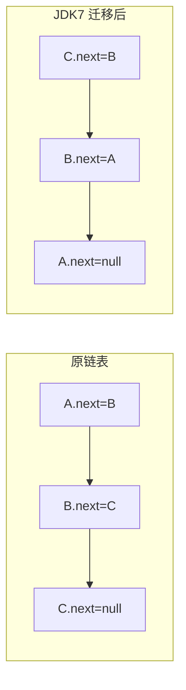

# HashMap 扩容机制（resize）

候选人小李在面试时被问到："HashMap 什么时候会扩容？"

小李答："元素数量超过阈值时扩容。"

面试官追问："JDK7 和 JDK8 的扩容有什么区别？"

小李说："JDK8 用了红黑树？"

面试官摇头："我问的是扩容算法，不是数据结构。"

小张彻底答不上来了。

【面试官心理】
扩容机制是 HashMap 的核心难点之一。JDK7 的扩容算法有个经典的并发死循环问题，这是面试常考的深水区。能说清楚 JDK7 和 JDK8 扩容差异的候选人，说明对 HashMap 源码有过深入研究。

## 一、扩容触发条件 🔴

### 1.1 触发时机

HashMap 的扩容由两个参数控制：

```java
// 默认容量
static final int DEFAULT_INITIAL_CAPACITY = 1 << 4; // 16

// 默认负载因子
static final float DEFAULT_LOAD_FACTOR = 0.75f;

// 扩容阈值 = 容量 × 负载因子
// 默认情况：16 × 0.75 = 12
// 当 size > 12 时，触发扩容
```

```java
// 在 putVal 方法中
if (++size > threshold)
    resize();
```

**扩容触发条件**：
- `size`（元素数量）超过 `threshold`（扩容阈值）
- 默认情况：16 × 0.75 = 12，即第 13 个元素插入时触发扩容

### 1.2 扩容流程图

```mermaid
graph TD
    A["put(key, value)"] --> B["size++"]
    B --> C{"size `<`<br/>threshold?"]
    C -->|是| D["直接返回"]
    C -->|否| E["resize() 扩容"]
    E --> F["创建新数组<br/>容量翻倍"]
    F --> G["迁移所有元素"]
    G --> H["更新 table 引用"]
    H --> D
```

### 1.3 扩容倍数

```java
// HashMap 的容量扩展永远是 2 倍
// 16 → 32 → 64 → 128 → ...

// 为什么要 2 倍？
// 1. 保持 2 的幂次的特性（n-1 全是 1）
// 2. 扩容算法可以利用这个特性优化
```

:::tip 💡
扩容后容量翻倍，但阈值也翻倍。所以扩容后需要再插入 **容量 × 0.75 - 容量 × 0.75 = 容量 × 0.75** 个元素才会再次扩容。
:::

【学习小结】
- 扩容阈值 = 容量 × 负载因子（默认 16 × 0.75 = 12）
- 第 13 个元素插入时触发第一次扩容
- 扩容后容量翻倍：16 → 32 → 64 → 128
- 阈值也翻倍：12 → 24 → 48 → 96

## 二、JDK 7 扩容算法 🔴

### 2.1 JDK 7 的 resize 方法

```java
void resize(int newCapacity) {
    Entry[] oldTable = table;
    int oldCapacity = oldTable.length;

    // 容量达到最大值，不再扩容
    if (oldCapacity == MAXIMUM_CAPACITY) {
        threshold = Integer.MAX_VALUE;
        return;
    }

    // 创建新数组
    Entry[] newTable = new Entry[newCapacity];
    transfer(newTable, initHashSeedAsNeeded(newCapacity));
    table = newTable;
    threshold = (int)(newCapacity * loadFactor);
}
```

### 2.2 JDK 7 的 transfer 方法

```java
void transfer(Entry[] newTable) {
    Entry[] src = table;
    int newCapacity = newTable.length;

    // 遍历旧数组的每个桶
    for (int j = 0; j < src.length; j++) {
        Entry<K,V> e = src[j];

        if (e != null) {
            src[j] = null; // 释放旧桶引用

            // 遍历桶中的每个节点
            do {
                Entry<K,V> next = e.next;  // 记录下一个节点

                // 重新计算 hash（在新数组中的位置）
                int i = indexFor(e.hash, newCapacity);
                e.next = newTable[i];  // 新桶的头插法
                newTable[i] = e;

                e = next;  // 处理下一个节点
            } while (e != null);
        }
    }
}
```

### 2.3 JDK 7 扩容的问题

**头插法导致的链表反转**：



**并发场景下的死循环**：

```java
// 线程 1 和线程 2 同时扩容

// 假设原链表：A -> B -> C（hash 相同，在同一个桶）
// 线程 1 执行到 transfer 时挂起

// 线程 2 完成扩容，链表变成：C -> B -> A（反转！）

// 线程 1 恢复执行，继续处理 A
// 此时 A.next = B（但 B.next = A！）
// 结果：形成环形链表

// 调用 get() 时：
while (e.next != null) {  // 永远不会为 null！
    // 死循环！
}
```

:::warning ⚠️
JDK 7 的 HashMap 扩容在多线程环境下可能导致环形链表，造成 CPU 100% 的死循环。这是经典的并发问题，面试必问！
:::

### 2.4 ❌ 错误示范

**候选人原话**："HashMap 线程不安全，所以不要在多线程下使用。"

**问题诊断**：
- 知道结论但不知道原因
- 不能解释为什么会出现死循环
- 不能说明 JDK 8 怎么解决的

**面试官内心 OS**："这个候选人只知道不能并发用 HashMap，但没有理解底层的原理。"

【面试官心理】
JDK 7 扩容死循环是 HashMap 面试的经典深水区。能说清楚头插法、链表反转、死循环形成原因的候选人，说明真正理解了扩容的每个细节。

## 三、JDK 8 扩容算法 🔴

### 3.1 JDK 8 的 resize 方法

```java
final Node<K,V>[] resize() {
    Node<K,V>[] oldTab = table;
    int oldCap = (oldTab == null) ? 0 : oldTab.length;
    int oldThr = threshold;
    int newCap, newThr = 0;

    // 情况 1：正常扩容
    if (oldCap > 0) {
        // 容量已达最大值，不再扩容
        if (oldCap >= MAXIMUM_CAPACITY) {
            threshold = Integer.MAX_VALUE;
            return oldTab;
        }
        // 新容量 = 旧容量 × 2
        // 新阈值 = 旧阈值 × 2
        else if ((newCap = oldCap << 1) < MAXIMUM_CAPACITY &&
                 oldCap >= DEFAULT_INITIAL_CAPACITY)
            newThr = oldThr << 1;
    }

    // 情况 2：构造函数指定了 initialCapacity
    else if (oldThr > 0)
        newCap = oldThr;

    // 情况 3：默认构造函数
    else {
        newCap = DEFAULT_INITIAL_CAPACITY;
        newThr = (int)(DEFAULT_LOAD_FACTOR * DEFAULT_INITIAL_CAPACITY);
    }

    // 计算新阈值
    if (newThr == 0) {
        float ft = (float)newCap * loadFactor;
        newThr = (newCap < MAXIMUM_CAPACITY && ft < (float)MAXIMUM_CAPACITY ?
                  (int)ft : Integer.MAX_VALUE);
    }
    threshold = newThr;

    // 创建新数组
    Node<K,V>[] newTab = (Node<K,V>[]) new Node[newCap];
    table = newTab;

    // 迁移元素
    if (oldTab != null) {
        for (int j = 0; j < oldCap; ++j) {
            Node<K,V> e;
            if ((e = oldTab[j]) != null) {
                oldTab[j] = null;

                // 桶只有一个节点：直接计算新位置
                if (e.next == null)
                    newTab[e.hash & (newCap - 1)] = e;

                // 红黑树节点：split 处理
                else if (e instanceof TreeNode)
                    ((TreeNode<K,V>)e).split(this, newTab, j, oldCap);

                // 链表：优化迁移
                else {
                    // JDK 8 的优化：不需要重新计算 hash
                    Node<K,V> loHead = null, loTail = null;
                    Node<K,V> hiHead = null, hiTail = null;
                    Node<K,V> next;

                    do {
                        next = e.next;
                        // 关键优化！
                        if ((e.hash & oldCap) == 0) {
                            // 保持原位置
                            if (loTail == null)
                                loHead = e;
                            else
                                loTail.next = e;
                            loTail = e;
                        } else {
                            // 移动到原位置 + oldCap
                            if (hiTail == null)
                                hiHead = e;
                            else
                                hiTail.next = e;
                            hiTail = e;
                        }
                    } while ((e = next) != null);

                    // 尾插法，不会反转链表！
                    if (loTail != null) {
                        loTail.next = null;
                        newTab[j] = loHead;
                    }
                    if (hiTail != null) {
                        hiTail.next = null;
                        newTab[j + oldCap] = hiHead;
                    }
                }
            }
        }
    }
    return newTab;
}
```

### 3.2 JDK 8 的关键优化

**不需要重新计算 hash！**

```java
// JDK 7：需要重新计算 hash
int i = indexFor(e.hash, newCapacity);

// JDK 8：只需要判断 (e.hash & oldCap) == 0
if ((e.hash & oldCap) == 0) {
    // 原位置不变
} else {
    // 新位置 = 原位置 + oldCap
}
```

**为什么这样可行？**

```java
// 假设 oldCap = 16 = 0b10000
//     newCap = 32 = 0b100000

// hash & (oldCap - 1) = hash & 15 = hash & 0b01111
// hash & (newCap - 1) = hash & 31 = hash & 0b11111

// 关键：oldCap 的二进制只有第 5 位是 1

// 如果 hash 的第 5 位是 0：
// hash & 0b10000 = 0
// 新位置 = 旧位置（不变）

// 如果 hash 的第 5 位是 1：
// hash & 0b10000 = 1
// 新位置 = 旧位置 + 16（原位置 + oldCap）
```

```mermaid
graph LR
    A["hash"] --> B{"hash & oldCap == 0?"]
    B -->|是| C["新位置 = 旧位置"]
    B -->|否| D["新位置 = 旧位置 + oldCap"]
```

**为什么用尾插法？**

```java
// JDK 7：头插法
e.next = newTable[i];  // 链表反转！
newTable[i] = e;

// JDK 8：尾插法
loTail.next = e;  // 保持顺序
loTail = e;
```

:::tip 💡
JDK 8 的扩容优化核心：
1. 不需要重新计算 hash，用 `(hash & oldCap)` 判断位置
2. 使用尾插法，链表顺序不变，不会死循环
3. 扩容后链表分为两类：保持原位置、移动到新位置
:::

【学习小结】
JDK 7 vs JDK 8 扩容算法对比：
- JDK 7：重新计算 hash，头插法，链表反转，可能死循环
- JDK 8：不重新计算 hash，尾插法，链表顺序不变，无死循环

## 四、扩容性能分析 🟡

### 4.1 扩容的时间复杂度

```java
// 扩容的时间复杂度：O(n)
// n = table.length

// 扩容时需要遍历所有桶
// 每个桶内的元素需要重新定位

// 均摊复杂度：O(1)
// 因为扩容频率很低
// 100 万次 put，只有约 20 次扩容
```

### 4.2 扩容的空间开销

```java
// 扩容时需要创建新数组
// 旧数组被 GC 回收

// 空间峰值：2 × 旧数组
// 例如：容量 16 → 32
// 峰值内存占用 = 16 × 元素大小 + 32 × 元素大小
```

### 4.3 扩容的代价

```java
// 一次扩容涉及：
// 1. 创建新数组：分配内存
// 2. 遍历所有元素：O(n)
// 3. 重新定位：所有元素的 hash 重新计算
// 4. GC 回收旧数组

// 对于 100 万个元素：
// 扩容耗时 ≈ 100-200ms
// 这期间服务可能出现卡顿！
```

## 五、生产避坑清单 🟡

### 5.1 ❌ 常见错误代码

```java
// ❌ 错误：循环内用 HashMap 不预设容量
Map<String, Order> orders = new HashMap<>();
for (Order order : orderList) {
    orders.put(order.getId(), order);
}
// 100 万订单，触发约 18 次扩容
// 每次扩容都重新 hash 所有元素
// 总时间复杂度：O(n²)！

// ✅ 正确：预设容量
Map<String, Order> orders = new HashMap<>(orderList.size());

// ✅ 更优：留 25% buffer
Map<String, Order> orders = new HashMap<>(
    (int)(orderList.size() * 1.25));
```

### 5.2 生产事故案例

**事故回顾**：2024 年双十一，某订单服务的 HashMap 扩容导致 GC 停顿 2 秒。

```java
// 原代码
Map<String, OrderItem> items = new HashMap<>();
for (Order order : orders) {
    items.put(order.getId(), order.getItems());
    // 问题：每次 put 都可能触发扩容
    // 100 万订单，18 次扩容
    // 每次扩容 stop-the-world
}

// 优化后
Map<String, OrderItem> items = new HashMap<>(orders.size() * 2);
// 一次扩容都不会触发
```

### 5.3 预估容量的最佳实践

```java
// 根据数据量预估容量
int expectedSize = 1000000;

// 公式：capacity = expectedSize / loadFactor + 1
int capacity = (int)(expectedSize / 0.75 + 1);

// 或者直接用 expectedSize * 1.5
int capacity = expectedSize * 3 / 2;

// 构造函数
Map<K, V> map = new HashMap<>(capacity);
```

:::warning ⚠️
HashMap 的默认容量是 16，负载因子是 0.75。如果数据量超过 12，必须扩容。预设容量可以避免扩容带来的性能开销。
:::

## 六、面试追问链 🟡

### 6.1 第一层追问

**面试官**："HashMap 扩容阈值是多少？"

**候选人**：`capacity × loadFactor`，默认 12。

**面试官追问**："为什么是 12 不是 16？"

**正确回答**：因为容量是 16，负载因子是 0.75，16 × 0.75 = 12。当插入第 13 个元素时触发扩容。

### 6.2 第二层追问

**面试官**："JDK 7 和 JDK 8 的扩容有什么区别？"

**候选人**：...

**正确回答**：
- JDK 7：重新计算 hash，头插法，可能形成环形链表导致死循环
- JDK 8：不重新计算 hash，用 `(hash & oldCap)` 判断位置，尾插法，不会死循环

### 6.3 第三层追问

**面试官**："JDK 8 的 `(hash & oldCap) == 0` 是什么意思？"

**候选人**：...

**正确回答**：oldCap 是 2 的幂次，如 16 = 0b10000。`(hash & oldCap)` 只看 hash 的第 5 位（如果 oldCap = 16）：
- 如果是 0：新位置 = 旧位置
- 如果是 1：新位置 = 旧位置 + oldCap

### 6.4 第四层追问

**面试官**："为什么 HashMap 的容量必须是 2 的幂次？"

**候选人**：...

**正确回答**：因为 2 的幂次 - 1 的二进制全是 1，`hash & (n-1)` 等价于 `hash % n`，但 `&` 比 `%` 快很多。另外，扩容时 `hash & oldCap` 判断位置也需要容量是 2 的幂次。

## 七、红黑树的 split 🟡

### 7.1 红黑树节点的扩容处理

```java
// TreeNode.split()
final void split(HashMap<K,V> map, Node<K,V>[] tab, int index, int bit) {
    TreeNode<K,V> b = this;

    // lo 部分：保持原位置
    // hi 部分：移动到新位置

    TreeNode<K,V> loHead = null, loTail = null;
    TreeNode<K,V> hiHead = null, hiTail = null;
    int lc = 0, hc = 0;

    // 遍历红黑树的所有节点
    for (TreeNode<K,V> e = b, next; e != null; e = next) {
        next = (TreeNode<K,V>)((Node<K,V>)e).next;
        ((Node<K,V>)e).next = null;

        if ((e.hash & bit) == 0) {
            // 保持原位置
            if ((e.prev = loTail) == null)
                loHead = e;
            else
                loTail.next = e;
            loTail = e;
            ++lc;
        } else {
            // 移动到新位置
            if ((e.prev = hiTail) == null)
                hiHead = e;
            else
                hiTail.next = e;
            hiTail = e;
            ++hc;
        }
    }

    // 如果 lo 部分节点少，退化为链表
    if (loHead != null) {
        if (lc <= UNTREEIFY_THRESHOLD)
            tab[index] = loHead.untreeify(map);
        else {
            tab[index] = loHead;
            if (hiHead != null)
                loHead.treeify(tab);
        }
    }

    // hi 部分同理
    if (hiHead != null) {
        if (hc <= UNTREEIFY_THRESHOLD)
            tab[index + bit] = hiHead.untreeify(map);
        else {
            tab[index + bit] = hiHead;
            if (loHead != null)
                hiHead.treeify(tab);
        }
    }
}
```

### 7.2 扩容后红黑树的退化

```java
// 扩容后，如果红黑树的节点数 <= 6
// 会退化为链表
// 避免小规模红黑树的额外开销
```

【学习小结】
HashMap 扩容核心要点：
- 触发条件：`size > capacity × 0.75`
- JDK 7：重新 hash + 头插法 → 可能死循环
- JDK 8：不重新 hash + 尾插法 + `(hash & oldCap)` 判断位置 → 无死循环
- 生产中必须预设容量，避免频繁扩容
