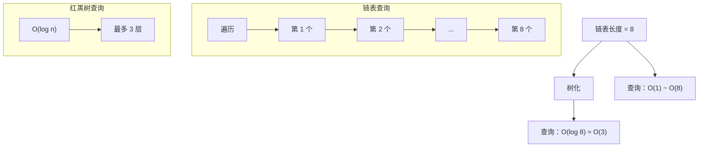
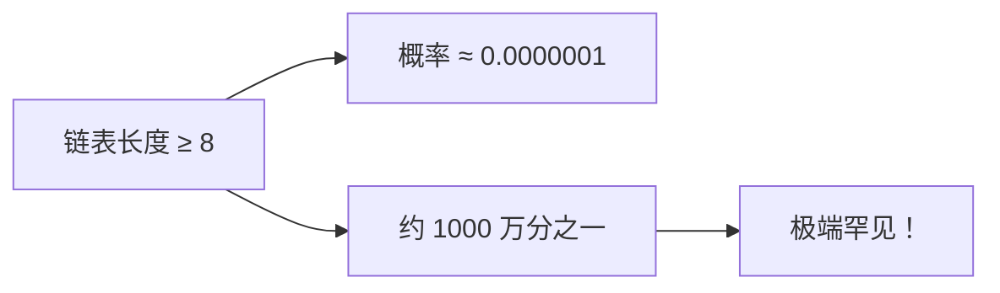

# HashMap 红黑树化阈值设计

面试官问："HashMap 的链表什么时候会变成红黑树？"

候选人小王答："长度达到 8 的时候。"

面试官追问："为什么是 8 而不是 16？"

小王说："可能...性能更好？"

面试官继续追问："那为什么退链表阈值是 6 而不是 8？"

小王彻底答不上来了。

【面试官心理】
红黑树阈值是 HashMap 面试的经典深水区。能说出 8 是基于泊松分布计算的候选人，说明对 JDK 源码有过深入研究。能解释为什么退链表阈值是 6 而不是 8 的，说明真正理解了 JDK 作者的设计权衡。

## 一、为什么需要红黑树 🔴

### 1.1 哈希碰撞问题

当哈希函数设计不好时，大量 key 会 hash 到同一个桶：

```java
// 恶意构造：所有 key 的 hash 都相同
Map<Integer, String> map = new HashMap<>();
for (int i = 0; i < 10000; i++) {
    map.put(i, "value" + i); // 如果 hash 函数不好
}
// 10000 个元素都在同一个链表上
```

**性能退化**：
- 链表查询：O(n)
- 当链表很长时，get/put 操作非常慢

### 1.2 JDK 7 的困境

```java
// JDK 7 HashMap 的 get 方法
public V get(Object key) {
    if (size == 0)
        return null;

    Entry<K,V> e = getEntry(key);
    return e == null ? null : e.value;
}

final Entry<K,V> getEntry(Object key) {
    int hash = (key == null) ? 0 : hash(key);
    // 遍历链表查找
    for (Entry<K,V> e = table[indexFor(hash, table.length)];
         e != null;
         e = e.next) {
        Object k;
        if (e.hash == hash &&
            ((k = e.key) == key || (key != null && key.equals(k))))
            return e;
    }
    return null;
}
```

**问题**：当链表长度达到 1000+ 时，查询是 O(1000)，性能极差。

### 1.3 解决方案：红黑树

JDK 8 引入了红黑树：

```java
// 查询时间：O(log n)
// 链表长度 8 → 红黑树深度最多 3
// 链表长度 1000 → 红黑树深度约 10
```

**红黑树的特性**：
- 自平衡的二叉搜索树
- 插入/删除/查找：O(log n)
- 保证了最坏情况下的性能



【直观类比】
想象一个图书馆：
- 链表：1000 本书按随机顺序排成一排，要找第 500 本只能一本一本数
- 红黑树：同样的 1000 本书按字母顺序排好书架，可以二分查找

## 二、树化阈值详解 🔴

### 2.1 关键阈值

```java
// 链表长度 >= 8，树化
static final int TREEIFY_THRESHOLD = 8;

// 红黑树节点 <= 6，退链表
static final int UNTREEIFY_THRESHOLD = 6;

// 最小树化容量 = 64
// 只有容量 >= 64 时才允许树化
static final int MIN_TREEIFY_CAPACITY = 64;
```

### 2.2 树化条件

```java
// 在 putVal 中
if (binCount >= TREEIFY_THRESHOLD - 1) // TREEIFY_THRESHOLD - 1 = 7
    treeifyBin(tab, hash);

// treeifyBin 方法
final void treeifyBin(Node<K,V>[] tab, int hash) {
    int n, index;
    Node<K,V> e;

    // 容量 < 64，优先扩容而非树化
    if (tab == null || (n = tab.length) < MIN_TREEIFY_CAPACITY)
        resize();
    else if ((e = tab[index = (n - 1) & hash]) != null) {
        // 链表转红黑树
        TreeNode<K,V> hd = null, tl = null;
        do {
            TreeNode<K,V> p = replacementTreeNode(e, null);
            if (tl == null)
                hd = p;
            else {
                p.prev = tl;
                tl.next = p;
            }
            tl = p;
        } while ((e = e.next) != null);

        if ((tab[index] = hd) != null)
            hd.treeify(tab);
    }
}
```

### 2.3 ❌ 错误示范

**候选人原话**："HashMap 的链表长度达到 8 就会变成红黑树。"

**问题诊断**：
- 忽略了 MIN_TREEIFY_CAPACITY = 64 的限制
- 没有说明退链表的阈值是 6

**面试官内心 OS**："这个候选人可能看过资料，但没有理解细节。"

【面试官心理】
树化的两个条件（长度 ≥ 8 且容量 ≥ 64）是面试常考的细节。能完整说出两个条件的候选人，说明真正理解了整个设计。

## 三、为什么是 8 —— 泊松分布 🔴

### 3.1 泊松分布基础

在负载因子 0.75 的情况下，每个桶的平均元素数是 **0.75**。

哈希碰撞（链表长度）为 k 的概率服从泊松分布：

```
P(X = k) = (λ^k × e^(-λ)) / k!
其中 λ = 0.75（平均每桶元素数）
```

### 3.2 链表长度的概率

```java
// λ = 0.75
// 计算 P(X = k)

P(X = 0) = e^(-0.75) ≈ 0.472 (47.2% 的桶是空的)
P(X = 1) = 0.75 × e^(-0.75) ≈ 0.354 (35.4%)
P(X = 2) = 0.75² × e^(-0.75) / 2! ≈ 0.133 (13.3%)
P(X = 3) = 0.75³ × e^(-0.75) / 3! ≈ 0.033 (3.3%)
P(X = 4) = 0.75⁴ × e^(-0.75) / 4! ≈ 0.006 (0.6%)
P(X = 5) = 0.75⁵ × e^(-0.75) / 5! ≈ 0.001 (0.1%)
P(X = 6) = 0.75⁶ × e^(-0.75) / 6! ≈ 0.0001 (0.01%)
P(X = 7) = 0.75⁷ × e^(-0.75) / 7! ≈ 0.00001 (0.001%)
P(X = 8) = 0.75⁸ × e^(-0.75) / 8! ≈ 0.0000001 (0.00001%)
```

### 3.3 关键结论



**链表长度达到 8 的概率约为千万分之一**，这意味着：

1. 在正常情况下，链表几乎不会达到长度 8
2. 一旦达到长度 8，说明哈希碰撞非常严重
3. 此时转换为红黑树是合理的优化

:::details 📖 点击展开 JDK 源码注释

JDK 源码中有这样的注释：

```java
/*
 * Because TreeNodes are about twice the size of regular nodes, we
 * use them only when bins contain enough nodes to warrant use
 * (see TREEIFY_THRESHOLD). And when they become too small (due to
 * removal or resizing) they are converted back to plain bins.
 * Usage of bin counts is avoided because bins are tracked in
 * HashMap.Node.next fields.
 *
 * The values of bin counts and thresholds are based on Poisson
 * distribution with λ = 0.5 (for default capacity) or λ ≈ 0.75
 * (for user-specified capacities).
 *
 * The histogram is tuned for initial resize, when bins are
 * rehashed and TreeNodes split.  The expected average tree bin
 * count is less than 2, so tree bin is only created if
 * binCount >= TREEIFY_THRESHOLD (8).
 */
```
:::

【学习小结】
- 链表长度 ≥ 8 的概率 ≈ 千万分之一
- 这是基于泊松分布计算的
- JDK 作者认为这个阈值足够大，平时几乎不会触发
- 只有在极端哈希碰撞时才启用红黑树

## 四、为什么是 6 而不是 8 🟡

### 4.1 避免频繁转换

如果树化阈值和退链表阈值相同（如都是 8）：


当链表长度在 8 附近波动时，会频繁在链表和红黑树之间转换，造成性能抖动。

### 4.2 为什么选择 6

```java
// 链表长度 ≤ 6，退链表
static final int UNTREEIFY_THRESHOLD = 6;
```

选择 6 而不是 7 或 8 的原因：

| 阈值 | 效果 |
| --- | --- |
| 8 = 8 | 临界点，容易频繁转换 |
| 7 = 7 | 仍然临界 |
| 6 ≠ 8 | 有缓冲，避免频繁转换 |

**关键设计**：树化阈值（8）和退链表阈值（6）**不相同**，留有 2 的缓冲空间。

```mermaid
graph TD
    A["链表长度"] --> B{"`<= 6"}
    A --> C{"7"}
    A --> D{"`>= 8"}
    B --> E["链表"]
    C --> F["保持原样"]
    D --> G["红黑树"]
    F --> H{"长度变化?"]
    H -->|减少到 6| E
    H -->|增加到 8| G
```

### 4.3 红黑树的额外开销

红黑树虽然查询快，但有额外的开销：

```java
// 红黑树节点比链表节点大
// TreeNode：parent + left + right + prev + red + Node 字段
// Node：hash + key + value + next

// 插入/删除时需要旋转和变色
// 如果链表很短（`<` 8），遍历比红黑树的 log n 更快
```

**性能对比**：

| 链表长度 | 链表查询 | 红黑树查询 | 红黑树增删改 |
| --- | --- | --- | --- |
| 1 | O(1) | O(log n) | O(log n) |
| 8 | O(8) | O(log 8) = O(3) | O(log 8) + 旋转 |
| 16 | O(16) | O(log 16) = O(4) | O(log 16) + 旋转 |

:::tip 💡
当链表长度很小时（如 1-7），链表的遍历开销（简单指针跳转）可能比红黑树的 log n + 旋转更快。JDK 选择 8 作为树化阈值，是因为此时链表的遍历开销已经超过了红黑树的优势。
:::

## 五、MIN_TREEIFY_CAPACITY = 64 🟡

### 5.1 为什么需要这个限制

```java
static final int MIN_TREEIFY_CAPACITY = 64;
```

当容量很小（`<` 64）时，优先**扩容**而非**树化**：

```java
final void treeifyBin(Node<K,V>[] tab, int hash) {
    // ...
    if (tab == null || (n = tab.length) < MIN_TREEIFY_CAPACITY)
        resize();  // 扩容，而非树化
    // ...
}
```

### 5.2 扩容 vs 树化

```mermaid
graph TD
    A["链表长度 >= 8"] --> B{"容量 `<` 64?"]
    B -->|是| C["扩容 2 倍"]
    B -->|否| D["树化"]
    C --> E["哈希分布更均匀"]
    C --> F["链表可能变短"]
    D --> G["链表转红黑树"]
```

**扩容的好处**：
- 容量翻倍，hash 分布更均匀
- 链表可能变短，不再需要树化
- 避免小容量下的红黑树开销

**举例**：

```java
// 容量 16，负载因子 0.75，阈值 12
// 当插入第 13 个元素时触发扩容

// 如果扩容到 32：
// - 哈希分布更均匀
// - 链表平均长度从 0.75 降到 0.375
// - 不需要树化了！
```

### 5.3 为什么不直接树化

```java
// ❌ 如果直接树化
capacity = 16, size = 13
13 个元素平均分布在 13 个桶上，链表长度 1
树化后，每个桶还是 1 个节点
红黑树的 O(log n) 反而比 O(1) 慢！

// ✅ 扩容后再判断
capacity = 32, size = 13
哈希分布更均匀，链表更短
可能不需要树化了
```

## 六、红黑树的退化 🟡

### 6.1 退化条件

```java
// 扩容时，如果红黑树节点数 <= 6，退化为链表
static final int UNTREEIFY_THRESHOLD = 6;
```

```java
// TreeNode.split() 方法
if (lc <= UNTREEIFY_THRESHOLD)
    tab[index] = loHead.untreeify(map);
else
    tab[index] = loHead;
```

### 6.2 退化的时机

1. **扩容时**：如果 split 后某部分的节点数 ≤ 6
2. **删除时**：如果红黑树缩小到 ≤ 6 个节点

```java
// 红黑树删除
final boolean removeTreeNode(HashMap<K,V> map, Node<K,V>[] tab,
                             boolean movable) {
    // ...

    // 如果树太小，退化为链表
    if (root == null || root.right == null ||
        (rl = root.left) == null || rl.left == null) {
        // 退化为链表
        tab[index] = first.untreeify(map);
        return true;
    }
}
```

## 七、面试高频追问 🟡

### 7.1 第一层追问

**面试官**："为什么 HashMap 的树化阈值是 8？"

**候选人**：...

**正确回答**：基于泊松分布。在负载因子 0.75 下，链表长度达到 8 的概率约为千万分之一。这个阈值足够大，正常使用几乎不会触发红黑树。

### 7.2 第二层追问

**面试官**："为什么退链表阈值是 6 而不是 8？"

**候选人**：...

**正确回答**：为了避免在临界点频繁转换。如果树化和退链表的阈值相同（如都是 8），当链表长度在 8 附近波动时，会频繁转换，造成性能抖动。

### 7.3 第三层追问

**面试官**："为什么需要 MIN_TREEIFY_CAPACITY = 64？"

**候选人**：...

**正确回答**：容量小时，优先扩容而非树化。扩容后哈希分布更均匀，链表可能变短，避免在小容量下使用红黑树的额外开销。

### 7.4 第四层追问

**面试官**："红黑树的查询比链表快，为什么不一开始就用红黑树？"

**候选人**：...

**正确回答**：
1. 红黑树节点比链表节点大 2 倍（需要额外的 parent/left/right 指针）
2. 红黑树的插入/删除有旋转和变色开销
3. 链表很短时（`<` 8），遍历比红黑树的 O(log n) + 旋转更快
4. 泊松分布计算表明，正常情况下链表几乎不会达到长度 8

【学习小结】
HashMap 树化阈值核心要点：
- TREEIFY_THRESHOLD = 8：链表长度达到 8 树化
- UNTREEIFY_THRESHOLD = 6：红黑树节点 ≤ 6 退链表
- MIN_TREEIFY_CAPACITY = 64：容量 < 64 优先扩容
- 8 基于泊松分布，触发概率千万分之一
- 两个阈值不同是为了避免频繁转换
