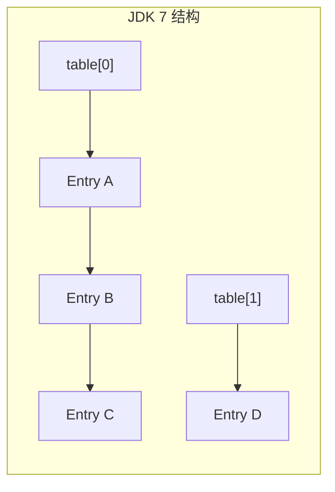
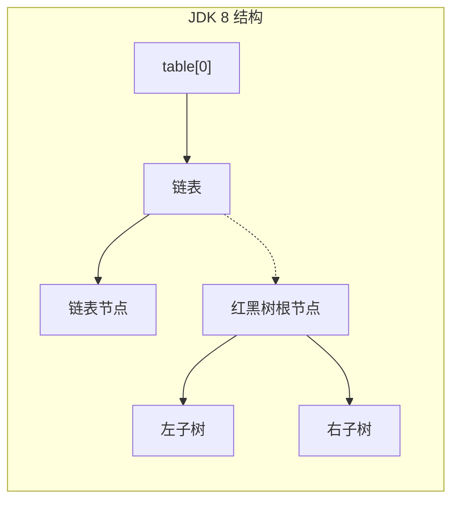

# HashMap 源码深度解析

候选人小李在面试阿里 P6 时，被问到："HashMap 的 put 流程说一下。"

小李脱口而出："计算 hash，找桶，插入链表，判断扩容。"

面试官点点头："JDK8 为什么要引入红黑树？"

小李说："因为链表太长了会影响性能。"

面试官追问："多长算长？为什么是 8 不是 16？"

小张支支吾吾答不上来。

面试官继续追问："容量为什么必须是 2 的幂次？"

小张彻底卡住了。

【面试官心理】
HashMap 是 Java 面试中最重要的高频题之一。90% 的候选人能说出 put 流程，但只有 10% 能解释清楚为什么这么设计。引入红黑树的阈值 8、容量为什么是 2 的幂次、扩容机制的设计理由——这才是 P6 和 P5 的真正差距。

## 一、数据结构演进 🔴

### 1.1 JDK 7 vs JDK 8 的区别

**JDK 7：数组 + 链表**

```java
// JDK 7 HashMap 核心结构
transient Entry<K, V>[] table;

static class Entry<K, V> implements Map.Entry<K, V> {
    final K key;
    V value;
    Entry<K, V> next;  // 链表指针
    int hash;          // key 的 hash 值
}
```



**JDK 8：数组 + 链表 + 红黑树**

```java
// JDK 8 HashMap 核心结构
transient Node<K, V>[] table;

static class Node<K, V> {
    final int hash;
    final K key;
    V value;
    Node<K, V> next;
}

static final class TreeNode<K, V> extends LinkedHashMap.Entry<K, V> {
    TreeNode<K, V> parent;
    TreeNode<K, V> left;
    TreeNode<K, V> right;
    TreeNode<K, V> prev;
    boolean red;
}
```



### 1.2 为什么要引入红黑树

当哈希碰撞严重时，链表会退化成线性结构：

```java
// 最坏情况：所有 key 都 hash 到同一个桶
Map<Integer, String> map = new HashMap<>();
for (int i = 0; i < 10000; i++) {
    map.put(0, "value" + i); // 所有 key 的 hash 都是 0
}
// 此时 get/put 都是 O(n)，10000 次操作
```

**JDK 8 的解决方案**：
- 链表长度 ≥ 8 → 转为红黑树，查询 O(log n)
- 红黑树节点过多时 → 退化为链表

:::tip 💡
JDK 8 引入红黑树的背景：JDK 7 的 HashMap 在哈希碰撞攻击（Hashtable/HashMap collision attack）面前非常脆弱。攻击者可以通过构造大量 hash 相同的 key 使 HashMap 退化为链表，导致服务拒绝。
:::

【学习小结】
- JDK 7：数组 + 链表，冲突严重时退化为 O(n)
- JDK 8：数组 + 链表 + 红黑树，冲突严重时转化为 O(log n)
- 红黑树是应对哈希碰撞攻击的解决方案

## 二、哈希算法详解 🔴

### 2.1 hash() 方法

```java
// JDK 8 HashMap.hash()
static final int hash(Object key) {
    int h;
    return (key == null) ? 0 : (h = key.hashCode()) ^ (h >>> 16);
}
```

**为什么要扰动？**

```java
// 假设 key 的 hashCode 是 0xAAAAAAAA = 10101010101010101010101010101010
// 直接用 hash & (n-1) 取模

// 如果 n = 16，n-1 = 0xF = 00001111
// hash & 0xF 只会用到 hash 的低 4 位！

// 结果：无论高位如何，只有低 4 位参与运算
// 冲突严重！
```

**扰动的作用**：

```java
// (h = key.hashCode()) ^ (h >>> 16)
// 高 16 位和低 16 位异或
// 让高位也参与到 index 计算中

// 举例：
// hashCode = 0xAAAA0000
// hash = 0xAAAA0000 ^ 0x0000AAAA = 0xAAA0AAAA
// 现在高低位混合了
```

```mermaid
graph LR
    A["hashCode()"] --> B{"key != null?"]
    B -->|是| C["h = key.hashCode()"]
    C --> D["h ^ (h >>> 16)"]
    D --> E["hash() 结果"]
    B -->|否| F["0"]
    F --> E
```

### 2.2 容量必须为 2 的幂次

```java
// HashMap 构造函数可以指定容量
public HashMap(int initialCapacity) {
    this(initialCapacity, 0.75f);
}

// 但 HashMap 会把容量调整为 2 的幂次
public HashMap(int initialCapacity, float loadFactor) {
    // ...
    int capacity = 1;
    while (capacity < initialCapacity)
        capacity <<= 1;  // 找第一个 >= initialCapacity 的 2 的幂次
    // initialCapacity=10 → capacity=16
    // initialCapacity=15 → capacity=16
    // initialCapacity=16 → capacity=16
    // initialCapacity=17 → capacity=32
}
```

**为什么必须是 2 的幂次？**

```java
// index 计算方式
int index = (n - 1) & hash;

// n = 16 = 0b10000
// n - 1 = 15 = 0b01111

// 如果 n 是 2 的幂次，n-1 的二进制全是 1
// 例如：
// n-1 = 15 = 0b01111 (4 个 1)
// n-1 = 31 = 0b11111 (5 个 1)

// hash & (n-1) 等价于 hash % n
// 但 & 比 % 快 10 倍！
```

:::warning ⚠️
如果 n 不是 2 的幂次，`hash % n` 无法用 `&` 优化，必须用取模运算，性能差很多。JDK 选择 2 的幂次是为了让取模变成位运算。
:::

### 2.3 常见面试陷阱

**面试官**："如果 hash 值全部相同，HashMap 的性能会怎样？"

**候选人**：...

**正确回答**：退化为链表，所有操作变成 O(n)。这是哈希碰撞攻击的原理。

**面试官**："为什么 HashMap 的容量必须是 2 的幂次？"

**候选人**：为了取模快。

**面试官**："那 2 的幂次有什么特点？"

**候选人**：...

**正确回答**：`n - 1` 的二进制全是 1，例如 16-1=15=0b1111。`hash & (n-1)` 等价于 `hash % n`，但 `&` 运算是位操作，比 `%` 快得多。

## 三、put 流程详解 🔴

### 3.1 put 方法入口

```java
public V put(K key, V value) {
    return putVal(hash(key), key, value, false, true);
}
```

### 3.2 putVal 核心逻辑

```java
final V putVal(int hash, K key, V value, boolean onlyIfAbsent,
               boolean evict) {
    Node<K,V>[] tab;
    Node<K,V> p;
    int n, i;

    // 1. 如果 table 为空或长度为 0，进行扩容
    if ((tab = table) == null || (n = tab.length) == 0)
        n = (tab = resize()).length;

    // 2. 计算 index，如果该桶为空，创建普通节点
    if ((p = tab[i = (n - 1) & hash]) == null)
        tab[i] = newNode(hash, key, value, null);

    else {
        // 3. 该桶已有元素，处理哈希冲突
        Node<K,V> e;
        K k;

        // 情况 A：桶中第一个元素的 key 和插入 key 相同
        if (p.hash == hash &&
            ((k = p.key) == key || (key != null && key.equals(k))))
            e = p;

        // 情况 B：桶是红黑树节点
        else if (p instanceof TreeNode)
            e = ((TreeNode<K,V>)p).putTreeVal(this, tab, hash, key, value);

        // 情况 C：桶是链表
        else {
            for (int binCount = 0; ; ++binCount) {
                // 遍历到链表尾部
                if ((e = p.next) == null) {
                    p.next = newNode(hash, key, value, null);

                    // 链表长度 >= 8，树化
                    if (binCount >= TREEIFY_THRESHOLD - 1)
                        treeifyBin(tab, hash);
                    break;
                }

                // 链表中找到相同 key
                if (e.hash == hash &&
                    ((k = e.key) == key || (key != null && key.equals(k))))
                    break;

                p = e;
            }
        }

        // 4. 找到了已存在的 key，更新 value
        if (e != null) {
            V oldValue = e.value;
            if (!onlyIfAbsent || oldValue == null)
                e.value = value;
            afterNodeAccess(e);
            return oldValue;
        }
    }

    // 5. 修改次数 +1
    ++modCount;

    // 6. 如果 size 超过阈值，扩容
    if (++size > threshold)
        resize();

    afterNodeInsertion(evict);
    return null;
}
```

### 3.3 put 流程图

```mermaid
graph TD
    A["put(key, value)"] --> B{"table == null<br/>或 table.length == 0?"]
    B -->|是| C["resize() 扩容"]
    C --> D["计算 index<br/>i = (n-1) & hash"]
    B -->|否| D
    D --> E{"桶[i] == null?"]
    E -->|是| F["直接插入普通节点"]
    E -->|否| G{"key 相同?"]
    G -->|是| H["更新 value"]
    G -->|否| I{"是 TreeNode?"]
    I -->|是| J["红黑树插入"]
    I -->|否| K["链表遍历"]
    K --> L{"找到相同 key?"]
    L -->|是| H
    L -->|否| M["插入链表尾部<br/>binCount >= 7?"]
    M -->|是| N["treeifyBin 树化"]
    M -->|否| O["遍历结束"]
    F --> P["size++<br/>size > threshold?"]
    J --> P
    N --> P
    O --> P
    H --> P
    P -->|是| Q["resize() 扩容"]
    P -->|否| R["返回"]
    Q --> R
```

### 3.4 ❌ 错误示范

**候选人原话**："put 流程是先计算 hash，然后遍历链表插入，最后判断扩容。"

**问题诊断**：
- 没有说明链表为空和链表不为空的处理区别
- 没有说明红黑树的情况
- 没有说明找到相同 key 时会更新而非插入

**面试官内心 OS**："这个候选人背过流程，但没有理解细节。"

【面试官心理】
put 流程的追问点很多：链表为空怎么办？链表不为空怎么办？红黑树怎么办？树化阈值是多少？扩容阈值是多少？能说清楚这些细节的候选人，说明真的看过源码。

## 四、红黑树阈值设计 🟡

### 4.1 树化阈值

```java
static final int TREEIFY_THRESHOLD = 8;   // 链表长度 >= 8，树化
static final int UNTREEIFY_THRESHOLD = 6; // 红黑树节点 <= 6，退链表

// MIN_TREEIFY_CAPACITY = 64
// 只有容量 >= 64 时才会树化，否则只扩容
```

### 4.2 为什么是 8？

**泊松分布解释**：

```java
// 在负载因子 0.75 下，每个桶的平均元素数是 0.75
// 链表长度 k 的概率服从泊松分布

// P(X=k) = (λ^k * e^(-λ)) / k!
// λ = 0.75

// 计算：
// P(k=8) = (0.75^8 * e^(-0.75)) / 8!
//        ≈ 0.0000001

// 也就是说，链表长度达到 8 的概率是千万分之一！
```

**JDK 作者的考量**：
- 链表长度 8 是极端罕见的
- 8 个节点的链表查询已经是 O(8)
- 红黑树的插入/删除开销（旋转、变色）比链表大
- 只有在真正需要的时候才转换为红黑树

:::details 📖 点击展开泊松分布详细计算

```java
// λ = 0.75（负载因子 0.75 的平均链表长度）
// P(X=0) = e^(-0.75) * 0.75^0 / 0! = 0.472 = 47.2%
// P(X=1) = e^(-0.75) * 0.75^1 / 1! = 0.354 = 35.4%
// P(X=2) = e^(-0.75) * 0.75^2 / 2! = 0.133 = 13.3%
// P(X=3) = e^(-0.75) * 0.75^3 / 3! = 0.033 = 3.3%
// P(X=4) = e^(-0.75) * 0.75^4 / 4! = 0.006 = 0.6%
// P(X=5) = e^(-0.75) * 0.75^5 / 5! = 0.001 = 0.1%
// P(X=6) = e^(-0.75) * 0.75^6 / 6! = 0.0001 = 0.01%
// P(X=7) = e^(-0.75) * 0.75^7 / 7! = 0.00001
// P(X=8) = e^(-0.75) * 0.75^8 / 8! ≈ 0.0000001
```
:::

### 4.3 为什么退链表阈值是 6 而不是 8？

这是为了避免频繁在链表和红黑树之间转换：

```mermaid
graph LR
    A["链表长度 = 8"] --> B["树化"]
    B --> C["删除 1 个节点"]
    C --> D["链表长度 = 7"]
    D --> E{"再删除?"]
    E -->|是| F["退化为链表"]
    E -->|否| G["保持红黑树"]
    F --> H["链表长度 = 6"]
```

如果树化阈值和退链表阈值相同（如都是 8），当链表长度在 8 附近波动时，会频繁转换，造成性能抖动。

**选择 6 而不是 7**：留一个缓冲，避免在临界点频繁转换。

:::tip 💡
红黑树的增删改查都是 O(log n)，链表是 O(n)。但红黑树的插入/删除有旋转和变色开销。如果链表很短（`<` 8），遍历查找比红黑树的 log n 更快。
:::

### 4.4 MIN_TREEIFY_CAPACITY = 64

```java
final void treeifyBin(Node<K,V>[] tab, int hash) {
    int n, index;
    Node<K,V> e;

    // 如果容量 < 64，优先扩容而非树化
    if (tab == null || (n = tab.length) < MIN_TREEIFY_CAPACITY)
        resize();  // 扩容，而不是树化
    else if ((e = tab[index = (n - 1) & hash]) != null) {
        // 树化
        TreeNode<K,V> hd = null, tl = null;
        do {
            TreeNode<K,V> p = replacementTreeNode(e, null);
            if (tl == null)
                hd = p;
            else {
                p.prev = tl;
                tl.next = p;
            }
            tl = p;
        } while ((e = e.next) != null);
        if ((tab[index] = hd) != null)
            hd.treeify();
    }
}
```

**为什么要限制 64？**

容量小时，扩容比树化更合算：
- 容量 16 → 扩容到 32，哈希分布更均匀
- 容量 64 才考虑树化

【学习小结】
- 链表长度 ≥ 8 且容量 ≥ 64 → 树化
- 红黑树节点 ≤ 6 → 退链表
- 阈值 8 基于泊松分布，触发概率极低
- 树化/退链表阈值不同是为了避免频繁转换

## 五、get 流程 🟡

### 5.1 get 方法

```java
public V get(Object key) {
    Node<K,V> e;
    return (e = getNode(hash(key), key)) == null ? null : e.value;
}

final Node<K,V> getNode(int hash, Object key) {
    Node<K,V>[] tab;
    Node<K,V> first, e;
    int n;
    K k;

    // 1. 定位桶
    if ((tab = table) != null && (n = tab.length) > 0 &&
        (first = tab[(n - 1) & hash]) != null) {

        // 2. 第一个节点就是
        if (first.hash == hash &&
            ((k = first.key) == key || (key != null && key.equals(k))))
            return first;

        // 3. 后面还有节点
        if ((e = first.next) != null) {
            // 红黑树
            if (first instanceof TreeNode)
                return ((TreeNode<K,V>)first).getTreeNode(hash, key);

            // 链表
            do {
                if (e.hash == hash &&
                    ((k = e.key) == key || (key != null && key.equals(k))))
                    return e;
            } while ((e = e.next) != null);
        }
    }
    return null;
}
```

### 5.2 get 流程图

```mermaid
graph TD
    A["get(key)"] --> B["hash(key)"]
    B --> C["计算 index"]
    C --> D{"桶是否为空?"]
    D -->|是| E["返回 null"]
    D -->|否| F{"第一个节点<br/>key 相同?"]
    F -->|是| G["返回节点"]
    F -->|否| H{"是 TreeNode?"]
    H -->|是| I["红黑树查找"]
    H -->|否| J["链表遍历"]
    I --> K{"找到?"]
    J --> K
    K -->|是| G
    K -->|否| E
```

## 六、负载因子 🔴

### 6.1 默认负载因子

```java
static final float DEFAULT_LOAD_FACTOR = 0.75f;

public HashMap() {
    this.loadFactor = DEFAULT_LOAD_FACTOR;
}
```

### 6.2 扩容阈值计算

```java
// threshold = capacity * loadFactor
// 默认：capacity=16, loadFactor=0.75 → threshold=12

// 什么时候扩容？
// size = 13 > threshold = 12 → 扩容
```

### 6.3 负载因子的权衡

| 负载因子 | 优点 | 缺点 |
| --- | --- | --- |
| 0.5 | 哈希碰撞少，查询快 | 占用内存多，扩容频繁 |
| 0.75 | 平衡（JDK 默认） | - |
| 1.0 | 内存利用率高 | 哈希碰撞多，查询慢 |

**空间与时间的平衡**：
- 负载因子低 → 空间换时间
- 负载因子高 → 时间换空间

:::tip 💡
JDK 选择 0.75 作为默认值，是经过大量测试和数学计算的最优平衡点。当负载因子为 0.75 时，哈希表的性能最稳定。
:::

## 七、面试高频追问链 🟡

### 7.1 第一层追问

**面试官**："HashMap 的容量为什么是 2 的幂次？"

**候选人**：为了取模快。

**面试官**："具体怎么实现的？"

**正确回答**：`n - 1` 的二进制全是 1，例如 16-1=15=0b1111。`hash & (n-1)` 等价于 `hash % n`，但 `&` 是位运算，比 `%` 快 10 倍以上。

### 7.2 第二层追问

**面试官**："JDK 8 引入红黑树的阈值为什么是 8？"

**候选人**：...

**正确回答**：基于泊松分布。在负载因子 0.75 下，每个桶的平均元素数是 0.75，链表长度达到 8 的概率是千万分之一。选择 8 是因为这个阈值足够大，平时几乎不会触发红黑树，只有在极端哈希碰撞时才会启用。

### 7.3 第三层追问

**面试官**："HashMap 是线程安全的吗？为什么？"

**候选人**：不是。

**面试官**："JDK 7 的扩容可能导致什么问题？"

**候选人**：...

**正确回答**：JDK 7 扩容时，如果多个线程并发，可能会形成环形链表，导致 `get()` 操作死循环。这是经典的"HashMap 并发死循环"问题，JDK 8 通过优化扩容算法解决了这个问题。

### 7.4 第四层追问

**面试官**："HashMap 和 HashTable 的区别？"

**候选人**：...

**正确回答**：
- HashMap：线程不安全，允许 null key
- HashTable：线程安全（synchronized），不允许 null key，性能差
- 推荐用 ConcurrentHashMap 替代 HashTable

## 八、生产避坑清单 🟡

### 8.1 常见错误代码

```java
// ❌ 错误 1：循环内不预设容量
Map<String, Order> orders = new HashMap<>();
for (Order order : orderList) {
    orders.put(order.getId(), order);
}
// 触发多次扩容，每次都要 rehash

// ✅ 正确：预设容量
Map<String, Order> orders = new HashMap<>(orderList.size());

// ❌ 错误 2：用可变对象作 key
Map<List<Integer>, String> map = new HashMap<>();
List<Integer> key = new ArrayList<>();
key.add(1);
map.put(key, "value");
key.add(2); // 修改了 key！
// map.get(key) 找不到值了！

// ✅ 正确：用不可变对象作 key
Map<String, String> map = new HashMap<>();
```

### 8.2 哈希碰撞攻击防护

```java
// 恶意攻击：构造大量 hash 相同的 key
for (int i = 0; i < 100000; i++) {
    map.put(hackKey(i), "value");
}

// JDK 8 解决方案：
// 1. 当链表长度 >= 8 时树化
// 2. 防止链表退化到 O(n)
// 3. 但仍然消耗 CPU
```

### 8.3 key 设计规范

```java
// ✅ 好 key 的特点：
// 1. hashCode() 计算简单，分布均匀
// 2. equals() 比较高效
// 3. 不可变（hashCode 不会变）

// 推荐用作 key 的类型：
// - String
// - Integer/Long 等包装类型
// - 不可变的自定义类（所有字段 final）

// 不推荐用作 key 的类型：
// - 可变对象（ArrayList 等）
// - 复杂的自定义对象
```

【学习小结】
HashMap 核心要点：
- 数据结构：数组 + 链表 + 红黑树（JDK 8+）
- 哈希扰动：`hash ^ (h >>> 16)`，让高位参与运算
- 容量必须是 2 的幂次：`hash & (n-1)` 等价 `hash % n`
- put 流程：定位桶 → 插入链表/红黑树 → 检查树化 → 检查扩容
- 树化阈值：8（链表），6（退链表），64（最小树化容量）
- 负载因子 0.75：平衡空间和时间
