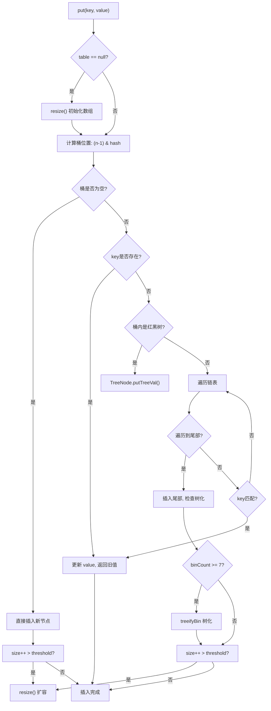

# HashMap 源码深度解析

小李坐在阿里P6面试间，面试官翻到简历上"熟练使用HashMap"这一行，开口问道：

"HashMap的put流程说一下。"

小李背出了那四步：计算hash、找到桶、插入链表/红黑树、判断扩容。面试官点点头，继续追问：

"JDK8为什么引入红黑树？链表达到多少长度会树化？"

小李说："好像是8？"面试官没说话，又问："什么时候树化，什么时候退链表？"

小李停顿了三秒，开始语无伦次...

【面试官心理】

我问他put流程，其实不是想听背书。我想知道的是：他有没有亲手看过源码，能不能理解JDK8为什么要引入红黑树。链表阈值8、树化条件、链表退化的平衡——这才是P6和P5的差距所在。

## 一、HashMap 到底是什么 🔴

### 1.1 最简实现：哈希表

HashMap 的本质是一个**哈希表**（Hash Table）。先看一个最简实现：

```java
public class SimpleHashMap<K, V> {
    private Entry<K, V>[] table;
    private int size;

    public SimpleHashMap(int capacity) {
        table = new Entry[capacity];
    }

    public V put(K key, V value) {
        int index = key.hashCode() % table.length;
        Entry<K, V> newEntry = new Entry<>(key, value, table[index]);
        table[index] = newEntry;
        size++;
        return value;
    }

    public V get(K key) {
        int index = key.hashCode() % table.length;
        for (Entry<K, V> e = table[index]; e != null; e = e.next) {
            if (e.key.equals(key)) return e.value;
        }
        return null;
    }

    private static class Entry<K, V> {
        K key;
        V value;
        Entry<K, V> next;
        Entry(K k, V v, Entry<K, V> n) { this.key=k; this.value=v; this.next=n; }
    }
}
```

这段代码能跑，但有三个致命问题：
- hashCode 碰撞时退化为链表，性能退化
- 没有扩容机制，数据多了就崩
- 线程不安全

JDK 的 HashMap 就是一步步解决这些问题诞生的。

### 1.2 JDK 核心属性

```java
public class HashMap<K, V> extends AbstractMap<K, V>
        implements Map<K, V>, Cloneable, Serializable {

    // 存储数据的数组
    transient Node<K, V>[] table;

    // 实际元素个数
    transient int size;

    // 触发扩容的阈值 = capacity * loadFactor
    int threshold;

    // 负载因子，默认 0.75
    final float loadFactor;

    // 默认初始容量 16
    static final int DEFAULT_INITIAL_CAPACITY = 1 << 4;

    // 最大容量 2^30
    static final int MAXIMUM_CAPACITY = 1 << 30;

    // 默认负载因子
    static final float DEFAULT_LOAD_FACTOR = 0.75f;

    // 链表树化阈值：桶内元素>=8时树化
    static final int TREEIFY_THRESHOLD = 8;

    // 树退化为链表的阈值：桶内元素<=6时退链表
    static final int UNTREEIFY_THRESHOLD = 6;

    // 最小树化容量：数组容量>=64时才允许树化
    static final int MIN_TREEIFY_CAPACITY = 64;
}
```

### 1.3 两种节点类型

```java
// 普通链表节点（JDK7 及之前的 Entry，JDK8 重命名为 Node）
static class Node<K, V> implements Map.Entry<K, V> {
    final int hash;
    final K key;
    V value;
    Node<K, V> next;  // 链表下一节点

    Node(int hash, K key, V value, Node<K, V> next) {
        this.hash = hash;
        this.key = key;
        this.value = value;
        this.next = next;
    }
}

// 红黑树节点（JDK8 新增）
static final class TreeNode<K, V> extends LinkedHashMap.Entry<K, V> {
    TreeNode<K, V> parent;
    TreeNode<K, V> left;
    TreeNode<K, V> right;
    TreeNode<K, V> prev;
    boolean red = true;
    // ...
}
```

:::tip 💡
TreeNode 继承自 `LinkedHashMap.Entry`，而 `LinkedHashMap.Entry` 继承自 `HashMap.Node`。所以 TreeNode 既有红黑树的 parent/left/right，也有链表的 next/prev。JDK8 的 HashMap 在同一个桶内同时维护了树结构和双向链表。
:::

## 二、核心哈希算法 🔴

### 2.1 hash 方法：扰动函数

```java
static final int hash(Object key) {
    int h;
    return (key == null) ? 0 : (h = key.hashCode()) ^ (h >>> 16);
}
```

这是 HashMap 中最重要的哈希算法。为什么要这么做？

**hashCode 返回的是 int，共 32 位**。如果直接用 `hashCode % table.length`：

```
假设 table.length = 16 (二进制 10000)
key.hashCode() = 0xABCD1234

hashCode 低 4 位都是 0~F，高位变化不影响取模结果
所有 key 只会散列到 0~15 这 16 个桶里
```

**扰动函数的作用**：将高 16 位和低 16 位做异或，让高位参与运算。

```
原始 hashCode:  1010 1100 1100 0001 0010 0011 0100 1001
h >>> 16:       0000 0000 0000 0000 1010 1100 1100 0001
异或结果:       1010 1100 1100 0001 1011 1111 0000 1000
```

这样高位的变化能影响到最终的低位，散列更均匀。

### 2.2 index 计算：hash & (length - 1)

```java
int index = hash & (table.length - 1);
```

为什么用位运算 `&` 而不是取模 `%`？

- `hash % length` 需要除法指令，CPU 消耗大
- `hash & (length - 1)` 是位运算，现代 CPU 一条指令搞定
- **前提：length 必须是 2 的幂次**

```
length = 16 = 0b00010000
length - 1 = 15 = 0b00001111

hash = 0b1010101010101010
            &
length-1   = 0b0000000000001111
结果:       0b0000000000001010 = 10

hash = 0b1010101010101111
            &
length-1   = 0b0000000000001111
结果:       0b0000000000001111 = 15
```

只要 length 是 2 的幂次，`hash & (length - 1)` 等价于 `hash % length`。

:::warning ⚠️
如果你指定 `new HashMap<>(7)`，实际容量会是 8。如果指定 `new HashMap<>(6)`，实际容量会是 8。HashMap 会将你指定的容量向上取整到最近的 2 的幂次。这是面试官追问容量设计的常见考点。
:::

## 三、put 流程 🔴

### 3.1 put 方法入口

```java
public V put(K key, V value) {
    return putVal(hash(key), key, value, false, true);
}

final V putVal(int hash, K key, V value, boolean onlyIfAbsent, boolean evict) {
    Node<K, V>[] tab;
    Node<K, V> p;
    int n, i;

    // 1. 第一次 put 时，延迟初始化数组
    if ((tab = table) == null || (n = tab.length) == 0)
        n = (tab = resize()).length;

    // 2. 计算桶位置，检查是否为空
    if ((p = tab[i = (n - 1) & hash]) == null)
        tab[i] = newNode(hash, key, value, null);  // 空桶，直接插入
    else {
        // 3. 桶不为空，发生 hash 碰撞
        Node<K, V> e;
        K k;

        if (p.hash == hash && ((k = p.key) == key || key.equals(k)))
            // key 已存在，直接覆盖 value
            e = p;
        else if (p instanceof TreeNode)
            // 桶内是红黑树，调用树的插入
            e = ((TreeNode<K, V>) p).putTreeVal(this, tab, hash, key, value);
        else {
            // 桶内是链表，遍历
            for (int binCount = 0; ; ++binCount) {
                if ((e = p.next) == null) {
                    // 遍历到链表尾部，插入新节点
                    p.next = newNode(hash, key, value, null);

                    // 检查是否需要树化
                    if (binCount >= TREEIFY_THRESHOLD - 1) // binCount 从0开始
                        treeifyBin(tab, hash);
                    break;
                }
                if (e.hash == hash && ((k = e.key) == key || key.equals(k)))
                    break;  // key 已存在
                p = e;
            }
        }

        // key 已存在，更新 value
        if (e != null) {
            V oldValue = e.value;
            if (!onlyIfAbsent || oldValue == null)
                e.value = value;
            afterNodeAccess(e);
            return oldValue;
        }
    }

    ++modCount;
    if (++size > threshold)
        resize();  // 超过阈值，扩容
    afterNodeInsertion(evict);
    return null;
}
```

### 3.2 put 流程图



## 四、红黑树化机制 🟡

### 4.1 为什么需要红黑树？

当大量 key 的 hashCode 相同时（哈希碰撞），所有元素会堆积在同一个桶里，退化成链表。链表的查询复杂度是 O(n)，在极端情况下（所有 key 都 hash 碰撞），HashMap 的性能会退化成 O(n)。

JDK8 引入红黑树，将 O(n) 优化为 O(log n)。

### 4.2 树化条件

```java
final void treeifyBin(Node<K, V>[] tab, int hash) {
    int n, index;
    Node<K, V> e;

    if (tab == null || (n = tab.length) < MIN_TREEIFY_CAPACITY)
        // 如果数组容量 < 64，优先扩容而不是树化
        resize();
    else if ((e = tab[index = (n - 1) & hash]) != null && e.hash >= 0) {
        // e.hash >= 0 表示是普通链表节点（非树节点）
        TreeNode<K, V> hd = null, tl = null;
        do {
            TreeNode<K, V> p = replacementTreeNode(e, null);
            if (tl == null)
                hd = p;
            else {
                p.prev = tl;
                tl.next = p;
            }
            tl = p;
        } while ((e = e.next) != null);

        if ((tab[index] = hd) != null)
            hd.treeify();  // 构建红黑树
    }
}
```

**树化需要同时满足两个条件**：
1. 桶内链表长度 `>= 8`
2. 数组容量 `>= 64`

如果容量小于 64，会触发扩容而不是树化。

:::tip 💡
为什么是 8 和 6？这不是拍脑袋，是泊松分布计算出来的。JDK 源码注释里写得很清楚：当 hash 分布均匀时，链表长度为 8 的概率只有 0.00000006（千万分之六）。所以用 8 作为树化阈值，在正常情况下几乎不会触发；而 6 作为退链表阈值，留了 2 个元素的缓冲，避免在临界点频繁树化/退化。
:::

### 4.3 红黑树的退化

```java
final Node<K, V> untreeify(HashMap<K, V> map) {
    TreeNode<K, V> hd = null, tl = null;
    for (Node<K, V> q = null; q != null; q = q.next) {
        Node<K, V> p = map.replacementNode(q, null);
        if (tl == null)
            hd = p;
        else {
            p.next = tl.next;
            tl.next = p;
        }
        tl = p;
    }
    return hd;
}
```

当红黑树节点数 `<= 6` 时，退化为链表。

## 五、常见翻车现场 🔴

### ❌ 翻车点一：key 对象没有重写 hashCode 和 equals

```java
class User {
    String name;
    int age;
}

Map<User, String> map = new HashMap<>();
map.put(new User("张三", 20), "北京");
map.get(new User("张三", 20));  // 返回 null！
```

`new User()` 创建了两个不同的对象，hashCode 不同（默认是对象地址），所以 `get` 找不到。这就是"HashMap key 失效"最常见的原因。

### ❌ 翻车点二：用可变对象做 key

```java
StringBuilder key = new StringBuilder("a");
Map<StringBuilder, String> map = new HashMap<>();
map.put(key, "value");

key.append("b");  // 修改了 key！
map.get(new StringBuilder("a"));  // 返回 null！
```

key 被修改后，hashCode 变了，再也找不到原来的位置。

### ❌ 翻车点三：自定义对象做 key 但 hashCode 实现有问题

```java
// ❌ 错误：每次调用 hashCode 返回不同的值
class BadKey {
    public int id;
    public int hashCode() {
        return new Random().nextInt();  // 每次返回不同的 hashCode！
    }
}

// ✅ 正确：hashCode 必须是确定性的
class GoodKey {
    public int id;
    public int hashCode() {
        return Integer.hashCode(id);  // 同一个对象，永远返回相同的 hashCode
    }
}
```

## 六、面试追问链 🟡

### 追问一：JDK7 和 JDK8 的 HashMap 有什么区别？

| 维度 | JDK7 | JDK8 |
| --- | --- | --- |
| 底层结构 | 数组 + 链表 | 数组 + 链表 + 红黑树 |
| 插入方式 | 头插法 | 尾插法 |
| 扩容方式 | 全部 rehash | 不用全部 rehash |
| 死循环问题 | 有（JDK7头插法扩容时） | 修复（JDK8尾插法） |
| hash 算法 | 简单取模 | 扰动函数 |

**JDK7 头插法死循环**：两个线程同时扩容，链表顺序会反转，导致环形链表，死循环。

### 追问二：为什么 hash & (length - 1) 要求 length 是 2 的幂次？

因为只有 2 的幂次 - 1 的二进制是全 1，这样才能让 hash 的每一位都参与取模运算：

```
length = 16, length-1 = 15 = 0b00001111  (全是1，可以截取任意位)
length = 10, length-1 = 9  = 0b00001001  (不是全1，某些 hash 值无法命中)
```

### 追问三：负载因子 0.75 是什么意思？

负载因子 = `实际元素数 / 桶数量`。当 `size > capacity * 0.75` 时触发扩容。

0.75 是时间和空间的平衡点：
- 太小（0.5）：空间浪费，扩容频繁
- 太大（0.9）：空间节省，但 hash 碰撞加剧，性能下降

【面试官心理】

问到负载因子背后的权衡、数据量对选型的影响、为什么 JDK 选 0.75 的候选人，通常是有实际调优经验或者看过源码注释的。这些细节才是 P6 和 P5 的分水岭。
