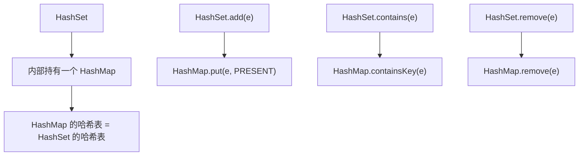

# HashSet 与 HashMap 关系

面试官问小张："HashSet 底层是什么？"

小张说："HashSet 底层是 HashMap。"

面试官点点头："那 HashSet.add(element) 底层调用了什么？"

小张说："hashMap.put(element, ???)"

面试官追问："HashSet 怎么保证元素不重复？它存的是 key 还是 value？"

小张支支吾吾："存的是...key？"

面试官："那 value 存的是什么？"

小张彻底卡住。

【面试官心理】

这道题我用来测试候选人对集合框架继承体系的理解。HashSet 是 HashMap 的"套壳"这件事，很多人都知道，但能说出"所有 value 都是同一个 Object 实例"的候选人，不到 10%。这个细节说明他真的看过源码，而不是道听途说。

## 一、HashSet 就是 HashMap 🔴

### 1.1 源码结构

```java
public class HashSet<E>
        extends AbstractSet<E>
        implements Set<E>, Cloneable, java.io.Serializable {

    // HashSet 内部真的就是一个 HashMap
    private transient HashMap<E, Object> map;

    // HashSet 不存储 value，存储的是 key
    // 所有 value 都是这个同一个对象
    private static final Object PRESENT = new Object();

    // 无参构造：创建空 HashMap
    public HashSet() {
        map = new HashMap<>();
    }

    // 指定初始容量
    public HashSet(int initialCapacity) {
        map = new HashMap<>(initialCapacity);
    }

    // 指定初始容量和负载因子
    public HashSet(int initialCapacity, float loadFactor) {
        map = new HashMap<>(initialCapacity, loadFactor);
    }
}
```

### 1.2 add 方法的实现

```java
public boolean add(E e) {
    return map.put(e, PRESENT) == null;
}
```

就这么简单！`add` 方法直接调用 `HashMap.put`，key 是要存储的元素，value 是固定的 `PRESENT` 对象。

- `put` 返回 `null` → 元素之前不存在 → add 成功 → 返回 `true`
- `put` 返回非 null（PRESENT）→ 元素已存在 → add 失败 → 返回 `false`

### 1.3 其他方法对应关系

```java
public boolean remove(Object o) {
    return map.remove(o) == PRESENT;
}

public int size() {
    return map.size();
}

public boolean isEmpty() {
    return map.isEmpty();
}

public void clear() {
    map.clear();
}

public boolean contains(Object o) {
    return map.containsKey(o);
}

public Iterator<E> iterator() {
    return map.keySet().iterator();
}
```

HashSet 的所有操作本质上都是对内部 HashMap 的操作。

## 二、为什么 HashSet 这么设计 🔴

### 2.1 复用 HashMap 的哈希表



**设计优势**：
- 代码复用：不用重新实现哈希表
- 功能复用：直接使用 HashMap 的 put、get、remove
- 一致性保证：和 HashMap 使用相同的哈希算法、扩容机制

### 2.2 PRESENT 对象的意义

```java
private static final Object PRESENT = new Object();
```

所有 HashSet 元素的 value 都是同一个 Object 实例。这带来两个问题：

**问题一：内存浪费？**

```java
HashSet<String> set = new HashSet<>();
set.add("a");  // map 中：{"a" -> Object@123}
set.add("b");  // map 中：{"a" -> Object@123, "b" -> Object@123}
set.add("c");  // map 中：{"a" -> Object@123, "b" -> Object@123, "c" -> Object@123}
```

100万个元素的 HashSet，有100万个 value 指向同一个 Object 实例。

**答案是：Object 只占用一个对象头的空间（约12字节），相对于 HashMap 节点的额外开销来说，几乎可以忽略不计。**

**问题二：能通过 PRESENT 反查 HashSet 的元素吗？**

不能。HashMap 允许 value 为 null，但 PRESENT 不是 null。如果你调用 `map.get(PROGRAM)` 找的是 key，不是 value。

## 三、去重机制 🔴

### 3.1 HashMap 的去重逻辑

HashSet 的去重本质上是 HashMap 的去重：

```java
public boolean add(E e) {
    return map.put(e, PRESENT) == null;
}

// HashMap.putVal 中的去重逻辑
final V putVal(int hash, K key, V value, boolean onlyIfAbsent, boolean evict) {
    // ...
    if (p.hash == hash &&
        ((k = p.key) == key || key.equals(k))) {
        // key 已存在，覆盖
        e = p;
    }
    // ...
}
```

去重依赖两个条件：
1. **hashCode 相等**：决定落在同一个桶
2. **equals 返回 true**：决定在链表/红黑树中找到了相同元素

### 3.2 自定义对象的去重

```java
class User {
    String name;
    int age;

    @Override
    public int hashCode() {
        return Objects.hash(name, age);
    }

    @Override
    public boolean equals(Object o) {
        if (this == o) return true;
        if (o == null || getClass() != o.getClass()) return false;
        User user = (User) o;
        return age == user.age && Objects.equals(name, user.name);
    }
}

HashSet<User> users = new HashSet<>();
users.add(new User("张三", 25));  // 添加成功
users.add(new User("张三", 25));  // 添加失败（hashCode 和 equals 都相同）
users.add(new User("李四", 25));  // 添加成功（name 不同）
```

:::warning ⚠️
如果只重写 `equals` 不重写 `hashCode`，HashSet 的去重会失效！因为 hashCode 不同会导致落在不同的桶，无法触发 equals 比较。反过来，只重写 `hashCode` 不重写 `equals` 也不会正常工作。**hashCode 和 equals 必须配对重写**。
:::

## 四、常见翻车现场 🟡

### ❌ 翻车点一：HashSet 不是有序的

```java
Set<String> set = new HashSet<>();
set.add("zhang");
set.add("wang");
set.add("li");

// HashSet 不保证顺序！每次遍历可能不同
for (String s : set) {
    System.out.println(s);  // 顺序不确定
}

// ✅ 如果需要有序，用 LinkedHashSet（保持插入顺序）
Set<String> linkedSet = new LinkedHashSet<>();
linkedSet.add("zhang");
linkedSet.add("wang");
linkedSet.add("li");
for (String s : linkedSet) {
    System.out.println(s);  // zhang, wang, li
}

// ✅ 如果需要排序，用 TreeSet
Set<String> treeSet = new TreeSet<>();
treeSet.add("zhang");
treeSet.add("wang");
treeSet.add("li");
for (String s : treeSet) {
    System.out.println(s);  // li, wang, zhang（字典序）
}
```

### ❌ 翻车点二：HashSet 不是线程安全的

```java
// ❌ 生产翻车代码
Set<String> set = new HashSet<>();
for (String s : strings) {
    set.add(s);  // 多线程下可能丢失数据或死循环
}

// ✅ 正确：使用线程安全版本
Set<String> set = Collections.synchronizedSet(new HashSet<>());
// 或者使用 ConcurrentHashMap.newKeySet()
Set<String> set = ConcurrentHashMap.newKeySet();
```

### ❌ 翻车点三：判断去重只看 equals

```java
class Item {
    int id;
    String name;
    @Override
    public boolean equals(Object o) {
        return this.id == ((Item) o).id;
    }
    // ❌ 忘记重写 hashCode，导致 HashSet 认为两个对象不相等
    // @Override public int hashCode() { return id; }
}

Set<Item> set = new HashSet<>();
set.add(new Item(1, "A"));  // 添加成功
set.add(new Item(1, "B"));  // 也添加成功了！因为 hashCode 不同，落在不同桶
```

## 五、HashSet 变体 🟡

### 5.1 LinkedHashSet：保持插入顺序

```java
public class LinkedHashSet<E>
        extends HashSet<E>
        implements Set<E> {

    public LinkedHashSet(int initialCapacity, float loadFactor) {
        super(initialCapacity, loadFactor, true);  // true 表示 accessOrder=true
    }
}

// 底层调用
HashSet(int initialCapacity, float loadFactor, boolean dummy) {
    map = new LinkedHashMap<>(initialCapacity, loadFactor);
}
```

LinkedHashSet 继承 HashSet，但使用 `LinkedHashMap` 代替 `HashMap`。`LinkedHashMap` 额外维护了双向链表，保证迭代顺序和插入顺序一致。

### 5.2 TreeSet：保持排序顺序

```java
public class TreeSet<E> extends AbstractSet<E>
        implements NavigableSet<E>, Cloneable, java.io.Serializable {

    private transient NavigableMap<E, Object> m;

    public TreeSet() {
        this(new TreeMap<E, Object>());
    }

    public TreeSet(Comparator<? super E> comparator) {
        m = new TreeMap<>(comparator);
    }

    public boolean add(E e) {
        return m.put(e, PRESENT) == null;
    }
}
```

TreeSet 底层是 `TreeMap`，支持按 key 自然顺序或比较器顺序遍历。

## 六、选型决策 🟢

| 场景 | 推荐类型 | 原因 |
| --- | --- | --- |
| 需要去重，不需要顺序 | HashSet | O(1) 插入/查找 |
| 需要去重 + 保持插入顺序 | LinkedHashSet | O(1) + 插入顺序 |
| 需要去重 + 排序 | TreeSet | O(log n) + 排序 |
| 需要去重 + 线程安全 | ConcurrentHashMap.newKeySet() | 无锁并发 |
| 需要去重 + 高效交集/并集 | Stream + distinct() | 函数式 API |

【面试官心理】

这道题我用来测试候选人对"组合优于继承"设计模式的理解。HashSet 本质上是一个"只存 key 不存 value"的 HashMap，这个设计既简洁又复用。但很多候选人只知道 HashSet 底层是 HashMap，说不出 PRESENT 的意义，或者不知道 LinkedHashSet 和 HashSet 的继承关系。能讲清楚这些细节的，通常对面向对象设计有一定的思考。
