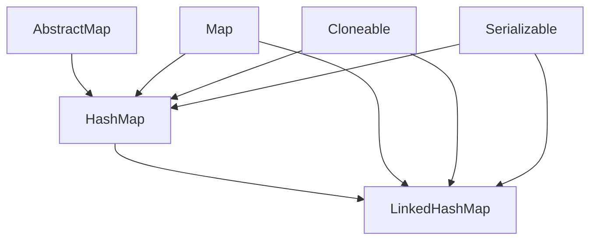
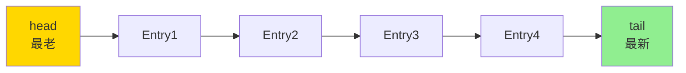

# LinkedHashMap 实现 LRU 缓存

小李在美团面试时被问到："如何用 LinkedHashMap 实现 LRU 缓存？"

小李想了半天，说："用 LinkedHashMap 的 removeEldestEntry 方法？"

面试官追问："那 accessOrder 参数是什么意思？访问操作（get）会不会影响元素顺序？"

小张又开始支支吾吾。

面试官继续："LinkedHashMap 内部是怎么维护双向链表的？它和 HashMap 的关系是什么？"

小张彻底卡住。

【面试官心理】

这道题我用来测试候选人对继承体系的理解深度，以及有没有动手实现过缓存。LinkedHashMap 是 HashMap 的子类，它重写了 `newNode` 和 `removeNode` 等方法，在 HashMap 插入/删除节点时自动维护双向链表。知道 accessOrder 的区别、知道 `removeEldestEntry` 的回调时机、知道怎么触发 `afterNodeAccess`，才是真正理解了这个类的设计。

## 一、LinkedHashMap 是什么 🔴

### 1.1 继承关系



LinkedHashMap 继承自 HashMap，重用了 HashMap 的哈希表结构，额外维护了一条**双向链表**来记录插入顺序或访问顺序。

### 1.2 核心结构

```java
public class LinkedHashMap<K, V> extends HashMap<K, V> {

    // 头节点（指向最老的节点）
    transient LinkedHashMap.Entry<K, V> head;

    // 尾节点（指向最新的节点）
    transient LinkedHashMap.Entry<K, V> tail;

    // 排序模式：false=插入顺序，true=访问顺序
    final boolean accessOrder;

    // LinkedHashMap 的节点，同时是 HashMap.Node 和双向链表节点
    static class Entry<K, V> extends HashMap.Node<K, V> {
        LinkedHashMap.Entry<K, V> before;  // 前一个节点
        LinkedHashMap.Entry<K, V> after;  // 后一个节点

        Entry(int hash, K key, V value, HashMap.Node<K, V> next) {
            super(hash, key, value, next);
        }
    }
}
```

### 1.3 双向链表示意图



- **插入顺序**（`accessOrder = false`）：按 `put` / `putAll` 的顺序排列
- **访问顺序**（`accessOrder = true`）：每次 `get` / `put` 都会把元素移到链表尾部

## 二、LRU 缓存实现 🔴

### 2.1 最简 LRU 实现

```java
public class LRUCache<K, V> extends LinkedHashMap<K, V> {
    private final int capacity;

    public LRUCache(int capacity) {
        // initialCapacity=16, loadFactor=0.75, accessOrder=true(按访问顺序)
        super(16, 0.75f, true);
        this.capacity = capacity;
    }

    // 当 eldest (最老的) 元素被访问时回调，返回 true 表示删除它
    @Override
    protected boolean removeEldestEntry(Map.Entry<K, V> eldest) {
        return size() > capacity;
    }
}
```

这个实现不到 20 行，但它的工作原理是什么？

### 2.2 源码分析：removeEldestEntry 的调用时机

`removeEldestEntry` 在 `putVal` 和 `putAll` 之后被调用：

```java
// HashMap.putVal 中的相关代码
public V put(K key, V value) {
    return putVal(hash(key), key, value, false, true);
}

final V putVal(int hash, K key, V value, boolean onlyIfAbsent, boolean evict) {
    // ... 插入逻辑 ...

    // LinkedHashMap 的回调钩子
    afterNodeInsertion(evict);
    return oldValue;
}

// LinkedHashMap 重写的回调
void afterNodeInsertion(boolean evict) {
    LinkedHashMap.Entry<K, V> first;
    if (evict && (first = head) != null && removeEldest) {
        // removeEldestEntry 默认返回 false
        // 如果返回 true，删除最老的节点
        K key = first.key;
        removeNode(hash(key), key, null, false, false);
    }
}
```

:::tip 💡
`removeEldestEntry` 是在插入后回调的，而且是**插入后立即检查**，所以 `size() > capacity` 意味着已经插入了第 `capacity+1` 个元素，需要删除最老的那个。检查条件用 `>=` 还是 `>` 取决于你的设计意图：用 `>` 则最多保留 `capacity` 个；用 `>=` 则最多保留 `capacity+1` 个（超出的那个被立即删除）。
:::

### 2.3 访问顺序的维护：afterNodeAccess

当 `accessOrder = true` 时，`get` 操作会把元素移到链表尾部：

```java
void afterNodeAccess(Node<K, V> e) {
    LinkedHashMap.Entry<K, V> last;
    if (accessOrder && (last = tail) != e) {
        // 把当前节点从链表中摘下
        LinkedHashMap.Entry<K, V> p =
            (LinkedHashMap.Entry<K, V>) e;
        LinkedHashMap.Entry<K, V> b = p.before, a = p.after;
        p.after = null;
        if (b == null)
            head = a;
        else
            b.after = a;
        if (a != null)
            a.before = b;
        else
            last = b;

        // 把节点接到链表尾部
        last.after = p;
        p.before = last;
        p.after = null;
        tail = p;
    }
}
```

:::warning ⚠️
`get` 操作会触发 `afterNodeAccess`，把被访问的节点移到尾部。这个行为在某些场景下可能是陷阱：如果你的业务逻辑需要"只读不修改顺序"，就不要用 `accessOrder = true`。同时，`afterNodeAccess` 也会触发 `modCount` 变化，如果你在迭代过程中调用 `get`，可能会触发 `ConcurrentModificationException`。
:::

## 三、生产级 LRU 缓存 🟡

### 3.1 完整实现

```java
public class LRUCache<K, V> extends LinkedHashMap<K, V> {
    private static final long serialVersionUID = 1L;

    private final int maxCapacity;

    public LRUCache(int maxCapacity) {
        super(16, 0.75f, true);
        this.maxCapacity = maxCapacity;
    }

    @Override
    protected boolean removeEldestEntry(Map.Entry<K, V> eldest) {
        return size() > maxCapacity;
    }

    // 手动访问，清空后重新设置
    public void clear() {
        super.clear();
    }

    // 批量添加，自动裁剪
    public void putAll(Map<? extends K, ? extends V> m) {
        for (Entry<? extends K, ? extends V> e : m.entrySet()) {
            put(e.getKey(), e.getValue());
        }
    }
}
```

### 3.2 带缓存命中率统计的 LRU

```java
public class LRUCacheWithStats<K, V> extends LinkedHashMap<K, V> {
    private final int maxCapacity;
    private final AtomicLong hitCount = new AtomicLong(0);
    private final AtomicLong missCount = new AtomicLong(0);

    public LRUCacheWithStats(int maxCapacity) {
        super(16, 0.75f, true);
        this.maxCapacity = maxCapacity;
    }

    @Override
    public V get(Object key) {
        V value = super.get(key);
        if (value != null) {
            hitCount.incrementAndGet();
        } else {
            missCount.incrementAndGet();
        }
        return value;
    }

    public double getHitRate() {
        long hits = hitCount.get();
        long misses = missCount.get();
        return (double) hits / (hits + misses);
    }

    public void printStats() {
        System.out.printf("LRU Stats - Hits: %d, Misses: %d, HitRate: %.2f%%, Size: %d/%d%n",
            hitCount.get(), missCount.get(), getHitRate() * 100, size(), maxCapacity);
    }

    @Override
    protected boolean removeEldestEntry(Map.Entry<K, V> eldest) {
        return size() > maxCapacity;
    }
}
```

### 3.3 多级缓存：内存 + 磁盘

```java
public class TwoLevelCache<K, V> {
    private final LinkedHashMap<K, V> memoryCache;
    private final DiskCache<K, V> diskCache;
    private final int maxMemorySize;

    public TwoLevelCache(int maxMemorySize) {
        this.maxMemorySize = maxMemorySize;
        this.memoryCache = new LinkedHashMap<>(16, 0.75f, true) {
            @Override
            protected boolean removeEldestEntry(Map.Entry<K, V> eldest) {
                if (size() > maxMemorySize) {
                    // 被淘汰的数据写入磁盘
                    diskCache.write(eldest.getKey(), eldest.getValue());
                    return true;
                }
                return false;
            }
        };
    }

    public V get(K key) {
        V value = memoryCache.get(key);
        if (value == null) {
            value = diskCache.read(key);
            if (value != null) {
                memoryCache.put(key, value);  // 从磁盘恢复
            }
        }
        return value;
    }

    public void put(K key, V value) {
        memoryCache.put(key, value);
    }
}
```

## 四、常见翻车现场 🟡

### ❌ 翻车点一：构造函数参数写错

```java
// ❌ 错误：accessOrder 默认是 false，不会按访问顺序淘汰
LRUCache<String, Object> cache = new LRUCache<>(100);
// get 操作不会改变顺序！

// ✅ 正确：必须显式传入 true
LRUCache<String, Object> cache = new LRUCache<>(100, true);
```

### ❌ 翻车点二：在迭代中 get 元素

```java
LRUCache<String, Object> cache = new LRUCache<>(3, true);
cache.put("a", 1);
cache.put("b", 2);
cache.put("c", 3);

// ❌ 错误：在迭代过程中调用 get
for (String key : cache.keySet()) {
    cache.get(key);  // 触发 afterNodeAccess，可能导致 ConcurrentModificationException
    // ...
}

// ✅ 正确：先取出所有 key，再处理
List<String> keys = new ArrayList<>(cache.keySet());
for (String key : keys) {
    cache.get(key);  // 安全
}
```

### ❌ 翻车点三：忘记重写 serialVersionUID

```java
public class LRUCache<K, V> extends LinkedHashMap<K, V> {
    // ❌ 忘记 serialVersionUID
    // 如果后续修改了类结构，序列化/反序列化会出问题

    // ✅ 正确
    private static final long serialVersionUID = 1L;
}
```

## 五、与 Guava Cache / Caffeine 对比 🟢

生产环境中，自定义 LinkedHashMap 实现 LRU 有局限性：

| 维度 | LinkedHashMap LRU | Guava Cache | Caffeine |
| --- | --- | --- | --- |
| 淘汰策略 | 只有 LRU | LRU/LFU/TTL 等 | W-TinyLFU（综合最优） |
| 并发支持 | 非线程安全 | 线程安全 | 线程安全 |
| 淘汰监听 | 无 | 支持 | 支持 |
| 性能 | 一般 | 高 | 极高 |
| 过期时间 | 需手动实现 | 内置 | 内置 |

:::tip 💡
如果你在生产环境中使用缓存，推荐直接用 Caffeine。Guava Cache 和 Caffeine 都是经过大量实战验证的，性能和功能都比自定义 LinkedHashMap 强太多。但在面试中，能手写 LinkedHashMap LRU 说明你对原理理解到位。
:::

## 六、面试追问链 🟢

### 追问一：LinkedHashMap 的节点和 HashMap 的节点有什么关系？

HashMap.Node 被 LinkedHashMap.Entry 继承：

```java
// HashMap.Node
static class Node<K, V> implements Map.Entry<K, V> {
    final int hash;
    final K key;
    V value;
    Node<K, V> next;  // 哈希表链表
}

// LinkedHashMap.Entry
static class Entry<K, V> extends HashMap.Node<K, V> {
    LinkedHashMap.Entry<K, V> before;  // 双向链表前驱
    LinkedHashMap.Entry<K, V> after;   // 双向链表后继
}
```

所以同一个 Entry 同时参与两个"链表"：
- HashMap 的桶内链表（next 指针）
- LinkedHashMap 的插入/访问顺序链表（before/after 指针）

### 追问二：removeEldestEntry 能手动调用吗？

不能。`removeEldestEntry` 是一个 protected 方法，由 HashMap 在插入后自动调用。它的设计意图是让子类控制淘汰策略。

```java
protected boolean removeEldestEntry(Map.Entry<K, V> eldest) {
    return false;  // 默认不删除任何元素
}
```

### 追问三：LinkedHashMap 是线程安全的吗？

不是。LinkedHashMap 继承自 HashMap，所有操作都没有同步。线程安全版本需要用 `Collections.synchronizedMap(new LinkedHashMap<>())` 或者用 `ConcurrentHashMap` + 自己维护顺序（但 ConcurrentHashMap 不保证顺序）。

【面试官心理】

问到 LinkedHashMap 的候选人，通常是对集合框架有一定了解的。这道题的关键在于两个点：第一，accessOrder 的区别；第二，removeEldestEntry 的回调机制。能讲清楚 LinkedHashMap 如何重写 HashMap 的回调钩子来维护双向链表的，说明对继承和多态有实际理解。
