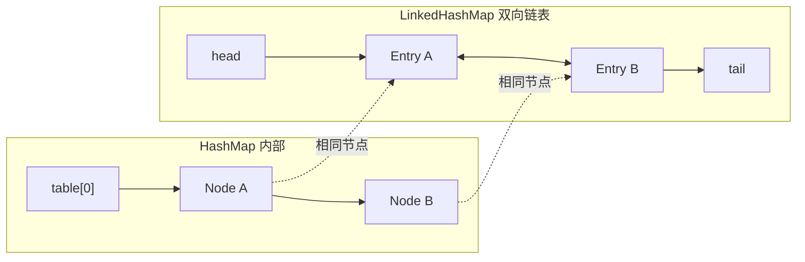
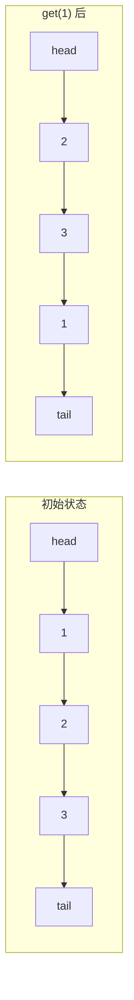

# LinkedHashMap 实现 LRU 缓存

面试官问："LinkedHashMap 是怎么实现的？"

候选人小王答："它是 HashMap 的子类，比 HashMap 多维护了一个双向链表。"

面试官追问："那怎么用 LinkedHashMap 实现 LRU 缓存？"

小王支支吾吾答不上来。

【面试官心理】
LinkedHashMap 是面试常考的进阶知识点。能说清楚它继承 HashMap、实现双向链表、维护访问顺序的候选人，说明对集合框架有过源码级别的研究。能手写 LRU 缓存的，基本是 P6+ 了。

## 一、LinkedHashMap 核心原理 🔴

### 1.1 继承关系

```java
public class LinkedHashMap<K,V>
    extends HashMap<K,V>
    implements Map<K,V> {

    // 双向链表的头结点（最久未访问）
    transient LinkedHashMap.Entry<K,V> head;

    // 双向链表的尾结点（最近访问）
    transient LinkedHashMap.Entry<K,V> tail;

    // 访问顺序模式
    // true：按访问顺序（get/put 都会移动到末尾）
    // false：按插入顺序（默认）
    final boolean accessOrder;
}
```

### 1.2 Entry 节点结构

```java
// LinkedHashMap 的 Entry 继承自 HashMap.Node
// 添加了 before 和 after 指针
static class Entry<K,V> extends HashMap.Node<K,V> {
    Entry<K,V> before, after;  // 双向链表指针
    Entry(int hash, K key, V value, Node<K,V> next) {
        super(hash, key, value, next);
    }
}
```



### 1.3 与 HashMap 的关系

```java
// LinkedHashMap 重写了 newNode()
// 创建节点时同时维护双向链表

Node<K,V> newNode(int hash, K key, V value, Node<K,V> e) {
    LinkedHashMap.Entry<K,V> p =
        new LinkedHashMap.Entry<>(hash, key, value, e);
    linkNodeEnd(p);  // 添加到链表末尾
    return p;
}

// HashMap 的 newNode() 只创建数组节点
// LinkedHashMap 的 newNode() 同时维护双向链表
```

:::tip 💡
LinkedHashMap 继承 HashMap，重用了 HashMap 的数组 + 链表/红黑树结构，同时添加了维护插入/访问顺序的双向链表。
:::

## 二、accessOrder 模式 🟡

### 2.1 两种模式

```java
// 按插入顺序（默认）
LinkedHashMap<Integer, String> map1 = new LinkedHashMap<>();
map1.put(1, "a");
map1.put(2, "b");
map1.put(3, "c");
// 遍历顺序：1 -> 2 -> 3

// 按访问顺序
LinkedHashMap<Integer, String> map2 = new LinkedHashMap<>(16, 0.75f, true);
map2.put(1, "a");
map2.put(2, "b");
map2.put(3, "c");
map2.get(1);  // 访问 key=1，会把 1 移到末尾
// 遍历顺序：2 -> 3 -> 1
```

### 2.2 accessOrder 的作用

```java
// LinkedHashMap 重写了 afterNodeAccess()
// 当节点被访问时，如果是 accessOrder=true，移动到链表末尾

void afterNodeAccess(Node<K,V> e) {
    LinkedHashMap.Entry<K,V> last;
    if (accessOrder && (last = tail) != e) {
        LinkedHashMap.Entry<K,V> p =
            (LinkedHashMap.Entry<K,V>)e, b = p.before, a = p.after;
        p.after = null;
        if (b == null)
            head = a;
        else
            b.after = a;
        if (a != null)
            a.before = b;
        else
            last = b;
        if (last == null)
            head = p;
        else {
            p.before = last;
            last.after = p;
        }
        tail = p;
        ++modCount;
    }
}
```

### 2.3 访问顺序示例

```java
LinkedHashMap<Integer, String> map =
    new LinkedHashMap<>(16, 0.75f, true); // accessOrder = true

map.put(1, "a");  // 链表：1
map.put(2, "b");  // 链表：1 -> 2
map.put(3, "c");  // 链表：1 -> 2 -> 3

map.get(1);       // 链表：2 -> 3 -> 1（1 移到末尾）

map.put(4, "d");  // 链表：2 -> 3 -> 1 -> 4

map.get(2);       // 链表：3 -> 1 -> 4 -> 2（2 移到末尾）
```



## 三、实现 LRU 缓存 🔴

### 3.1 LRU 缓存原理

LRU = Least Recently Used（最近最少使用）

```mermaid
graph TD
    A["访问数据"] --> B{"缓存已满?"]
    B -->|否| C["放入缓存"]
    B -->|是| D["删除最久未使用的"]
    D --> C
    C --> E["使用数据"]
```

### 3.2 removeEldestEntry() 方法

```java
// LinkedHashMap 提供了 removeEldestEntry() 钩子方法
// 当新元素插入时调用
// 返回 true 时，最老的元素会被删除

protected boolean removeEldestEntry(Map.Entry<K,V> eldest) {
    return size() > maxSize;  // 超过容量时删除最老元素
}
```

### 3.3 完整 LRU 缓存实现

```java
public class LRUCache<K, V> extends LinkedHashMap<K, V> {

    private final int maxCapacity;

    public LRUCache(int maxCapacity) {
        super(16, 0.75f, true);  // accessOrder = true
        this.maxCapacity = maxCapacity;
    }

    @Override
    protected boolean removeEldestEntry(Map.Entry<K, V> eldest) {
        return size() > maxCapacity;
    }

    @Override
    public V get(Object key) {
        return super.get(key);
    }

    @Override
    public V put(K key, V value) {
        return super.put(key, value);
    }

    public static void main(String[] args) {
        LRUCache<Integer, String> cache = new LRUCache<>(3);

        cache.put(1, "a");
        cache.put(2, "b");
        cache.put(3, "c");
        System.out.println(cache); // {1=a, 2=b, 3=c}

        cache.get(1);  // 访问 1，1 移到末尾
        System.out.println(cache); // {2=b, 3=c, 1=a}

        cache.put(4, "d");  // 超过容量，删除最老的 2
        System.out.println(cache); // {3=c, 1=a, 4=d}
    }
}
```

### 3.4 ❌ 错误示范

**候选人原话**："LinkedHashMap 是按插入顺序的，没办法实现 LRU。"

**问题诊断**：
- 不知道 accessOrder 参数的作用
- 没有看过 LinkedHashMap 的源码

**面试官内心 OS**："这个候选人可能用过 LinkedHashMap，但没有深入理解它的实现。"

【面试官心理】
LinkedHashMap 实现 LRU 缓存是经典面试题。关键是 `accessOrder = true` 和 `removeEldestEntry()` 方法。能完整说出实现思路并写出代码的候选人，说明真正理解了 LinkedHashMap 的设计。

## 四、LRU 缓存的线程安全 🟡

### 4.1 为什么不直接用 LinkedHashMap

```java
// ❌ 直接用 LinkedHashMap 不是线程安全的
LinkedHashMap<Integer, String> cache =
    new LinkedHashMap<>(16, 0.75f, true);

// 多线程并发访问会导致数据不一致
```

### 4.2 Collections.synchronizedMap

```java
// ❌ 不推荐：整个 Map 加锁，性能差
Map<Integer, String> unsafe = new LinkedHashMap<>(16, 0.75f, true);
Map<Integer, String> cache =
    Collections.synchronizedMap(unsafe);

// 问题是：遍历时仍然可能出问题
// 因为 LinkedHashMap 的双向链表也需要同步
```

### 4.3 推荐方案

```java
// 方案 1：ConcurrentHashMap + 额外维护访问顺序
// 复杂，不推荐

// 方案 2：Guava Cache
Cache<Integer, String> cache = CacheBuilder.newBuilder()
    .maximumSize(3)
    .build();

// 方案 3：自己加锁
public class ThreadSafeLRUCache<K, V> {

    private final int maxCapacity;
    private final Map<K, V> cache;
    private final LinkedHashMap<K, V> order;

    public ThreadSafeLRUCache(int maxCapacity) {
        this.maxCapacity = maxCapacity;
        this.cache = new ConcurrentHashMap<>();
        this.order = new LinkedHashMap<>(16, 0.75f, true) {
            @Override
            protected boolean removeEldestEntry(Map.Entry<K, V> eldest) {
                return cache.size() > maxCapacity;
            }
        };
    }

    public V get(K key) {
        V value = cache.get(key);
        if (value != null) {
            order.get(key);  // 更新访问顺序
        }
        return value;
    }

    public synchronized void put(K key, V value) {
        if (cache.put(key, value) == null && cache.size() > maxCapacity) {
            // 删除最老的
            Iterator<K> it = order.keySet().iterator();
            if (it.hasNext()) {
                K oldest = it.next();
                it.remove();
                cache.remove(oldest);
            }
        }
    }
}
```

## 五、LinkedHashMap 的应用场景 🟡

### 5.1 保持插入顺序

```java
// 场景：需要遍历时保持插入顺序
LinkedHashMap<String, String> map = new LinkedHashMap<>();
map.put("zhang", "张三");
map.put("li", "李四");
map.put("wang", "王五");

// 遍历顺序：zhang -> li -> wang（插入顺序）
for (Map.Entry<String, String> entry : map.entrySet()) {
    System.out.println(entry.getKey() + ": " + entry.getValue());
}
```

### 5.2 实现 FIFO 缓存

```java
// 按插入顺序，删除最老的
public class FIFOCache<K, V> extends LinkedHashMap<K, V> {

    private final int maxCapacity;

    public FIFOCache(int maxCapacity) {
        super(16, 0.75f, false);  // accessOrder = false
        this.maxCapacity = maxCapacity;
    }

    @Override
    protected boolean removeEldestEntry(Map.Entry<K, V> eldest) {
        return size() > maxCapacity;
    }
}
```

### 5.3 记录访问顺序

```java
// 场景：需要知道元素的访问顺序
LinkedHashMap<String, UserSession> sessions =
    new LinkedHashMap<>(16, 0.75f, true);  // accessOrder = true

// sessions.keySet() 按最近访问顺序排列
// 可以用于：清理过期会话、分析用户行为
```

## 六、源码解析 🟡

### 6.1 关键方法重写

```java
// LinkedHashMap 重写了以下方法：

// 1. newNode() - 创建节点时同时维护双向链表
Node<K,V> newNode(int hash, K key, V value, Node<K,V> e) {
    LinkedHashMap.Entry<K,V> p = new LinkedHashMap.Entry<>(hash, key, value, e);
    linkNodeEnd(p);  // 添加到链表末尾
    return p;
}

// 2. afterNodeAccess() - 访问后移动到末尾
void afterNodeAccess(Node<K,V> e) { ... }

// 3. afterNodeRemoval() - 删除时从链表移除
void afterNodeRemoval(Node<K,V> e) { ... }

// 4. containsValue() - 更高效的实现
boolean containsValue(Object value) {
    for (LinkedHashMap.Entry<K,V> e = head; e != null; e = e.after) {
        V v = e.value;
        if (v == value || (value != null && value.equals(v)))
            return true;
    }
    return false;
}
```

### 6.2 遍历的优势

```java
// HashMap 遍历：无序
Map<String, Integer> hashMap = new HashMap<>();
// 遍历顺序随机

// LinkedHashMap 遍历：按插入/访问顺序
LinkedHashMap<String, Integer> linkedHashMap = new LinkedHashMap<>();
// 遍历顺序确定
```

```java
// LinkedHashMap 的 entrySet() 返回有序迭代器
for (Map.Entry<String, Integer> entry : linkedHashMap.entrySet()) {
    // 按链表顺序遍历，缓存友好
}
```

## 七、生产避坑清单 🟡

### 7.1 ❌ 常见错误

```java
// ❌ 错误 1：默认 accessOrder=false，无法实现 LRU
LinkedHashMap<Integer, String> cache = new LinkedHashMap<>();
// 这样 get() 不会更新顺序！

// ✅ 正确：设置 accessOrder=true
LinkedHashMap<Integer, String> cache =
    new LinkedHashMap<>(16, 0.75f, true);

// ❌ 错误 2：没有重写 removeEldestEntry()
class BadCache<K, V> extends LinkedHashMap<K, V> {
    // 忘记重写 removeEldestEntry()，缓存无限增长！
}

// ✅ 正确：重写 removeEldestEntry()
class GoodCache<K, V> extends LinkedHashMap<K, V> {
    private final int maxCapacity;

    GoodCache(int maxCapacity) {
        super(16, 0.75f, true);
        this.maxCapacity = maxCapacity;
    }

    @Override
    protected boolean removeEldestEntry(Map.Entry<K, V> eldest) {
        return size() > maxCapacity;
    }
}
```

### 7.2 性能注意事项

```java
// ❌ 频繁 get() 会导致链表移动，有一定开销
for (int i = 0; i < 1000000; i++) {
    cache.get(i);  // 每次 get 都会移动到末尾！
}

// ✅ 如果不需要更新访问顺序，用 accessOrder=false
```

### 7.3 与 HashMap 的内存对比

```java
// LinkedHashMap 比 HashMap 多维护双向链表
// 每个节点多 2 个指针（before, after）
// 内存开销约多 20%

// LinkedHashMap.Entry：
// - extends HashMap.Node (hash, key, value, next)
// - + before, after
// - + 对象头

// 100 万个节点的内存对比：
// HashMap: ~32MB
// LinkedHashMap: ~40MB
```

:::tip 💡
LinkedHashMap 适合需要维护元素顺序的场景（如缓存、LRU），但如果不需要顺序，用 HashMap 更省内存。
:::

## 八、面试追问链 🟡

### 8.1 第一层追问

**面试官**："LinkedHashMap 和 HashMap 的区别是什么？"

**候选人**：...

**正确回答**：
- LinkedHashMap 继承 HashMap
- LinkedHashMap 额外维护双向链表，记录插入/访问顺序
- LinkedHashMap 支持按插入顺序或访问顺序遍历

### 8.2 第二层追问

**面试官**："accessOrder 参数是什么意思？"

**候选人**：...

**正确回答**：
- `accessOrder = false`：按插入顺序排列（默认）
- `accessOrder = true`：按访问顺序排列，`get()` 和 `put()` 都会把元素移到链表末尾

### 8.3 第三层追问

**面试官**："怎么用 LinkedHashMap 实现 LRU 缓存？"

**候选人**：...

**正确回答**：
1. 设置 `accessOrder = true`
2. 重写 `removeEldestEntry()` 方法，返回 `size() > maxCapacity`

### 8.4 第四层追问

**面试官**："LinkedHashMap 是线程安全的吗？"

**候选人**：...

**正确回答**：不是。线程安全版本需要外部同步，如 `Collections.synchronizedMap()` 或使用 `ConcurrentHashMap` + 额外同步。

【学习小结】
LinkedHashMap 核心要点：
- 继承 HashMap，额外维护双向链表
- `accessOrder = true` 时按访问顺序排列
- 通过 `removeEldestEntry()` 实现缓存淘汰
- 重写 `newNode()`、`afterNodeAccess()`、`afterNodeRemoval()` 维护链表
- 不是线程安全的
