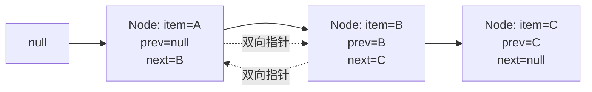

# LinkedList 源码与双端队列

面试官问："LinkedList 的 `get(int index)` 方法时间复杂度是多少？"

候选人小张答："O(1)，因为是链表。"

面试官追问："确定吗？JDK 源码里是怎么实现的？"

小张支支吾吾："应该是...遍历？"

面试官点点头，继续问："那你为什么在项目里用 LinkedList？"

小张说："链表插入删除快。"

面试官又问："那你为什么不用 ArrayList？"

小张陷入了沉默。

【面试官心理】
我问他 LinkedList 的 get 方法，其实是在测他有没有真正看过源码。LinkedList 的 get 是 O(n)，但大多数候选人答 O(1)。更关键的是，能说清楚"什么时候用 LinkedList"的候选人，往往能做出更好的技术选型决策。

## 一、LinkedList 的数据结构 🔴

### 1.1 双向链表结构

LinkedList 底层是双向链表，每个节点包含三个部分：

```java
private static class Node<E> {
    E item;           // 节点数据
    Node<E> next;     // 后继指针
    Node<E> prev;     // 前驱指针

    Node(Node<E> prev, E element, Node<E> next) {
        this.item = element;
        this.next = next;
        this.prev = prev;
    }
}
```



### 1.2 LinkedList 的核心属性

```java
public class LinkedList<E>
        extends AbstractSequentialList<E>
        implements List<E>, Deque<E>, Cloneable, Serializable {

    // 头节点
    transient Node<E> first;

    // 尾节点
    transient Node<E> last;

    // 元素个数
    transient int size = 0;
}
```

:::tip 💡
LinkedList 既有头节点指针 `first`，又有尾节点指针 `last`，这是实现双端队列的基础。
:::

### 1.3 ❌ 错误示范

**候选人原话**："LinkedList 是链表，所以 `get(int index)` 是 O(1)。"

**问题诊断**：
- 把"链表"和"随机访问"混为一谈
- 完全没看过 LinkedList 的 get 方法实现
- 不知道链表只能顺序访问

**面试官内心 OS**："这个候选人肯定没有动手写过 demo，只背了结论。"

【面试官心理】
LinkedList 的 get 方法是 O(n)，这是最基本的知识点。能准确说出时间复杂度，并且解释为什么的候选人，说明至少有动手写过代码验证过。

## 二、核心方法源码解析 🔴

### 2.1 add() 方法 — 尾部添加

```java
public boolean add(E e) {
    linkLast(e);
    return true;
}

void linkLast(E e) {
    final Node<E> l = last;           // 记录原尾节点
    final Node<E> newNode = new Node<>(l, e, null); // 新节点前驱=l，后继=null
    last = newNode;                   // last 指向新节点

    if (l == null)
        first = newNode;              // 第一个元素，first 也要指向它
    else
        l.next = newNode;             // 原尾节点的后继指向新节点

    size++;
    modCount++;
}
```

**复杂度分析**：O(1)，因为直接操作 last 指针。

### 2.2 addFirst() 方法 — 头部添加

```java
public void addFirst(E e) {
    linkFirst(e);
}

private void linkFirst(E e) {
    final Node<E> f = first;          // 记录原头节点
    final Node<E> newNode = new Node<>(null, e, f); // 新节点前驱=null，后继=f
    first = newNode;                   // first 指向新节点

    if (f == null)
        last = newNode;                // 第一个元素，last 也要指向它
    else
        f.prev = newNode;              // 原头节点的前驱指向新节点

    size++;
    modCount++;
}
```

**复杂度分析**：O(1)，和 `addLast` 一样快。

### 2.3 remove() 方法 — 删除节点

```java
public E remove() {
    return removeFirst();
}

public E removeFirst() {
    final Node<E> f = first;
    if (f == null)
        throw new NoSuchElementException();

    E element = f.item;
    final Node<E> next = f.next;       // 记录后继
    f.item = null;                     // GC 友好
    f.next = null;                     // GC 友好
    first = next;                      // first 指向后继

    if (next == null)
        last = null;                   // 删除的是唯一节点
    else
        next.prev = null;              // 新头节点的前驱置空

    size--;
    modCount++;
    return element;
}
```

**复杂度分析**：O(1)，因为直接操作 first 指针。

### 2.4 get(int index) 方法 — 随机访问的坑

这就是容易翻车的地方：

```java
public E get(int index) {
    checkElementIndex(index);
    return node(index).item;
}

// 关键：node 方法
Node<E> node(int index) {
    // 优化：选择离头近还是离尾近
    if (index < (size >> 1)) {
        // index 在前半段，从头开始往后找
        Node<E> x = first;
        for (int i = 0; i < index; i++)
            x = x.next;
        return x;
    } else {
        // index 在后半段，从尾开始往前找
        Node<E> x = last;
        for (int i = size - 1; i > index; i--)
            x = x.prev;
        return x;
    }
}
```

:::warning ⚠️
`get(int index)` 是 O(n)！虽然有"从头还是从尾"的优化，但最坏情况仍是 O(n)。
:::

【学习小结】
LinkedList 操作复杂度：
- `addFirst()` / `addLast()`：O(1)
- `removeFirst()` / `removeLast()`：O(1)
- `add(E)` / `remove()`：O(1)
- `get(int)` / `set(int)` / `add(int, E)`：O(n)

## 三、双端队列（Deque）实现 🟡

### 3.1 Deque 接口方法

LinkedList 实现了 `Deque<E>` 接口，提供了丰富的头尾操作方法：

```java
// 头部操作
void addFirst(E e)      // O(1)
void push(E e)          // 同 addFirst
E removeFirst()         // O(1)
E pollFirst()           // 同 removeFirst，但 null 返回而非异常
E getFirst()            // O(1)
E peekFirst()           // 同 getFirst，但 null 返回而非异常

// 尾部操作
void addLast(E e)       // O(1)
void offer(E e)         // 同 addLast
E removeLast()         // O(1)
E pollLast()            // 同 removeLast
E getLast()             // O(1)
E peekLast()            // 同 getLast

// 区别：
// add/remove/get → 队列满/空时抛异常
// offer/poll/peek → 队列满/空时返回 null/false
```

### 3.2 典型使用场景

**用 LinkedList 实现栈**：

```java
LinkedList<Integer> stack = new LinkedList<>();
stack.push(1);      // addFirst
stack.push(2);
int top = stack.pop(); // removeFirst → 2
```

**用 LinkedList 实现队列**：

```java
LinkedList<Integer> queue = new LinkedList<>();
queue.offer(1);     // addLast
queue.offer(2);
int head = queue.poll(); // removeFirst → 1
```

### 3.3 作为 List 使用的方法

```java
List<String> list = new LinkedList<>();
list.add("A");      // 尾部添加 O(1)
list.add(0, "B");   // 头部添加 O(1)
list.get(0);        // 随机访问 O(n)
list.get(list.size() - 1); // 尾部 O(1)
```

## 四、为什么大多数场景不该用 LinkedList 🟡

### 4.1 性能对比

面试官问："既然 LinkedList 插入删除快，为什么大多数场景还是用 ArrayList？"

这是关键问题：**LinkedList 的优势场景很少**。

| 操作 | ArrayList | LinkedList |
| --- | --- | --- |
| `get(int)` | O(1) | O(n) |
| `add(E)` 尾部添加 | O(1) 均摊 | O(1) |
| `add(int, E)` 中间插入 | O(n) | O(n) |
| `remove(int)` | O(n) | O(n) 需先找到位置 |
| `removeFirst()` | O(n) | O(1) |
| `removeLast()` | O(1) | O(1) |
| 内存占用 | 连续，节省 | 每个节点多 2 个指针 |

### 4.2 真实性能测试

```java
// 测试：10 万次随机位置插入
List<Integer> arrayList = new ArrayList<>();
List<Integer> linkedList = new LinkedList<>();

// ArrayList: O(n²) = 10^5 × 10^5 = 10^10 次操作
// LinkedList: O(n²) = 10^5 × (n/2) = 5×10^9 次操作
// 实际上 LinkedList 更慢，因为每次 get 都要遍历链表！
```

**关键问题**：LinkedList 的 `add(int, E)` 是 O(n)，但前提是先找到位置，找到位置是 O(n)，插入是 O(1)。

### 4.3 何时用 LinkedList

LinkedList 的真正优势场景：

1. **只从头尾操作的队列/栈**：如 `removeFirst()` / `addLast()`
2. **大量迭代，少量随机访问**：迭代 O(1) 访问每个节点
3. **频繁在头尾添加/删除**：如实现消息队列

```java
// ✅ LinkedList 真正有优势的场景
Deque<Integer> stack = new LinkedList<>();
stack.push(1); stack.push(2); stack.pop();

// ❌ ArrayList 更合适的场景
List<Integer> list = new LinkedList<>();
for (int i = 0; i < 1000; i++) {
    list.add(i);          // add 尾部，LinkedList 有优势
    int x = list.get(i); // 随机访问，ArrayList 完胜
}
```

:::tip 💡
**95% 的 List 使用场景应该用 ArrayList**。LinkedList 只在"队列头尾操作"或"迭代器遍历"场景下有优势。
:::

## 五、源码细节与追问 🟡

### 5.1 remove(Object o) 方法

```java
public boolean remove(Object o) {
    if (o == null) {
        for (Node<E> x = first; x != null; x = x.next) {
            if (x.item == null) {
                unlink(x);
                return true;
            }
        }
    } else {
        for (Node<E> x = first; x != null; x = x.next) {
            if (o.equals(x.item)) {
                unlink(x);
                return true;
            }
        }
    }
    return false;
}

E unlink(Node<E> x) {
    E element = x.item;
    Node<E> next = x.next;
    Node<E> prev = x.prev;

    if (prev == null) {
        first = next;      // 删除头节点
    } else {
        prev.next = next;
        x.prev = null;
    }

    if (next == null) {
        last = prev;       // 删除尾节点
    } else {
        next.prev = prev;
        x.next = null;
    }

    x.item = null;         // GC
    size--;
    modCount++;
    return element;
}
```

### 5.2 面试官追问

**面试官**："remove 某个位置的元素，ArrayList 和 LinkedList 谁更快？"

**候选人**：LinkedList 更快。

**面试官**："为什么？"

**正确回答**：
- LinkedList：`remove(int index)` → 找到位置 O(n) + 删除节点 O(1) = O(n)
- ArrayList：`remove(int index)` → 移动元素 O(n) = O(n)
- **两者都是 O(n)**，但 ArrayList 的优势是内存连续，`System.arraycopy()` 很快

**真正的差异**：如果按位置删除，ArrayList 可能更快；如果按对象删除且有迭代器，LinkedList 的 iterator.remove() 是 O(1)。

### 5.3 iterator.remove() 的优势

```java
// LinkedList 的 ListIterator
ListIterator<E> it = linkedList.listIterator();

// iterator.remove() 是 O(1)，因为已经知道位置
it.next();
it.remove(); // 删除刚遍历过的节点

// ArrayList 的 iterator.remove() 是 O(n)，需要移动元素
```

:::details 📖 点击展开 ArrayList vs LinkedList 迭代删除对比
```java
// ArrayList: iterator.remove() 需要移动元素
public void remove() {
    if (lastRet < 0) throw new IllegalStateException();
    ArrayList.this.remove(lastRet); // O(n)
    lastRet = -1;
    expectedModCount = modCount;
}

// LinkedList: iterator.remove() 只需要重新链接指针
public void remove() {
    if (lastReturned == null) throw new IllegalStateException();
    LinkedList.this.unlink(lastReturned); // O(1)
}
```
:::

## 六、生产避坑清单 🟡

### 6.1 常见错误代码

```java
// ❌ 错误：把 LinkedList 当作 ArrayList 使用
public List<Order> getOrders(List<Long> orderIds) {
    List<Order> orders = new LinkedList<>();
    for (Long id : orderIds) {
        orders.add(0, orderService.getOrder(id)); // O(n) 头部插入
        // 更好的做法：add(order) 尾部插入
    }
    return orders;
}

// ✅ 正确：使用 LinkedList 的优势
public void processQueue(List<Task> tasks) {
    LinkedList<Task> queue = new LinkedList<>();
    queue.addAll(tasks); // 尾部添加
    while (!queue.isEmpty()) {
        Task task = queue.removeFirst(); // O(1) 头部删除
        task.execute();
    }
}
```

### 6.2 内存占用问题

```java
// 存储 100 万个 Integer
ArrayList<Integer>:  ~4MB（4 bytes × 100万）
LinkedList<Integer>: ~32MB（4 bytes + 16 bytes Node × 100万）

// 每个 Node 需要：
// - item (引用): 8 bytes
// - prev (引用): 8 bytes
// - next (引用): 8 bytes
// - 对象头: 16 bytes (JVM)
```

:::warning ⚠️
LinkedList 的内存开销是 ArrayList 的 6-8 倍。在数据量大的场景下，这可能导致 OOM。
:::

### 6.3 GC 压力

LinkedList 节点的分散性会导致更频繁的 GC：

- ArrayList：连续内存，整块回收
- LinkedList：分散内存，需要 GC 追踪每个节点

## 七、LinkedList vs 其他集合 🟢

### 7.1 选型决策

```mermaid
graph TD
    A[需要 List?] --> B{操作位置?}
    B -->|头部| C[LinkedList 或 ArrayDeque]
    B -->|尾部| D{数据量大?]
    D -->|是| E[ArrayList 或 ArrayDeque]
    D -->|否| F[LinkedList 可接受]
    B -->|中间| G[ArrayList]
    B -->|随机访问多| H[ArrayList 必选]
```

### 7.2 ArrayDeque vs LinkedList

JDK 提供了 `ArrayDeque` 作为双端队列的实现，通常比 LinkedList 更快：

```java
// ArrayDeque：基于数组的头尾指针循环使用
Deque<Integer> stack = new ArrayDeque<>(); // 比 LinkedList 更快

// 为什么？
// - 数组访问 O(1) 比链表 O(n) 快
// - 无额外指针开销
// - 缓存友好
```

| 维度 | ArrayDeque | LinkedList |
| --- | --- | --- |
| 内存 | 连续数组 | 分散节点 |
| 指针开销 | 无 | 每个节点 2 个指针 |
| get(index) | O(1) | O(n) |
| 头部操作 | O(1) 均摊 | O(1) |
| 尾部操作 | O(1) 均摊 | O(1) |

:::tip 💡
**能用 ArrayDeque 的场景就不要用 LinkedList**。ArrayDeque 在几乎所有指标上都更优。
:::

## 八、追问升级

### 8.1 第一层追问

**面试官**："LinkedList 是线程安全的吗？"

**候选人**：不是。

**正确回答**：不是。如果需要线程安全的双端队列，用 `ConcurrentLinkedDeque`。

### 8.2 第二层追问

**面试官**："LinkedList 的 fail-fast 机制和 ArrayList 一样吗？"

**候选人**：...

**正确回答**：一样。都是通过 `modCount` 计数器检测结构性修改。

### 8.3 第三层追问

**面试官**："LinkedList 序列化时，`transient Node<E> first/last` 不会被序列化，怎么恢复链表结构？"

**候选人**：...

**正确回答**：LinkedList 重写了 `writeObject` 和 `readObject` 方法，通过遍历链表逐个序列化元素，反序列化时重新构建节点。

```java
private void writeObject(java.io.ObjectOutputStream s)
    throws java.io.IOException {
    s.defaultWriteObject();
    s.writeInt(size);
    for (Node<E> x = first; x != null; x = x.next)
        s.writeObject(x.item);
}
```

【学习小结】
- LinkedList 是双向链表，get/set 是 O(n)
- 真正的优势：头尾 O(1) 操作
- 95% 场景用 ArrayList
- 能用 ArrayDeque 就不要用 LinkedList
