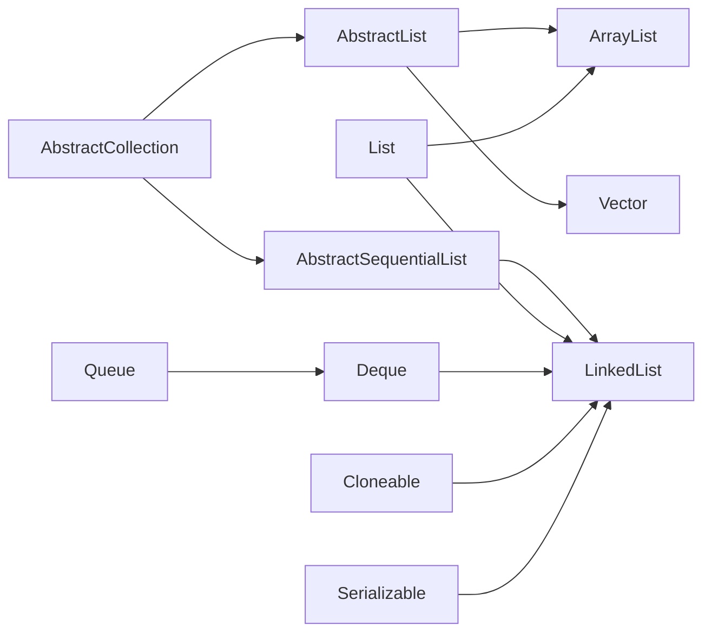

# LinkedList 源码与双端队列

字节跳动的面试间里，面试官看着小张的简历，上面写着"熟悉常用集合框架"。

"LinkedList 是单向链表还是双向链表？"

小张胸有成竹："双向链表。"

"那 LinkedList 实现了哪些接口？"

小张："呃...List？"

面试官点点头："还有呢？"

小张开始冒汗。

"那 Deque 呢？Queue 呢？"

小张彻底卡住了。

【面试官心理】

这道题我用来测试候选人对集合框架继承体系的理解深度。知道 LinkedList 用双向链表的占 70%，能说出它实现了 Deque 的占 30%，能讲清楚每种操作时间复杂度的占 10%。LinkedList 不是一个简单的"链表"，它是 Java 集合框架中唯一一个同时实现了 List 和 Deque 的类。这个细节不知道，说明对集合框架的理解还停留在"会用"的层面。

## 一、LinkedList 到底是什么 🔴

### 1.1 最简实现：双向链表

LinkedList 的核心是一个双向链表。先看最简实现：

```java
public class SimpleLinkedList<E> {
    private static class Node<E> {
        E item;
        Node<E> prev;
        Node<E> next;
        Node(E element, Node<E> prev, Node<E> next) {
            this.item = element;
            this.prev = prev;
            this.next = next;
        }
    }

    private Node<E> first;
    private Node<E> last;
    private int size;

    public void addFirst(E e) {
        Node<E> newNode = new Node<>(e, null, first);
        if (first == null)
            last = newNode;
        else
            first.prev = newNode;
        first = newNode;
        size++;
    }
}
```

这段代码展示了双向链表的核心思想：每个节点知道自己的前一个和后一个。但真正的 LinkedList 比这复杂得多，它还实现了 Deque 接口，支持队列和栈操作。

### 1.2 JDK 核心结构

```java
public class LinkedList<E>
        extends AbstractSequentialList<E>
        implements List<E>, Deque<E>, Cloneable, java.io.Serializable {

    // 头节点
    transient Node<E> first;

    // 尾节点
    transient Node<E> last;

    // 元素个数
    transient int size = 0;

    // 双向链表的节点结构
    private static class Node<E> {
        E item;
        Node<E> next;
        Node<E> prev;
        Node(Node<E> prev, E element, Node<E> next) {
            this.item = element;
            this.next = next;
            this.prev = prev;
        }
    }
}
```

:::tip 💡
LinkedList 继承的是 `AbstractSequentialList`，而不是 `AbstractList`。`AbstractList` 底层是数组，支持随机访问；`AbstractSequentialList` 底层是链表，只支持顺序访问。这也是为什么 LinkedList 没有实现 `RandomAccess` 接口。
:::

### 1.3 继承体系图



从体系图中可以看出：LinkedList 同时实现了 List 和 Deque，这意味着它既可以做列表操作，又可以做队列和栈操作。

## 二、核心操作：增删改查 🔴

### 2.1 addFirst / addLast

```java
private void linkFirst(E e) {
    // 获取旧头节点
    final Node<E> f = first;
    // 创建新节点，prev=null, next=旧头节点
    final Node<E> newNode = new Node<>(null, e, f);
    // 新节点成为头节点
    first = newNode;
    // 如果旧头节点为空，说明原来链表是空的，新节点也是尾节点
    if (f == null)
        last = newNode;
    else
        f.prev = newNode;  // 旧头节点的prev指向新节点
    size++;
    modCount++;
}

public void addLast(E e) {
    final Node<E> l = last;
    final Node<E> newNode = new Node<>(l, e, null);
    last = newNode;
    if (l == null)
        first = newNode;
    else
        l.next = newNode;
    size++;
    modCount++;
}
```

:::warning ⚠️
这里有个容易忽略的细节：头插法和尾插法的分支处理。当链表为空时（`f == null`），头节点和尾节点都是新节点。如果不处理这个边界，first 和 last 就会出现不一致。
:::

### 2.2 add / remove（指定位置）

```java
public void add(int index, E element) {
    checkPositionIndex(index);
    if (index == size)
        linkLast(element);      // 尾部追加
    else
        linkBefore(element, node(index));  // 插入到指定节点前
}

// 找到指定位置的节点，链表越长，查找越慢
Node<E> node(int index) {
    if (index < (size >> 1)) {
        // 前半段：从头往后找
        Node<E> x = first;
        for (int i = 0; i < index; i++)
            x = x.next;
        return x;
    } else {
        // 后半段：从尾往前找
        Node<E> x = last;
        for (int i = size - 1; i > index; i--)
            x = x.prev;
        return x;
    }
}

private void linkBefore(E e, Node<E> succ) {
    final Node<E> pred = succ.prev;
    final Node<E> newNode = new Node<>(pred, e, succ);
    succ.prev = newNode;
    if (pred == null)
        first = newNode;
    else
        pred.next = newNode;
    size++;
    modCount++;
}
```

**关键性能问题**：`node(index)` 的时间复杂度是 O(n)。LinkedList 的随机访问不是 O(1)，而是 O(n)！

### 2.3 removeFirst / removeLast

```java
public E removeFirst() {
    final Node<E> f = first;
    if (f == null) throw new NoSuchElementException();
    return unlinkFirst(f);
}

private E unlinkFirst(Node<E> f) {
    final E element = f.item;
    final Node<E> next = f.next;
    f.item = null;   // GC 友好
    f.next = null;   // GC 友好
    first = next;
    if (next == null)
        last = null;  // 链表空了
    else
        next.prev = null;  // 新头节点的prev设为null
    size--;
    modCount++;
    return element;
}
```

:::tip 💡
`unlinkFirst` 里把 `f.item` 和 `f.next` 都设为 null 是为了帮助 GC。在双向链表里，如果只删节点不断开引用，会产生内存泄漏（虽然现代 GC 已经很强，但养成好习惯很重要）。
:::

## 三、双端队列 Deque 实现 🔴

### 3.1 Deque 接口方法

LinkedList 实现了 `Deque<E>` 接口，提供了丰富的双端操作：

```java
// Queue 方法（从队尾进，队头出）
boolean add(E e);         // 队尾插入，容量满则抛异常
boolean offer(E e);      // 队尾插入，容量满返回false
E remove();              // 队头移除，空则抛异常
E poll();                // 队头移除，空返回null
E element();             // 查看队头，空则抛异常
E peek();                // 查看队头，空返回null

// Deque 特有方法
void addFirst(E e);      // 队头插入
void addLast(E e);       // 队尾插入
void push(E e);           // 相当于 addFirst，用于栈
E pop();                  // 相当于 removeFirst，用于栈
```

### 3.2 作为栈使用

```java
LinkedList<String> stack = new LinkedList<>();

// 压栈
stack.push("A");
stack.push("B");
stack.push("C");

// 弹栈
while (!stack.isEmpty()) {
    System.out.println(stack.pop());  // C, B, A
}
```

:::tip 💡
为什么不用 Stack？`java.util.Stack` 是 Vector 的子类，继承自 SynchronizedCollection，所有操作都加锁，性能差。而且 Stack 继承了 Vector，违反了"组合优于继承"的设计原则。官方文档都建议用 Deque 代替 Stack。
:::

### 3.3 作为队列使用

```java
LinkedList<String> queue = new LinkedList<>();

// 入队
queue.offer("first");
queue.offer("second");
queue.offer("third");

// 出队
while (!queue.isEmpty()) {
    System.out.println(queue.poll());  // first, second, third
}
```

## 四、常见翻车现场 🟡

### ❌ 翻车点一：用 LinkedList 做随机访问

```java
// 生产级翻车代码
LinkedList<String> list = new LinkedList<>();
// 填充100万个元素...
for (int i = 0; i < 1000000; i++) {
    String s = list.get(i);  // 每次 get 都要从两端遍历，时间复杂度 O(n)
    // ...
}
```

LinkedList 没有实现 `RandomAccess`，`get(i)` 的实现是：

```java
public E get(int index) {
    checkElementIndex(index);
    return node(index).item;  // O(n) 查找
}
```

100万次 `get(i)` 调用，每次 O(n)，总复杂度是 O(n²)，等同于冒泡排序。

### ❌ 翻车点二：LinkedList 真的省内存吗？

有人说："LinkedList 比 ArrayList 省内存，因为不用预分配数组。"

错。只有在**少量数据**时 LinkedList 才省内存。

| 数量级 | ArrayList 内存 | LinkedList 内存 |
| --- | --- | --- |
| 10个元素 | 10个对象 + 16字节数组 | 10个节点 + 40字节额外指针 |
| 100万个元素 | 100万对象 + 16MB数组 | 100万节点 + 额外48MB指针开销 |

LinkedList 的每个节点至少多出 16 字节（prev + next 指针），100万个节点就多出约16MB。而且 LinkedList 的节点是分散在堆里的，CPU cache 不友好，性能反而更差。

### ❌ 翻车点三：迭代器里删除元素

```java
LinkedList<Integer> list = new LinkedList<>();
list.addAll(Arrays.asList(1, 2, 3, 4, 5));

// ❌ 错误：ConcurrentModificationException
for (Integer i : list) {
    if (i == 3) {
        list.remove(i);  // 迭代过程中修改结构
    }
}

// ✅ 正确：使用迭代器删除
Iterator<Integer> it = list.iterator();
while (it.hasNext()) {
    if (it.next() == 3) {
        it.remove();  // 迭代器自己的删除方法
    }
}
```

## 五、生产避坑指南 🟡

### 5.1 场景：LRU 缓存实现

LinkedList 经常被用来实现 LRU 缓存：

```java
public class LRUCache<K, V> {
    private final int capacity;
    private final LinkedList<Map.Entry<K, V>> list = new LinkedList<>();
    private final Map<K, V> cache = new HashMap<>();

    public void put(K key, V value) {
        if (cache.containsKey(key)) {
            list.removeIf(e -> e.getKey().equals(key));  // 移除旧位置
        } else if (list.size() >= capacity) {
            list.removeFirst();  // 移除最久未使用的
            cache.remove(list.peekFirst().getKey());
        }
        list.addLast(Map.entry(key, value));  // 添加到末尾
        cache.put(key, value);
    }
}
```

### 5.2 场景：浏览器前进后退

```java
LinkedList<String> backStack = new LinkedList<>();   // 后退栈
LinkedList<String> forwardStack = new LinkedList<>(); // 前进栈

public void go(String url) {
    backStack.push(url);    // 当前页压入后退栈
    forwardStack.clear();   // 前进历史清空
}

public void back() {
    if (backStack.size() <= 1) return;
    forwardStack.push(backStack.pop());  // 弹出当前页到前进栈
    // 显示 backStack.peek()
}
```

## 六、ArrayList vs LinkedList 核心对比 🟢

| 维度 | ArrayList | LinkedList |
| --- | --- | --- |
| 底层结构 | 动态数组 | 双向链表 |
| 随机访问 | O(1) | O(n) |
| 头部插入 | O(n) | O(1) |
| 尾部插入 | 均摊 O(1) | O(1) |
| 中间插入 | O(n) | O(n) |
| 内存占用 | 低（只需数组） | 高（节点+指针） |
| CPU Cache | 友好（连续内存） | 不友好（分散内存） |
| 线程安全 | 否 | 否 |
| 实现接口 | List | List, Deque, Queue |

【面试官心理】

这道对比题我通常会问 P6 候选人。能说出时间复杂度差异的占 80%，能解释 CPU cache 影响的占 30%，能给出具体选型建议的占 10%。我追问的目的是想看候选人有没有"性能意识"——不是会背复杂度表，而是真的理解为什么数组比链表快。

## 七、工程选型 🟢

```
需要快速遍历/随机访问？ → ArrayList
需要频繁头尾操作？ → LinkedList
需要队列/栈操作？ → ArrayDeque（比 LinkedList 更快的实现）
需要线程安全？ → ConcurrentLinkedQueue
```

LinkedList 的最佳场景是**作为 Deque 使用**（队列、栈），而不是作为 List 使用。当你需要用 LinkedList 做 `get(i)` 的时候，就应该反思选型了。
