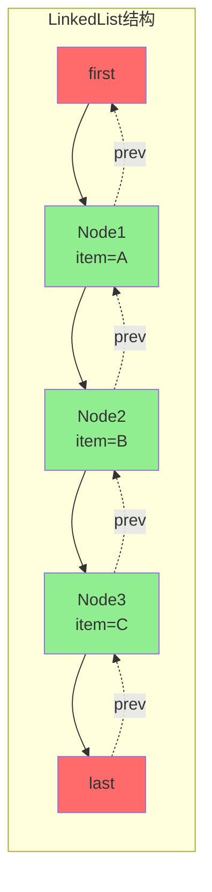
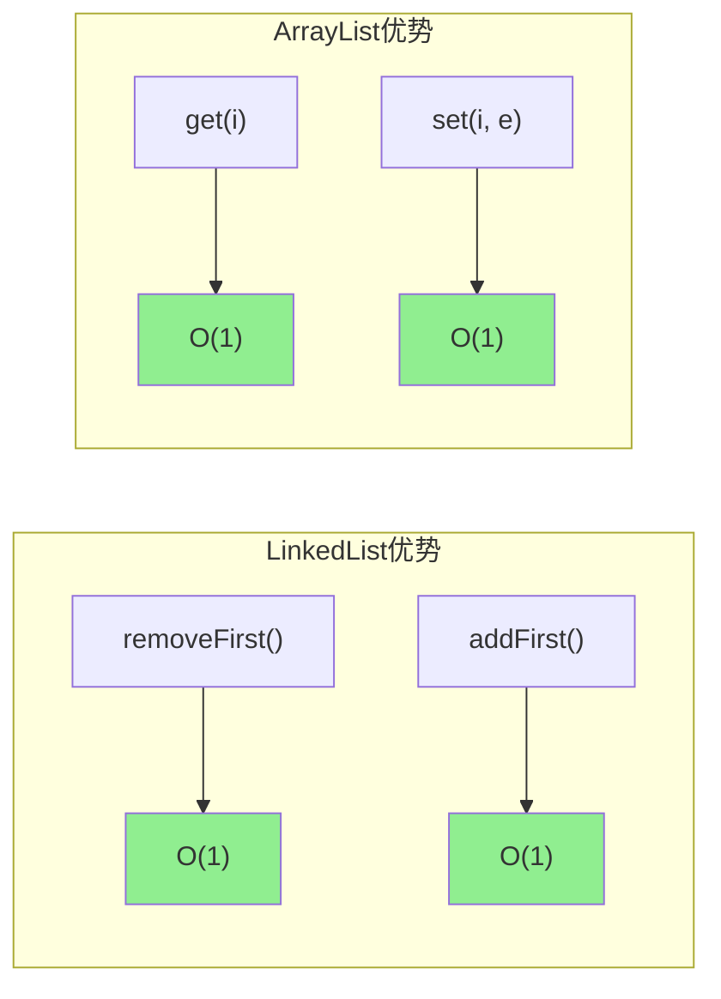
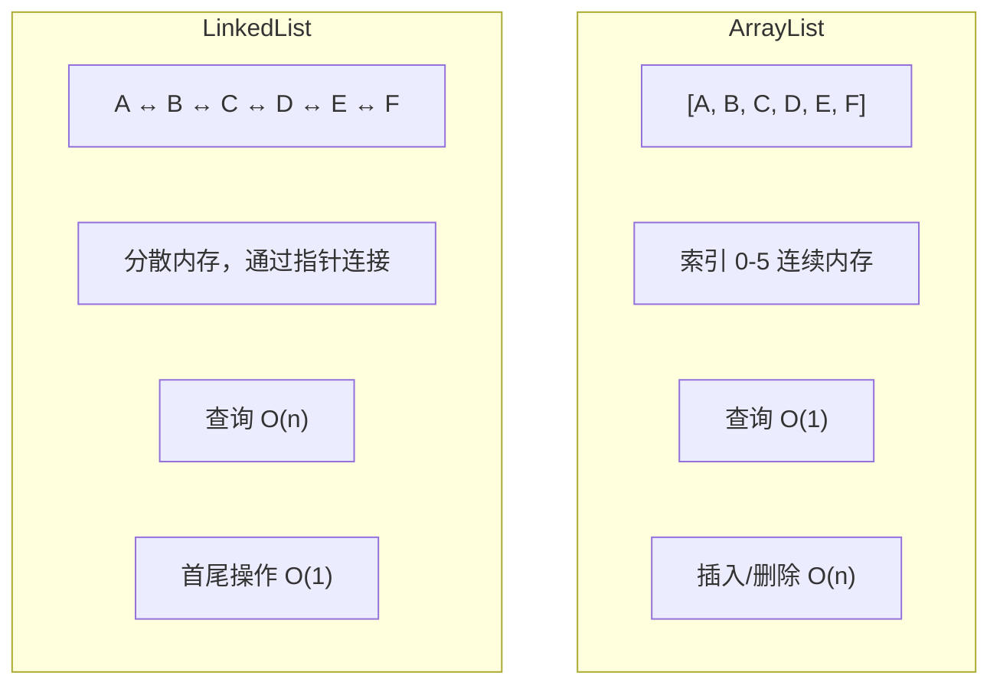

# LinkedList 源码深度解析

**目标级别**：P5

## 快速自测

面试官问：「LinkedList 和 ArrayList 的区别是什么？LinkedList 作为栈和队列哪个效率高？」

你能回答到第几层？

---

## 一、核心问题

### 🔴 LinkedList 的底层是什么？

LinkedList 的底层是**双向链表**（Doubly Linked List）。

```java title="LinkedList.java"
public class LinkedList<E>
    extends AbstractSequentialList<E>
    implements List<E>, Deque<E>, Cloneable, Serializable {
    
    // 头节点
    transient Node<E> first;
    
    // 尾节点
    transient Node<E> last;
    
    // 元素数量
    transient int size = 0;
    
    // 双向链表节点
    private static class Node<E> {
        E item;
        Node<E> prev;
        Node<E> next;
    }
}
```

### 双向链表结构



---

## 二、核心方法源码

### add 方法（尾插）

```java title="LinkedList.java"
public boolean add(E e) {
    linkLast(e);
    return true;
}

void linkLast(E e) {
    final Node<E> l = last;
    final Node<E> newNode = new Node<>(l, e, null);
    last = newNode;
    
    if (l == null)
        first = newNode;
    else
        l.next = newNode;
    
    size++;
    modCount++;
}
```

### add 方法（指定位置）

```java
public void add(int index, E element) {
    checkPositionIndex(index);
    
    if (index == size)
        linkLast(element);
    else
        linkBefore(element, node(index));
}

// 获取指定位置的节点（O(n)）
Node<E> node(int index) {
    if (index < (size >> 1)) {
        Node<E> x = first;
        for (int i = 0; i < index; i++)
            x = x.next;
        return x;
    } else {
        Node<E> x = last;
        for (int i = size - 1; i > index; i--)
            x = x.prev;
        return x;
    }
}

// 在指定节点前插入
void linkBefore(E e, Node<E> succ) {
    final Node<E> pred = succ.prev;
    final Node<E> newNode = new Node<>(pred, e, succ);
    succ.prev = newNode;
    
    if (pred == null)
        first = newNode;
    else
        pred.next = newNode;
    
    size++;
    modCount++;
}
```

### remove 方法

```java
public E remove(int index) {
    checkElementIndex(index);
    return unlink(node(index));
}

E unlink(Node<E> x) {
    final E element = x.item;
    final Node<E> next = x.next;
    final Node<E> prev = x.prev;
    
    if (prev == null) {
        first = next;
    } else {
        prev.next = next;
        x.prev = null;
    }
    
    if (next == null) {
        last = prev;
    } else {
        next.prev = prev;
        x.next = null;
    }
    
    x.item = null;
    size--;
    modCount++;
    
    return element;
}
```

---

## 三、Deque 接口实现

### 作为双端队列

```java
// LinkedList 实现了 Deque<E>，可以从两端操作
LinkedList<Integer> deque = new LinkedList<>();

// 队尾操作
deque.addLast(1);   // [1]
deque.offerLast(2); // [1, 2]

// 队首操作
deque.addFirst(0);   // [0, 1, 2]
deque.offerFirst(-1);// [-1, 0, 1, 2]

// 取出
deque.removeFirst(); // 返回 0，[-1, 1, 2]
deque.removeLast();  // 返回 2，[-1, 1]

// 查看
deque.peekFirst();   // -1
deque.peekLast();    // 1
```

### 作为栈

```java
LinkedList<Integer> stack = new LinkedList<>();

// 压栈
stack.push(1);
stack.push(2);
stack.push(3);  // [3, 2, 1]

// 弹栈
stack.pop();  // 返回 3
stack.pop();  // 返回 2

// 查看栈顶
stack.peek();  // 返回 1
```

---

## 四、方法复杂度分析

### 时间复杂度表

| 操作 | LinkedList | ArrayList |
|------|------------|-----------|
| **add(E)** 尾插 | O(1) | O(1) 均摊 |
| **add(int, E)** 指定位置 | O(n) | O(n) |
| **remove(int)** 指定位置 | O(n) | O(n) |
| **removeFirst() / removeLast()** | O(1) | O(n) |
| **get(int)** 获取 | O(n) | O(1) |
| **set(int, E)** 设置 | O(n) | O(1) |
| **contains(Object)** | O(n) | O(n) |

### 复杂度对比图



---

## 五、ArrayList vs LinkedList

### 🔴 核心对比



### 性能对比表

| 操作 | ArrayList | LinkedList |
|------|-----------|------------|
| **随机访问** | O(1) | O(n) |
| **头部插入** | O(n) | O(1) |
| **尾部插入** | O(1) 均摊 | O(1) |
| **中间插入** | O(n) | O(n) + O(n) |
| **内存开销** | 小（无指针） | 大（2个指针） |
| **CPU缓存** | 友好 | 不友好 |

### 选择建议

```java
// 查询多，选 ArrayList
List<String> list = new ArrayList<>();
for (int i = 0; i < 100000; i++) {
    list.get(i);  // O(1)，快
}

// 插入/删除多，选 LinkedList
List<String> list = new LinkedList<>();
for (int i = 0; i < 100000; i++) {
    list.add(0, "item");  // O(1)，快
}

// Java 9+ 可以用 List.of() 创建不可变列表
List<String> immutable = List.of("a", "b", "c");
```

---

## 六、手写 LinkedList

```java title="SimpleLinkedList.java"
public class SimpleLinkedList<E> {
    
    private Node<E> first;
    private Node<E> last;
    private int size;
    
    private static class Node<E> {
        E item;
        Node<E> prev;
        Node<E> next;
        
        Node(Node<E> prev, E item, Node<E> next) {
            this.prev = prev;
            this.item = item;
            this.next = next;
        }
    }
    
    public void addLast(E e) {
        Node<E> l = last;
        Node<E> newNode = new Node<>(l, e, null);
        last = newNode;
        
        if (l == null) {
            first = newNode;
        } else {
            l.next = newNode;
        }
        size++;
    }
    
    public void addFirst(E e) {
        Node<E> f = first;
        Node<E> newNode = new Node<>(null, e, f);
        first = newNode;
        
        if (f == null) {
            last = newNode;
        } else {
            f.prev = newNode;
        }
        size++;
    }
    
    public E removeFirst() {
        if (first == null) throw new NoSuchElementException();
        
        E item = first.item;
        Node<E> next = first.next;
        
        first.item = null;
        first.next = null;
        first = next;
        
        if (next == null) {
            last = null;
        } else {
            next.prev = null;
        }
        size--;
        
        return item;
    }
    
    public E get(int index) {
        checkIndex(index);
        return node(index).item;
    }
    
    private Node<E> node(int index) {
        Node<E> x = first;
        for (int i = 0; i < index; i++) {
            x = x.next;
        }
        return x;
    }
    
    private void checkIndex(int index) {
        if (index < 0 || index >= size)
            throw new IndexOutOfBoundsException();
    }
    
    public int size() {
        return size;
    }
}
```

---

## 七、面试题精讲

### 🔴 第一层：LinkedList 和 ArrayList 的区别？

> **参考答案**：
>
> | 维度 | ArrayList | LinkedList |
> |------|-----------|------------|
> | **底层结构** | 动态数组 | 双向链表 |
> | **随机访问** | O(1) | O(n) |
> | **头部操作** | O(n) | O(1) |
> | **尾部操作** | O(1) 均摊 | O(1) |
> | **内存开销** | 小 | 大（2个指针） |

### 🟡 第二层：LinkedList 为什么适合做栈和队列？

> **参考答案**：
>
> LinkedList 实现了 `Deque` 接口，可以从两端高效操作：
> - `addFirst()` / `removeFirst()` / `peekFirst()` → 栈操作
> - `addLast()` / `removeLast()` / `peekLast()` → 队列操作
>
> 头部和尾部操作都是 O(1)，因为有 first/last 指针。

### 🟡 第三层：LinkedList 的 get 方法为什么是 O(n)？

> **参考答案**：
>
> LinkedList 是链表，元素分散在内存中，没有索引。需要从头节点开始顺序遍历到指定位置，时间复杂度 O(n)。ArrayList 因为是连续数组，可以通过计算偏移量直接定位，O(1)。

---

## 八、常见错误与陷阱

### ⚠️ 陷阱 1：用 LinkedList 做随机访问

```java
// 错误：大量随机访问场景
LinkedList<String> list = new LinkedList<>();
for (int i = 0; i < 100000; i++) {
    list.add("item" + i);
}

// 随机访问 10000 次，O(n) * 10000 = 非常慢
```

### ⚠️ 陷阱 2：LinkedList 的内存开销

```java
// LinkedList 节点对象开销
class Node {
    Object item;  // 8字节（引用）
    Node prev;    // 8字节（引用）
    Node next;    // 8字节（引用）
    // 每个节点至少 24 字节 + 对象头 12 字节 = 36 字节
}

// ArrayList 只需要数组元素本身
// 相同数量元素，LinkedList 可能占用 3-4 倍内存
```

### ⚠️ 陷阱 3：遍历删除时出错

```java
LinkedList<String> list = new LinkedList<>(Arrays.asList("a", "b", "c"));

// 错误：fail-fast
for (String s : list) {
    if ("b".equals(s)) {
        list.remove(s);  // ConcurrentModificationException
    }
}

// 正确
Iterator<String> it = list.iterator();
while (it.hasNext()) {
    if ("b".equals(it.next())) {
        it.remove();
    }
}
```

---

## 延伸阅读

- [ArrayList vs LinkedList](./list-comparison)
- [ArrayList 源码解析](./arraylist)
- [fail-fast 与 fail-safe](../collection/fail-fast)
- [Deque 接口与 ArrayDeque](../collection/array-deque)
