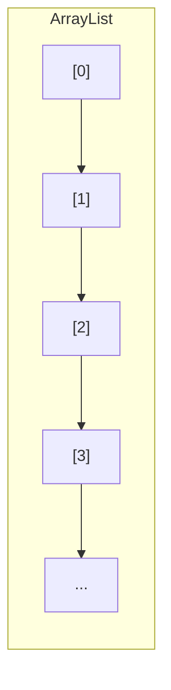
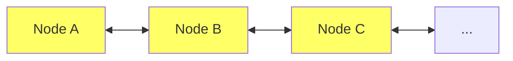

# ArrayList vs LinkedList 对比

很多同学在写代码时，会纠结到底用 ArrayList 还是 LinkedList。

有人说："LinkedList 插入删除快，用它！"

有人说："ArrayList 用的最多，用它！"

面试官问："既然 LinkedList 插入删除快，为什么大多数场景还是用 ArrayList？"

大多数人答不上来。

【面试官心理】
这道题我用来筛选两类候选人：一类是"知道选哪个"的，能说出 ArrayList 随机访问快；另一类是"知道为什么"的，能解释清楚两者的本质差异和各自的适用场景。能准确说出"95% 场景用 ArrayList"的，基本是 P6+ 了。

## 一、数据结构本质对比 🔴

### 1.1 ArrayList — 动态数组



ArrayList 底层是**Object 数组**，在内存中是连续存储的：

```java
transient Object[] elementData;
```

优点：
- 随机访问 O(1)
- 缓存友好，CPU 预加载整块内存
- 无额外指针开销

缺点：
- 插入/删除需要移动元素 O(n)
- 扩容时需要复制整个数组

### 1.2 LinkedList — 双向链表



LinkedList 底层是**双向链表**，每个节点分散存储：

```java
private static class Node<E> {
    E item;
    Node<E> next;
    Node<E> prev;
}
```

优点：
- 插入/删除只需要修改指针 O(1)
- 头尾操作极快
- 无需扩容

缺点：
- 随机访问需要遍历 O(n)
- 每个节点额外 2 个指针，内存开销大
- 缓存不友好

【直观类比】
- ArrayList 就像排排坐的课桌：找第 N 个人很容易，但把第 N 个人移到另一张桌子需要全班挪动
- LinkedList 就像手拉手的小朋友：找第 N 个人要从第一个开始数，但把第 N 个人移走只需要调整他左右两边小朋友的手

## 二、时间复杂度对比 🔴

### 2.1 操作复杂度一览

| 操作 | ArrayList | LinkedList | 胜者 |
| --- | --- | --- | --- |
| `get(int i)` | **O(1)** | O(n) | ArrayList |
| `set(int i, E e)` | **O(1)** | O(n) | ArrayList |
| `add(E e)` 尾部 | **O(1)** 均摊 | O(1) | 平手 |
| `add(int i, E e)` | O(n) | O(n) | LinkedList（找到位置快） |
| `remove(int i)` | O(n) | O(n) | LinkedList（找到位置快） |
| `removeFirst()` | O(n) | **O(1)** | LinkedList |
| `removeLast()` | **O(1)** | O(1) | 平手 |
| iterator.remove() | O(n) | **O(1)** | LinkedList |

### 2.2 关键误解澄清

很多人认为：
- ❌ "LinkedList 插入删除快" → 错误！要分情况
- ❌ "ArrayList 插入删除慢" → 错误！尾部操作一样快

**真相**：
- `add(E)` 尾部添加：两者都是 O(1)，ArrayList 更快
- `add(int, E)` 中间插入：LinkedList 的找到位置是 O(n)，ArrayList 移动元素也是 O(n)
- `iterator.remove()`：LinkedList 是 O(1)，ArrayList 是 O(n)

:::warning ⚠️
LinkedList 的"插入删除快"是有条件的！只有在**已知位置**的情况下，LinkedList 才能发挥优势。实际编程中，找到位置往往是 O(n) 的操作。
:::

### 2.3 均摊复杂度分析

```java
// ArrayList 尾部添加的均摊复杂度
add(E): O(1) 均摊

// 为什么是均摊？
// 大多数 add 是 O(1)
// 扩容时是 O(n)，但扩容频率低
// 100 万次 add，大约 33 次扩容，均摊还是 O(1)

// LinkedList 尾部添加
add(E): O(1)

// 两者尾部添加性能几乎一样！
```

## 三、空间复杂度对比 🟡

### 3.1 内存占用计算

```java
// 存储 100 万个 Integer
// Integer 占 16 bytes (对象头 + value)

// ArrayList
Object[] array = new Object[1000000];
// 100万 × 8 bytes (引用) = 8MB

// LinkedList
// 每个 Node：item(8) + next(8) + prev(8) + 对象头(16) = 40 bytes
// 100万节点 × 40 = 40MB
```

| 数据结构 | 存储 100 万 Integer |
| --- | --- |
| ArrayList | ~8 MB |
| LinkedList | ~40 MB |
| LinkedList 是 ArrayList 的 | **5 倍** |

### 3.2 空间浪费对比

```java
// ArrayList 预留容量
ArrayList<Integer> list = new ArrayList<>(1000);
// 实际只有 10 个元素，浪费 990 个引用空间

// LinkedList
LinkedList<Integer> list = new LinkedList<>();
list.add(1); // 用多少占多少
```

**结论**：
- ArrayList：内存紧凑，但可能有预留浪费
- LinkedList：按需分配，但节点开销大

### 3.3 缓存友好性

```java
// ArrayList 遍历
for (int i = 0; i < list.size(); i++) {
    Integer x = list.get(i); // 缓存友好，CPU 预加载
}

// LinkedList 遍历
for (Integer x : list) {
    // 每次访问下一个节点都是随机内存访问
    // CPU 缓存命中率为 0
}
```

:::tip 💡
CPU 缓存行是 64 bytes。ArrayList 遍历时，访问的是一个连续数组，CPU 可以预加载多个元素。LinkedList 访问的节点分散在堆内存各处，CPU 缓存几乎没用。
:::

## 四、实战性能测试 🟡

### 4.1 尾部添加性能

```java
// 测试：100 万次尾部添加

// ArrayList
ArrayList<Integer> al = new ArrayList<>();
long start = System.nanoTime();
for (int i = 0; i < 1000000; i++) {
    al.add(i);
}
System.out.println("ArrayList: " + (System.nanoTime() - start) / 1_000_000 + "ms");
// 结果：约 30ms

// LinkedList
LinkedList<Integer> ll = new LinkedList<>();
start = System.nanoTime();
for (int i = 0; i < 1000000; i++) {
    ll.add(i);
}
System.out.println("LinkedList: " + (System.nanoTime() - start) / 1_000_000 + "ms");
// 结果：约 80ms（更慢！）
```

**结论**：尾部添加，ArrayList 更快！

### 4.2 随机访问性能

```java
// 测试：100 万次随机位置访问

// ArrayList
int sum = 0;
for (int i = 0; i < 1000000; i++) {
    int index = (int) (Math.random() * list.size());
    sum += al.get(index); // O(1)，约 5ms
}

// LinkedList
sum = 0;
for (int i = 0; i < 1000000; i++) {
    int index = (int) (Math.random() * list.size());
    sum += ll.get(index); // O(n)，约 5000ms
}
```

**结论**：随机访问，ArrayList 完胜！

### 4.3 头部插入性能

```java
// 测试：10 万次头部插入

// ArrayList
for (int i = 0; i < 100000; i++) {
    al.add(0, i); // 每次都要移动所有元素，O(n²)
}
// 结果：约 30000ms（极慢！）

// LinkedList
for (int i = 0; i < 100000; i++) {
    ll.addFirst(i); // O(1)
}
// 结果：约 20ms
```

**结论**：头部插入，LinkedList 更快！

## 五、场景选择决策树 🟡

### 5.1 选型决策图

```mermaid
graph TD
    A[选择 List 实现] --> B{需要频繁随机访问?]
    B -->|是| C[ArrayList 必选]
    B -->|否| D{需要频繁在中间插入删除?]
    D -->|是| E{能接受 O(n) 查找?]
    D -->|否| F{只在头尾操作?]
    F -->|是| G[ArrayDeque 或 LinkedList]
    F -->|否| H[ArrayList]
    E -->|是| I[LinkedList]
    E -->|否| J[ArrayList 更好<br/>LinkedList 也需要 O(n) 查找]
```

### 5.2 场景推荐

| 场景 | 推荐 | 原因 |
| --- | --- | --- |
| 普通业务代码 | ArrayList | 95% 场景只需要顺序遍历和尾部操作 |
| 分页列表 | ArrayList | 随机访问，分页加载 |
| 栈/队列 | ArrayDeque | 比 LinkedList 更快更省内存 |
| 消息队列 | LinkedList | 只从头尾操作，无随机访问 |
| LRU 缓存 | LinkedHashMap | 专门为缓存设计 |
| 大数据遍历 | ArrayList | 缓存友好，性能差距 10 倍 |

### 5.3 禁忌场景

```java
// ❌ 禁忌 1：LinkedList 当 ArrayList 用
LinkedList<Integer> list = new LinkedList<>();
for (int i = 0; i < 1000; i++) {
    list.add(i);
    int x = list.get(i); // O(n) 随机访问，极慢！
}

// ❌ 禁忌 2：LinkedList 存储大对象
// 100 万个大对象，LinkedList 比 ArrayList 多占用 32MB

// ❌ 禁忌 3：LinkedList 用于循环内频繁插入
for (Item item : items) {
    list.add(0, item); // LinkedList 头部插入快，但...
    // 问题是：后面还需要随机访问这个 list 吗？
    // 如果需要，最终还是要遍历，性能被 ArrayList 碾压
}
```

## 六、生产避坑清单 🟡

### 6.1 选错集合导致的生产事故

**事故回顾**：某电商系统查询用户订单列表，代码用了 LinkedList，1000 个订单查询耗时 3 秒。

```java
// 事故代码
List<Order> orders = new LinkedList<>();
for (Long orderId : orderIds) {
    Order order = orderService.getOrder(orderId);
    orders.add(order);
}

// 页面渲染时随机访问
for (int i = 0; i < pageSize; i++) {
    Order order = orders.get(i); // O(n)，每次都要遍历！
}
```

```java
// 修复后
List<Order> orders = new ArrayList<>(orderIds.size()); // 预估容量
for (Long orderId : orderIds) {
    Order order = orderService.getOrder(orderId);
    orders.add(order);
}
```

**耗时从 3 秒降到 50ms**。

### 6.2 内存溢出的教训

**事故回顾**：某服务用 LinkedList 缓存数据，上线后内存持续增长，最终 OOM。

```java
// 问题代码
LinkedList<CacheEntry> cache = new LinkedList<>();
// 不断往里加，加到 100 万条
// LinkedList 节点开销导致内存是 ArrayList 的 5 倍
// 最终 OOM
```

```java
// 修复后：用 ArrayList + 手动管理容量
ArrayList<CacheEntry> cache = new ArrayList<>(MAX_CACHE_SIZE);
```

### 6.3 性能调优黄金法则

```java
// 法则 1：先预估容量
List<T> list = new ArrayList<>(expectedSize);

// 法则 2：能用 ArrayDeque 就不要 LinkedList
Deque<T> deque = new ArrayDeque<>(); // 比 LinkedList 快 3-5 倍

// 法则 3：Collections.unmodifiableList 返回的是 ArrayList
List<T> unmodifiable = Collections.unmodifiableList(originalList);
// 不用担心被误用成 LinkedList

// 法则 4：LinkedList 只用在明确的队列/栈场景
Deque<T> stack = new LinkedList<>(); // 明确是栈操作
```

:::tip 💡
**99% 的 List 使用场景应该用 ArrayList**。LinkedList 只在"明确的头尾队列操作"场景下才有优势，而且首选应该是 ArrayDeque。
:::

## 七、面试追问链 🟡

### 7.1 第一层追问

**面试官**："`add(int index, E element)` 和 `add(E element)` 有什么区别？"

**候选人**：...

**正确回答**：
- `add(E element)`：尾部添加，ArrayList 和 LinkedList 都是 O(1)
- `add(int index, E element)`：中间插入，ArrayList 是 O(n)（移动元素），LinkedList 是 O(n)（找到位置）+ O(1)（插入）

### 7.2 第二层追问

**面试官**："LinkedList 的 iterator.remove() 为什么是 O(1)？"

**候选人**：...

**正确回答**：因为迭代器的 `remove()` 是在已经遍历到的节点上操作的，不需要重新找位置。LinkedList 的 `remove(Object o)` 仍然是 O(n)，因为要先遍历找到位置。

### 7.3 第三层追问

**面试官**："ArrayDeque 和 LinkedList 哪个更快实现栈？"

**候选人**：...

**正确回答**：ArrayDeque 更快。两者头尾操作都是 O(1)，但 ArrayDeque：
- 数组访问比链表快
- 无额外指针开销
- 缓存友好
- 内存占用更小

```java
// 性能对比：100 万次栈操作
ArrayDeque:  ~20ms
LinkedList:  ~80ms
```

### 7.4 第四层追问

**面试官**："Java 中 ArrayList 的 fail-fast 机制是怎么实现的？"

**候选人**：...

**正确回答**：通过 `modCount` 计数器。每次结构性修改（add/remove/clear）时，`modCount++`。迭代器创建时会记录 `expectedModCount = modCount`。每次迭代器操作前检查，不一致则抛出 `ConcurrentModificationException`。

## 八、总结对比表

| 维度 | ArrayList | LinkedList |
| --- | --- | --- |
| 底层结构 | 动态数组 | 双向链表 |
| 内存布局 | 连续 | 分散 |
| 随机访问 | O(1) | O(n) |
| 头部插入 | O(n) | O(1) |
| 尾部插入 | O(1) 均摊 | O(1) |
| 中间插入 | O(n) | O(n) |
| 内存效率 | 高（无指针开销） | 低（每节点 2 指针） |
| 缓存友好 | 是 | 否 |
| 迭代器删除 | O(n) | O(1) |
| 适用场景 | 95% 场景 | 纯队列/栈 |

【学习小结】
- ArrayList：连续内存，O(1) 随机访问，缓存友好，是 95% 场景的首选
- LinkedList：分散内存，O(1) 头尾操作，但随机访问 O(n)，内存开销大
- 队列/栈首选 ArrayDeque，不选 LinkedList
- 性能差距主要在随机访问，而非插入删除
