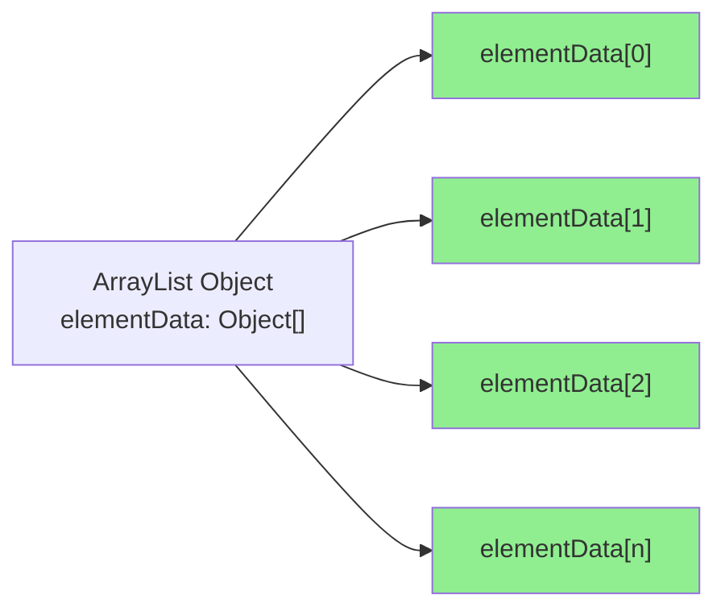
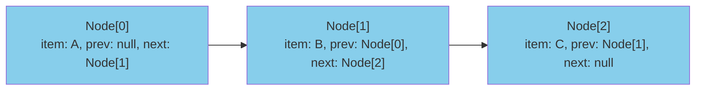
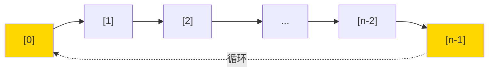

# ArrayList vs LinkedList 深度对比

阿里 P6 面试间里，面试官合上简历，问了一个老生常谈的问题：

"ArrayList 和 LinkedList 的区别是什么？分别在什么场景下使用？"

小王深吸一口气："ArrayList 底层是数组，LinkedList 底层是链表。ArrayList 查快改慢，LinkedList 查慢改快。"

面试官点点头，继续追问："那为什么 JDK 的 `ArrayDeque` 比 `LinkedList` 做队列更快？"

小王愣了两秒："呃...因为 ArrayDeque 是数组实现？"

面试官："对，但为什么数组实现就更快？"

小王开始支支吾吾。

【面试官心理】

这道题我用来测试候选人对"为什么"的追求程度。知道数据结构差异的占 80%，知道性能差异的占 50%，能解释 CPU cache、内存连续性、指针开销的占 20%，能说清楚 `ArrayDeque` vs `LinkedList` 底层差异的占 5%。选型题的本质不是考你知道什么，而是考你理解得有多深。

## 一、底层结构对比 🔴

### 1.1 ArrayList：连续内存的数组



ArrayList 底层是一个 `Object[]` 数组，所有元素在内存中是**连续存放**的。这带来了两个关键特性：

1. **CPU Cache 友好**：现代 CPU 有 L1/L2/L3 缓存，当访问 `elementData[i]` 时，整个数组的相邻元素都可能被预加载到 cache 中
2. **随机访问 O(1)**：通过 `baseAddress + index * elementSize` 直接计算内存地址

### 1.2 LinkedList：分散内存的节点



LinkedList 底层是双向链表，每个节点在内存中是**分散存放**的，通过 prev 和 next 指针串联起来。

```java
private static class Node<E> {
    E item;
    Node<E> next;
    Node<E> prev;
}
```

每个节点额外占用 16 字节（两个指针），而且节点之间通过指针连接，CPU 无法预判下一个节点的内存地址。

## 二、性能真相 🔴

### 2.1 时间复杂度对比

| 操作 | ArrayList | LinkedList |
| --- | --- | --- |
| get(int i) | O(1) | O(n) |
| add(E e) 尾部 | 均摊 O(1) | O(1) |
| add(int i, E e) 头部 | O(n) | O(1) |
| add(int i, E e) 中间 | O(n) | O(n) |
| remove(int i) | O(n) | O(n) |
| 迭代遍历 | O(n) + cache友好 | O(n) + cache不友好 |

:::warning ⚠️
"LinkedList 增删快" 这个说法是片面的。LinkedList 只有在**头部或尾部的 O(1) 位置**增删才是 O(1)，中间位置同样是 O(n)，因为要先遍历找到位置。
:::

### 2.2 CPU Cache 的致命影响

这是理解两种列表性能差异的关键。

**ArrayList 遍历**：

```java
for (int i = 0; i < list.size(); i++) {
    process(list.get(i));  // 顺序访问，cache 命中率高
}
```

CPU 读取 `elementData[0]` 时，由于缓存行（通常 64 字节）机制，`elementData[0]` ~ `elementData[7]` 会被一次性加载到 L1 cache。访问下一个元素时，数据已经在 cache 里，无需再访内存。

**LinkedList 遍历**：

```java
for (Node<E> x = first; x != null; x = x.next) {
    process(x.item);  // 随机访问，每次可能都 miss cache
}
```

访问 `Node[0].item` 时，CPU 只加载这个节点到 cache。访问 `Node[1]` 时，由于它在内存中的位置可能距离 `Node[0]` 很远，cache miss，必须重新从主存取数据。

实测数据（来源： mechanical-sympathy 关于 CPU cache 的经典博客）：

- L1 cache 命中：约 1 纳秒
- L2 cache 命中：约 3-4 纳秒
- 主存访问：约 100 纳秒

**两者相差 100 倍！**

### 2.3 真实性能测试

```java
// 测试环境：JDK 17, Intel i7-9700K
public class ListBenchmark {
    static final int SIZE = 1_000_000;

    public static void main(String[] args) {
        // ArrayList 遍历
        ArrayList<Integer> al = new ArrayList<>(SIZE);
        for (int i = 0; i < SIZE; i++) al.add(i);
        long start = System.nanoTime();
        for (int i = 0; i < SIZE; i++) al.get(i);
        System.out.println("ArrayList 遍历: " + (System.nanoTime() - start) / 1_000_000 + "ms");

        // LinkedList 遍历
        LinkedList<Integer> ll = new LinkedList<>();
        for (int i = 0; i < SIZE; i++) ll.add(i);
        start = System.nanoTime();
        for (int i = 0; i < SIZE; i++) ll.get(i);
        System.out.println("LinkedList 遍历: " + (System.nanoTime() - start) / 1_000_000 + "ms");
    }
}
```

典型结果：
- ArrayList 遍历 100万元素：约 **50-100ms**
- LinkedList 遍历 100万元素：约 **5000-10000ms**

**LinkedList 慢了 100 倍！**

## 三、选型决策树 🔴

```
需要存储数据并频繁随机访问？
  → ArrayList

需要作为队列/栈使用（头尾操作）？
  → ArrayDeque（比 LinkedList 更快）

需要频繁在列表中间插入/删除？
  → LinkedList（但要考虑数据量）

需要线程安全？
  → CopyOnWriteArrayList 或 synchronized 包装

需要遍历操作远多于增删操作？
  → ArrayList

需要存储大量元素（百万级以上）？
  → ArrayList（内存效率更高）
```

### 决策场景一：分页列表

```java
// ✅ 正确：用 ArrayList
public List<User> getPage(int page, int pageSize) {
    int fromIndex = (page - 1) * pageSize;
    return allUsers.subList(fromIndex, Math.min(fromIndex + pageSize, allUsers.size()));
}
```

用户要翻页，必然要随机访问，用 ArrayList。

### 决策场景二：消息队列（内存队列）

```java
// ❌ LinkedList：节点开销大，cache 不友好
LinkedList<Message> queue = new LinkedList<>();

// ✅ ArrayDeque：循环数组，头尾操作都是 O(1)
ArrayDeque<Message> queue = new ArrayDeque<>();

// ✅ 最佳：ConcurrentLinkedQueue（无锁队列）
ConcurrentLinkedQueue<Message> queue = new ConcurrentLinkedQueue<>();
```

### 决策场景三：撤销操作（Undo/Redo）

```java
// ✅ LinkedList：需要频繁在头部操作
LinkedList<State> undoStack = new LinkedList<>();
LinkedList<State> redoStack = new LinkedList<>();

public void doAction(State s) {
    undoStack.push(s);   // O(1) 头部插入
    redoStack.clear();
}
```

### 决策场景四：大数据量 ETL

```java
// ✅ ArrayList：内存连续，遍历快，GC 开销小
List<Record> batch = new ArrayList<>(batchSize);
while (rs.next()) {
    batch.add(extractRecord(rs));
    if (batch.size() == batchSize) {
        processBatch(batch);  // 批量处理
        batch.clear();        // 复用数组
    }
}
```

## 四、为什么 ArrayDeque 比 LinkedList 快 🟡

这是面试官最爱追问的进阶问题。

### 4.1 ArrayDeque 的结构

```java
public class ArrayDeque<E> extends AbstractCollection<E>
        implements Deque<E>, Cloneable, Serializable {

    transient Object[] elements;  // 循环数组
    transient int head;           // 头指针
    transient int tail;           // 尾指针
}
```

ArrayDeque 使用**循环数组**（Circular Buffer），头尾指针在数组两端移动，到达边界后绕回起点。



### 4.2 ArrayDeque vs LinkedList

| 维度 | ArrayDeque | LinkedList |
| --- | --- | --- |
| 内存占用 | 1个数组 + 2个int | N个节点 + 2N个指针 |
| 头尾操作 | 都是 O(1) | 都是 O(1) |
| 遍历速度 | 极快（连续内存） | 慢（随机内存） |
| GC 压力 | 低（固定对象数） | 高（创建大量节点） |
| 缓存友好度 | 极高 | 低 |
| 内存效率 | 高 | 低 |

:::tip 💡
ArrayDeque 的 addFirst 和 addLast 时间复杂度都是 O(1)，且不需要创建新节点。对于队列和栈这种"头尾操作"场景，ArrayDeque 全面优于 LinkedList。
:::

## 五、面试高频追问 🟡

### 追问一：ArrayList 扩容会影响性能吗？

会。ArrayList 扩容时需要：
1. 分配新数组（通常是旧容量的 1.5 倍）
2. 调用 `System.arraycopy` 复制所有元素

对于已知数据量，预设容量可以避免扩容开销：
```java
List<String> list = new ArrayList<>(1000000);  // 预设容量
```

### 追问二：LinkedList 为什么没有 RandomAccess？

因为 LinkedList 的 `get(int index)` 是 O(n) 操作，不满足 RandomAccess 接口的语义（应该接近 O(1)）。

```java
public class LinkedList<E> ...
        // 注意：没有 implements RandomAccess
```

可以通过 instanceof 判断：
```java
if (list instanceof RandomAccess) {
    // ArrayList，用 index 访问
} else {
    // LinkedList，用迭代器遍历
}
```

### 追问三：遍历时删元素用哪个更好？

都不用。正确做法是使用迭代器的 `remove()` 方法：

```java
Iterator<E> it = list.iterator();
while (it.hasNext()) {
    if (condition(it.next())) {
        it.remove();
    }
}
```

而且如果能确定列表类型，可以在循环前先判断，避免不必要的类型转换开销。

## 六、避坑清单 🟢

```
❌ 不要：用 LinkedList 做遍历或随机访问
❌ 不要：用 ArrayList 做频繁的头部插入
❌ 不要：在循环中频繁 add/remove 导致扩容
❌ 不要：忽略数据量对选型的影响

✅ 要：根据操作模式选择合适的列表类型
✅ 要：预估数据量并预设容量
✅ 要：理解 CPU cache 对性能的影响
✅ 要：了解 ArrayDeque 作为队列的性能优势
```

【面试官心理】

这道对比题背后，我真正想知道的是：候选人有没有"性能意识"。不是背了复杂度表就完了，而是真的理解为什么数组快、链表慢，CPU cache 是什么，内存连续性意味着什么。知道"怎么做"是 60 分，知道"为什么这样做"才是 100 分。
