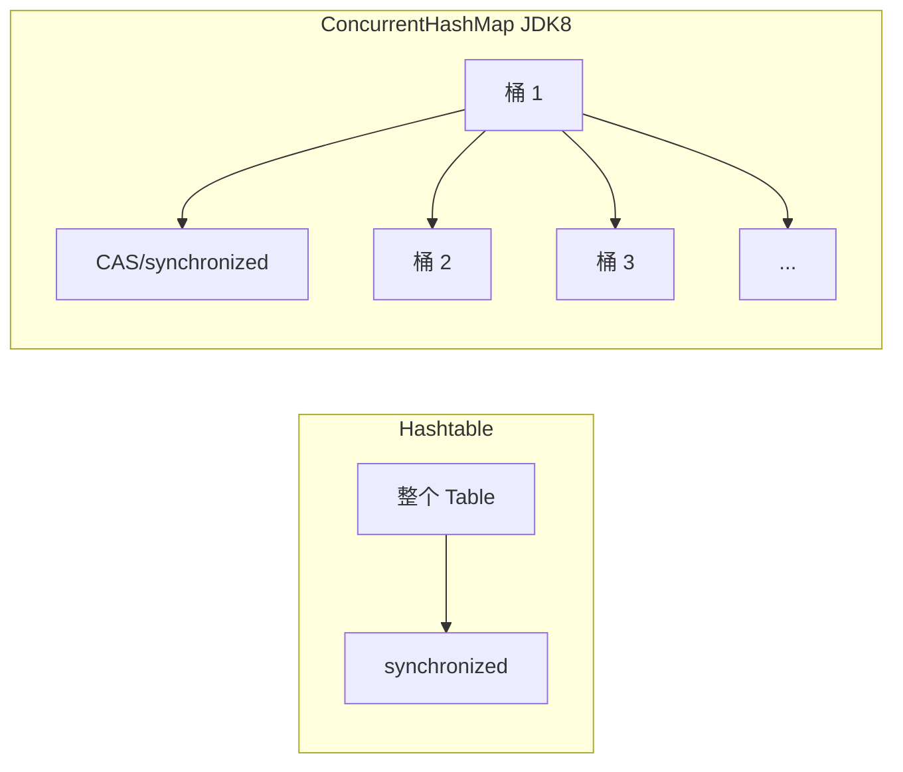
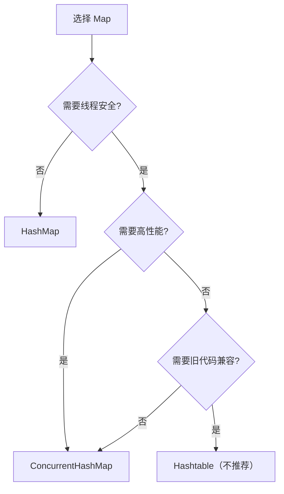

# HashMap vs Hashtable vs ConcurrentHashMap

面试官问："多线程环境下该用哪个 Map？"

候选人小李答："ConcurrentHashMap。"

面试官追问："为什么不用 Hashtable？它也是线程安全的。"

小李说："Hashtable 太慢了。"

面试官继续追问："那 Collections.synchronizedMap 呢？为什么不推荐用？"

小张答不上来了。

【面试官心理】
这道题我用来测试候选人对并发编程的理解深度。能说清楚三种 Map 的区别、性能差异、适用场景的候选人，说明真正理解了什么叫做"线程安全"和"并发性能"。

## 一、三种 Map 概述 🔴

### 1.1 HashMap

```java
// HashMap - 非线程安全，最常用的 Map
Map<String, Integer> map = new HashMap<>();
map.put("a", 1);
map.get("a"); // 线程不安全
```

**特点**：
- 非线程安全
- O(1) 查找/插入
- 允许一个 null key
- JDK 1.2 引入
- 不支持并发操作

### 1.2 Hashtable

```java
// Hashtable - 线程安全但已废弃
Map<String, Integer> map = new Hashtable<>();
map.put("a", 1);
map.get("a"); // 线程安全，但性能差
```

**特点**：
- 线程安全（每个方法都用 synchronized）
- O(1) 查找/插入
- 不允许 null key
- JDK 1.0 引入
- 已被废弃，不推荐使用

### 1.3 ConcurrentHashMap

```java
// ConcurrentHashMap - 高性能线程安全
Map<String, Integer> map = new ConcurrentHashMap<>();
map.put("a", 1);
map.get("a"); // 线程安全，性能好
```

**特点**：
- 线程安全（CAS + synchronized）
- O(1) 查找/插入
- 不允许 null key
- JDK 1.5 引入
- 推荐的多线程 Map

## 二、线程安全实现对比 🔴

### 2.1 Hashtable 的 synchronized

```java
// Hashtable 的每个方法都加锁
public synchronized V put(K key, V value) {
    // 整个 table 被锁住
}

public synchronized V get(Object key) {
    // 整个 table 被锁住
}

public synchronized V remove(Object key) {
    // 整个 table 被锁住
}

public synchronized int size() {
    // 整个 table 被锁住
}
```

**问题**：所有操作都是全局锁，高并发下性能极差。

### 2.2 ConcurrentHashMap 的分段锁/桶锁

```java
// JDK 7 - Segment 分段锁
public V put(K key, V value) {
    Segment<K,V> s = segments[(hash >>> segmentShift) & segmentMask];
    return s.put(key, hash, value, false);
}

// JDK 8 - CAS + synchronized
public V put(K key, V value) {
    return putVal(key, value, false);
}
```

### 2.3 锁粒度对比



| Map | 锁粒度 | 并发度 |
| --- | --- | --- |
| Hashtable | 全局锁（整个 table） | 低 |
| ConcurrentHashMap JDK7 | Segment 级别（16 个段） | 中 |
| ConcurrentHashMap JDK8 | 桶级别（细粒度锁） | 高 |

### 2.4 ❌ 错误示范

**候选人原话**："Hashtable 和 ConcurrentHashMap 都是线程安全的，用哪个都一样。"

**问题诊断**：
- 不理解"线程安全"和"并发性能"的区别
- 不理解锁粒度对性能的影响

**面试官内心 OS**："这个候选人可能只是知道 Hashtable 不能用了，但没有理解为什么。"

【面试官心理】
面试官追问"为什么 Hashtable 不推荐"，是在测试候选人对并发性能的理解。能够解释清楚锁粒度、性能差异的候选人，说明真正理解了并发编程。

## 三、性能对比 🟡

### 3.1 单线程性能

```java
// 测试：100 万次 put + get

// HashMap: ~80ms
Map<String, Integer> hashMap = new HashMap<>();
for (int i = 0; i < 1000000; i++) {
    hashMap.put("key" + i, i);
}

// ConcurrentHashMap: ~150ms（稍有开销）
Map<String, Integer> concurrentHashMap = new ConcurrentHashMap<>();
for (int i = 0; i < 1000000; i++) {
    concurrentHashMap.put("key" + i, i);
}

// Hashtable: ~500ms（性能差）
Map<String, Integer> hashtable = new Hashtable<>();
for (int i = 0; i < 1000000; i++) {
    hashtable.put("key" + i, i);
}
```

### 3.2 多线程性能

```java
// 测试：16 线程并发，100 万次 put

// HashMap（不安全，可能出错）：不可用

// Hashtable: ~3000ms
// 每个操作都要竞争同一把锁

// ConcurrentHashMap JDK8: ~400ms
// 锁粒度细，并发度高
```

### 3.3 性能对比表

| 操作 | HashMap | Hashtable | ConcurrentHashMap |
| --- | --- | --- | --- |
| 单线程 put | O(1) | O(1) + 锁开销 | O(1) + CAS |
| 单线程 get | O(1) | O(1) + 锁开销 | O(1) |
| 多线程 put | 不安全 | O(n) 争用 | O(1) 细粒度 |
| 多线程 get | 不安全 | O(n) 争用 | O(1) |
| null 支持 | key/value 都可以 null | 都不可以 | 都不可以 |

## 四、null 支持差异 🟡

### 4.1 HashMap

```java
// HashMap 允许 null key 和 null value
Map<String, Integer> map = new HashMap<>();

map.put(null, 1);      // OK
map.put("a", null);    // OK
map.get(null);         // 返回 1
map.get("a");          // 返回 null
```

### 4.2 Hashtable

```java
// Hashtable 不允许 null key 或 null value
Map<String, Integer> map = new Hashtable<>();

map.put(null, 1);      // NullPointerException!
map.put("a", null);    // NullPointerException!
```

### 4.3 ConcurrentHashMap

```java
// ConcurrentHashMap 也不允许 null key 或 null value
Map<String, Integer> map = new ConcurrentHashMap<>();

map.put(null, 1);      // NullPointerException!
map.put("a", null);    // NullPointerException!
```

### 4.4 为什么 ConcurrentHashMap 不允许 null

```java
// 原因：并发场景下 null 会导致歧义

// 假设允许 null：
V v = map.get(key);  // 返回 null

// 问题是：
// 1. key 不存在，返回 null
// 2. key 存在但 value 是 null

// 无法区分这两种情况！

// HashMap 不需要区分，因为它不是线程安全的
// ConcurrentHashMap 需要区分，所以不允许 null value
```

:::tip 💡
ConcurrentHashMap 不允许 null 是为了避免并发场景下的歧义。如果需要表示"无值"，用 `Optional` 或特殊值（如 `-1`、`EMPTY`）。
:::

## 五、复合操作的线程安全 🟡

### 5.1 非原子操作的危险

```java
// ❌ 这些都不是原子操作！
Map<String, Integer> map = new ConcurrentHashMap<>();

// 1. 先检查再操作
if (map.get("key") == null) {
    map.put("key", 1);  // 可能被其他线程抢先
}

// 2. 读后写
map.put("key", map.get("key") + 1);

// 3. 批量操作
for (Map.Entry<String, Integer> entry : map.entrySet()) {
    // 其他线程可能同时修改 map
}
```

### 5.2 原子操作方法

```java
// ConcurrentHashMap 提供了原子操作
Map<String, Integer> map = new ConcurrentHashMap<>();

// 1. putIfAbsent - 如果不存在才插入
map.putIfAbsent("key", 1);

// 2. replace - 原子替换
map.replace("key", 1, 2);  // 如果旧值是 1，才替换为 2
map.replace("key", 2);      // 直接替换

// 3. compute - 原子计算
map.compute("key", (k, v) -> v == null ? 1 : v + 1);

// 4. merge - 原子合并
map.merge("key", 1, (v1, v2) -> v1 + v2);

// 5. getAndIncrement / incrementAndGet
map.getAndIncrement("counter");
map.incrementAndGet("counter");
```

### 5.3 Collections.synchronizedMap

```java
// Collections.synchronizedMap 也是全局锁
Map<String, Integer> map = Collections.synchronizedMap(new HashMap<>());

synchronized (map) {
    if (map.get("key") == null) {
        map.put("key", 1);  // 在同步块内
    }
}

// 问题：
// 1. 每次操作都要加锁
// 2. 迭代时也需要同步
synchronized (map) {
    for (Map.Entry<String, Integer> entry : map.entrySet()) {
        // ...
    }
}
```

## 六、迭代器行为差异 🟡

### 6.1 HashMap

```java
// HashMap 的迭代器是 fail-fast
Map<String, Integer> map = new HashMap<>();
Iterator<String> it = map.keySet().iterator();

// 迭代过程中修改 map，会抛出 ConcurrentModificationException
```

### 6.2 Hashtable

```java
// Hashtable 的迭代器也是 fail-fast
Map<String, Integer> map = new Hashtable<>();
Iterator<String> it = map.keys();

// 迭代过程中修改，会抛出 ConcurrentModificationException
```

### 6.3 ConcurrentHashMap

```java
// ConcurrentHashMap 的迭代器是弱一致的
Map<String, Integer> map = new ConcurrentHashMap<>();
Iterator<String> it = map.keySet().iterator();

// 迭代过程中允许修改
// 不抛出 ConcurrentModificationException
// 可能反映迭代开始后的部分修改
```

### 6.4 弱一致迭代器的实现

```java
// ConcurrentHashMap 的弱一致迭代器
// 允许在迭代过程中其他线程修改
// 可能看到部分修改，但不保证

Iterator<Map.Entry<K, V>> iterator() {
    Node<K, V>[] tab = this.table;
    // 记录当时的 table
    // 迭代时可能看到旧值或新值
    return new EntryIterator(tab);
}
```

## 七、选型决策树 🟡

### 7.1 何时用 HashMap

```java
// 单线程环境
// 不需要线程安全
Map<String, Integer> map = new HashMap<>();

// 需要高性能
// HashMap 是最快的 Map
```

### 7.2 何时用 ConcurrentHashMap

```java
// 多线程环境
// 需要高性能的线程安全
Map<String, Integer> map = new ConcurrentHashMap<>();

// 需要原子操作
map.putIfAbsent("key", 1);

// 需要迭代一致性
for (String key : map.keySet()) {
    // 允许其他线程同时修改
}
```

### 7.3 何时用 Hashtable

```java
// 几乎不需要！
// Hashtable 已被废弃

// 唯一可能的使用场景：
// 维护旧代码
// 第三方库可能还在使用
```

### 7.4 选型决策图



## 八、Collections.synchronizedMap vs ConcurrentHashMap 🟢

### 8.1 性能对比

```java
// Collections.synchronizedMap - 全局锁
Map<String, Integer> syncMap = Collections.synchronizedMap(new HashMap<>());
// 每次操作都要获取锁

// ConcurrentHashMap - 细粒度锁
Map<String, Integer> concurrentMap = new ConcurrentHashMap<>();
// 只有写冲突时需要加锁
```

### 8.2 迭代对比

```java
// Collections.synchronizedMap
synchronized (syncMap) {
    for (String key : syncMap.keySet()) {
        // 需要手动同步
    }
}

// ConcurrentHashMap
for (String key : concurrentMap.keySet()) {
    // 不需要手动同步
    // 弱一致迭代器
}
```

### 8.3 原子操作对比

```java
// Collections.synchronizedMap - 没有原子操作
synchronized (syncMap) {
    if (!syncMap.containsKey("key")) {
        syncMap.put("key", 1);  // 不是原子操作！
    }
}

// ConcurrentHashMap - 有原子操作
concurrentMap.putIfAbsent("key", 1);  // 原子操作
```

:::tip 💡
**永远不要用 Collections.synchronizedMap**，它的问题和 Hashtable 一样（全局锁），但没有 Hashtable 稳定。ConcurrentHashMap 在任何场景下都比它更好。
:::

## 九、生产避坑清单 🟡

### 9.1 ❌ 常见错误

```java
// ❌ 错误 1：在多线程环境下用 HashMap
Map<String, Integer> map = new HashMap<>();
// 多个线程同时 put/get，可能导致数据丢失、环形链表

// ✅ 正确
Map<String, Integer> map = new ConcurrentHashMap<>();

// ❌ 错误 2：用 Hashtable（已废弃）
Map<String, Integer> map = new Hashtable<>();
// 性能差，不推荐

// ✅ 正确
Map<String, Integer> map = new ConcurrentHashMap<>();

// ❌ 错误 3：用 Collections.synchronizedMap
Map<String, Integer> map = Collections.synchronizedMap(new HashMap<>());
// 性能差，没有原子操作

// ✅ 正确
Map<String, Integer> map = new ConcurrentHashMap<>();

// ❌ 错误 4：ConcurrentHashMap 的复合操作
Map<String, Integer> map = new ConcurrentHashMap<>();
if (map.get("key") == null) {
    map.put("key", 1);  // 不是原子操作！
}

// ✅ 正确：使用原子操作
map.putIfAbsent("key", 1);
```

### 9.2 并发场景最佳实践

```java
// 场景 1：计数器
ConcurrentHashMap<String, AtomicInteger> counters = new ConcurrentHashMap<>();
counters.computeIfAbsent("page", k -> new AtomicInteger()).incrementAndGet();

// 场景 2：批量处理
Map<String, Integer> local = new HashMap<>();
// ... 收集本地数据
local.forEach((k, v) ->
    counters.merge(k, v, Integer::sum));

// 场景 3：缓存
ConcurrentHashMap<String, Future<String>> cache = new ConcurrentHashMap<>();
String getOrCompute(String key, Supplier<String> computer) {
    Future<String> f = cache.computeIfAbsent(key, k -> {
        CompletableFuture.supplyAsync(computer);
    });
    return f.get();
}
```

### 9.3 HashMap 在多线程下的风险

```java
// ❌ 多线程并发使用 HashMap 的严重后果

// 1. 数据丢失
// 线程 A: map.put("key", 1)
// 线程 B: map.put("key", 2)
// 结果：可能只有一个值被保存

// 2. 环形链表（JDK 7）
// 扩容时可能形成环形链表
// get() 死循环，CPU 100%

// 3. 数据错乱
// 同时读写导致数据结构损坏
```

## 十、面试高频追问 🟡

### 10.1 第一层追问

**面试官**："Hashtable 为什么被废弃了？"

**候选人**：...

**正确回答**：
- 每个方法都用 synchronized 加全局锁
- 锁粒度太粗，高并发下性能极差
- ConcurrentHashMap 提供了更好的替代方案

### 10.2 第二层追问

**面试官**："ConcurrentHashMap 和 Collections.synchronizedMap 有什么区别？"

**候选人**：...

**正确回答**：
- Collections.synchronizedMap：全局锁，和 Hashtable 一样
- ConcurrentHashMap：CAS + synchronized，锁粒度细
- 性能：ConcurrentHashMap > Collections.synchronizedMap

### 10.3 第三层追问

**面试官**："ConcurrentHashMap 的 key/value 能为 null 吗？"

**候选人**：...

**正确回答**：不能。如果为 null，会抛出 NullPointerException。这是和 HashMap 的主要区别之一。原因是避免并发场景下"key 不存在"和"key 存在但 value 为 null"的歧义。

### 10.4 第四层追问

**面试官**："ConcurrentHashMap 的迭代器是 fail-fast 吗？"

**候选人**：...

**正确回答**：不是。ConcurrentHashMap 的迭代器是弱一致的。迭代过程中允许其他线程修改，不会抛出 ConcurrentModificationException。

## 十一、三种 Map 总结对比

| 维度 | HashMap | Hashtable | ConcurrentHashMap |
| --- | --- | --- | --- |
| 线程安全 | 否 | 是（全局锁） | 是（桶锁/CAS） |
| 性能 | 最快 | 最慢 | 快 |
| null key | 允许 | 不允许 | 不允许 |
| null value | 允许 | 不允许 | 不允许 |
| 迭代器 | fail-fast | fail-fast | 弱一致 |
| JDK 版本 | 1.2 | 1.0（已废弃） | 1.5 |
| 推荐场景 | 单线程 | 无 | 多线程 |
| 锁粒度 | 无锁 | 全局锁 | 桶级别 |
| 原子操作 | 无 | 无 | 有（putIfAbsent 等） |

【学习小结】
三种 Map 核心要点：
- HashMap：单线程首选，性能最好，非线程安全
- Hashtable：已被废弃，全局锁，性能差
- ConcurrentHashMap：多线程首选，CAS + synchronized，支持原子操作
- 永远不要用 Collections.synchronizedMap，它的问题和 Hashtable 一样
- ConcurrentHashMap 不允许 null 是为了避免并发歧义
