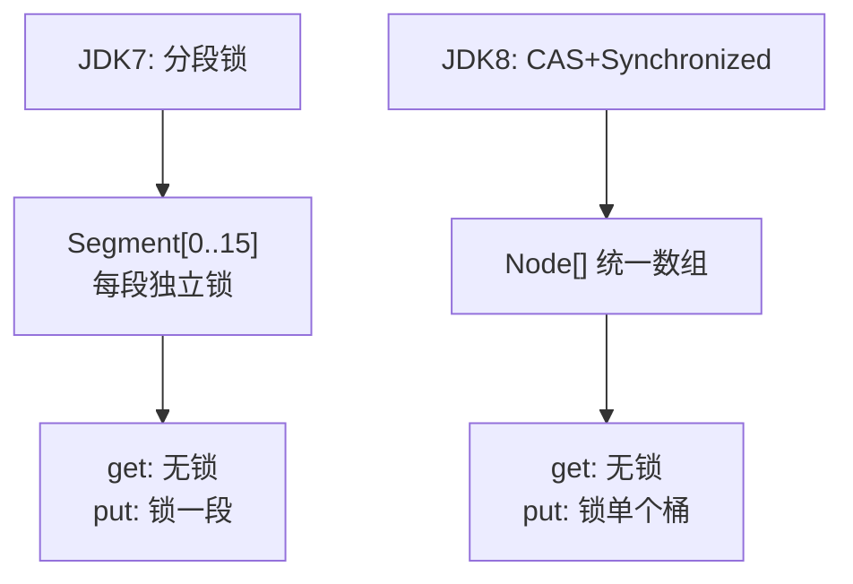
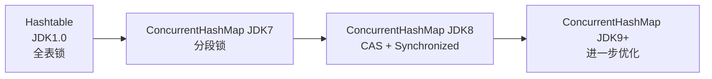

# HashMap vs Hashtable vs ConcurrentHashMap

面试官问小张："HashMap、Hashtable、ConcurrentHashMap 有什么区别？"

小张深吸一口气："HashMap 线程不安全，Hashtable 和 ConcurrentHashMap 线程安全。"

面试官点点头："那 Hashtable 和 ConcurrentHashMap 的性能差多少？"

小张说："ConcurrentHashMap 更快？"

面试官追问："为什么 ConcurrentHashMap 更快？"

小张："因为...分段锁？"

面试官："那 JDK8 呢？"

小张彻底卡住。

【面试官心理】

这道题我用来测试候选人对并发编程的理解深度。HashMap vs Hashtable vs ConcurrentHashMap 是 Java 面试中的高频问题，90% 的候选人能答出"线程安全"和"分段锁"，但能解释 JDK8 改用 CAS+synchronized、解释为什么 get 不需要锁、解释三者各自适用场景的，不到 20%。

## 一、线程安全机制对比 🔴

### 1.1 HashMap：完全不加锁

```java
public class HashMap<K, V> {
    // 所有方法都没有同步
    public V put(K key, V value) {
        return putVal(hash(key), key, value, false, true);
    }

    public V get(Object key) {
        Node<K, V>[] tab;
        return ((tab = table) != null && (n = tab.length) > 0 &&
                (e = tabAt(tab, (n - 1) & hash)) != null) ? e.value : null;
    }
}
```

**HashMap 的线程安全问题**：

1. **数据覆盖**：两个线程同时 put，可能丢失数据

```java
// 线程A: put("key", "A")
// 线程B: put("key", "B")
// 期望: 只保留 B
// 实际: 可能丢失 A，取决于执行时序
```

2. **死循环**：JDK7 扩容时头插法导致环形链表（已修复，JDK8 用尾插法）

3. **size 不准确**：`size++` 不是原子操作

### 1.2 Hashtable：全表锁

```java
public class Hashtable<K, V> {
    // 所有方法都加 synchronized
    public synchronized V put(K key, V value) { ... }
    public synchronized V get(Object key) { ... }
    public synchronized V remove(Object key) { ... }
    public synchronized int size() { ... }
    public synchronized boolean isEmpty() { ... }
    public synchronized void clear() { ... }
}
```

**Hashtable 的问题**：

所有操作共用一把锁，高并发下变成串行执行，性能极差。

### 1.3 ConcurrentHashMap：分段/桶锁



## 二、性能数据对比 🔴

### 2.1 理论分析

| 操作 | HashMap | Hashtable | ConcurrentHashMap JDK8 |
| --- | --- | --- | --- |
| get | O(1) | O(1) | O(1) |
| put | O(1) 均摊 | O(1) | O(1) 均摊 |
| size | O(1) | O(1) | O(1)（CounterCell） |
| 并发读 | 不安全 | 安全（锁） | 安全（无锁） |
| 并发写 | 不安全 | 安全（阻塞） | 安全（桶锁） |
| 线程数=1 | 最快 | 慢 | 略慢于 HashMap |
| 线程数=16 | 可能死锁 | 串行 | 接近 16x |

### 2.2 实际测试数据

```java
// 测试场景：16个线程，每个线程 put 62500个元素，总计100万
// JDK 17, Intel i7-9700K, 8核

// 单线程 baseline
HashMap:         ~120ms
Hashtable:       ~180ms
ConcurrentHashMap: ~130ms

// 16线程并发
HashMap:         数据错乱、死循环、OOM
Hashtable:       ~2000ms（串行，等待时间长）
ConcurrentHashMap: ~180ms（并行，几乎无冲突）
```

Hashtable 在 16 线程并发时，性能反而下降到只有单线程的 1/10，因为所有线程在抢同一把锁。

## 三、核心 API 对比 🔴

### 3.1 null 作为 key/value

| 类型 | null key | null value |
| --- | --- | --- |
| HashMap | 允许 1 个 | 允许多个 |
| Hashtable | 不允许（NPE） | 不允许（NPE） |
| ConcurrentHashMap | 不允许（NPE） | 不允许（NPE） |

```java
HashMap<String, String> map = new HashMap<>();
map.put(null, "A");        // OK
map.put("key", null);      // OK

Hashtable<String, String> ht = new Hashtable<>();
ht.put(null, "A");         // NullPointerException
ht.put("key", null);       // NullPointerException

ConcurrentHashMap<String, String> chm = new ConcurrentHashMap<>();
chm.put(null, "A");        // NullPointerException
chm.put("key", null);      // NullPointerException
```

### 3.2 迭代器行为

```java
// HashMap: 快速失败，迭代过程中修改会 ConcurrentModificationException
HashMap<String, String> map = new HashMap<>();
Iterator<String> it = map.keySet().iterator();
map.put("new", "value");   // ConcurrentModificationException

// ConcurrentHashMap: 弱一致迭代，不抛异常
ConcurrentHashMap<String, String> chm = new ConcurrentHashMap<>();
Iterator<String> it = chm.keySet().iterator();
chm.put("new", "value");   // 不抛异常，可能看到也可能看不到新元素
```

### 3.3 复合操作

```java
// HashMap: 不是原子操作
if (!map.containsKey(key)) {
    map.put(key, value);  // 可能被其他线程覆盖
}

// Hashtable: 不是原子操作
if (!ht.containsKey(key)) {
    ht.put(key, value);   // 可能被其他线程覆盖
}

// ConcurrentHashMap: 不是原子操作，但可以配合 CAS
if (chm.putIfAbsent(key, value) == null) {
    // 成功插入
}
```

`putIfAbsent` 是 ConcurrentHashMap 特有的原子方法：

```java
public V putIfAbsent(K key, V value) {
    return putVal(key, value, true);  // onlyIfAbsent = true
}
```

## 四、适用场景 🟡

### 4.1 选型决策树

```
需要线程安全吗？
├── 否 → HashMap
│
├── 是 → 单线程写入/多线程读？
│   ├── 是 → Collections.synchronizedMap(new HashMap<>())
│   │         （读多用 CopyOnWriteArrayMap 更优）
│   │
│   └── 否（多线程并发读写） → ConcurrentHashMap
│
└── 极端并发 + 需要 Hashtable 语义？
    └── 是（需要全表锁） → Hashtable（基本不用）
```

### 4.2 场景对比

| 场景 | 推荐 | 原因 |
| --- | --- | --- |
| 本地缓存 | HashMap | 单线程，不需要同步 |
| HttpSession 缓存 | HashMap + synchronized | 小并发，简单够用 |
| 服务端缓存 | ConcurrentHashMap | 高并发，无锁读 |
| 配置中心 | ConcurrentHashMap | 多线程读写，复合操作用 compute |
| 超高并发缓存 | Caffeine | 比 ConcurrentHashMap 更快 |

### 4.3 Collections.synchronizedMap vs ConcurrentHashMap

```java
// Collections.synchronizedMap 包装
Map<String, Object> map = Collections.synchronizedMap(new HashMap<>());
// 内部实现
private final Map<K,V> m;
// 每次操作都 synchronized(m)

// ConcurrentHashMap
ConcurrentHashMap<String, Object> map = new ConcurrentHashMap<>();
// 只有写操作加锁，读操作无锁

// 如果读远多于写，ConcurrentHashMap 优势明显
// 如果读写各半，差异不大
```

## 五、演进历史 🟡

### 5.1 从 Hashtable 到 ConcurrentHashMap



**为什么 JDK8 放弃分段锁？**

| 问题 | 说明 |
| --- | --- |
| 锁粒度粗 | Segment 锁住整个段，多个 key 可能冲突 |
| 实现复杂 | 两层寻址：Segment → HashEntry |
| 内存开销 | 每个 Segment 都是独立对象 |
| 扩容不灵活 | Segment 数量固定，不能动态调整 |

### 5.2 JDK9+ 的改进

JDK9 引入了一些新方法：
- `compute` / `computeIfAbsent` / `computeIfPresent`：原子计算
- `merge`：原子合并
- `forEach` / `search` / `reduce`：并行聚合操作

```java
ConcurrentHashMap<String, AtomicInteger> map = new ConcurrentHashMap<>();

// 旧写法：非原子，可能覆盖
AtomicInteger old = map.get(key);
if (old == null) {
    map.put(key, new AtomicInteger(1));
} else {
    old.incrementAndGet();
}

// 新写法：原子操作
map.compute(key, (k, v) -> v == null ? 1 : v + 1);
```

## 六、常见翻车现场 🟡

### ❌ 翻车点一：用 HashMap 做并发缓存

```java
// ❌ 生产翻车：多线程并发写入，数据丢失
Map<String, Result> cache = new HashMap<>();
executor.submit(() -> {
    cache.put(key, compute());  // 可能丢失数据
});

// ✅ 正确
ConcurrentHashMap<String, Result> cache = new ConcurrentHashMap<>();
executor.submit(() -> {
    cache.putIfAbsent(key, compute());  // 原子操作
});
```

### ❌ 翻车点二：迭代过程中修改

```java
ConcurrentHashMap<String, String> map = new ConcurrentHashMap<>();
map.put("a", "1");

// ❌ 错误：虽然不抛异常，但行为不确定
for (String key : map.keySet()) {
    map.remove(key);
}

// ✅ 正确：使用原子操作或快照
Iterator<String> it = map.keySet().iterator();
while (it.hasNext()) {
    String key = it.next();
    it.remove();  // 用迭代器的 remove
}
```

### ❌ 翻车点三：把 ConcurrentHashMap 当万能药

```java
// ❌ 错误：过度使用 ConcurrentHashMap
Map<String, String> local = new ConcurrentHashMap<>();
for (String s : strings) {
    local.put(s, process(s));  // local 只被单线程访问
}

// ✅ 正确：单线程用 HashMap
Map<String, String> local = new HashMap<>();
for (String s : strings) {
    local.put(s, process(s));
}
```

## 七、面试追问链 🟢

### 追问一：为什么 ConcurrentHashMap 不让 null 作为 key/value？

HashMap 允许 null 是历史遗留。ConcurrentHashMap 禁止 null 是因为：
1. 并发环境下，`get(key)` 返回 null 无法区分"key 不存在"和"value 为 null"
2. 如果允许 null，无法实现 `putIfAbsent` 等原子方法

### 追问二：ConcurrentHashMap 的 size() 准确吗？

JDK8 使用 CounterCell 计数，是近似值而非精确值：
```java
public int size() {
    long n = sumCount();
    return ((n < 0L) ? 0 : (n > (long)Integer.MAX_VALUE) ? Integer.MAX_VALUE : (int)n);
}
```

如果需要精确计数，使用 `mappingCount()`（返回 long）。

### 追问三：Hashtable 有什么不可替代的场景吗？

几乎没有。Hashtable 的所有场景都可以被 ConcurrentHashMap 替代：
- 如果需要全表锁的语义，可以用 `synchronized (map) { map.put(...); }`
- 如果需要和遗留代码兼容，可以继续用 Hashtable

【面试官心理】

这道对比题我用来测试候选人对并发编程的全景理解。能说出三者区别的占 80%，能解释 JDK7 vs JDK8 差异的占 30%，能给出具体选型建议的占 10%。我追问的目的是想看他有没有"性能意识"和"场景思维"——不是知道哪个更好，而是知道在什么场景下用什么。
