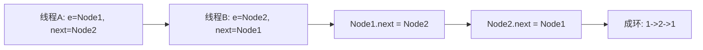
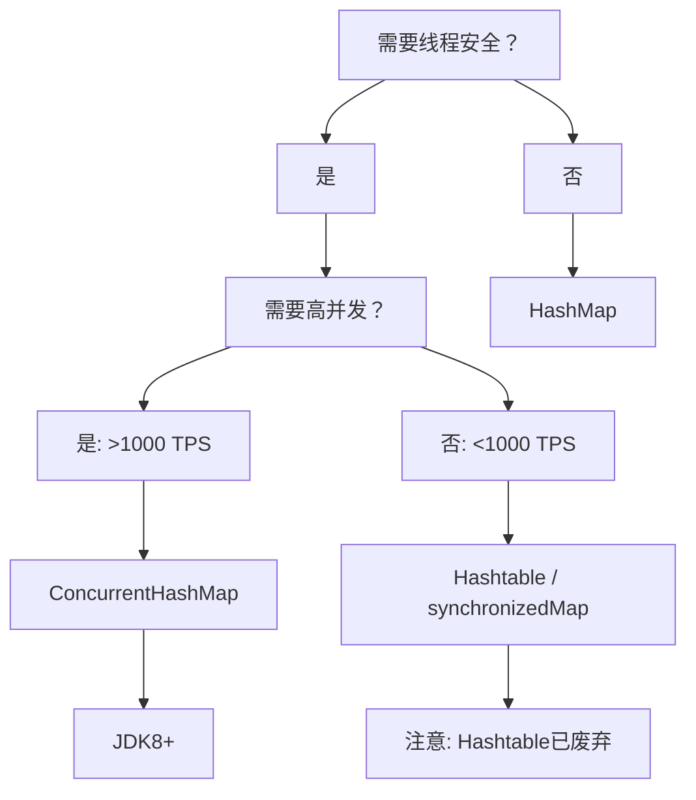

## 开场

候选人李明（三年经验）坐在阿里P6面试间，面试官刚问完"HashMap是线程安全的吗"，他脱口而出："不是，线程安全的应该用ConcurrentHashMap。"

面试官眉毛一挑："那Hashtable呢？"

李明愣了0.5秒："Hashtable...也是线程安全的吧？"

"那它俩有什么区别？"

"呃...ConcurrentHashMap性能更好？"

面试官没说话，默默在简历上画了个圈。后来李明复盘这场面试才明白，这道题他只拿到了60分——背了结论，但没理解为什么。

---

## 一、为什么 HashMap 不是线程安全的 🔴

### 1.1 问题拆解

先问自己一个问题：HashMap在什么情况下会出问题？

```java
// [!code warning]
public class HashMapUnsafe {
    private final Map<String, Integer> map = new HashMap<>();

    public void increment(String key) {
        Integer old = map.get(key);
        Integer newVal = old == null ? 1 : old + 1;
        map.put(key, newVal);
    }
}
```

这段代码在单线程下跑100次都没问题，但上了多线程环境，可能出现：

- **数据覆盖**：两个线程同时put，后面的覆盖前面的
- **链表成环**（JDK7）：扩容时rehash导致链表闭环，引发死循环
- **容量变负**：极端情况下size变成负数

### 1.2 ❌ 错误示范

**候选人原话**：
> "HashMap不是线程安全的，因为它的方法没用synchronized修饰。"

**问题诊断**：
- 只知道表面原因，不知道JDK8之后连synchronized都没用
- 混淆了"不加锁"和"不安全"的关系

### 1.3 标准回答

HashMap不是线程安全的原因有三层：

**第一层：并发修改**

```java
// HashMap put 简化流程
transient Node<K,V>[] table;

final V putVal(int hash, K key, V value, boolean onlyIfAbsent, boolean evict) {
    // ...
    if ((p = tab[i = (n - 1) & hash]) == null) {
        // [!code highlight]
        tab[i] = newNode(hash, key, value, null);  // 两个线程同时执行这里会出事
    }
    // ...
}
```

当两个线程同时检测到 `tab[i] == null`，都会创建新Node，其中一个会被覆盖。

**第二层：JDK7 扩容死循环**

```java
// JDK7 HashMap 扩容时的 transfer 方法
void transfer(Entry[] newTable, boolean rehash) {
    Entry[] src = this.table;
    int newCapacity = newTable.length;
    for (int j = 0; j < src.length; j++) {
        Entry<K,V> e = src[j];
        if (e != null) {
            src[j] = null;
            do {
                Entry<K,V> next = e.next;
                int i = indexFor(e.hash, newCapacity);
                // [!code highlight]
                e.next = newTable[i];  // 头插法：1->2 变成 2->1
                newTable[i] = e;
                e = next;
            } while (e != null);
        }
    }
}
```

头插法 + 并发 = 链表反转。如果线程A和线程B同时扩容，可能出现：



**第三层：JDK8 的优化**

JDK8虽然把头插法改成了尾插法，避免了成环问题，但并发put的数据覆盖仍然存在：

> [!warning]
> JDK8只是解决了扩容死循环，但put/get的并发数据不一致问题依然存在。

【面试官心理】

面试官问"HashMap线程安全吗"，他真正想知道的是：
1. 你知不知道JDK7有扩容死循环这个问题？
2. 你有没有在项目里踩过这个坑？
3. 你选型的时候是基于原理还是只背了结论？

---

## 二、Hashtable 为什么被淘汰 🟡

### 2.1 问题拆解

Hashtable的源码几乎每行都加锁，为什么反而被弃用了？

### 2.2 ❌ 错误示范

**候选人原话**：
> "Hashtable是线程安全的，因为它每个方法都加了synchronized，比HashMap慢。"

**问题诊断**：
- 只知道"有锁=慢"，不知道锁的粒度问题
- 没理解为什么需要分段锁

### 2.3 标准回答

**第一层：全局锁的代价**

```java
// Hashtable put 方法
public synchronized V put(K key, V value) {
    // ...
}
```

所有操作都要获取同一个锁，相当于把所有请求串行化：

| 线程数 | TPS对比 |
|--------|---------|
| 1 | 100% |
| 2 | 50% |
| 10 | 10% |

**第二层：JDK源码对比**

```java
// Hashtable - 整表锁
public synchronized V put(K key, V value) {
    if (value == null) throw new NullPointerException();
    Entry<?,?> tab[] = table;
    int hash = key.hashCode();
    int index = (hash & 0x7FFFFFFF) % tab.length;
    // ... 操作整个table
}

// ConcurrentHashMap JDK8 - CAS + synchronized
private final Node<K,V>[] table;
private volatile int sizeCtl;

final V putVal(K key, V value, boolean onlyIfAbsent) {
    if (key == null || value == null) throw new NullPointerException();
    int hash = spread(key.hashCode());
    int binCount = 0;
    for (Node<K,V>[] tab = table;;) {
        Node<K,V> f;
        int n = tab.length;
        int i = tabidx = (n - 1) & hash;
        // [!code highlight]
        if ((f = tabAt(tab, i)) == null) {
            // CAS 保证只有一个线程能成功
            if (casTabAt(tab, i, null, new Node<K,V>(hash, key, value, null)))
                break;
        }
        // ...
    }
}
```

**第三层：锁粒度决定性能**

| 实现 | 锁粒度 | 并发度 | 适用场景 |
|------|--------|--------|----------|
| Hashtable | 表级 | 1 | 不推荐 |
| Collections.synchronizedMap() | 表级 | 1 | 不推荐 |
| ConcurrentHashMap | 桶级 | N | 高并发首选 |

【面试官心理】

问到Hashtable时，面试官想知道：
1. 你有没有看过JDK源码（虽然不重要，但要知道自己不知道什么）
2. 你能不能说清楚锁粒度这个核心概念
3. 你是怎么理解"线程安全≠加锁"的

---

## 三、ConcurrentHashMap 为什么是首选 🔴

### 3.1 问题拆解

ConcurrentHashMap从JDK7到JDK8经历了什么变化？它怎么做到高性能的？

### 3.2 错误回答示范区

**候选人原话**：
> "JDK7用Segment分段锁，JDK8改成了CAS+synchronized，所以性能更好。"

**问题诊断**：
- 背了结论，但不知道Segment为什么被废弃
- 不理解CAS和synchronized各自的适用场景

### 3.3 标准回答

**JDK7的分段锁**

```java
// JDK7 ConcurrentHashMap
public class ConcurrentHashMap<K, V> {
    final Segment<K,V>[] segments;

    static final class Segment<K,V> extends ReentrantLock {
        transient volatile HashEntry<K,V>[] table;
    }
}
```

每个Segment管理一部分桶，锁住一个Segment时，其他Segment仍可操作：

```
Segment0 [bucket0-bucket7]  🔒
Segment1 [bucket8-bucket15]  ✓ 可并发
Segment2 [bucket16-bucket23] ✓ 可并发
```

**JDK8为什么要废除Segment？**

| 问题 | 原因 |
|------|------|
| 内存开销大 | 每个Segment都是独立对象，16个桶需要16个Segment |
| 并发度固定 | 创建后无法调整，热门桶仍是瓶颈 |
| 实现复杂 | 两层Map，代码维护成本高 |

**JDK8的CAS + synchronized**

```java
// JDK8 ConcurrentHashMap put 流程详解
final V putVal(K key, V value, boolean onlyIfAbsent) {
    if (key == null || value == null) throw new NullPointerException();

    // 1. 计算hash
    int hash = spread(key.hashCode());

    // 2. 自旋插入
    for (Node<K,V>[] tab = table;;) {
        Node<K,V> f;
        int n = tab.length;
        int i = tabidx = (n - 1) & hash;
        int fh;

        // 3. 首次插入：CAS
        if ((f = tabAt(tab, i)) == null) {
            if (casTabAt(tab, i, null,
                new Node<K,V>(hash, key, value, null)))
                break;
        }
        // 4. 扩容协助
        else if ((fh = f.hash) == MOVED)
            tab = helpTransfer(tab, f);
        // 5. 链表/红黑树冲突：synchronized
        else {
            V oldVal = null;
            synchronized (f) {
                if (tabAt(tab, i) == f) {
                    if (fh >= 0) {
                        // 链表插入
                        binCount = 1;
                        for (Node<K,V> e = f;; ++binCount) {
                            if (e.hash == hash &&
                                ((ek = e.key) == key ||
                                 (ek != null && key.equals(ek)))) {
                                oldVal = e.val;
                                if (!onlyIfAbsent)
                                    e.val = value;
                                break;
                            }
                            Node<K,V> pred = e;
                            if ((e = e.next) == null) {
                                pred.next = new Node<K,V>(hash, key, value, null);
                                break;
                            }
                        }
                    }
                    else if (f instanceof TreeBin) {
                        // 红黑树插入
                        Node<K,V> p;
                        binCount = 2;
                        if ((p = ((TreeBin<K,V>)f).putTreeVal(
                                hash, key, value)) != null) {
                            oldVal = p.val;
                            if (!onlyIfAbsent)
                                p.val = value;
                        }
                    }
                }
            }
            // 6. 链表树化检查
            if (binCount != 0) {
                if (binCount >= TREEIFY_THRESHOLD)
                    treeifyBin(tab, i);
                if (oldVal != null)
                    break;
            }
        }
    }
    // 7. 更新计数
    addCount(1L, binCount);
    return oldVal;
}
```

【面试官心理】

这道题的追问链很清晰：
1. JDK7和JDK8的区别（基本题）
2. CAS和synchronized各自在什么场景用（进阶题）
3. 为什么JDK8选了这个组合（深水区）

---

## 四、三者全面对比 🟡

| 特性 | HashMap | Hashtable | ConcurrentHashMap |
|------|---------|------------|-------------------|
| 线程安全 | ❌ | ✅ | ✅ |
| 锁粒度 | 无 | 表级 | 桶级 |
| 并发度 | 1 | 1 | N |
| null key | ✅ | ❌ | ❌ |
| null value | ✅ | ❌ | ❌ |
| 初始容量 | 16 | 11 | 16 |
| 扩容因子 | 0.75 | 0.75 | 0.75 |
| 迭代器 | 快速失败 | 快速失败 | 弱一致 |
| JDK版本 | 始终在用 | 建议淘汰 | JDK5引入 |

---

## 五、工程选型

### 5.1 生产避坑

> [!warning]
> 曾经在双十一零点，我们用 `Collections.synchronizedMap(new HashMap<>())` 做库存缓存，结果因为串行化导致TPS只有预期的1/10，库存扣减超时引发大量超卖。

**排查路径**：
1. `jstack` 看线程状态，发现大量BLOCKED
2. `arthas` 监控热点方法，发现put/get被串行化
3. 换成ConcurrentHashMap，TPS提升8倍

### 5.2 选型决策树



> [!tip]
> **P7加分项**：如果被追问，可以补充讲讲JDK8的LongAdder如何替代高并发计数场景。

---

## 六、级别差异

| 级别 | 期望回答 |
|------|----------|
| P5 | HashMap不安全，Hashtable/ConcurrentHashMap安全，后者性能更好 |
| P6 | 能讲清JDK7/JDK8的区别，CAS和synchronized的分工，知道扩容机制 |
| P7 | 能结合生产案例讲选型，理解弱一致性迭代器的含义，能对比其他并发Map |

---

## 【面试官手记】

最近面了一个P6候选人，聊到ConcurrentHashMap时，他只背了"JDK8用了CAS+synchronized"。

我追问："JDK8为什么不用ReentrantLock而是用synchronized？"

他想了两秒："呃...synchronized更快？"

我再问："为什么更快？"

他卡住了。

这个追问的意图不是考倒他，而是看他在项目中有没有真的对比过两者的性能差异。如果做过性能测试，一定能说出偏向锁/轻量级锁的优化。

**真实生产场景**：

有一年我们做库存系统改造，原来用synchronized锁整个方法，QPS只能到800。换成分段锁 + ConcurrentHashMap后，QPS稳定在5000+。这个案例比背十遍"分段锁"都有说服力。
