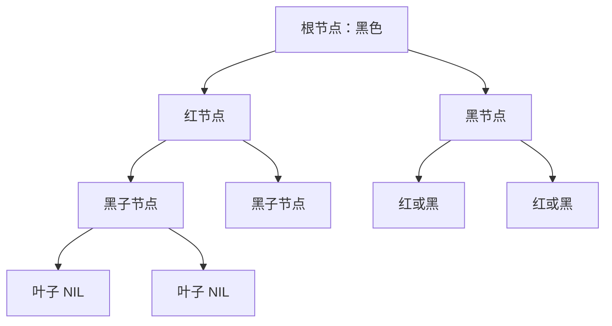
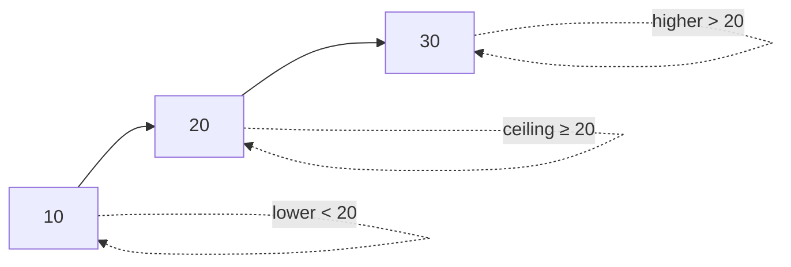

# TreeMap 与红黑树

面试官问："TreeMap 底层是什么数据结构？"

候选人小李答："红黑树。"

面试官追问："红黑树有哪些特性？为什么需要这些特性？"

小李说："...平衡二叉树？"

面试官继续追问："那 TreeMap 的 `floor()` 和 `ceiling()` 方法有什么用？"

小张彻底答不上来了。

【面试官心理】
TreeMap 是 Java 集合框架中比较"冷门"的成员，但它的有序性是 HashMap 无法替代的。能说清楚红黑树特性、TreeMap 导航方法的候选人，说明有一定的算法和数据结构基础。

## 一、红黑树基础 🔴

### 1.1 什么是红黑树

红黑树是一种**自平衡的二叉搜索树**，它通过颜色和旋转操作来保持平衡：

```java
// 红黑树节点
static final class Entry<K,V> implements Map.Entry<K,V> {
    K key;
    V value;
    Entry<K,V> left;
    Entry<K,V> right;
    Entry<K,V> parent;
    boolean color = RED;  // 默认红色
}
```

### 1.2 红黑树的 5 个特性

```
1. 每个节点要么是红色，要么是黑色
2. 根节点是黑色
3. 每个叶子节点（NIL）是黑色
4. 红节点的子节点必须是黑色（不能有连续的红节点）
5. 从任意节点到其每个叶子节点的路径上，黑节点数量相同
```



### 1.3 为什么需要红黑树

**普通二叉搜索树的问题**：

```java
// 如果插入的数据是有序的
TreeSet<Integer> set = new TreeSet<>();
for (int i = 1; i <= 1000; i++) {
    set.add(i);
}
// 退化成链表，查找 O(n)
```

**红黑树的解决方案**：

```java
// 红黑树通过旋转和变色保持平衡
// 查找、插入、删除：O(log n)
// 无论数据是否有序，都保持平衡
```

【直观类比】
红黑树就像一个会自动调整高度的跷跷板：
- 插入数据时，如果某一边太重（不平衡），会自动调整
- 调整后仍然保持平衡，保证左右高度差不大
- 这样无论查找还是插入，都能保证 O(log n) 的性能

## 二、TreeMap 核心原理 🔴

### 2.1 TreeMap 的结构

```java
public class TreeMap<K,V>
    extends AbstractMap<K,V>
    implements NavigableMap<K,V>, Cloneable, java.io.Serializable {

    // 红黑树的根节点
    private transient Entry<K,V> root;

    // 比较器：null 表示使用 key 的自然顺序
    private final Comparator<? super K> comparator;

    // 元素个数
    private transient int size = 0;

    // 修改计数（fail-fast）
    private transient int modCount = 0;
}
```

### 2.2 节点的定义

```java
static final class Entry<K,V> implements Map.Entry<K,V> {
    K key;
    V value;
    Entry<K,V> left = null;
    Entry<K,V> right = null;
    Entry<K,V> parent;
    boolean color = BLACK;  // 默认黑色

    Entry(K key, V value, Entry<K,V> parent) {
        this.key = key;
        this.value = value;
        this.parent = parent;
    }
}
```

### 2.3 put 方法

```java
public V put(K key, V value) {
    Entry<K,V> t = root;
    if (t == null) {
        // 第一个节点，作为根
        root = new Entry<>(key, value, null);
        size = 1;
        modCount++;
        return null;
    }

    // 比较 key，找到插入位置
    Comparator<? super K> cpr = comparator;
    if (cpr != null) {
        do {
            parent = t;
            int cmp = cpr.compare(key, t.key);
            if (cmp < 0)
                t = t.left;
            else if (cmp > 0)
                t = t.right;
            else
                return t.setValue(value);  // key 相同，更新 value
        } while (t != null);
    } else {
        // 使用自然顺序（key 必须实现 Comparable）
        if (key == null)
            throw new NullPointerException();
        Comparable<? super K> k = (Comparable<? super K>) key;
        do {
            parent = t;
            int cmp = k.compareTo(t.key);
            if (cmp < 0)
                t = t.left;
            else if (cmp > 0)
                t = t.right;
            else
                return t.setValue(value);
        } while (t != null);
    }

    // 创建新节点
    Entry<K,V> e = new Entry<>(key, value, parent);
    if (cmp < 0)
        parent.left = e;
    else
        parent.right = e;

    // 调整红黑树平衡
    fixAfterInsertion(e);
    size++;
    modCount++;
    return null;
}
```

### 2.4 ❌ 错误示范

**候选人原话**："TreeMap 和 HashMap 一样，都是 Map，实现也差不多。"

**问题诊断**：
- 完全不理解两者的根本区别
- HashMap 是哈希表，TreeMap 是红黑树
- HashMap 无序，TreeMap 有序

**面试官内心 OS**："这个候选人可能只是背过概念，没有真正理解数据结构的差异。"

【面试官心理】
TreeMap 和 HashMap 的核心区别是"有序 vs 无序"。能说清楚这个区别的候选人，说明理解了这两种数据结构的本质差异。

## 三、自然排序与自定义排序 🟡

### 3.1 自然排序

```java
// key 实现 Comparable 接口
TreeMap<Integer, String> map = new TreeMap<>();
map.put(3, "c");
map.put(1, "a");
map.put(2, "b");

// 遍历：按 key 的自然顺序
// 1 -> a, 2 -> b, 3 -> c
```

```java
// String 的自然顺序：字典序
TreeMap<String, Integer> map = new TreeMap<>();
map.put("banana", 2);
map.put("apple", 1);
map.put("cherry", 3);

// 遍历：apple, banana, cherry
```

### 3.2 自定义排序

```java
// 使用 Comparator
TreeMap<String, Integer> map = new TreeMap<>(Comparator.reverseOrder());
map.put("banana", 2);
map.put("apple", 1);
map.put("cherry", 3);

// 遍历：cherry, banana, apple（逆序）
```

### 3.3 自定义对象作为 key

```java
public class User implements Comparable<User> {
    private String name;
    private int age;

    @Override
    public int compareTo(User o) {
        // 按 name 排序
        return this.name.compareTo(o.name);
    }
}

TreeMap<User, Integer> map = new TreeMap<>();
map.put(new User("Alice", 25), 1);
map.put(new User("Bob", 30), 2);

// 按 User 的 compareTo 排序
```

```java
// 或者使用 Comparator
TreeMap<User, Integer> map = new TreeMap<>((u1, u2) -> {
    if (u1.getAge() != u2.getAge())
        return u1.getAge() - u2.getAge();  // 按 age 排序
    return u1.getName().compareTo(u2.getName());  // age 相同按 name
});
```

## 四、导航方法 🟡

### 4.1 导航方法一览

```java
TreeMap<Integer, String> map = new TreeMap<>();
map.put(10, "ten");
map.put(20, "twenty");
map.put(30, "thirty");

// 导航方法
map.lowerKey(20);    // < 20 的最大 key → 10
map.floorKey(20);    // <= 20 的最大 key → 20
map.ceilingKey(20);  // >= 20 的最小 key → 20
map.higherKey(20);   // > 20 的最小 key → 30

map.firstKey();      // 最小的 key → 10
map.lastKey();       // 最大的 key → 30
```

### 4.2 导航方法图示



### 4.3 典型使用场景

**场景 1：排行榜**

```java
// 用户分数排行榜
TreeMap<Integer, String> leaderboard = new TreeMap<>(Comparator.reverseOrder());
leaderboard.put(1000, "Alice");
leaderboard.put(900, "Bob");
leaderboard.put(1100, "Charlie");

// 获取第一名
String champion = leaderboard.firstEntry().getValue(); // Charlie

// 获取第二名
Map.Entry<Integer, String> second = leaderboard.higherEntry(
    leaderboard.firstKey());
```

**场景 2：会议室预订系统**

```java
// 会议室预订（时间段不重叠）
TreeMap<Integer, Integer> bookings = new TreeMap<>();
// key = 开始时间，value = 结束时间

public boolean book(int start, int end) {
    // 找到 end 之前最近的预订
    Map.Entry<Integer, Integer> prev = bookings.floorEntry(start);
    if (prev != null && prev.getValue() > start) {
        return false; // 时间冲突
    }
    bookings.put(start, end);
    return true;
}
```

**场景 3：缓存过期处理**

```java
// 按过期时间排序的缓存
TreeMap<Long, CacheEntry> cache = new TreeMap<>();

public void cleanExpired() {
    long now = System.currentTimeMillis();
    // 删除所有已过期的条目
    Map<Long, CacheEntry> expired = cache.headMap(now);
    for (Map.Entry<Long, CacheEntry> entry : expired.entrySet()) {
        cache.remove(entry.getKey());
    }
}
```

:::tip 💡
TreeMap 的导航方法是面试加分项。能说清楚 `floor/ceiling/lower/higher` 的区别和用法的候选人，说明对 TreeMap 有实战经验。
:::

## 五、子 Map 视图 🟡

### 5.1 subMap 方法

```java
TreeMap<Integer, String> map = new TreeMap<>();
map.put(1, "a");
map.put(2, "b");
map.put(3, "c");
map.put(4, "d");
map.put(5, "e");

// 闭区间：[2, 4]
Map<Integer, String> sub = map.subMap(2, 5); // 2, 3, 4

// 左开右闭：(2, 4]
Map<Integer, String> sub2 = map.subMap(2, false, 4, true);
```

### 5.2 headMap 和 tailMap

```java
// < 3
Map<Integer, String> head = map.headMap(3); // 1, 2

// >= 3
Map<Integer, String> tail = map.tailMap(3); // 3, 4, 5
```

### 5.3 视图与操作

```java
TreeMap<Integer, String> map = new TreeMap<>();
map.put(1, "a");
map.put(2, "b");
map.put(3, "c");

// subMap 视图操作会影响原 map
Map<Integer, String> sub = map.subMap(1, 3);
sub.remove(2);  // 从原 map 删除 key=2

// 反过来也可以
map.remove(1);  // 从原 map 删除，影响 subMap
```

:::warning ⚠️
TreeMap 的 subMap/headMap/tailMap 返回的是**视图**而非副本。对视图的操作会影响原 Map，删除操作是连锁的。
:::

## 六、性能对比 🟡

### 6.1 TreeMap vs HashMap

| 维度 | TreeMap | HashMap |
| --- | --- | --- |
| 底层结构 | 红黑树 | 哈希表 |
| 时间复杂度 | O(log n) | O(1) 均摊 |
| 空间复杂度 | O(n) | O(n) |
| 是否有序 | 是 | 否 |
| 查找范围 | 支持（导航方法） | 不支持 |
| null key | 不支持 | 支持一个 null key |
| 线程安全 | 否 | 否 |

### 6.2 何时用 TreeMap

```java
// 需要有序遍历
TreeMap<Integer, String> sorted = new TreeMap<>();
sorted.put(3, "c");
sorted.put(1, "a");
sorted.put(2, "b");
// 遍历：1 -> a, 2 -> b, 3 -> c

// 需要范围查找
String result = map.floorKey(target); // <= target 的最大 key

// 需要自定义排序规则
TreeMap<User, Integer> users = new TreeMap<>(userComparator);

// 需要导航方法（first/last/floor/ceiling）
```

### 6.3 何时用 HashMap

```java
// 只需要基本的 key-value 存储
HashMap<Integer, String> basic = new HashMap<>();

// 不需要有序遍历
// 不需要范围查找
// 不需要导航方法
// 需要 O(1) 的查找性能
```

## 七、线程安全 🟢

### 7.1 TreeMap 不是线程安全的

```java
// ❌ 多线程并发使用 TreeMap 会出问题
TreeMap<Integer, String> map = new TreeMap<>();
// 线程 A 和线程 B 同时 put，可能导致数据结构损坏
```

### 7.2 线程安全方案

```java
// 方案 1：Collections.synchronizedSortedMap
Map<Integer, String> safe = Collections.synchronizedSortedMap(new TreeMap<>());

// 方案 2：ConcurrentSkipListMap
// SkipList 实现，有序且线程安全
ConcurrentNavigableMap<Integer, String> concurrent = new ConcurrentSkipListMap<>();
```

:::tip 💡
如果需要有序且线程安全的 Map，用 `ConcurrentSkipListMap`。它的性能比 `Collections.synchronizedSortedMap` 好。
:::

## 八、面试高频追问 🟡

### 8.1 第一层追问

**面试官**："红黑树的特性是什么？"

**候选人**：...

**正确回答**：
1. 每个节点非红即黑
2. 根节点是黑色
3. 叶子节点是黑色
4. 红节点的子节点必须是黑色（不能有连续红节点）
5. 从任一节点到其每个叶子节点的路径上，黑节点数量相同

### 8.2 第二层追问

**面试官**："红黑树的查找、插入、删除时间复杂度是多少？"

**候选人**：...

**正确回答**：都是 **O(log n)**。因为红黑树是自平衡的二叉搜索树。

### 8.3 第三层追问

**面试官**："TreeMap 和 HashMap 的区别是什么？"

**候选人**：...

**正确回答**：
- HashMap：哈希表，O(1) 查找，无序
- TreeMap：红黑树，O(log n) 查找，有序，支持导航方法

### 8.4 第四层追问

**面试官**："TreeMap 的 `floorKey()` 和 `lowerKey()` 有什么区别？"

**候选人**：...

**正确回答**：
- `lowerKey(k)`：严格小于 k 的最大 key
- `floorKey(k)`：小于等于 k 的最大 key
- `higherKey(k)`：严格大于 k 的最小 key
- `ceilingKey(k)`：大于等于 k 的最小 key

## 九、生产避坑清单 🟡

### 9.1 ❌ 常见错误

```java
// ❌ 错误 1：TreeMap 的 key 不能为 null（如果使用自然顺序）
TreeMap<String, Integer> map = new TreeMap<>();
map.put(null, 1); // NullPointerException！

// ✅ 正确：如果使用 Comparator，可以为 null
TreeMap<String, Integer> map = new TreeMap<>(Comparator.nullsFirst());
map.put(null, 1); // OK

// ❌ 错误 2：HashMap 可以，TreeMap 不行
// HashMap: 只需要 hashCode() 和 equals()
// TreeMap: 需要 Comparable 或 Comparator
```

### 9.2 性能陷阱

```java
// ❌ 错误的比较器导致性能问题
TreeMap<MyKey, Value> map = new TreeMap<>((k1, k2) -> {
    // 错误的比较器：每次比较都创建新对象
    return k1.getName().compareTo(k2.getName());
});

// ✅ 正确的比较器
Comparator<MyKey> cmp = Comparator.comparing(MyKey::getName);
TreeMap<MyKey, Value> map = new TreeMap<>(cmp);
```

【学习小结】
TreeMap 核心要点：
- 底层是红黑树，查找/插入/删除都是 O(log n)
- 按 key 有序排列
- 支持自然排序和自定义排序
- 导航方法：floor/ceiling/lower/higher
- subMap/headMap/tailMap 返回视图
- 线程不安全，需要线程安全时用 ConcurrentSkipListMap
