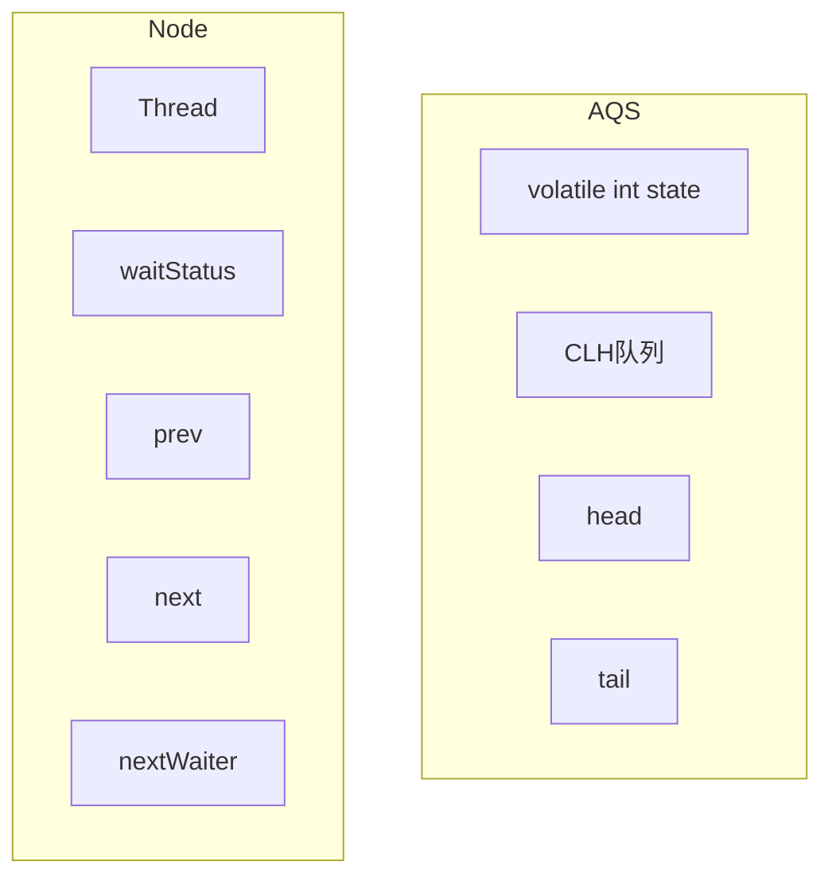
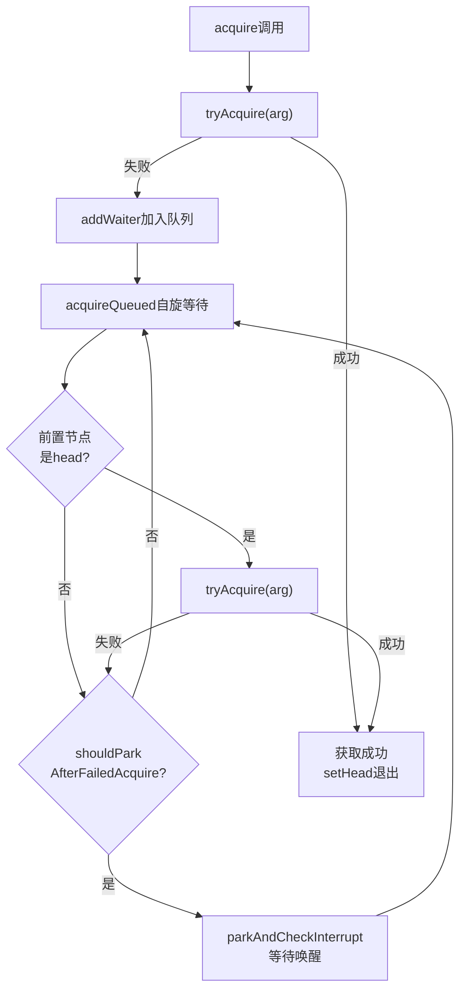
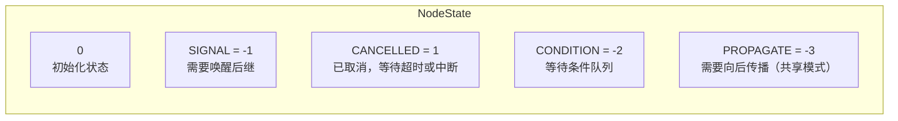

# AQS抽象队列同步器原理

## 面试中的高频追问

面试官问："AQS是什么？"

候选人小张回答："AbstractQueuedSynchronizer，抽象队列同步器。"

面试官追问："ReentrantLock、Semaphore、CountDownLatch都基于它，它们有什么区别？"

小张说："呃...都是用来做同步的？"

面试官继续追问："那AQS的state变量在ReentrantLock和Semaphore里分别表示什么？"

小张彻底卡住了。

AQS是Java并发包的基石。理解AQS，你就能理解ReentrantLock、Semaphore、CountDownLatch、ReadWriteLock甚至CyclicBarrier的底层实现。

今天这篇文章，把AQS讲透。

## AQS是什么

### 定义

AbstractQueuedSynchronizer（JSR 166）是Java并发包的核心抽象类：

```java
public abstract class AbstractQueuedSynchronizer
    extends AbstractOwnableSynchronizer 
    implements java.io.Serializable {
    
    // 同步状态
    private volatile int state;
    
    // CLH队列的头尾节点
    private transient volatile Node head;
    private transient volatile Node tail;
}
```

### 核心组件



**AQS的核心思想**：
- **state**：表示资源数量或锁状态
- **CLH队列**：管理等待获取资源的线程

### 两种模式

| 模式 | 说明 | 代表实现 |
|------|------|----------|
| **独占模式（Exclusive）** | 一次只有一个线程能获取资源 | ReentrantLock |
| **共享模式（Shared）** | 多个线程可以同时获取资源 | Semaphore, CountDownLatch |

## CLH队列

### 队列结构

CLH（Craig, Landin, Hagersten）队列是单向链表：

```java
static final class Node {
    // 等待状态
    volatile int waitStatus;
    
    // 节点类型：独占/共享
    static final Node SHARED = new Node();
    static final Node EXCLUSIVE = null;
    
    // 前驱和后继节点
    volatile Node prev;
    volatile Node next;
    
    // 节点关联的线程
    volatile Thread thread;
    
    // 条件队列链接（独占模式使用）
    Node nextWaiter;
}
```

### 入队过程

```java
// 添加到等待队列
private Node addWaiter(Node mode) {
    Node node = new Node(Thread.currentThread(), mode);
    Node pred = tail;
    
    // 快速入队：尝试一次CAS
    if (pred != null) {
        node.prev = pred;
        if (compareAndSetTail(pred, node)) {
            pred.next = node;
            return node;
        }
    }
    
    // 慢速入队：自旋直到成功
    enq(node);
    return node;
}

private Node enq(Node node) {
    while (true) {
        Node t = tail;
        if (t == null) {
            // 初始化：创建哨兵节点
            if (compareAndSetHead(new Node())) {
                tail = head;
            }
        } else {
            // 链接到队尾
            node.prev = t;
            if (compareAndSetTail(t, node)) {
                t.next = node;
                return t;
            }
        }
    }
}
```

### 出队过程

```java
// 获取资源
final boolean acquireQueued(Node node, int arg) {
    boolean failed = true;
    try {
        boolean interrupted = false;
        for (;;) {
            Node p = node.predecessor();
            
            // 如果是队首，尝试获取资源
            if (p == head && tryAcquire(arg)) {
                setHead(node);
                p.next = null;  // 帮助GC
                failed = false;
                return interrupted;
            }
            
            // 检查是否需要阻塞
            if (shouldParkAfterFailedAcquire(p, node) &&
                parkAndCheckInterrupt()) {
                interrupted = true;
            }
        }
    } finally {
        if (failed) {
            cancelAcquire(node);
        }
    }
}
```

## acquire模板

### 独占模式acquire

```java
public final void acquire(int arg) {
    // 1. 尝试获取资源
    if (!tryAcquire(arg)) {
        // 2. 获取失败，加入等待队列
        Node node = addWaiter(Node.EXCLUSIVE);
        // 3. 在队列中等待
        if (acquireQueued(node, arg)) {
            // 4. 如果被中断，自我中断
            selfInterrupt();
        }
    }
}
```

**流程图**：



### 共享模式acquire

```java
public final void acquireShared(int arg) {
    // 1. 尝试获取资源（可共享）
    if (tryAcquireShared(arg) < 0) {
        // 2. 获取失败，加入等待队列
        doAcquireShared(arg);
    }
}

private void doAcquireShared(int arg) {
    Node node = addWaiter(Node.SHARED);
    boolean failed = true;
    try {
        boolean interrupted = false;
        for (;;) {
            Node p = node.predecessor();
            if (p == head) {
                // 尝试获取资源
                int r = tryAcquireShared(arg);
                if (r >= 0) {
                    setHeadAndPropagate(node, r);
                    p.next = null;  // 帮助GC
                    failed = false;
                    if (interrupted) {
                        selfInterrupt();
                    }
                    return;
                }
            }
            if (shouldParkAfterFailedAcquire(p, node) &&
                parkAndCheckInterrupt()) {
                interrupted = true;
            }
        }
    } finally {
        if (failed) {
            cancelAcquire(node);
        }
    }
}
```

## release模板

### 独占模式release

```java
public final boolean release(int arg) {
    // 1. 尝试释放资源
    if (tryRelease(arg)) {
        Node h = head;
        // 2. 唤醒后继节点
        if (h != null && h.waitStatus != 0) {
            unparkSuccessor(h);
        }
        return true;
    }
    return false;
}

private void unparkSuccessor(Node head) {
    Node s;
    // 找到最需要被唤醒的后继节点
    if ((s = head.next) != null && s.waitStatus <= 0) {
        unpark(s.thread);
    } else {
        // 从尾向前找最近的需要唤醒的节点
        Node t = tail;
        while (t != null && t != head) {
            if (t.waitStatus <= 0) {
                s = t;
            }
            t = t.prev;
        }
        if (s != null) {
            unpark(s.thread);
        }
    }
}
```

### 共享模式release

```java
public final boolean releaseShared(int arg) {
    // 1. 尝试释放资源
    if (tryReleaseShared(arg)) {
        // 2. 唤醒所有等待的节点
        doReleaseShared();
        return true;
    }
    return false;
}

private void doReleaseShared() {
    for (;;) {
        Node h = head;
        if (h != null && h != tail) {
            int ws = h.waitStatus;
            if (ws == Node.SIGNAL) {
                // 唤醒后继节点
                if (compareAndSetWaitStatus(h, Node.SIGNAL, 0)) {
                    unpark(h.next);
                }
            } else if (ws == 0 &&
                       !compareAndSetWaitStatus(h, 0, Node.PROPAGATE)) {
                // 重置状态，确保传播
            }
        }
        if (h == head) {
            break;
        }
    }
}
```

## state的语义

### ReentrantLock中的state

```java
// state = 持有锁的次数
// 0：锁未被持有
// 1：锁被一个线程持有
// >1：锁被同一个线程重入

public class ReentrantLock {
    private final Sync sync;
    
    abstract static class Sync extends AbstractQueuedSynchronizer {
        // 非公平获取
        final boolean nonfairTryAcquire(int acquires) {
            Thread current = Thread.currentThread();
            int c = getState();
            if (c == 0) {
                if (compareAndSetState(0, acquires)) {
                    setExclusiveOwnerThread(current);
                    return true;
                }
            } else if (current == getExclusiveOwnerThread()) {
                // 可重入：增加计数
                int cnext = c + acquires;
                setState(cnext);
                return true;
            }
            return false;
        }
        
        protected final boolean tryRelease(int releases) {
            int c = getState() - releases;
            if (Thread.currentThread() != getExclusiveOwnerThread())
                throw new IllegalMonitorStateException();
            boolean free = (c == 0);
            if (free) {
                setExclusiveOwnerThread(null);
            }
            setState(c);
            return free;
        }
    }
}
```

### Semaphore中的state

```java
// state = 可用许可证数量
// >0：还有许可证，线程可以获取
// =0：没有许可证，线程需要等待

public class Semaphore {
    private final Sync sync;
    
    abstract static class Sync extends AbstractQueuedSynchronizer {
        Semaphore(int permits) {
            setState(permits);
        }
        
        // 共享获取
        final int tryAcquireShared(int reduces) {
            for (;;) {
                int available = getState();
                int remaining = available - reduces;
                if (remaining < 0 || 
                    compareAndSetState(available, remaining)) {
                    return remaining;
                }
            }
        }
        
        // 共享释放
        protected final boolean tryReleaseShared(int releases) {
            for (;;) {
                int c = getState();
                int nextc = c + releases;
                if (nextc < c) {  // overflow
                    throw new Error("Maximum permit count exceeded");
                }
                if (compareAndSetState(c, nextc)) {
                    return true;
                }
            }
        }
    }
}
```

### CountDownLatch中的state

```java
// state = 计数器的值
// >0：线程需要等待
// =0：所有等待线程被唤醒

public class CountDownLatch {
    private final Sync sync;
    
    private static final class Sync extends AbstractQueuedSynchronizer {
        CountDownLatch(int count) {
            setState(count);
        }
        
        // 共享模式下，尝试获取
        // 返回负数表示失败
        protected int tryAcquireShared(int acquires) {
            return (getState() == 0) ? 1 : -1;
        }
        
        // 共享模式下，尝试释放
        protected boolean tryReleaseShared(int releases) {
            for (;;) {
                int c = getState();
                if (c == 0) {
                    return false;  // 已经为0，不能再减少
                }
                int nextc = c - 1;
                if (compareAndSetState(c, nextc)) {
                    return nextc == 0;  // 只有减到0时才返回true
                }
            }
        }
    }
}
```

### ReadWriteLock中的state

```java
// state = 高16位写锁计数 | 低16位读锁计数
// 写锁计数：0或1（一次只有一个线程能持有写锁）
// 读锁计数：同时持有读锁的线程数

public class ReentrantReadWriteLock {
    private final ReentrantReadWriteLock.ReadLock readerLock;
    private final ReentrantReadWriteLock.WriteLock writerLock;
    
    static final int SHARED_SHIFT   = 16;
    static final int SHARED_UNIT    = (1 << SHARED_SHIFT);  // 65536
    static final int MAX_COUNT      = (1 << SHARED_SHIFT) - 1;  // 65535
    static final int EXCLUSIVE_MASK = (1 << SHARED_SHIFT) - 1;  // 65535
    
    // 获取读锁计数
    static int sharedCount(int c) { return c >>> SHARED_SHIFT; }
    // 获取写锁计数
    static int exclusiveCount(int c) { return c & EXCLUSIVE_MASK; }
}
```

## waitStatus状态机



| 状态值 | 名称 | 含义 |
|--------|------|------|
| 0 | INITIAL | 初始状态 |
| -1 | SIGNAL | 节点在等待，需要被唤醒 |
| 1 | CANCELLED | 已取消（超时或中断） |
| -2 | CONDITION | 在条件队列中等待 |
| -3 | PROPAGATE | 共享模式下需要传播 |

## 生产中的实际应用

### 自己实现一个Mutex

```java
public class Mutex implements java.io.Serializable {
    private final Sync sync = new Sync();
    
    // 内部类，继承AQS
    private static class Sync extends AbstractQueuedSynchronizer {
        // 尝试获取锁（独占模式）
        protected boolean tryAcquire(int acquires) {
            // CAS尝试获取锁
            if (compareAndSetState(0, 1)) {
                setExclusiveOwnerThread(Thread.currentThread());
                return true;
            }
            return false;
        }
        
        // 尝试释放锁
        protected boolean tryRelease(int releases) {
            if (getState() == 0) {
                throw new IllegalMonitorStateException();
            }
            setExclusiveOwnerThread(null);
            setState(0);
            return true;
        }
        
        // 是否持有锁
        boolean isHeldExclusively() {
            return getState() == 1 && 
                   getExclusiveOwnerThread() == Thread.currentThread();
        }
    }
    
    // 对外API
    public void lock() {
        sync.acquire(1);
    }
    
    public void unlock() {
        sync.release(1);
    }
    
    public boolean tryLock() {
        return sync.tryAcquire(1);
    }
    
    public boolean isLocked() {
        return sync.isHeldExclusively();
    }
}
```

### 自己实现一个Semaphore

```java
public class SimpleSemaphore {
    private final Sync sync;
    
    private static class Sync extends AbstractQueuedSynchronizer {
        Sync(int permits) {
            setState(permits);
        }
        
        // 共享获取
        protected int tryAcquireShared(int reduces) {
            for (;;) {
                int current = getState();
                int remaining = current - reduces;
                if (remaining >= 0 && 
                    compareAndSetState(current, remaining)) {
                    return remaining;
                }
            }
        }
        
        // 共享释放
        protected boolean tryReleaseShared(int releases) {
            for (;;) {
                int current = getState();
                int next = current + releases;
                if (compareAndSetState(current, next)) {
                    return true;
                }
            }
        }
    }
    
    public SimpleSemaphore(int permits) {
        sync = new Sync(permits);
    }
    
    public void acquire() throws InterruptedException {
        sync.acquireSharedInterruptibly(1);
    }
    
    public void release() {
        sync.releaseShared(1);
    }
}
```

## 面试中的高频追问

### 追问1：AQS如何保证线程安全？

1. **CAS操作**：state的修改使用CAS，保证原子性
2. **volatile变量**：head、tail、state都是volatile，保证可见性
3. **自旋 + park**：减少上下文切换，同时保证正确性

### 追问2：为什么CLH队列是双向的？

1. **快速取消**：node.prev直接指向前驱，可以快速跳过取消的节点
2. **快速释放**：release时可以从tail向前找到最近的需要唤醒的节点

### 追问3：为什么需要哨兵节点（head）？

哨兵节点是虚节点，不关联任何线程：
- 简化出队逻辑（head永远是队首）
- 避免队列为空时的边界问题

### 追问4：ReentrantLock如何实现公平/非公平？

- **非公平**：tryAcquire直接CAS获取，不检查队列
- **公平**：tryAcquire增加hasQueuedPredecessor检查，确保FIFO

## 【学习小结】

1. **AQS两大核心**：state（资源状态）+ CLH队列（等待队列）
2. **两种模式**：独占（ReentrantLock）和共享（Semaphore/CountDownLatch）
3. **acquire流程**：tryAcquire → addWaiter → acquireQueued → park
4. **release流程**：tryRelease → unparkSuccessor
5. **state语义**：ReentrantLock=重入次数，Semaphore=许可数，CountDownLatch=计数
6. **waitStatus**：0/信号量/取消/条件/传播
7. **实现要点**：模板方法模式，子类实现tryAcquire/tryRelease

---

**延伸阅读**：
- [ReentrantLock公平锁 vs 非公平锁](/java/concurrent/reentrantlock)
- [Semaphore信号量](/java/concurrent/semaphore)
- [CountDownLatch原理与使用](/java/concurrent/countdownlatch)