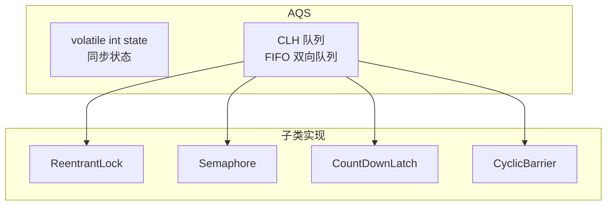
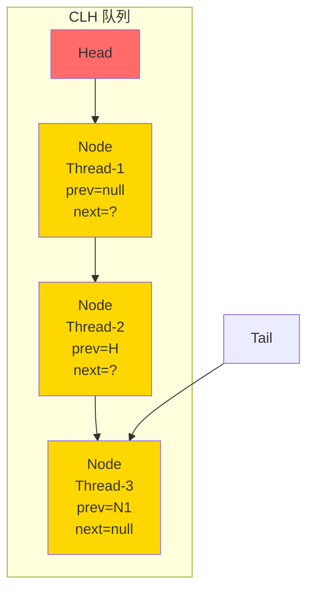
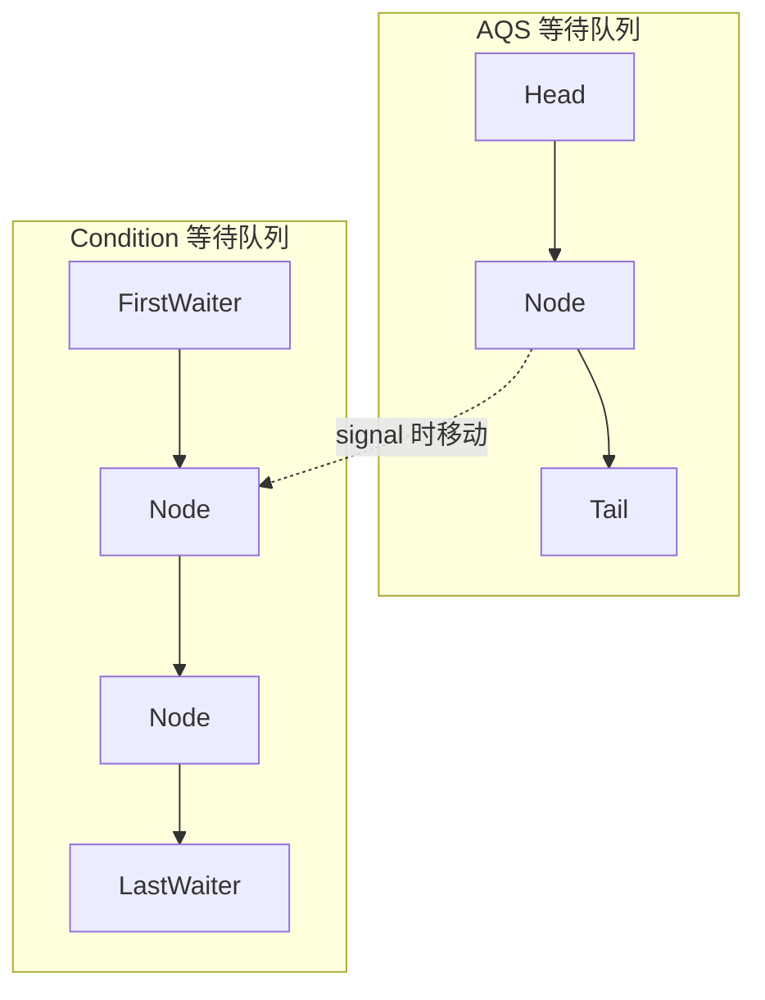

# AQS 抽象队列同步器

**目标级别**：P7

## 快速自测

面试官问：「AQS 的核心是什么？ReentrantLock 是如何基于 AQS 实现的？」

你能回答到第几层？

---

## 一、核心问题

### 🔴 什么是 AQS？

AQS（AbstractQueuedSynchronizer）是 Java 并发包的核心基础类，提供了**队列同步**的通用框架。



### AQS 的核心组件

| 组件 | 说明 |
|------|------|
| **state** | 同步状态，通过 CAS 修改 |
| **CLH 队列** | 等待队列，存储阻塞的线程 |
| **模板方法** | tryAcquire/tryRelease 等 |

---

## 二、CLH 队列

### CLH 队列结构



### Node 节点

```java title="AbstractQueuedSynchronizer.java"
static final class Node {
    // 共享模式
    static final Node SHARED = new Node();
    // 独占模式
    static final Node EXCLUSIVE = null;
    
    // 等待状态
    volatile int waitStatus;
    // 前驱节点
    volatile Node prev;
    // 后继节点
    volatile Node next;
    // 存储的线程
    volatile Thread thread;
    // 指向下一个等待节点（共享模式）
    Node nextWaiter;
}

// 等待状态
static final int CANCELLED =  1;  // 已取消
static final int SIGNAL    = -1;  // 后继节点需要被唤醒
static final int CONDITION = -2;  // 等待条件
static final int PROPAGATE = -3;  // 传播（共享模式）
```

---

## 三、独占模式

### 获取锁（acquire）

```java title="AbstractQueuedSynchronizer.java"
public final void acquire(int arg) {
    // 1. 尝试获取锁
    if (!tryAcquire(arg)) {
        // 2. 获取失败，加入等待队列
        Node node = addWaiter(Node.EXCLUSIVE);
        // 3. 自旋尝试获取锁
        if (acquireQueued(node, arg))
            selfInterrupt();
    }
}

// 添加等待节点
private Node addWaiter(Node mode) {
    Node node = new Node(Thread.currentThread(), mode);
    Node pred = tail;
    
    // 快速入队
    if (pred != null) {
        node.prev = pred;
        if (compareAndSetTail(pred, node)) {
            pred.next = node;
            return node;
        }
    }
    
    // 自旋入队
    enq(node);
    return node;
}

// 自旋获取锁
final boolean acquireQueued(Node node, int arg) {
    boolean failed = true;
    try {
        boolean interrupted = false;
        for (;;) {
            // 获取前驱节点
            Node p = node.predecessor();
            
            // 前驱是头节点，尝试获取锁
            if (p == head && tryAcquire(arg)) {
                setHead(node);
                p.next = null;  // GC
                failed = false;
                return interrupted;
            }
            
            // 前驱不是头节点，阻塞
            if (shouldParkAfterFailedAcquire(p, node) &&
                parkAndCheckInterrupt())
                interrupted = true;
        }
    } finally {
        if (failed)
            cancelAcquire(node);
    }
}
```

### 释放锁（release）

```java
public final boolean release(int arg) {
    if (tryRelease(arg)) {
        Node h = head;
        // 唤醒后继节点
        if (h != null && h.waitStatus != 0)
            unparkSuccessor(h);
        return true;
    }
    return false;
}

private void unparkSuccessor(Node node) {
    int ws = node.waitStatus;
    if (ws < 0)
        compareAndSetWaitStatus(node, ws, 0);
    
    Node s = node.next;
    // 找到需要唤醒的节点
    if (s == null || s.waitStatus > 0) {
        s = null;
        for (Node t = tail; t != null && t != node; t = t.prev)
            if (t.waitStatus <= 0)
                s = t;
    }
    
    if (s != null)
        LockSupport.unpark(s.thread);  // 唤醒线程
}
```

---

## 四、共享模式

### 获取锁（acquireShared）

```java
public final void acquireShared(int arg) {
    if (tryAcquireShared(arg) < 0)
        doAcquireShared(arg);
}

private void doAcquireShared(int arg) {
    Node node = addWaiter(Node.SHARED);
    boolean failed = true;
    try {
        boolean interrupted = false;
        for (;;) {
            Node p = node.predecessor();
            if (p == head) {
                // 尝试获取共享锁
                int r = tryAcquireShared(arg);
                if (r >= 0) {
                    setHeadAndPropagate(node, r);
                    p.next = null;  // GC
                    failed = false;
                    return;
                }
            }
            if (shouldParkAfterFailedAcquire(p, node) &&
                parkAndCheckInterrupt())
                interrupted = true;
        }
    } finally {
        if (failed)
            cancelAcquire(node);
    }
}
```

### Semaphore 应用

```java title="Semaphore.java"
public class Semaphore implements java.io.Serializable {
    private final Sync sync;
    
    // 非公平获取
    public void acquire() throws InterruptedException {
        sync.acquireSharedInterruptibly(1);
    }
    
    // 释放
    public void release() {
        sync.releaseShared(1);
    }
}
```

---

## 五、ReentrantLock 实现

### 非公平锁

```java title="NonfairSync.java"
static final class NonfairSync extends Sync {
    protected final boolean tryAcquire(int acquires) {
        // 获取当前状态
        final Thread current = Thread.currentThread();
        int c = getState();
        
        // 状态为 0，尝试 CAS 获取
        if (c == 0) {
            if (compareAndSetState(0, acquires)) {
                setExclusiveOwnerThread(current);
                return true;
            }
        }
        // 状态非 0，判断是否是当前线程
        else if (current == getExclusiveOwnerThread()) {
            int nextc = c + acquires;
            setState(nextc);
            return true;
        }
        return false;
    }
}
```

### 公平锁

```java title="FairSync.java"
static final class FairSync extends Sync {
    protected final boolean tryAcquire(int acquires) {
        final Thread current = Thread.currentThread();
        int c = getState();
        
        if (c == 0) {
            // 公平锁：检查是否有前驱节点
            if (!hasQueuedPredecessors() &&
                compareAndSetState(0, acquires)) {
                setExclusiveOwnerThread(current);
                return true;
            }
        }
        else if (current == getExclusiveOwnerThread()) {
            int nextc = c + acquires;
            setState(nextc);
            return true;
        }
        return false;
    }
}
```

### tryRelease

```java title="Sync.java"
protected final boolean tryRelease(int releases) {
    int c = getState() - releases;
    
    if (Thread.currentThread() != getExclusiveOwnerThread())
        throw new IllegalMonitorStateException();
    
    boolean free = false;
    if (c == 0) {
        free = true;
        setExclusiveOwnerThread(null);
    }
    setState(c);
    return free;
}
```

---

## 六、Condition 实现

### Condition 队列



### await/signal

```java
public class ConditionObject implements Condition, Serializable {
    private transient Node firstWaiter;
    private transient Node lastWaiter;
    
    // await：释放锁，进入 Condition 队列
    public final void await() throws InterruptedException {
        if (Thread.interrupted())
            throw new InterruptedException();
        
        Node node = addConditionWaiter();
        int savedState = fullyRelease(node);
        int interruptMode = 0;
        
        while (!isOnSyncQueue(node)) {
            LockSupport.park(this);
            if ((interruptMode = checkInterruptWhilePark(node)) != 0)
                break;
        }
        
        // 重新获取锁
        acquireQueued(node, savedState);
    }
    
    // signal：移动到 AQS 队列
    public final void signal() {
        if (!isHeldExclusively())
            throw new IllegalMonitorStateException();
        
        Node first = firstWaiter;
        if (first != null)
            doSignal(first);
    }
}
```

### BlockingQueue 应用

```java
// ReentrantLock + Condition 实现阻塞队列
public class MyBlockingQueue<E> {
    private final Object[] items;
    private final ReentrantLock lock = new ReentrantLock();
    private final Condition notEmpty = lock.newCondition();
    private final Condition notFull = lock.newCondition();
    
    public void put(E e) throws InterruptedException {
        lock.lock();
        try {
            while (count == items.length)
                notFull.await();
            items[takeIndex] = e;
            if (++takeIndex == items.length) takeIndex = 0;
            count++;
            notEmpty.signal();
        } finally {
            lock.unlock();
        }
    }
    
    public E take() throws InterruptedException {
        lock.lock();
        try {
            while (count == 0)
                notEmpty.await();
            E x = items[putIndex];
            if (++putIndex == items.length) putIndex = 0;
            count--;
            notFull.signal();
            return x;
        } finally {
            lock.unlock();
        }
    }
}
```

---

## 七、面试题精讲

### 🔴 第一层：AQS 的核心是什么？

> **参考答案**：
>
> AQS 的核心是**state 状态**和**CLH 队列**：
> 1. **state**：用 volatile int 表示同步状态，通过 CAS 修改
> 2. **CLH 队列**：存储等待的线程节点，FIFO 顺序
>
> AQS 定义了模板方法，子类实现 tryAcquire/tryRelease 等方法。

### 🟡 第二层：ReentrantLock 是如何基于 AQS 实现的？

> **参考答案**：
>
> ReentrantLock 使用 AQS 的 state 表示重入次数：
> 1. **获取锁**：tryAcquire 检查 state = 0 且 CAS 成功，或 state > 0 且是当前线程
> 2. **释放锁**：tryRelease 检查 state = 0，唤醒后继节点
> 3. **公平/非公平**：公平锁多了 hasQueuedPredecessors 检查

### 🟡 第三层：CountDownLatch 是如何实现的？

> **参考答案**：
>
> CountDownLatch 使用 AQS 的共享模式：
> 1. **state**：初始化为计数器的值
> 2. **await**：检查 state = 0，是则通过，否则阻塞
> 3. **countDown**：CAS 减少 state，减到 0 时唤醒所有等待线程

### 💡 第四层：AQS 为什么用双向队列？

> **参考答案**：
>
> 双向队列便于：
> 1. **快速取消节点**：CAS 修改 prev 指针
> 2. **快速唤醒后继**：直接通过 next 找到后继节点
> 3. **处理取消节点**：遍历队列清理 cancelled 节点

---

## 八、常见错误与陷阱

### ⚠️ 陷阱 1：AQS 不支持公平锁？

AQS 本身支持公平和非公平。ReentrantLock 的公平锁通过 hasQueuedPredecessors() 检查队列中是否有前驱节点。

### ⚠️ 陷阱 2：Condition 必须先获取锁

```java
Condition condition = lock.newCondition();
condition.await();  // IllegalMonitorStateException！

// 正确用法
lock.lock();
try {
    condition.await();
} finally {
    lock.unlock();
}
```

### ⚠️ 陷阱 3：signal vs signalAll

```java
// signal：只唤醒一个等待线程
condition.signal();

// signalAll：唤醒所有等待线程
condition.signalAll();
```

---

## 九、对比总结表

| 同步组件 | AQS 模式 | state 含义 |
|----------|----------|-----------|
| **ReentrantLock** | 独占 | 重入次数 |
| **Semaphore** | 共享 | 许可证数量 |
| **CountDownLatch** | 共享 | 倒计时数值 |
| **CyclicBarrier** | 独占（内部用 ReentrantLock） | 参与线程数量 |
| **ReadWriteLock** | 独占 + 共享 | 读锁数量/写锁状态 |

---

## 十、扩展思考

> **追问**：为什么 AQS 用 CLH 队列而不是普通队列？

CLH 队列的优势：
1. **无锁入队**：只需要 CAS 修改 tail
2. **O(1) 取消**：只需设置 node.waitStatus = CANCELLED
3. **自旋锁优化**：检查前驱节点状态实现自旋等待

> **追问**：Park/Unpark 原理？

LockSupport.park/unpark 直接操作底层 ParkEvent：
- park：禁止线程消费 CPU，进入等待状态
- unpark：恢复线程执行，允许继续消费 CPU

---

## 延伸阅读

- [ReentrantLock 公平锁](./reentrantlock)
- [ReentrantReadWriteLock](./readwritelock)
- [Condition 条件队列](./condition)
- [synchronized 原理与锁升级](./synchronized)
