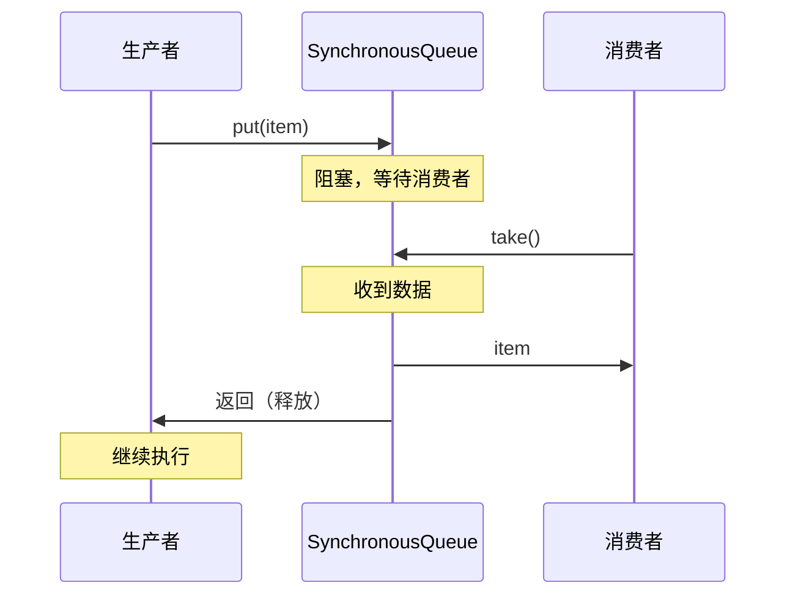

# 阻塞队列（Array/Linked/Synchronous/Delay）

在项目中用线程池时，很多同学会疑惑：BlockingQueue 到底有哪些实现？为什么有时候用 LinkedBlockingQueue 会 OOM，有时候用 ArrayBlockingQueue 反而更好？我自己也踩过这个坑——用了无界队列导致内存暴涨。

今天我们就来把这些阻塞队列彻底讲清楚。

## 一、BlockingQueue 核心接口

### 1.1 基本方法

```java
public interface BlockingQueue<E> extends Queue<E> {
    // 阻塞插入
    void put(E e) throws InterruptedException;
    
    // 阻塞移除
    E take() throws InterruptedException;
    
    // 超时插入
    boolean offer(E e, long timeout, TimeUnit unit) throws InterruptedException;
    
    // 超时移除
    E poll(long timeout, TimeUnit unit) throws InterruptedException;
    
    // 非阻塞插入（队列满则抛异常）
    boolean add(E e);
    
    // 非阻塞插入（队列满则返回 false）
    boolean offer(E e);
    
    // 非阻塞移除（队列空则返回 null）
    E poll();
}
```

### 1.2 方法对比

| 方法 | 队列满时的行为 | 队列空时的行为 |
| --- | --- | --- |
| `add()` | 抛异常 | 抛异常 |
| `offer()` | 返回 false | 返回 null |
| `put()` | **阻塞等待** | - |
| `take()` | - | **阻塞等待** |
| `poll(timeout)` | 返回 null | 返回 null |

## 二、ArrayBlockingQueue

### 2.1 特点

```java
// 固定容量，需要指定大小
BlockingQueue<String> queue = new ArrayBlockingQueue<>(100);

// 特点：
// - 有界队列
// - 基于数组实现
// - FIFO 顺序
// - 可选公平/非公平
BlockingQueue<String> fairQueue = new ArrayBlockingQueue<>(100, true);
```

### 2.2 内部结构

```java
// ArrayBlockingQueue 内部结构
public class ArrayBlockingQueue<E> {
    private final Object[] items;  // 数组存储
    private int takeIndex;         // 下一个读取位置
    private int putIndex;         // 下一个写入位置
    private int count;            // 元素数量
    
    private final ReentrantLock lock;  // 重入锁
    
    private final Condition notEmpty;   // 非空条件
    private final Condition notFull;    // 非满条件
}
```

### 2.3 适用场景

| 场景 | 推荐 | 原因 |
| --- | --- | --- |
| 资源限制 | ArrayBlockingQueue | 明确容量，防止无限增长 |
| 生产者-消费者 | ArrayBlockingQueue | 固定容量，资源可控 |
| 高性能需求 | ArrayBlockingQueue | 比 LinkedBlockingQueue 稍快 |

### 2.4 示例

```java
// 线程池队列配置
ThreadPoolExecutor executor = new ThreadPoolExecutor(
    10, 20,
    60L, TimeUnit.SECONDS,
    new ArrayBlockingQueue<>(100),  // 有界，不会 OOM
    Executors.defaultThreadFactory(),
    new ThreadPoolExecutor.AbortPolicy()
);
```

## 三、LinkedBlockingQueue

### 3.1 特点

```java
// 可选容量（默认 Integer.MAX_VALUE）
BlockingQueue<String> queue1 = new LinkedBlockingQueue<>();  // 无界！
BlockingQueue<String> queue2 = new LinkedBlockingQueue<>(1000);  // 有界

// 特点：
// - 基于链表实现
// - 默认无界（容量 Integer.MAX_VALUE）
// - 插入和移除使用不同的锁
// - 比 ArrayBlockingQueue 吞吐量更高
```

### 3.2 内部结构

```java
// LinkedBlockingQueue 内部结构
public class LinkedBlockingQueue<E> {
    private final int capacity;  // 容量
    private final AtomicInteger count = new AtomicInteger(0);  // 元素计数
    
    private Node<E> head;         // 头节点（哑节点）
    private Node<E> last;         // 尾节点
    
    private final ReentrantLock takeLock = new ReentrantLock();  // 取锁
    private final Condition notEmpty = takeLock.newCondition();
    
    private final ReentrantLock putLock = new ReentrantLock();   // 放锁
    private final Condition notFull = putLock.newCondition();
}
```

### 3.3 潜在问题

```java
// 危险：无界队列
BlockingQueue<String> queue = new LinkedBlockingQueue<>();

// 问题：
// 1. 生产者速度 > 消费者速度时
// 2. 队列无限增长
// 3. 内存暴涨
// 4. OOM
```

### 3.4 适用场景

| 场景 | 推荐 | 原因 |
| --- | --- | --- |
| 需要高吞吐量 | LinkedBlockingQueue | 双锁并发度高 |
| 任务队列 | ArrayBlockingQueue | 明确容量 |
| 消费者比生产者快 | LinkedBlockingQueue（有界） | 性能更好 |

## 四、SynchronousQueue

### 4.1 特点

```java
// 同步队列，不存储元素
BlockingQueue<String> queue = new SynchronousQueue<>();

// 特点：
// - 不存储元素
// - 每个 put 必须等待一个 take，反之亦然
// - 用于两个线程之间的直接传递
```

### 4.2 工作原理



### 4.3 适用场景

```java
// 场景1：Executors.newCachedThreadPool
ExecutorService cachedExecutor = Executors.newCachedThreadPool();
// 内部使用 SynchronousQueue
// 每个任务必须立即被线程取走

// 场景2：线程间直接传递
public class DirectTransfer {
    public static void main(String[] args) throws InterruptedException {
        BlockingQueue<String> queue = new SynchronousQueue<>();
        
        Thread producer = new Thread(() -> {
            try {
                System.out.println("准备发送...");
                queue.put("Hello");  // 阻塞
                System.out.println("已发送");
            } catch (InterruptedException e) {
                e.printStackTrace();
            }
        });
        
        Thread consumer = new Thread(() -> {
            try {
                Thread.sleep(1000);
                String msg = queue.take();  // 等待
                System.out.println("收到: " + msg);
            } catch (InterruptedException e) {
                e.printStackTrace();
            }
        });
        
        producer.start();
        consumer.start();
    }
}
```

### 4.4 vs 其他队列

| 队列 | 存储能力 | 阻塞特性 |
| --- | --- | --- |
| ArrayBlockingQueue | 存储元素 | put/take 阻塞 |
| LinkedBlockingQueue | 存储元素 | put/take 阻塞 |
| SynchronousQueue | **不存储** | put/take 必须配对 |

## 五、DelayQueue

### 5.1 特点

```java
// 延迟队列
BlockingQueue<DelayedTask> queue = new DelayQueue<>();

// 特点：
// - 只有超过延迟时间的元素才能被取出
// - 基于 PriorityQueue 实现
// - 用于定时任务调度
```

### 5.2 使用方式

```java
public class DelayedTask implements Delayed {
    private final String taskName;
    private final long delayTime;
    private final long expireTime;  // 到期时间
    
    public DelayedTask(String taskName, long delayTime, TimeUnit unit) {
        this.taskName = taskName;
        this.delayTime = unit.toNanos(delayTime);
        this.expireTime = System.nanoTime() + this.delayTime;
    }
    
    @Override
    public long getDelay(TimeUnit unit) {
        return unit.convert(expireTime - System.nanoTime(), TimeUnit.NANOSECONDS);
    }
    
    @Override
    public int compareTo(Delayed o) {
        DelayedTask other = (DelayedTask) o;
        return Long.compare(this.expireTime, other.expireTime);
    }
}

// 使用
BlockingQueue<DelayedTask> queue = new DelayQueue<>();

queue.put(new DelayedTask("Task1", 5, TimeUnit.SECONDS));
queue.put(new DelayedTask("Task2", 2, TimeUnit.SECONDS));

// 2秒后取出 Task2
DelayedTask task2 = queue.take();  // 阻塞2秒

// 再过3秒取出 Task1
DelayedTask task1 = queue.take();  // 再阻塞3秒
```

### 5.3 定时任务调度器

```java
public class DelayedTaskScheduler {
    private final DelayQueue<Task> queue = new DelayQueue<>();
    
    public void schedule(Runnable task, long delay, TimeUnit unit) {
        queue.put(new Task(task, delay, unit));
    }
    
    public void start() {
        while (true) {
            try {
                Task task = queue.take();  // 等待任务到期
                task.execute();
            } catch (InterruptedException e) {
                break;
            }
        }
    }
}
```

## 六、其他阻塞队列

### 6.1 PriorityBlockingQueue

```java
// 优先级队列
BlockingQueue<Integer> queue = new PriorityBlockingQueue<>();

queue.put(5);
queue.put(1);
queue.put(3);

System.out.println(queue.take());  // 输出 1
System.out.println(queue.take());  // 输出 3
System.out.println(queue.take());  // 输出 5
```

### 6.2 LinkedBlockingDeque

```java
// 双向阻塞队列
BlockingQueue<String> deque = new LinkedBlockingDeque<>();

// 可以从任意一端插入和移除
deque.putFirst("A");
deque.putLast("B");
deque.takeFirst();  // "A"
deque.takeLast();   // "B"
```

## 七、选型指南

### 7.1 对比表

| 队列 | 有界/无界 | 存储 | 吞吐量 | 适用场景 |
| --- | --- | --- | --- | --- |
| ArrayBlockingQueue | 有界 | 数组 | 中 | 资源限制 |
| LinkedBlockingQueue | 可选 | 链表 | 高 | 高吞吐量 |
| SynchronousQueue | 无存储 | - | 低 | 直接传递 |
| DelayQueue | 无界 | 堆 | 低 | 定时任务 |
| PriorityBlockingQueue | 无界 | 堆 | 低 | 优先级任务 |

### 7.2 生产环境选择

```java
// 线程池队列选择

// 场景1：资源受限，任务重要 → ArrayBlockingQueue
new ArrayBlockingQueue<>(100)

// 场景2：高吞吐量，可以接受任务丢失 → LinkedBlockingQueue（无界）
// 不推荐！容易 OOM

// 场景3：线程池需要立即执行 → SynchronousQueue
new SynchronousQueue<>()

// 场景4：定时任务 → DelayQueue
new DelayQueue<>()

// 场景5：优先级任务 → PriorityBlockingQueue
new PriorityBlockingQueue<>()
```

## 【学习小结】

本篇文章的核心要点：

1. **ArrayBlockingQueue**：有界数组队列，需要明确容量，防止内存暴涨
2. **LinkedBlockingQueue**：基于链表，有可选容量，默认无界（Integer.MAX_VALUE）
3. **SynchronousQueue**：不存储元素，每个 put 必须等待 take，用于直接传递
4. **DelayQueue**：延迟队列，只有到期元素才能被取出，用于定时任务
5. **PriorityBlockingQueue**：优先级队列，无界，按优先级排序
6. **LinkedBlockingQueue 双锁**：takeLock 和 putLock 分离，提高并发吞吐量
7. **无界队列风险**：生产者快于消费者时会 OOM
8. **选型建议**：资源限制用 ArrayBlockingQueue，高吞吐用 LinkedBlockingQueue，定时任务用 DelayQueue
