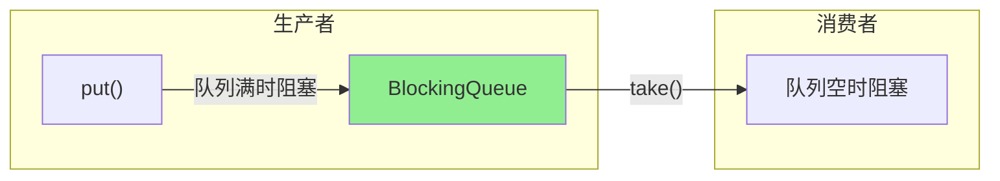
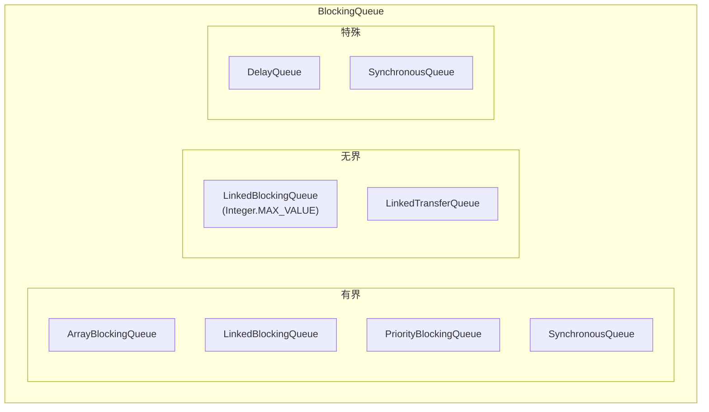

# 阻塞队列

**目标级别**：P5 / P6

## 快速自测

面试官问：「阻塞队列有哪些？ArrayBlockingQueue 和 LinkedBlockingQueue 的区别是什么？」

你能回答到第几层？

---

## 一、核心问题

### 🔴 什么是阻塞队列？

阻塞队列（BlockingQueue）是在队列基础上增加了**阻塞等待**机制的线程安全队列。



### 核心接口

```java title="BlockingQueue.java"
public interface BlockingQueue<E> extends Queue<E> {
    // 阻塞插入，队列满时等待
    void put(E e) throws InterruptedException;
    
    // 阻塞移除，队列空时等待
    E take() throws InterruptedException;
    
    // 超时插入
    boolean offer(E e, long timeout, TimeUnit unit) 
        throws InterruptedException;
    
    // 超时移除
    E poll(long timeout, TimeUnit unit) 
        throws InterruptedException;
}
```

---

## 二、ArrayBlockingQueue

### 原理

ArrayBlockingQueue 使用**有界数组**实现，使用 ReentrantLock 保证线程安全。

```java title="ArrayBlockingQueue.java"
public class ArrayBlockingQueue<E> extends AbstractQueue<E>
        implements BlockingQueue<E> {
    
    // 存储元素的数组
    final Object[] items;
    
    // 锁
    final ReentrantLock lock;
    
    // 条件变量
    private final Condition notEmpty;
    private final Condition notFull;
    
    // 索引
    int takeIndex;
    int putIndex;
    int count;
}
```

### put 和 take 实现

```java
public void put(E e) throws InterruptedException {
    checkNotNull(e);
    final ReentrantLock lock = this.lock;
    lock.lockInterruptibly();
    try {
        while (count == items.length)
            notFull.await();  // 队列满，等待
        enqueue(e);
    } finally {
        lock.unlock();
    }
}

public E take() throws InterruptedException {
    final ReentrantLock lock = this.lock;
    lock.lockInterruptibly();
    try {
        while (count == 0)
            notEmpty.await();  // 队列空，等待
        return dequeue();
    } finally {
        lock.unlock();
    }
}
```

---

## 三、LinkedBlockingQueue

### 原理

LinkedBlockingQueue 使用**单向链表**实现，可以指定容量（默认 Integer.MAX_VALUE）。

```java title="LinkedBlockingQueue.java"
public class LinkedBlockingQueue<E> extends AbstractQueue<E>
        implements BlockingQueue<E> {
    
    // 节点
    static class Node<E> {
        E item;
        Node<E> next;
    }
    
    // 容量（可选）
    private final int capacity;
    
    // 元素数量
    private final AtomicInteger count = new AtomicInteger(0);
    
    // 头尾节点
    private transient Node<E> head;
    private transient Node<E> last;
    
    // 两把锁（高吞吐量）
    private final ReentrantLock takeLock = new ReentrantLock();
    private final ReentrantLock putLock = new ReentrantLock();
}
```

### 与 ArrayBlockingQueue 的区别

| 维度 | ArrayBlockingQueue | LinkedBlockingQueue |
|------|-------------------|---------------------|
| **存储结构** | 有界数组 | 单向链表 |
| **容量** | 必须指定 | 可选（默认 Integer.MAX_VALUE） |
| **锁** | 一把锁 | 两把锁（take/put） |
| **吞吐量** | 较低 | 较高 |
| **内存** | 固定 | 动态（但有 GC 开销） |

---

## 四、八种实现对比

### 实现分类



### 对比表

| 实现 | 容量 | 特点 | 适用场景 |
|------|------|------|----------|
| **ArrayBlockingQueue** | 有界 | 数组，一把锁 | 固定大小缓冲 |
| **LinkedBlockingQueue** | 可选 | 链表，两把锁 | 高吞吐量生产者-消费者 |
| **PriorityBlockingQueue** | 无界 | 优先队列 | 优先级任务 |
| **DelayQueue** | 无界 | 延迟元素 | 定时任务 |
| **SynchronousQueue** | 0 | 不存储元素 | 直接交换 |
| **LinkedTransferQueue** | 无界 | Transfer 支持 | 高性能传递 |
| **LinkedBlockingDeque** | 可选 | 双端队列 | 两端操作 |

---

## 五、SynchronousQueue

### 特点

SynchronousQueue 不存储元素，生产者必须等待消费者消费后才能继续。

```java
SynchronousQueue<Integer> queue = new SynchronousQueue<>();

// 线程 A：放入元素（阻塞）
new Thread(() -> {
    try {
        queue.put(1);  // 阻塞，直到线程 B 取走
        System.out.println("已放入");
    } catch (InterruptedException e) {}
}).start();

// 线程 B：取出元素
new Thread(() -> {
    try {
        Thread.sleep(1000);
        Integer value = queue.take();  // 阻塞，直到线程 A 放入
        System.out.println("取出: " + value);
    } catch (InterruptedException e) {}
}).start();
```

### 公平 vs 非公平

```java
// 非公平（默认）：使用栈模式
SynchronousQueue<Integer> unfair = new SynchronousQueue<>();

// 公平：使用队列模式，FIFO
SynchronousQueue<Integer> fair = new SynchronousQueue<>(true);
```

---

## 六、PriorityBlockingQueue

### 特点

PriorityBlockingQueue 是无界优先队列，基于数组实现，使用 ReentrantLock。

```java
PriorityBlockingQueue<Integer> queue = new PriorityBlockingQueue<>();

queue.put(3);
queue.put(1);
queue.put(2);

while (!queue.isEmpty()) {
    System.out.println(queue.take());  // 1, 2, 3
}
```

### 实现原理

```java
public class PriorityBlockingQueue<E> extends AbstractQueue<E>
        implements BlockingQueue<E> {
    
    // 优先队列（堆）
    private transient Object[] queue;
    
    // 比较器（可选）
    private final Comparator<? super E> comparator;
    
    // 锁
    private final ReentrantLock lock;
    
    // 无界，所以不需要 notFull 条件
}
```

---

## 七、DelayQueue

### 特点

DelayQueue 存储 Delayed 接口实现，只允许取出已到期的元素。

```java
public class DelayQueueDemo {
    
    static class DelayedTask implements Delayed {
        private final long delay;
        private final String name;
        
        public DelayedTask(long delay, String name) {
            this.delay = delay;
            this.name = name;
        }
        
        @Override
        public long getDelay(TimeUnit unit) {
            return unit.convert(delay - System.nanoTime(), TimeUnit.NANOSECONDS);
        }
        
        @Override
        public int compareTo(Delayed o) {
            return Long.compare(delay, ((DelayedTask) o).delay);
        }
    }
    
    public static void main(String[] args) throws Exception {
        DelayQueue<DelayedTask> queue = new DelayQueue<>();
        
        queue.put(new DelayedTask(5000, "任务1"));  // 5秒后到期
        queue.put(new DelayedTask(1000, "任务2"));  // 1秒后到期
        
        while (!queue.isEmpty()) {
            DelayedTask task = queue.take();  // 按到期顺序取出
            System.out.println("执行: " + task.name);
        }
    }
}
```

---

## 八、生产者-消费者模式

### 手写实现

```java title="ProducerConsumer.java"
public class ProducerConsumer {
    
    public static void main(String[] args) {
        BlockingQueue<Integer> queue = new LinkedBlockingQueue<>(10);
        
        // 生产者
        ExecutorService producers = Executors.newFixedThreadPool(3);
        for (int i = 0; i < 3; i++) {
            final int id = i;
            producers.submit(() -> {
                int count = 0;
                while (true) {
                    try {
                        queue.put(count++);
                        System.out.println("生产者 " + id + " 生产: " + count);
                        Thread.sleep(100);
                    } catch (InterruptedException e) {
                        break;
                    }
                }
            });
        }
        
        // 消费者
        ExecutorService consumers = Executors.newFixedThreadPool(2);
        for (int i = 0; i < 2; i++) {
            final int id = i;
            consumers.submit(() -> {
                while (true) {
                    try {
                        Integer value = queue.take();
                        System.out.println("消费者 " + id + " 消费: " + value);
                        Thread.sleep(200);
                    } catch (InterruptedException e) {
                        break;
                    }
                }
            });
        }
    }
}
```

---

## 九、面试题精讲

### 🔴 第一层：阻塞队列有哪些？

> **参考答案**：
>
> JDK 提供的阻塞队列有：
> 1. **ArrayBlockingQueue**：有界数组队列
> 2. **LinkedBlockingQueue**：有界/无界链表队列
> 3. **PriorityBlockingQueue**：无界优先队列
> 4. **DelayQueue**：延迟队列
> 5. **SynchronousQueue**：不存储元素的同步队列
> 6. **LinkedTransferQueue**：支持 Transfer 的队列

### 🟡 第二层：ArrayBlockingQueue 和 LinkedBlockingQueue 的区别？

> **参考答案**：
>
> | 维度 | ArrayBlockingQueue | LinkedBlockingQueue |
> |------|-------------------|---------------------|
> | **存储结构** | 有界数组 | 单向链表 |
> | **锁** | 一把锁 | 两把锁（putLock/takeLock） |
> | **吞吐量** | 较低 | 较高 |
> | **内存** | 固定 | 动态分配 |
> | **容量** | 必须指定 | 可选（默认 Integer.MAX_VALUE） |

### 🟡 第三层：SynchronousQueue 的特点？

> **参考答案**：
>
> SynchronousQueue 不存储元素，生产者 put 时必须等待消费者 take，反之亦然。用于直接交换数据的场景，吞吐量高。

---

## 十、对比总结表

| 方法 | 抛出异常 | 返回特殊值 | 阻塞 | 超时 |
|------|---------|-----------|------|------|
| **insert** | add(e) | offer(e) | put(e) | offer(e, time, unit) |
| **remove** | remove() | poll() | take() | poll(time, unit) |
| **examine** | element() | peek() | - | - |

---

## 延伸阅读

- [线程池核心参数与原理](../concurrent/threadpool-params)
- [CountDownLatch](../concurrent/countdownlatch)
- [CyclicBarrier](../concurrent/cyclicbarrier)
- [Semaphore](../concurrent/semaphore)
