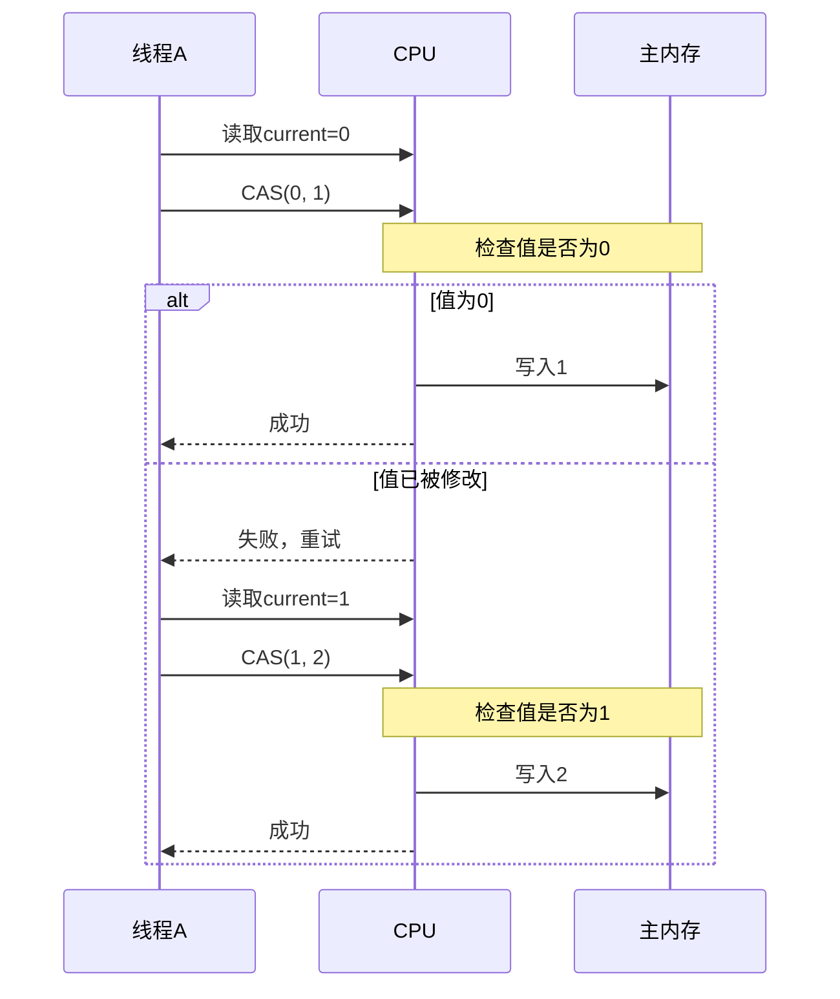
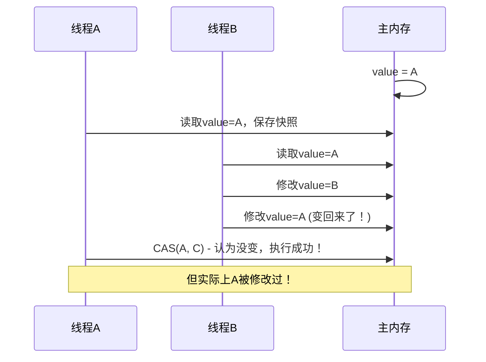

# CAS原理与ABA问题

## 一个让候选人原形毕露的问题

面试官问："什么是CAS？"

候选人小张回答："CAS是Compare And Swap，比较并交换。"

面试官追问："那CAS有什么问题？"

小张说："呃...可能性能不太好？"

面试官继续追问："ABA问题是什么？怎么解决？"

小张支支吾吾，没能说清楚。

这个问题看似简单，但能回答好的人不多。CAS是并发编程的基石，理解了CAS，你才能理解AtomicInteger、ConcurrentHashMap的底层实现。

今天这篇文章，把CAS讲透。

## 【直观类比】理解CAS

用一个生活中的比喻理解CAS：

想象你在银行取钱：
1. 你查看余额（比较：当前值 vs 预期值）
2. 如果余额足够，你取走一部分（交换：新值 vs 旧值）

**关键点**：如果在你查看余额和取钱之间，有人也取走了钱，你再次查看时余额已经变了，你必须重新开始。

```java
// CAS操作的核心思想
public class CASLikeLife {
    private int balance = 1000;  // 余额
    
    public boolean withdraw(int amount) {
        int current = balance;        // 1. 查看当前余额
        if (current >= amount) {     // 2. 比较是否足够
            balance = current - amount;  // 3. 更新余额
            return true;
        }
        return false;
    }
}
```

但在并发环境下，问题来了：

```java
// 线程A和线程B同时取钱
Thread A: 读取balance=1000
Thread B: 读取balance=1000
Thread A: 余额够，扣款，balance=900
Thread B: 余额够（还是1000），扣款，balance=800

问题：实际扣了200，但余额只减少了100！
```

CAS解决这个问题：如果发现balance被修改过，就**重试**，而不是盲目更新。

## CAS的底层实现

### CPU级别的支持

CAS是CPU提供的原子指令：

| 架构 | 指令 |
|------|------|
| x86 | `cmpxchg` (compare and exchange) |
| ARM | `cas` (load-linked/store-conditional) |
| MIPS | `ll/sc` (load linked/store conditional) |

### x86的cmpxchg指令

```c
// 伪汇编
// EAX = 预期值(compare), EBX = 新值(exchange), [ptr] = 内存地址
lock cmpxchg [ptr], ebx

// 执行过程：
// 1. 比较 [ptr] 和 EAX
// 2. 如果相等：EBX -> [ptr], 设置ZF=1
// 3. 如果不等：EAX <- [ptr], 设置ZF=0
// 4. 返回比较结果（ZF标志位）
```

### Java中的CAS

Java通过`sun.misc.Unsafe`提供CAS能力：

```java
public class UnsafeCAS {
    private static final Unsafe unsafe;
    private static final long valueOffset;
    
    static {
        try {
            unsafe = Unsafe.getUnsafe();
            valueOffset = unsafe.objectFieldOffset(
                AtomicInteger.class.getDeclaredField("value")
            );
        } catch (Exception e) {
            throw new Error(e);
        }
    }
    
    private volatile int value;
    
    // CAS实现
    public final boolean compareAndSwap(int expectedValue, int newValue) {
        return unsafe.compareAndSwapInt(this, valueOffset, expectedValue, newValue);
    }
}
```

### AtomicInteger的incrementAndGet

```java
public class AtomicIntegerDemo {
    private AtomicInteger counter = new AtomicInteger(0);
    
    public void increment() {
        // incrementAndGet的内部实现
        int current;
        int next;
        do {
            current = counter.get();       // 获取当前值
            next = current + 1;            // 计算新值
        } while (!counter.compareAndSet(current, next));  // CAS直到成功
    }
}
```

**流程图**：



## CAS的问题

### 问题一：高竞争下的性能问题

```java
public class CASContentionProblem {
    private AtomicInteger counter = new AtomicInteger(0);
    
    public void highContentionIncrement() {
        // 1000个线程同时竞争
        for (int i = 0; i < 1000; i++) {
            new Thread(() -> {
                for (int j = 0; j < 10000; j++) {
                    counter.incrementAndGet();  // CAS重试
                }
            }).start();
        }
    }
}
```

**问题**：高竞争下，CAS失败率升高，大量线程做无用功。

**解决**：JDK 8引入LongAdder，用分段思想减少竞争：

```java
// LongAdder的核心思想：分段计数
public class LongAdderDemo {
    private volatile Cell[] cells;
    
    public void increment() {
        Cell[] c;
        long b, v;
        int m;
        Cell c2;
        
        if ((c = cells) != null ||
            !casBase(b = base, b + 1)) {
            // base冲突，分段计数
            int i = getProbe() & (cells.length - 1);
            c2 = c[i];
            if (c2 == null || !c2.cas(v = c2.value, v + 1)) {
                // 继续重试或扩容
            }
        }
    }
}
```

### 问题二：ABA问题

**什么是ABA问题**：



**ABA问题的危害**：

```java
// 栈的CAS实现（ABA问题示例）
public class StackCASProblem {
    private AtomicReference<Node> top = new AtomicReference<>();
    
    public void push(Node node) {
        Node oldTop;
        do {
            oldTop = top.get();      // 读取栈顶：A
            node.next = oldTop;
        } while (!top.compareAndSet(oldTop, node));  // CAS(A, node)
        // 如果A被改成B又改回A，CAS会成功，但栈可能已经出问题
    }
}
```

### 问题三：自旋开销

```java
// 大量重试的开销
public class CASRetryOverhead {
    private AtomicInteger value = new AtomicInteger(0);
    
    public void problematicIncrement() {
        // 如果大量线程同时修改，会导致大量CAS失败
        // 每次失败都要重试，浪费CPU
        while (true) {
            int current = value.get();
            if (value.compareAndSet(current, current + 1)) {
                return;
            }
            // 什么都没做，白白浪费一次循环
        }
    }
}
```

## ABA问题的解决方案

### 方案一：版本号（AtomicStampedReference）

```java
import java.util.concurrent.atomic.AtomicStampedReference;

public class AtomicStampedReferenceDemo {
    private AtomicStampedReference<String> ref = 
        new AtomicStampedReference<>("A", 0);
    
    public void ABAFixDemo() {
        String oldValue = "A";
        String newValue = "C";
        int stamp = ref.getStamp();
        
        // 第一次修改
        ref.compareAndSet(oldValue, "B", stamp, stamp + 1);
        
        // 第二次修改
        stamp = ref.getStamp();
        ref.compareAndSet("B", oldValue, stamp, stamp + 1);
        
        // 第三次修改尝试
        stamp = ref.getStamp();
        // 此时stamp已经变成3，A虽然变回了A，但版本号不同
        // CAS会失败
        boolean success = ref.compareAndSet(oldValue, newValue, stamp, stamp + 1);
        
        System.out.println("第三次CAS成功? " + success);  // true
        // 实际上我们改的是 "A->B->A->C"
    }
}
```

### 方案二：AtomicMarkableReference（布尔标记）

```java
import java.util.concurrent.atomic.AtomicMarkableReference;

public class AtomicMarkableReferenceDemo {
    private AtomicMarkableReference<String> ref = 
        new AtomicMarkableReference<>("A", false);
    
    public void markBasedFix() {
        String oldValue = "A";
        boolean oldMark = false;
        
        // 第一次修改
        ref.compareAndSet(oldValue, "B", oldMark, !oldMark);
        
        // 第二次修改
        ref.compareAndSet("B", oldValue, !oldMark, oldMark);
        
        // 第三次修改
        // 标记也变了，所以CAS会失败
        boolean success = ref.compareAndSet(oldValue, "C", oldMark, !oldMark);
        
        System.out.println("第三次CAS成功? " + success);  // false
        // 因为标记已经变了
    }
}
```

### 方案三：业务层面的设计

```java
public class BusinessLevelABAFix {
    private AtomicReference<Account> accountRef = 
        new AtomicReference<>(new Account(1000, 0));
    
    public void transfer(Account target, int amount) {
        while (true) {
            Account current = accountRef.get();
            Account newAccount = new Account(current.balance - amount, current.version + 1);
            
            // 使用版本号检查
            if (accountRef.compareAndSet(current, newAccount)) {
                return;
            }
            // 如果CAS失败，说明版本变了，重试
        }
    }
    
    static class Account {
        int balance;
        int version;  // 版本号
        
        Account(int balance, int version) {
            this.balance = balance;
            this.version = version;
        }
    }
}
```

## CAS的实际应用

### AtomicInteger的完整实现

```java
public class AtomicInteger extends Number implements java.io.Serializable {
    private static final long serialVersionUID = 6214790243416807050L;
    
    // Unsafe实例，通过反射获取
    private static final Unsafe unsafe = Unsafe.getUnsafe();
    
    // value字段的内存偏移量
    private static final long valueOffset;
    
    // 实际的值，使用volatile保证可见性
    private volatile int value;
    
    static {
        try {
            valueOffset = unsafe.objectFieldOffset(
                AtomicInteger.class.getDeclaredField("value")
            );
        } catch (Exception ex) { throw new Error(ex); }
    }
    
    // 获取当前值
    public final int get() {
        return value;
    }
    
    // 自增并返回新值
    public final int incrementAndGet() {
        return unsafe.getAndAddInt(this, valueOffset, 1) + 1;
    }
    
    // CAS操作
    public final boolean compareAndSet(int expectedValue, int newValue) {
        return unsafe.compareAndSwapInt(this, valueOffset, expectedValue, newValue);
    }
}
```

### ConcurrentHashMap的CAS应用

```java
// ConcurrentHashMap中用CAS保证线程安全
public class ConcurrentHashMapCAS {
    // Node数组，每个桶有一个锁
    transient volatile Node<K,V>[] table;
    
    // CAS设置数组元素
    static final <K,V> boolean casTabAt(Node<K,V>[] tab, int i,
                                        Node<K,V> c, Node<K,V> v) {
        return U.compareAndSwapObject(tab, ((long)i << ASHIFT) + ABASE, c, v);
    }
    
    // put操作的部分逻辑
    public V put(K key, V value) {
        int hash = spread(key.hashCode());
        for (Node<K,V>[] tab = table; ;) {
            Node<K,V> f = tabAt(tab, (n - 1) & hash);
            if (f == null) {
                // CAS插入新节点
                if (casTabAt(tab, i, null, new Node<>(hash, key, value, null))) {
                    break;
                }
            }
            // 继续遍历或扩容
        }
    }
}
```

### LongAdder的分段思想

```java
// LongAdder的分段实现
public class LongAdder extends Striped64 {
    transient volatile Cell[] cells;
    transient volatile long base;
    transient volatile int cellsBusy;
    
    public void add(long x) {
        Cell[] c;
        long b, v;
        int m;
        Cell c2;
        
        if ((c = cells) != null) {
            // cells已初始化，尝试分段更新
            if ((c2 = c[getProbe() & m]) != null) {
                if (c2.cas(v = c2.value, v + x)) {
                    return;
                }
            }
            // 分段失败，尝试扩容或重新计算位置
            retryInitialize(c, b, v, x, m);
        } else if (casBase(b = base, b + x)) {
            // cells未初始化，且base CAS成功
            return;
        } else {
            // base CAS失败，初始化cells
            initialize(cells, base, b, v, x);
        }
    }
    
    // 分段Cell
    @sun.misc.Contended
    static final class Cell {
        volatile long value;
        Cell(long x) { value = x; }
        final boolean cas(long cmp, long val) {
            return UNSAFE.compareAndSwapLong(this, valueOffset, cmp, val);
        }
    }
}
```

## 面试中的高频追问

### 追问1：CAS和synchronized的区别？

| 维度 | CAS | synchronized |
|------|-----|--------------|
| 机制 | 无锁（乐观） | 有锁（悲观） |
| 阻塞 | 不阻塞（自旋重试） | 阻塞线程 |
| 性能 | 高（无上下文切换） | 低（可能有上下文切换） |
| 适用场景 | 低竞争 | 高竞争 |
| ABA问题 | 存在 | 不存在 |

### 追问2：compareAndSet vs weakCompareAndSet

- `compareAndSet`：失败时返回false，保证有happens-before语义
- `weakCompareAndSet`：失败时也返回false，但不保证happens-before语义

```java
// 实际使用中，两者差别不大
// weak版本性能略好（不需要同步屏障）
public class WeakVsStrong {
    private AtomicInteger value = new AtomicInteger(0);
    
    public void demo() {
        // 一般使用compareAndSet
        value.compareAndSet(0, 1);
        
        // weak版本在某些JVM实现中等价
        value.weakCompareAndSet(0, 1);
    }
}
```

### 追问3：如何减少CAS重试？

1. **减少竞争**：用LongAdder代替AtomicLong
2. **退避策略**：重试失败后稍等再试
3. **批量操作**：一次性更新多个值

### 追问4：Unsafe类的作用？

Unsafe提供底层操作能力：
- 直接内存操作
- CAS操作
- 对象布局操作
- 线程调度

一般不直接使用，用Atomic*类代替。

## 【学习小结】

1. **CAS原理**：比较-交换，需要CPU指令支持
2. **底层指令**：x86的cmpxchg，ARM的ll/sc
3. **Java实现**：通过Unsafe.compareAndSwapInt等方法
4. **ABA问题**：值从A→B→A，表面看没变，但实际已修改
5. **ABA解决**：版本号（AtomicStampedReference）或标记（AtomicMarkableReference）
6. **高竞争优化**：LongAdder分段减少竞争
7. **CAS vs 锁**：乐观无锁 vs 悲观有锁，选择取决于竞争程度

---

**延伸阅读**：
- [AQS抽象队列同步器原理](/java/concurrent/aqs)
- [ConcurrentHashMap原理](/java/collection/concurrent-hashmap)
- [volatile可见性与禁止重排序](/java/concurrent/volatile)