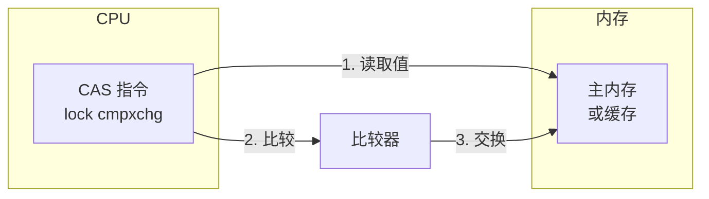
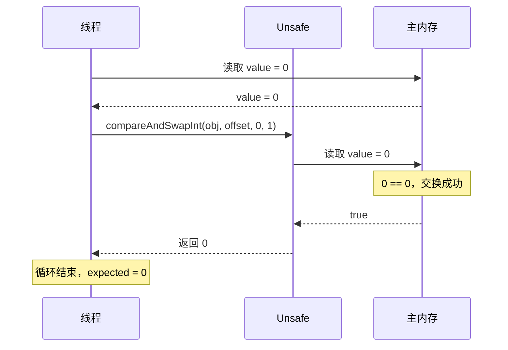
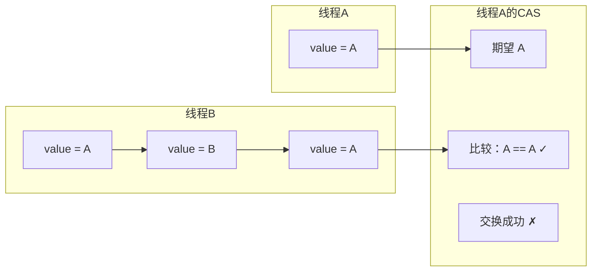
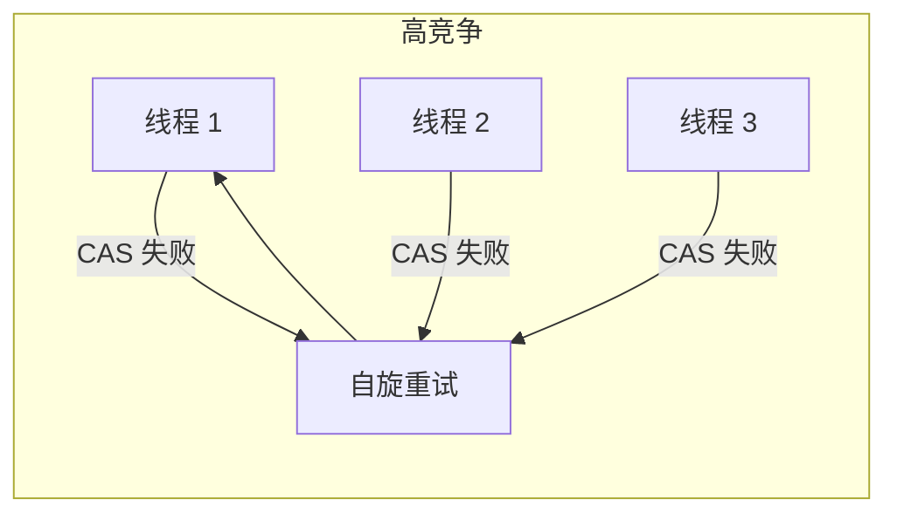

# CAS 原理与 ABA 问题

**目标级别**：P6

## 快速自测

面试官问：「什么是 CAS？ABA 问题是什么？如何解决？」

你能回答到第几层？

---

## 一、核心问题

### 🔴 什么是 CAS？

CAS（Compare-And-Swap）是 CPU 提供的**原子指令**，用于实现无锁并发。

```java
// CAS 语义
boolean CAS(expected, newValue) {
    if (currentValue == expected) {
        currentValue = newValue;
        return true;
    }
    return false;
}
```

### CAS 与 synchronized 对比

| 维度 | synchronized | CAS |
|------|--------------|-----|
| **锁机制** | 互斥锁 | 乐观锁 |
| **线程状态** | 阻塞/等待 | 自旋 |
| **性能** | 较慢 | 快（无上下文切换） |
| **复杂度** | 简单 | 复杂 |
| **适用场景** | 竞争激烈 | 竞争不激烈 |

---

## 二、CAS 原理

### 处理器支持



| 处理器 | CAS 指令 |
|--------|----------|
| x86/x64 | `lock cmpxchg` |
| ARM | `ldaxr` / `stlxr` |
| RISC-V | `amoswap` |

### Java 中的 CAS

```java title="Unsafe.java"
public final class Unsafe {
    // compareAndSwapInt
    public final native boolean 
        compareAndSwapInt(Object o, long offset, 
                          int expected, int newValue);
    
    // compareAndSwapLong
    public final native boolean 
        compareAndSwapLong(Object o, long offset,
                           long expected, long newValue);
    
    // compareAndSwapObject
    public final native boolean 
        compareAndSwapObject(Object o, long offset,
                              Object expected, Object newValue);
}
```

### AtomicInteger 实现

```java title="AtomicInteger.java"
public class AtomicInteger extends Number {
    private volatile int value;
    
    // 获取偏移量
    private static final long valueOffset;
    
    static {
        try {
            valueOffset = unsafe.objectFieldOffset(
                AtomicInteger.class.getDeclaredField("value"));
        } catch (Exception ex) { throw new Error(ex); }
    }
    
    // CAS 实现自增
    public final int incrementAndGet() {
        return unsafe.getAndAddInt(this, valueOffset, 1) + 1;
    }
    
    public final int getAndAddInt(Object o, long offset, int delta) {
        int expected;
        do {
            expected = unsafe.getIntVolatile(o, offset);
        } while (!unsafe.compareAndSwapInt(o, offset, expected, 
                                          expected + delta));
        return expected;
    }
}
```

### getAndAddInt 执行流程



---

## 三、ABA 问题

### 🔴 什么是 ABA 问题？

CAS 检查值是否变化时，只比较当前值和期望值是否相同。但如果值从 A → B → A，CAS 检查会通过，但实际值已经变化过。



### ABA 问题示例

```java
// 栈的 pop 操作
Stack<Integer> stack = new Stack<>();
stack.push(1);  // 栈：[1]
stack.push(2);  // 栈：[2, 1]

// 线程 A：期望栈顶是 2，准备 pop
// 线程 B：pop 了 2，又 push 了 2
// 线程 C：pop 了 2，又 push 了 1

// 此时线程 A 看到的栈顶还是 2，但栈的状态已经变化了
```

### 常见场景

| 场景 | 问题 |
|------|------|
| **栈/队列** | 出栈后入栈相同值 |
| **链表** | 删除节点后又插入新节点 |
| **版本号** | 版本号绕回 |
| **对象引用** | 对象被回收后创建新对象 |

---

## 四、ABA 问题解决方案

### 方案一：版本号（AtomicStampedReference）

```java title="AtomicStampedReference.java"
public class AtomicStampedReference<V> {
    // Pair<V, Integer> 存储值和版本号
    private static class Pair<T> {
        final T reference;
        final int stamp;
        private Pair(T reference, int stamp) {
            this.reference = reference;
            this.stamp = stamp;
        }
    }
    
    private volatile Pair<V> pair;
    
    public boolean compareAndSet(V expectedReference,
                                 V newReference,
                                 int expectedStamp,
                                 int newStamp) {
        Pair<V> current = pair;
        return expectedReference == current.reference &&
               expectedStamp == current.stamp &&
               ((newReference == current.reference &&
                 newStamp == current.stamp) ||
                casPair(current, Pair.of(newReference, newStamp)));
    }
}
```

### 使用示例

```java
AtomicStampedReference<Integer> ref = 
    new AtomicStampedReference<>(100, 0);

int stamp = ref.getStamp();

// 线程 A：期望值 100，版本 0，改为 200，版本 1
ref.compareAndSet(100, 200, stamp, stamp + 1);

// 线程 B：期望值 100，版本 0（过期）→ CAS 失败
ref.compareAndSet(100, 300, stamp, stamp + 1);  // false
```

### 方案二：时间戳（AtomicMarkableReference）

```java
// 只关心是否被修改过，不关心修改次数
AtomicMarkableReference<Integer> ref = 
    new AtomicMarkableReference<>(100, false);

// 修改时，mark 翻转
ref.compareAndSet(100, 200, false, true);
```

### 方案三：双重 CAS

```java
// 先比较版本，再比较值
public class DoubleCAS<T> {
    private volatile long version;
    private volatile T value;
    
    public boolean update(T expected, T newValue) {
        long currentVersion = version;
        if (value == expected && version == currentVersion) {
            // 模拟 CAS（实际需要用 Unsafe）
            value = newValue;
            version = currentVersion + 1;
            return true;
        }
        return false;
    }
}
```

---

## 五、CAS 的问题

### 问题一：自旋开销

```java
// 如果竞争激烈，CAS 会一直失败
// 线程不断自旋，消耗 CPU
public final int getAndAddInt(Object o, long offset, int delta) {
    int expected;
    do {
        expected = getIntVolatile(o, offset);  // 每次都要读取
    } while (!compareAndSwapInt(o, offset, expected, 
                                 expected + delta));
    return expected;
}
```

### 问题二：高竞争场景



| 竞争程度 | CAS 表现 |
|---------|---------|
| 低竞争 | 性能优秀 |
| 中竞争 | 性能下降 |
| 高竞争 | 可能不如锁 |

### 问题三：只能保证一个变量

```java
// 原子类只能保证一个变量的原子性
AtomicInteger a = new AtomicInteger();
AtomicInteger b = new AtomicInteger();

// 这不是原子操作
a.incrementAndGet();
b.incrementAndGet();

// 正确做法：使用锁或其他同步机制
```

---

## 六、面试题精讲

### 🔴 第一层：什么是 CAS？

> **参考答案**：
>
> CAS（Compare-And-Swap）是 CPU 提供的原子指令。Java 中通过 `Unsafe` 类的 `compareAndSwapInt` 等方法调用。其语义是：只有当当前值等于期望值时，才更新为新值，否则返回 false。
>
> ```java
> // CAS 伪代码
> if (value == expected) {
>     value = newValue;
>     return true;
> }
> return false;
> ```

### 🟡 第二层：CAS 的原理？

> **参考答案**：
>
> CAS 依赖 CPU 的 `lock cmpxchg` 指令。在 x86 架构下，这条指令：
> 1. 锁定总线（或缓存行），确保原子性
> 2. 比较目标内存和寄存器中的值
> 3. 如果相等，将新值写入内存
>
> Java 中，AtomicInteger 的 `incrementAndGet` 通过自旋 + CAS 实现无锁的自增。

### 🟡 第三层：什么是 ABA 问题？

> **参考答案**：
>
> ABA 问题是指：值从 A 变为 B 又变回 A，CAS 检查通过，但实际上值已经变化过。
>
> 解决方法是使用**版本号**（AtomicStampedReference）或**时间戳**（AtomicMarkableReference）。

### 💡 第四层：为什么 CAS 比锁快？

> **参考答案**：
>
> 1. **无阻塞**：CAS 失败后自旋，不会让线程进入阻塞状态
> 2. **无上下文切换**：线程一直在运行态，不需要切换到阻塞态再唤醒
> 3. **减少开销**：锁的获取和释放涉及系统调用，用户态/内核态切换开销大
>
> 但 CAS 只适用于竞争不激烈的场景。竞争激烈时，自旋会消耗大量 CPU，不如直接阻塞。

---

## 七、常见错误与陷阱

### ⚠️ 陷阱 1：误以为 CAS 是无锁

```java
// CAS 失败后的自旋也是"锁"
// 只是用 CPU 时间换锁
do {
    expected = value;
} while (!CAS(value, expected, expected + 1));

// 极端情况下可能永远自旋
```

### ⚠️ 陷阱 2：ABA 问题导致数据错误

```java
// 栈应用
Stack<String> stack = new Stack<>();
stack.push("A");
stack.push("B");

// 线程 A：看到了 B，准备 pop
// 线程 B：pop B，push C，push B
// 线程 A：CAS 成功，但栈结构已破坏

// 解决：使用 AtomicStampedReference
```

### ⚠️ 陷阱 3：过度依赖 CAS

```java
// 错误：每个操作都用 CAS
while (!counter.compareAndSet(counter.get(), counter.get() + 1)) {
    // 忙等待
}

// 正确：使用 LongAdder（JDK8+）
LongAdder adder = new LongAdder();
adder.increment();  // 高并发下性能更好
```

---

## 八、LongAdder 解决高并发

### 伪共享问题

```java
// LongAdder 使用分段锁减少竞争
public class LongAdder extends Striped64 {
    // 基础值
    transient volatile long base;
    // 单元数组
    transient volatile Cell[] cells;
}
```

### Cell 类（避免伪共享）

```java
// JDK 8 使用 @sun.misc.Contended
@sun.misc.Contended
static final class Cell {
    volatile long value;
    
    Cell(long x) { value = x; }
    
    final boolean cas(long cmp, long val) {
        return UNSAFE.compareAndSwapLong(this, VALUE, cmp, val);
    }
}
```

### LongAdder vs AtomicLong

| 维度 | AtomicLong | LongAdder |
|------|------------|-----------|
| **并发度** | 单一变量，高竞争下性能差 | 分段，减少竞争 |
| **延迟** | 高 | 低 |
| **空间** | 小 | 大（Cell 数组） |
| **适用场景** | 低并发 | 高并发 |

---

## 九、对比总结表

| 维度 | synchronized | CAS | LongAdder |
|------|--------------|-----|-----------|
| **机制** | 互斥锁 | 乐观锁 | 分段乐观锁 |
| **线程状态** | 阻塞 | 自旋 | 自旋 |
| **性能** | 稳定 | 竞争小时快 | 竞争大时快 |
| **ABA 问题** | 无 | 有 | 无（版本） |
| **实现复杂度** | 低 | 中 | 高 |

| ABA 解决方案 | 适用场景 |
|-------------|---------|
| AtomicStampedReference | 需要知道修改次数 |
| AtomicMarkableReference | 只关心是否修改过 |
| 业务层加版本号 | 无法使用 JDK 原子类 |

---

## 十、扩展思考

> **追问**：什么是伪共享？

CPU 缓存行是 64 字节。多个变量在同一缓存行时，一个变量修改会导致整个缓存行失效。

```java
// 伪共享示例
class FalseSharing {
    long a;  // 和 b 在同一缓存行
    long b;
}
```

> **追问**：LongAdder 如何保证最终一致性？

LongAdder 的 sum() 方法会累加 base 和所有 Cell 的值，可能有短暂的不精确（因为 Cell 还在更新），但最终会一致。

---

## 延伸阅读

- [volatile 可见性与禁止重排序](./volatile)
- [JMM 与 happens-before](./jmm)
- [LongAdder 原理](./longadder)
- [AQS 抽象队列同步器](./aqs)
