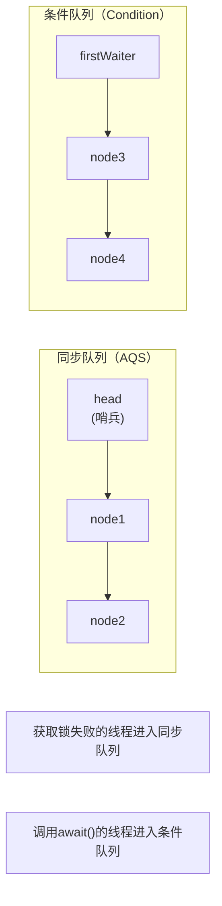

# Condition条件队列

## 面试中的高频问题

面试官问："synchronized的wait/notify和Condition有什么区别？"

候选人小张说："Condition是ReentrantLock配合使用的。"

面试官追问："具体有什么区别？"

小张说："Condition可以创建多个，wait/notify只能有一个。"

面试官继续追问："那为什么需要多个Condition？"

小张支支吾吾，没能说清楚。

Condition是Java并发中容易被忽视的概念。很多同学知道"wait/notify是Object的方法，Condition是配合ReentrantLock用的"，但对**为什么需要Condition**、**Condition的实现原理**、**生产者-消费者模式的应用**理解不深。

今天这篇文章，把Condition讲透。

## 为什么需要Condition

### Object.wait/notify的局限性

```java
// ❌ 问题：只有一个等待队列
public class SingleQueueProblem {
    private final Object lock = new Object();
    private boolean conditionA = false;
    private boolean conditionB = false;
    
    // 等待条件A
    public synchronized void waitA() throws InterruptedException {
        while (!conditionA) {
            wait();  // 只有一个等待队列
        }
        conditionA = false;
    }
    
    // 等待条件B
    public synchronized void waitB() throws InterruptedException {
        while (!conditionB) {
            wait();  // 和waitA共用同一个队列
        }
        conditionB = false;
    }
    
    // 唤醒条件A
    public synchronized void signalA() {
        conditionA = true;
        notify();  // 可能唤醒的是waitB！
    }
    
    // 唤醒条件B
    public synchronized void signalB() {
        conditionB = true;
        notify();  // 可能唤醒的是waitA！
    }
}
```

**问题**：notify()是随机唤醒的，可能唤醒错误的线程。

### notifyAll的代价

```java
// ⚠️ notifyAll可以唤醒所有等待线程
public class NotifyAllDemo {
    private final Object lock = new Object();
    private boolean ready = false;
    
    public synchronized void await() throws InterruptedException {
        while (!ready) {
            wait();
        }
    }
    
    public synchronized void signal() {
        ready = true;
        notifyAll();  // 唤醒所有线程
    }
}
```

**问题**：notifyAll唤醒了所有线程，但只有一个能获取锁，其他线程又会wait，浪费CPU。

### Condition的解决方案

```java
// ✅ 每个条件变量有独立的等待队列
public class ConditionSolution {
    private final ReentrantLock lock = new ReentrantLock();
    private final Condition conditionA = lock.newCondition();
    private final Condition conditionB = lock.newCondition();
    
    // 等待条件A - 只在conditionA队列等待
    public void awaitA() throws InterruptedException {
        lock.lock();
        try {
            while (!conditionAMet()) {
                conditionA.await();
            }
        } finally {
            lock.unlock();
        }
    }
    
    // 等待条件B - 只在conditionB队列等待
    public void awaitB() throws InterruptedException {
        lock.lock();
        try {
            while (!conditionBMet()) {
                conditionB.await();
            }
        } finally {
            lock.unlock();
        }
    }
    
    // 唤醒条件A - 只唤醒conditionA队列
    public void signalA() {
        lock.lock();
        try {
            conditionA.signal();
        } finally {
            lock.unlock();
        }
    }
    
    // 唤醒条件B - 只唤醒conditionB队列
    public void signalB() {
        lock.lock();
        try {
            conditionB.signal();
        } finally {
            lock.unlock();
        }
    }
}
```

## Condition的实现原理

### 等待队列结构

```java
// ConditionObject是AQS的内部类
public class ConditionObject implements Condition, java.io.Serializable {
    // 条件队列的头尾节点
    private transient Node firstWaiter;
    private transient Node lastWaiter;
    
    // 等待队列节点
    // 注意：这里用的是AQS.Node，但nextWaiter字段用于链接Condition队列
}
```

### 等待队列 vs 同步队列



### await()的实现

```java
// 等待条件满足
public final void await() throws InterruptedException {
    if (Thread.interrupted()) {
        throw new InterruptedException();
    }
    
    // 1. 添加到条件队列
    Node node = addConditionWaiter();
    
    // 2. 完全释放锁（支持可重入）
    int savedState = fullyRelease(node);
    
    // 3. 阻塞当前线程
    boolean interrupted = false;
    while (!isOnSyncQueue(node)) {
        LockSupport.park(this);
        if (Thread.interrupted()) {
            interrupted = true;
        }
    }
    
    // 4. 重新获取锁
    if (acquireQueued(node, savedState) || interrupted) {
        selfInterrupt();
    }
}

private Node addConditionWaiter() {
    Node t = lastWaiter;
    // 清除取消的节点
    if (t != null && t.waitStatus != Node.CONDITION) {
        unlinkCancelledWaiters();
        t = lastWaiter;
    }
    
    // 创建新节点，加入条件队列
    Node node = new Node(Thread.currentThread(), Node.CONDITION);
    if (t == null) {
        firstWaiter = node;
    } else {
        t.nextWaiter = node;
    }
    lastWaiter = node;
    return node;
}
```

### signal()的实现

```java
// 唤醒一个等待线程
public final void signal() {
    if (!isHeldExclusively()) {
        throw new IllegalMonitorStateException();
    }
    
    Node first = firstWaiter;
    if (first != null) {
        doSignal(first);
    }
}

private void doSignal(Node first) {
    do {
        // 从条件队列移除
        nextWaiter = first.nextWaiter;
        first.nextWaiter = null;
        
        // 移动到同步队列（尝试唤醒）
        if (!transferForSignal(first)) {
            // 如果失败，尝试下一个节点
            first = firstWaiter;
        }
    } while (first != null && !transferForSignal(first));
}

final boolean transferForSignal(Node node) {
    // 修改等待状态
    if (!node.compareAndSetWaitStatus(Node.CONDITION, 0)) {
        return false;  // 节点已被取消
    }
    
    // 加入同步队列
    Node p = enq(node);
    int ws = node.waitStatus;
    if (ws > 0 || !node.compareAndSetWaitStatus(ws, Node.SIGNAL)) {
        // 如果节点被取消或设置SIGNAL失败，唤醒线程
        LockSupport.unpark(node.thread);
    }
    return true;
}
```

### signalAll()的实现

```java
// 唤醒所有等待线程
public final void signalAll() {
    if (!isHeldExclusively()) {
        throw new IllegalMonitorStateException();
    }
    
    Node first = firstWaiter;
    if (first != null) {
        // 唤醒所有节点
        doSignalAll(first);
    }
}

private void doSignalAll(Node first) {
    lastWaiter = firstWaiter = null;
    do {
        Node next = first.nextWaiter;
        first.nextWaiter = null;
        transferForSignal(first);
        first = next;
    } while (first != null);
}
```

## 生产者-消费者模式

### 有界阻塞队列

```java
public class BoundedBlockingQueue<T> {
    private final Object[] items;
    private int count = 0;
    private int putIndex = 0;
    private int takeIndex = 0;
    
    private final ReentrantLock lock = new ReentrantLock();
    private final Condition notFull = lock.newCondition();   // 队列不满
    private final Condition notEmpty = lock.newCondition();  // 队列不空
    
    public BoundedBlockingQueue(int capacity) {
        items = new Object[capacity];
    }
    
    // 生产者：放入元素
    public void put(T item) throws InterruptedException {
        lock.lockInterruptibly();
        try {
            // 队列满，等待
            while (count == items.length) {
                notFull.await();
            }
            
            // 放入元素
            items[putIndex] = item;
            if (++putIndex == items.length) {
                putIndex = 0;
            }
            count++;
            
            // 唤醒消费者
            notEmpty.signal();
        } finally {
            lock.unlock();
        }
    }
    
    // 消费者：取出元素
    public T take() throws InterruptedException {
        lock.lockInterruptibly();
        try {
            // 队列空，等待
            while (count == 0) {
                notEmpty.await();
            }
            
            // 取出元素
            @SuppressWarnings("unchecked")
            T item = (T) items[takeIndex];
            items[takeIndex] = null;  // 帮助GC
            if (++takeIndex == items.length) {
                takeIndex = 0;
            }
            count--;
            
            // 唤醒生产者
            notFull.signal();
            return item;
        } finally {
            lock.unlock();
        }
    }
    
    // 带超时的put
    public boolean offer(T item, long timeout, TimeUnit unit) 
            throws InterruptedException {
        long nanos = unit.toNanos(timeout);
        lock.lockInterruptibly();
        try {
            while (count == items.length) {
                if (nanos <= 0) {
                    return false;
                }
                nanos = notFull.awaitNanos(nanos);
            }
            
            items[putIndex] = item;
            if (++putIndex == items.length) {
                putIndex = 0;
            }
            count++;
            
            notEmpty.signal();
            return true;
        } finally {
            lock.unlock();
        }
    }
}
```

### 线程池任务队列

```java
public class TaskQueue {
    private final ReentrantLock lock = new ReentrantLock();
    private final Condition available = lock.newCondition();
    private final Queue<Runnable> queue = new LinkedList<>();
    
    public Runnable take() throws InterruptedException {
        lock.lockInterruptibly();
        try {
            while (queue.isEmpty()) {
                available.await();
            }
            return queue.poll();
        } finally {
            lock.unlock();
        }
    }
    
    public void put(Runnable task) {
        lock.lock();
        try {
            queue.offer(task);
            available.signal();
        } finally {
            lock.unlock();
        }
    }
}
```

## await()的超时版本

### awaitNanos

```java
public class TimedAwaitDemo {
    private final ReentrantLock lock = new ReentrantLock();
    private final Condition condition = lock.newCondition();
    
    public boolean awaitWithTimeout(long time, TimeUnit unit) 
            throws InterruptedException {
        lock.lock();
        try {
            // awaitNanos返回剩余时间
            long nanosRemaining = unit.toNanos(time);
            while (!conditionMet()) {
                if (nanosRemaining <= 0) {
                    return false;  // 超时
                }
                nanosRemaining = condition.awaitNanos(nanosRemaining);
            }
            return true;
        } finally {
            lock.unlock();
        }
    }
}
```

### 实际应用：限时等待

```java
public class TimeoutDemo {
    private final ReentrantLock lock = new ReentrantLock();
    private final Condition responseReady = lock.newCondition();
    private String response;
    
    public String getResponse(long timeout, TimeUnit unit) 
            throws InterruptedException {
        lock.lock();
        try {
            long nanos = unit.toNanos(timeout);
            while (response == null) {
                if (nanos <= 0) {
                    return null;  // 超时
                }
                nanos = responseReady.awaitNanos(nanos);
            }
            return response;
        } finally {
            lock.unlock();
        }
    }
    
    public void setResponse(String resp) {
        lock.lock();
        try {
            this.response = resp;
            responseReady.signal();
        } finally {
            lock.unlock();
        }
    }
}
```

## 与Object.wait/notify的区别

### 功能对比

| 特性 | Object.wait/notify | Condition |
|------|-------------------|-----------|
| 锁类型 | 必须配合synchronized | 必须配合ReentrantLock |
| 队列数量 | 只有一个等待队列 | 可以创建多个Condition |
| 唤醒方式 | notify/notifyAll | signal/signalAll |
| 中断响应 | 支持 | 支持 |
| 超时等待 | 支持 | 支持（awaitNanos） |
| 公平性 | 不支持 | 支持（取决于锁） |

### 代码对比

```java
// synchronized + Object.wait/notify
public class SyncVersion {
    private final Object lock = new Object();
    
    public void await() throws InterruptedException {
        synchronized (lock) {
            while (!condition()) {
                lock.wait();
            }
        }
    }
    
    public void signal() {
        synchronized (lock) {
            lock.notify();
        }
    }
}

// ReentrantLock + Condition
public class ConditionVersion {
    private final ReentrantLock lock = new ReentrantLock();
    private final Condition condition = lock.newCondition();
    
    public void await() throws InterruptedException {
        lock.lock();
        try {
            while (!condition()) {
                condition.await();
            }
        } finally {
            lock.unlock();
        }
    }
    
    public void signal() {
        lock.lock();
        try {
            condition.signal();
        } finally {
            lock.unlock();
        }
    }
}
```

## 面试中的高频追问

### 追问1：为什么Condition必须在lock块中调用？

因为await/signal需要获取关联的锁：
- await()需要释放锁
- signal()需要检查锁的持有状态

如果不先获取锁，会抛出IllegalMonitorStateException。

### 追问2：signal()为什么可能失败？

```java
public class SignalFailure {
    public void signalFailureScenario() {
        // signal()可能唤醒一个已经被取消的节点
        // 或者节点状态已经变化
        
        // 这是为什么通常用while(!condition)的原因
    }
}
```

### 追问3：await()被中断会怎样？

```java
public class AwaitInterrupt {
    public void awaitInterruptDemo() throws InterruptedException {
        ReentrantLock lock = new ReentrantLock();
        Condition condition = lock.newCondition();
        
        lock.lock();
        try {
            // 如果被中断，await()抛出InterruptedException
            condition.await();  // throws InterruptedException
            
            // 或者使用可中断版本
            condition.awaitInterruptibly();
        } finally {
            lock.unlock();
        }
    }
}
```

### 追问4：signal()和signalAll()的选择？

- signal()：性能更好，但可能唤醒错误线程导致活锁
- signalAll()：更安全，但可能浪费CPU

一般原则：能确定唤醒哪个线程时用signal()，不确定时用signalAll()。

## 【学习小结】

1. **为什么需要Condition**：解决单一等待队列的局限性
2. **Condition vs Object.wait**：多队列 vs 单队列、ReentrantLock vs synchronized
3. **await()流程**：加入条件队列 → 释放锁 → 阻塞 → 被唤醒后重新获取锁
4. **signal()流程**：从条件队列移到同步队列 → 尝试获取锁
5. **应用场景**：生产者-消费者、限流器、线程池任务队列
6. **注意事项**：必须在lock块中调用、while循环检查条件
7. **超时等待**：使用awaitNanos()实现限时等待

---

**延伸阅读**：
- [ReentrantLock公平锁 vs 非公平锁](/java/concurrent/reentrantlock)
- [AQS抽象队列同步器原理](/java/concurrent/aqs)
- [阻塞队列（Array/Linked/Synchronous/Delay）](/java/concurrent/blocking-queue)