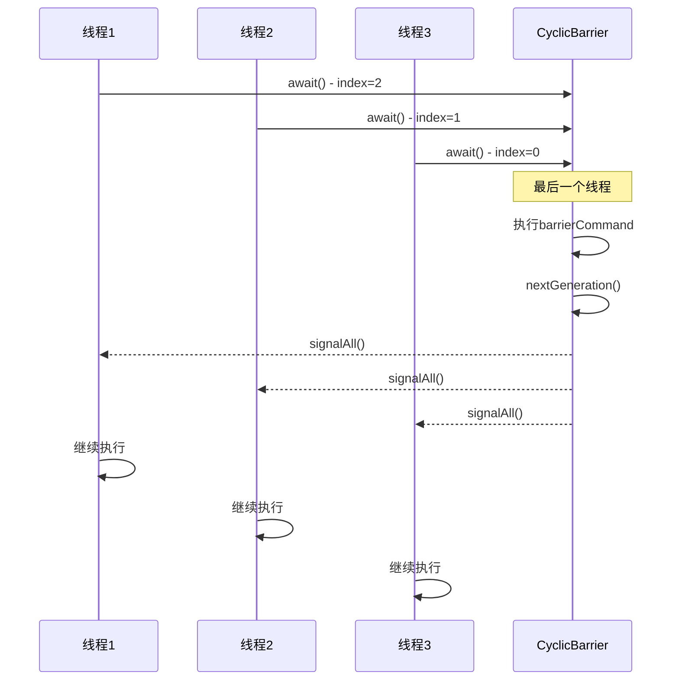

# CyclicBarrier原理与使用

## 一个让候选人翻车的面试题

面试官问："CyclicBarrier和CountDownLatch有什么区别？"

候选人小张说："CyclicBarrier可以循环使用，CountDownLatch不能。"

面试官追问："CyclicBarrier怎么实现循环的？"

小张说："呃...可能每次调用await()就会重置？"

面试官继续追问："那CyclicBarrier的broken barrier是什么？"

小张彻底卡住了。

CyclicBarrier和CountDownLatch看似相似，实际上有很大不同。理解CyclicBarrier的实现原理，对理解线程同步有重要意义。

今天这篇文章，把CyclicBarrier讲透。

## 什么是CyclicBarrier

### 基本概念

```java
public class CyclicBarrierDemo {
    public static void main(String[] args) {
        // 创建屏障，参与者数量为3
        CyclicBarrier barrier = new CyclicBarrier(3);
        
        for (int i = 0; i < 3; i++) {
            new Thread(() -> {
                try {
                    System.out.println(Thread.currentThread().getName() + " 到达");
                    barrier.await();  // 等待其他人
                    System.out.println(Thread.currentThread().getName() + " 继续");
                } catch (Exception e) {}
            }).start();
        }
    }
}
```

**输出**：
```
Thread-0 到达
Thread-1 到达
Thread-2 到达
Thread-0 继续
Thread-1 继续
Thread-2 继续
```

### 与CountDownLatch的本质区别

```java
// CountDownLatch：主线程等待子任务完成
// 示例：3个子任务完成后，主线程继续
CountDownLatch latch = new CountDownLatch(3);
for (int i = 0; i < 3; i++) {
    new Thread(() -> {
        doTask();
        latch.countDown();  // 子任务通知完成
    }).start();
}
latch.await();  // 主线程等待
// 主线程继续

// CyclicBarrier：线程之间互相等待
// 示例：3个线程都到达某点后，一起继续
CyclicBarrier barrier = new CyclicBarrier(3);
for (int i = 0; i < 3; i++) {
    new Thread(() -> {
        doPhase1();
        barrier.await();  // 等待其他人
        doPhase2();      // 所有人一起执行Phase2
    }).start();
}
```

## CyclicBarrier的实现原理

### 核心数据结构

```java
public class CyclicBarrier {
    // 锁（用于保护parties和count的修改）
    private final ReentrantLock lock = new ReentrantLock();
    
    // 条件：等待最后一个线程
    private final Condition trip = lock.newCondition();
    
    // 参与者数量
    private final int parties;
    
    // 最后一个线程执行的操作
    private final Runnable barrierCommand;
    
    // 当前Generation（用于区分轮次）
    private Generation generation = new Generation();
    
    // 剩余等待的线程数
    private int count;
}
```

### Generation机制

```java
// Generation用于追踪每个"循环"
private static class Generation {
    boolean broken = false;  // 是否被破坏
}

// 创建一个新的Generation
private void nextGeneration() {
    // 唤醒所有等待的线程
    trip.signalAll();
    // 重置count为parties
    count = parties;
    // 创建新Generation
    generation = new Generation();
}

// 破坏当前Generation
private void breakBarrier() {
    generation.broken = true;  // 标记为破坏
    count = parties;          // 重置count
    trip.signalAll();          // 唤醒所有线程
}
```

### await()的实现

```java
public int await() throws InterruptedException, BrokenBarrierException {
    return dowait(false, 0L);
}

private int dowait(boolean timed, long nanos) throws InterruptedException, BrokenBarrierException, TimeoutException {
    final ReentrantLock lock = this.lock;
    lock.lock();
    try {
        Generation g = generation;
        
        // 检查是否被破坏
        if (g.broken) {
            throw new BrokenBarrierException();
        }
        
        // 检查中断
        if (Thread.interrupted()) {
            breakBarrier();
            throw new InterruptedException();
        }
        
        // 计数减1
        int index = --count;
        
        if (index == 0) {
            // 最后一个线程
            boolean ranAction = false;
            try {
                // 执行barrierAction
                final Runnable command = barrierCommand;
                if (command != null) {
                    command.run();
                    ranAction = true;
                }
                // 开启新一代
                nextGeneration();
                return 0;
            } finally {
                if (!ranAction) {
                    breakBarrier();
                }
            }
        }
        
        // 不是最后一个线程，等待
        for (;;) {
            try {
                if (!timed) {
                    trip.await();  // 无限等待
                } else if (nanos > 0L) {
                    nanos = trip.awaitNanos(nanos);
                }
            } catch (InterruptedException ie) {
                if (g == generation && !g.broken) {
                    breakBarrier();
                    throw ie;
                } else {
                    Thread.currentThread().interrupt();
                }
            }
            
            // 检查是否被破坏
            if (g.broken) {
                throw new BrokenBarrierException();
            }
            
            // 检查是否进入新一代
            if (g != generation) {
                return index;
            }
            
            // 检查超时
            if (timed && nanos <= 0L) {
                breakBarrier();
                throw new TimeoutException();
            }
        }
    } finally {
        lock.unlock();
    }
}
```

### 流程图



## Broken Barrier

### 什么情况下Barrier会broken

```java
public class BrokenBarrierDemo {
    public static void main(String[] args) throws InterruptedException {
        CyclicBarrier barrier = new CyclicBarrier(3);
        
        Thread t1 = new Thread(() -> {
            try {
                barrier.await();
            } catch (Exception e) {
                System.out.println("线程1捕获异常: " + e.getClass().getSimpleName());
            }
        });
        
        Thread t2 = new Thread(() -> {
            try {
                Thread.sleep(100);
                t1.interrupt();  // 中断线程1
                barrier.await();
            } catch (Exception e) {
                System.out.println("线程2捕获异常: " + e.getClass().getSimpleName());
            }
        });
        
        Thread t3 = new Thread(() -> {
            try {
                barrier.await();
            } catch (Exception e) {
                System.out.println("线程3捕获异常: " + e.getClass().getSimpleName());
            }
        });
        
        t1.start();
        t2.start();
        t3.start();
    }
}
```

**结果**：
```
线程1捕获异常: InterruptedException
线程3捕获异常: BrokenBarrierException
线程2捕获异常: BrokenBarrierException
```

### BrokenBarrierException的捕获

```java
public class HandleBrokenBarrier {
    public void demo() {
        CyclicBarrier barrier = new CyclicBarrier(3);
        
        for (int i = 0; i < 3; i++) {
            final int id = i;
            new Thread(() -> {
                try {
                    try {
                        barrier.await();
                        System.out.println("线程" + id + " 通过屏障");
                    } catch (BrokenBarrierException e) {
                        // Barrier被破坏
                        System.out.println("线程" + id + " 检测到Barrier被破坏");
                        throw e;
                    }
                } catch (InterruptedException e) {
                    Thread.currentThread().interrupt();
                }
            }).start();
        }
    }
}
```

## 可循环使用

### reset()方法

```java
public class ResetDemo {
    public void demo() throws InterruptedException, BrokenBarrierException {
        CyclicBarrier barrier = new CyclicBarrier(3);
        
        // 第一轮
        System.out.println("第一轮开始");
        for (int i = 0; i < 3; i++) {
            final int id = i;
            new Thread(() -> {
                try {
                    barrier.await();
                    System.out.println("线程" + id + " 完成第一轮");
                } catch (Exception e) {}
            }).start();
        }
        
        Thread.sleep(500);
        
        // 第二轮 - 同样的barrier可以复用
        System.out.println("第二轮开始");
        for (int i = 0; i < 3; i++) {
            final int id = i;
            new Thread(() -> {
                try {
                    barrier.await();
                    System.out.println("线程" + id + " 完成第二轮");
                } catch (Exception e) {}
            }).start();
        }
    }
}
```

### reset()的实现

```java
public void reset() {
    final ReentrantLock lock = this.lock;
    lock.lock();
    try {
        breakBarrier();  // 破坏当前generation
        nextGeneration(); // 创建新generation
    } finally {
        lock.unlock();
    }
}
```

## 带超时的await

```java
public class TimedAwaitDemo {
    public void demo() throws InterruptedException {
        CyclicBarrier barrier = new CyclicBarrier(3);
        
        // 等待5秒
        for (int i = 0; i < 3; i++) {
            final int id = i;
            new Thread(() -> {
                try {
                    boolean passed = barrier.await(5, TimeUnit.SECONDS);
                    if (passed) {
                        System.out.println("线程" + id + " 通过");
                    }
                } catch (TimeoutException e) {
                    System.out.println("线程" + id + " 超时");
                } catch (Exception e) {}
            }).start();
        }
    }
}
```

## 生产中的实际应用

### 场景1：多阶段计算

```java
public class MultiPhaseComputation {
    public void compute() throws InterruptedException, BrokenBarrierException {
        CyclicBarrier barrier = new CyclicBarrier(4);
        
        // 阶段1：并行读取数据
        new Thread(() -> readFromDB(barrier), "DB").start();
        new Thread(() -> readFromCache(barrier), "Cache").start();
        new Thread(() -> readFromFile(barrier), "File").start();
        new Thread(() -> readFromNetwork(barrier), "Network").start();
        
        barrier.await();
        
        // 阶段2：数据合并（所有人同时开始）
        mergeData();
        
        // 阶段3：计算
        barrier.await();
        calculate();
    }
    
    private void readFromDB(CyclicBarrier barrier) {
        try {
            // 读取数据库
            barrier.await();  // 等待所有人
        } catch (Exception e) {}
    }
    
    // 其他方法类似...
}
```

### 场景2：多线程游戏关卡

```java
public class GameLevel {
    public void playLevel(int levelId) throws InterruptedException, BrokenBarrierException {
        CyclicBarrier barrier = new CyclicBarrier(5);  // 5个玩家
        
        ExecutorService executor = Executors.newFixedThreadPool(5);
        for (int i = 0; i < 5; i++) {
            final int playerId = i;
            executor.submit(() -> {
                try {
                    // 进入关卡
                    enterLevel(levelId, playerId);
                    
                    // 等待所有玩家加载完成
                    barrier.await();
                    
                    // 开始战斗
                    startBattle(playerId);
                    
                    // 等待所有玩家战斗完成
                    barrier.await();
                    
                } catch (Exception e) {}
            });
        }
        
        executor.shutdown();
    }
}
```

### 场景3：批量任务处理

```java
public class BatchProcessor {
    public void processBatch(List<Task> tasks) throws InterruptedException, BrokenBarrierException {
        int threadCount = Runtime.getRuntime().availableProcessors();
        int batchSize = (tasks.size() + threadCount - 1) / threadCount;
        
        CyclicBarrier barrier = new CyclicBarrier(threadCount, () -> {
            // 所有批次完成后执行
            System.out.println("一批处理完成，准备下一批");
        });
        
        for (int i = 0; i < threadCount; i++) {
            final int start = i * batchSize;
            final int end = Math.min(start + batchSize, tasks.size());
            
            new Thread(() -> {
                try {
                    for (int j = start; j < end; j++) {
                        processTask(tasks.get(j));
                    }
                    barrier.await();  // 等待其他批次
                } catch (Exception e) {}
            }).start();
        }
    }
}
```

## 与CountDownLatch的对比

### 功能对比

| 特性 | CountDownLatch | CyclicBarrier |
|------|----------------|---------------|
| 是否可重置 | ❌ | ✅ |
| 等待方向 | 主线程等待子任务 | 线程互相等待 |
| 触发机制 | 计数递减到0 | 计数递增到parties |
| 完成后动作 | 无 | 可执行barrierCommand |
| 适用场景 | 一次性等待 | 分阶段同步 |

### 选择建议

```java
// 使用CountDownLatch的场景
// 1. 一次性等待
// 2. 主线程等待多个子任务完成
CountDownLatch latch = new CountDownLatch(n);
for (int i = 0; i < n; i++) {
    new Thread(() -> {
        doTask();
        latch.countDown();
    }).start();
}
latch.await();

// 使用CyclicBarrier的场景
// 1. 分阶段执行
// 2. 线程互相等待
// 3. 需要复用
CyclicBarrier barrier = new CyclicBarrier(n);
for (int i = 0; i < n; i++) {
    new Thread(() -> {
        doPhase1();
        barrier.await();
        doPhase2();
    }).start();
}
```

## 面试中的高频追问

### 追问1：CyclicBarrier如何实现可循环？

通过Generation机制：
- 每个"循环"有一个Generation对象
- 最后一个线程到达时，调用nextGeneration()创建新Generation
- 重置count为parties
- 所有线程醒来后检查generation，发现是新generation就知道进入下一轮

### 追问2：为什么叫Cyclic？

因为可以循环使用：
- 每次await()成功后，所有线程继续执行
- 可以再次await()开始新一轮
- 通过reset()可以强制重置

### 追问3：barrierCommand什么时候执行？

当最后一个线程调用await()时，在唤醒其他线程之前执行：

```java
if (index == 0) {
    // 最后一个线程
    Runnable command = barrierCommand;
    if (command != null) {
        command.run();  // 执行barrierCommand
    }
    nextGeneration();  // 然后唤醒其他线程
}
```

### 追问4：Broken Barrier是如何产生的？

以下情况会导致Barrier broken：
1. 等待中的线程被中断
2. await()超时
3. reset()被调用

## 【学习小结】

1. **CyclicBarrier**：可循环的屏障，线程互相等待
2. **核心组件**：ReentrantLock + Condition + Generation
3. **Generation机制**：区分每轮循环，支持reset()
4. **await()流程**：计数递减→最后一个线程执行barrierCommand→唤醒所有线程
5. **Broken Barrier**：线程中断、超时、reset导致
6. **可重置**：reset()或一轮完成后自动重置
7. **选择CountDownLatch**：一次性等待；**选择CyclicBarrier**：分阶段同步、需要复用

---

**延伸阅读**：
- [CountDownLatch原理与使用](/java/concurrent/countdownlatch)
- [Semaphore信号量](/java/concurrent/semaphore)
- [AQS抽象队列同步器原理](/java/concurrent/aqs)