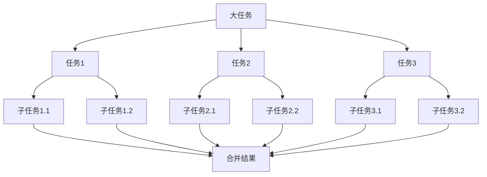
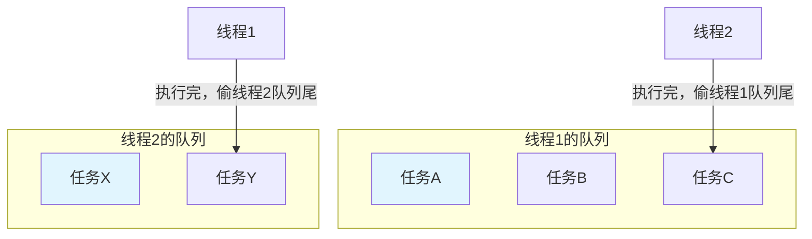

# Fork/Join 框架

在项目中处理分治并行任务时，很多同学会用 ThreadPoolExecutor，但被问到"为什么 Fork/Join 更快"和"RecursiveTask 怎么用"时，往往说不清楚。我自己也踩过坑——任务拆分太细，导致大量线程创建开销。

今天我们就来把这个分治并行框架彻底讲清楚。

## 一、Fork/Join 设计理念

### 1.1 分治思想

Fork/Join 基于"分而治之"的思想：
1. **Fork（分解）**：把大任务分解成多个小任务，并行执行
2. **Join（合并）**：等待所有子任务完成，合并结果



### 1.2 与线程池的区别

| 特性 | ThreadPoolExecutor | ForkJoinPool |
| --- | --- | --- |
| 任务队列 | 每个线程一个队列 | 每个线程一个双端队列 |
| 任务获取 | 从队列头部取 | 从自己队列头部取，偷别人的尾部 |
| 负载均衡 | 无自动均衡 | 工作窃取（Work-Stealing） |
| 适用场景 | 独立任务 | 递归分治任务 |

### 1.3 工作窃取原理



**工作窃取特点**：
- 空闲线程从其他线程队列尾部偷任务
- 减少线程等待时间
- 适合递归分治任务（子任务大小不均）

## 二、ForkJoinPool

### 2.1 创建方式

```java
// 方式1：使用默认公共池
ForkJoinPool pool = ForkJoinPool.commonPool();

// 方式2：创建指定大小的池
ForkJoinPool pool = new ForkJoinPool(4);  // 4个线程

// 方式3：通过系统属性配置
// -Djava.util.concurrent.ForkJoinPool.common.parallelism=4
```

### 2.2 执行任务

```java
// 使用 invoke
int result = pool.invoke(new SumTask(0, 1000000));

// 使用 submit
ForkJoinTask<Integer> task = pool.submit(new SumTask(0, 1000000));
int result = task.join();

// 使用 execute（异步）
pool.execute(new SumTask(0, 1000000));
```

## 三、RecursiveTask 与 RecursiveAction

### 3.1 RecursiveTask（有返回值）

```java
public class SumTask extends RecursiveTask<Long> {
    private final long[] array;
    private final int start;
    private final int end;
    private static final int THRESHOLD = 1000;

    public SumTask(long[] array, int start, int end) {
        this.array = array;
        this.start = start;
        this.end = end;
    }

    @Override
    protected Long compute() {
        int length = end - start;
        if (length <= THRESHOLD) {
            // 任务足够小，直接计算
            return computeDirectly();
        }
        
        // 拆分成两个子任务
        int middle = start + length / 2;
        SumTask leftTask = new SumTask(array, start, middle);
        SumTask rightTask = new SumTask(array, middle, end);
        
        // Fork：异步执行两个子任务
        leftTask.fork();
        rightTask.fork();
        
        // Join：合并结果
        return leftTask.join() + rightTask.join();
    }

    private Long computeDirectly() {
        long sum = 0;
        for (int i = start; i < end; i++) {
            sum += array[i];
        }
        return sum;
    }
}
```

### 3.2 RecursiveAction（无返回值）

```java
public class PrintTask extends RecursiveAction {
    private final int[] array;
    private final int start;
    private final int end;
    private static final int THRESHOLD = 100;

    public PrintTask(int[] array, int start, int end) {
        this.array = array;
        this.start = start;
        this.end = end;
    }

    @Override
    protected void compute() {
        int length = end - start;
        if (length <= THRESHOLD) {
            // 直接执行
            for (int i = start; i < end; i++) {
                System.out.println(array[i]);
            }
            return;
        }

        // 拆分任务
        int middle = start + length / 2;
        invokeAll(
            new PrintTask(array, start, middle),
            new PrintTask(array, middle, end)
        );
    }
}
```

### 3.3 fork/join vs invokeAll

```java
// fork/join 方式
leftTask.fork();
rightTask.fork();
return leftTask.join() + rightTask.join();

// invokeAll 方式
invokeAll(leftTask, rightTask);
return leftTask.join() + rightTask.join();

// invokeAll 更简洁，推荐使用
```

## 四、并行排序示例

### 4.1 并行归并排序

```java
public class ParallelMergeSort extends RecursiveAction {
    private final int[] array;
    private final int start;
    private final int end;
    private static final int THRESHOLD = 1000;

    public ParallelMergeSort(int[] array, int start, int end) {
        this.array = array;
        this.start = start;
        this.end = end;
    }

    @Override
    protected void compute() {
        int length = end - start;
        if (length <= THRESHOLD) {
            Arrays.sort(array, start, end);
            return;
        }

        int middle = start + length / 2;
        
        ParallelMergeSort left = new ParallelMergeSort(array, start, middle);
        ParallelMergeSort right = new ParallelMergeSort(array, middle, end);
        
        invokeAll(left, right);
        merge(start, middle, end);
    }

    private void merge(int start, int middle, int end) {
        int[] temp = new int[end - start];
        int i = start, j = middle, k = 0;
        
        while (i < middle && j < end) {
            if (array[i] <= array[j]) {
                temp[k++] = array[i++];
            } else {
                temp[k++] = array[j++];
            }
        }
        
        while (i < middle) temp[k++] = array[i++];
        while (j < end) temp[k++] = array[j++];
        
        System.arraycopy(temp, 0, array, start, temp.length);
    }
}
```

### 4.2 使用并行排序

```java
public class ParallelSortDemo {
    public static void main(String[] args) {
        int[] array = new int[10_000_000];
        Random random = new Random();
        for (int i = 0; i < array.length; i++) {
            array[i] = random.nextInt();
        }

        ForkJoinPool pool = new ForkJoinPool();
        ParallelMergeSort task = new ParallelMergeSort(array, 0, array.length);

        long start = System.nanoTime();
        pool.invoke(task);
        long end = System.nanoTime();

        System.out.println("Parallel sort time: " + 
            TimeUnit.NANOSECONDS.toMillis(end - start) + "ms");
    }
}
```

## 五、生产环境应用

### 5.1 并行计算

```java
public class ParallelCalculator {
    private final ForkJoinPool pool;

    public ParallelCalculator() {
        this.pool = ForkJoinPool.commonPool();
    }

    public CompletableFuture<Double> calculate(List<Double> values) {
        return CompletableFuture.supplyAsync(
            () -> pool.invoke(new SumDoubleTask(values, 0, values.size())),
            pool
        );
    }
}

class SumDoubleTask extends RecursiveTask<Double> {
    private final List<Double> values;
    private final int start;
    private final int end;
    private static final int THRESHOLD = 1000;

    SumDoubleTask(List<Double> values, int start, int end) {
        this.values = values;
        this.start = start;
        this.end = end;
    }

    @Override
    protected Double compute() {
        int length = end - start;
        if (length <= THRESHOLD) {
            return values.subList(start, end).stream()
                .mapToDouble(Double::doubleValue).sum();
        }

        int middle = start + length / 2;
        SumDoubleTask left = new SumDoubleTask(values, start, middle);
        SumDoubleTask right = new SumDoubleTask(values, middle, end);
        
        invokeAll(left, right);
        return left.join() + right.join();
    }
}
```

### 5.2 并行处理树形结构

```java
public class TreeTraversalTask extends RecursiveTask<List<String>> {
    private final TreeNode node;
    private static final int LEAF_THRESHOLD = 10;

    public TreeTraversalTask(TreeNode node) {
        this.node = node;
    }

    @Override
    protected List<String> compute() {
        List<String> results = new ArrayList<>();
        
        if (node.children.size() <= LEAF_THRESHOLD) {
            return traverseSequentially(node);
        }

        List<TreeTraversalTask> tasks = new ArrayList<>();
        for (TreeNode child : node.children) {
            tasks.add(new TreeTraversalTask(child));
        }
        
        invokeAll(tasks);
        
        for (TreeTraversalTask task : tasks) {
            results.addAll(task.join());
        }
        
        results.add(node.name);
        return results;
    }

    private List<String> traverseSequentially(TreeNode node) {
        List<String> results = new ArrayList<>();
        results.add(node.name);
        for (TreeNode child : node.children) {
            results.addAll(traverseSequentially(child));
        }
        return results;
    }
}
```

## 六、常见问题与避坑

### 6.1 任务拆分过细

```java
// 错误：任务拆分过细
protected Long compute() {
    if (end - start <= 1) {
        return array[start];
    }
    
    // 拆分太细，每个任务开销大于计算
    SumTask left = new SumTask(array, start, start + 1);
    SumTask right = new SumTask(array, start + 1, end);
    left.fork();
    right.fork();
    return left.join() + right.join();
}

// 正确：设置合理的阈值
protected Long compute() {
    if (end - start <= THRESHOLD) {
        return computeDirectly();  // THRESHOLD 通常 100-1000
    }
    // ...
}
```

### 6.2 忘记 join

```java
// 错误：fork 后忘记 join
protected Long compute() {
    SumTask left = new SumTask(...);
    SumTask right = new SumTask(...);
    
    left.fork();
    right.fork();
    
    // 忘记 join！结果不正确
    return 0L;
}

// 正确：join 获取结果
protected Long compute() {
    SumTask left = new SumTask(...);
    SumTask right = new SumTask(...);
    
    left.fork();
    right.fork();
    
    return left.join() + right.join();
}
```

### 6.3 递归深度过大

```java
// 问题：递归深度过大可能导致栈溢出
// 例如：10亿数据，阈值1000，递归深度 ~17 层
// 但如果阈值只有 10，递归深度 ~10 层

// 解决：设置合理的阈值，或使用迭代方式
private static final int THRESHOLD = 1000;
```

### 6.4 使用普通线程池的问题

```java
// 错误：用 ThreadPoolExecutor 执行分治任务
ExecutorService pool = Executors.newFixedThreadPool(10);
pool.submit(() -> {
    // 递归分治任务
    // 问题：线程等待子任务完成，效率低
});

// 正确：用 ForkJoinPool
ForkJoinPool pool = new ForkJoinPool();
pool.invoke(new Task());
```

## 七、性能调优

### 7.1 线程数设置

```java
// 获取可用处理器数
int processors = Runtime.getRuntime().availableProcessors();

// ForkJoinPool 线程数通常设为处理器数
ForkJoinPool pool = new ForkJoinPool(processors);

// 也可以通过构造函数指定并发度
ForkJoinPool pool = new ForkJoinPool(
    processors,  // 并发度
    ForkJoinPool.defaultForkJoinWorkerThreadFactory,  // 工厂
    null,  // 异常处理器
    true   // 异步模式
);
```

### 7.2 阈值设置

```java
// 阈值设置原则：
// 1. 任务太小不值得并行
// 2. 任务太大拆分开销大
// 3. 通常 100-1000 比较合适

// 计算密集型：阈值 500-2000
// I/O 混合型：阈值 100-500

private static final int THRESHOLD = calculateThreshold();

private static int calculateThreshold() {
    int processors = Runtime.getRuntime().availableProcessors();
    // 每个线程至少处理 500 个元素
    return Math.max(500, 10000 / processors);
}
```

### 7.3 监控

```java
// 通过 JMX 监控
ForkJoinPool pool = ForkJoinPool.commonPool();

System.out.println("Pool parallelism: " + pool.getParallelism());
System.out.println("Active threads: " + pool.getActiveThreadCount());
System.out.println("Running threads: " + pool.getRunningThreadCount());
System.out.println("Queued tasks: " + pool.getQueuedSubmissionCount());
System.out.println("Steals: " + pool.getStealCount());
```

## 【学习小结】

本篇文章的核心要点：

1. **Fork/Join 设计理念**：分治思想，通过 fork 分解任务，join 合并结果
2. **工作窃取机制**：空闲线程从其他线程队列尾部偷任务，实现负载均衡
3. **RecursiveTask**：有返回值的分治任务
4. **RecursiveAction**：无返回值的分治任务
5. **fork/join**：fork 异步执行，join 等待并获取结果
6. **invokeAll**：更简洁的批量执行方式
7. **阈值设置**：任务拆分太细会增加开销，阈值 100-1000 比较合适
8. **适用场景**：并行排序、树遍历、批量计算等分治任务
9. **与 ThreadPoolExecutor 的区别**：Fork/Join 更适合递归分治任务
