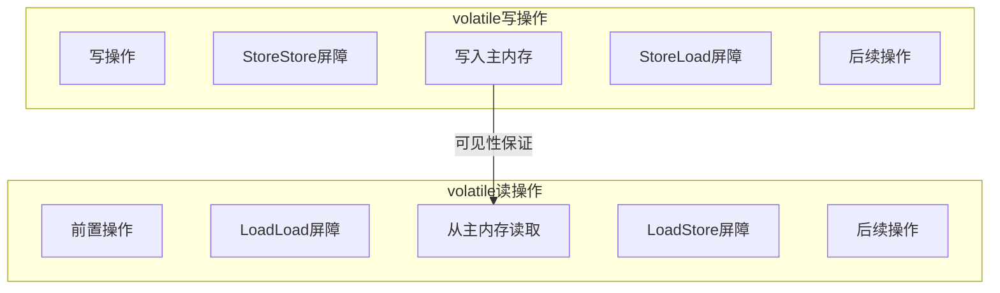

# happens-before原则

## 一个困惑了很多人的问题

面试官问："为什么需要happens-before？"

很多同学会说："为了保证可见性。"

面试官继续追问："可见性是什么？volatile不是已经保证可见性了吗？happens-before和volatile是什么关系？"

这个时候，大部分同学就开始语无伦次了。

我在带学员的时候，发现很多人把happens-before和volatile混为一谈。他们知道volatile保证可见性，但不知道为什么volatile能保证，怎么保证的。

今天这篇文章，把happens-before掰开揉碎讲清楚。

## 【直观类比】理解happens-before

先用一个生活化的比喻理解happens-before。

想象你在银行办业务：

1. 你先把表单填好（写操作）
2. 然后把表单交给柜员（提交）
3. 柜员处理完后通知你（结果可见）

在这个过程中，"填表单"happens-before"柜员处理"，因为只有填好了才能提交。"提交"happens-before"拿到结果"，因为柜员必须处理完才能给你结果。

通过happens-before关系，你**保证**了：
- 柜员能看到你填的内容
- 你能拿到柜员处理的结果

但如果中间有人插队，或者顺序乱了，就可能出现：柜员还没处理完，你就已经拿到了一个旧结果。这就是**可见性问题**。

## happens-before的本质

### 定义

happens-before是Java Memory Model（JMM）的核心概念，它定义了：

1. **可见性**：如果操作A happens-before 操作B，那么操作A的结果对操作B可见
2. **有序性**：如果操作A happens-before 操作B，那么操作A在操作B之前执行

**重要提醒**：happens-before**不是指时间上的先后**，而是指**逻辑上的先行关系**。两个操作可能时间上A先执行，但逻辑上B先happens-before。

### 为什么需要happens-before

没有happens-before，JVM可以任意重排序：

```java
// 线程A
x = 1;     // A1
y = 2;     // A2

// 线程B
if (y == 2) {
    System.out.println(x);  // 可能打印0！
}
```

时间上：A1在A2之前执行
但如果JVM重排序成：

```java
// 线程A
y = 2;     // 先执行
x = 1;     // 后执行
```

线程B可能看到y=2，但x=0（因为x还没赋值）。

**问题根源**：
- 编译器的指令重排序
- CPU的指令流水线
- CPU缓存的可见性延迟

**解决方案**：
- JVM通过happens-before规则，告诉你哪些操作**必须有确定的顺序**
- 程序员通过volatile、synchronized、Lock等，**强制建立happens-before关系**

## 8条happens-before规则详解

### 规则一：程序顺序规则（Program Order Rule）

**定义**：在同一线程内，按照代码顺序，前面的操作happens-before后面的操作。

```java
int a = 1;      // ①
int b = 2;      // ②
int c = a + b;  // ③

// ① HB ②，② HB ③
// 所以c一定能正确计算为3
```

**注意**：这只保证单线程内的顺序。多线程情况下，如果不同线程操作不同变量，不受此规则约束。

### 规则二：监视器锁规则（Monitor Lock Rule）

**定义**：对一个锁的解锁操作，happens-before后续对这个锁的加锁操作。

```java
public class MonitorLockDemo {
    private int value = 0;
    private final Object lock = new Object();
    
    public void writer() {
        synchronized (lock) {  // 加锁
            value = 100;       // A线程写入
        }  // 解锁
    
    public void reader() {
        synchronized (lock) {  // 加锁
            int r = value;     // B线程读取
            System.out.println(r);  // 一定能读到100
        }
    }
}
```

**原理**：
- 进入synchronized代码块前，必须先获取锁
- 退出synchronized代码块时，必须释放锁
- 锁的获取和释放是全功能的内存屏障，保证之前所有操作都刷新到主内存

### 规则三：volatile变量规则（Volatile Variable Rule）

**定义**：对volatile变量的写操作，happens-before后续对该变量的读操作。

```java
public class VolatileDemo {
    private volatile boolean ready = false;
    private int result = 0;
    
    public void writer() {
        result = 42;         // A1
        ready = true;        // A2: volatile写
    }
    
    public void reader() {
        if (ready) {         // B1: volatile读
            System.out.println(result);  // 一定能打印42
        }
    }
}
```

**为什么能保证可见性**：
- 写volatile时，JMM强制刷新缓存到主内存
- 读volatile时，JMM强制invalidate本地缓存，从主内存重新读取

### 规则四：线程启动规则（Thread Start Rule）

**定义**：Thread.start()调用，happens-before被启动线程中的任何操作。

```java
public class ThreadStartDemo {
    private int x = 0;
    
    public void demo() {
        Thread B = new Thread(() -> {
            // 一定能读到x=10
            System.out.println(x);
        });
        
        x = 10;        // A: 写入
        B.start();     // B: 启动B
    }
}
```

**原因**：主线程在启动B之前的所有操作，对B都可见，因为B能看到主线程在start()之前的所有操作。

### 规则五：线程终止规则（Thread Termination Rule）

**定义**：线程中的所有操作，happens-before其他线程检测到该线程终止。

```java
public class ThreadTerminationDemo {
    private int x = 0;
    
    public void demo() {
        Thread B = new Thread(() -> {
            x = 100;
        });
        
        B.start();
        B.join();  // 等待B结束
        
        // 一定能读到x=100
        System.out.println(x);
    }
}
```

**原因**：join()返回时，意味着B的所有操作都已完成，主线程能看到B写入的所有值。

### 规则六：中断规则（Thread Interruption Rule）

**定义**：对线程interrupt()的调用，happens-before被中断线程检测到中断事件。

```java
public class InterruptDemo {
    public void demo() {
        Thread B = new Thread(() -> {
            while (!Thread.interrupted()) {
                // 执行业务逻辑
            }
            // 检测到中断后，退出循环
        });
        
        B.start();
        
        try {
            Thread.sleep(1000);
        } catch (InterruptedException e) {
        }
        
        B.interrupt();  // 中断B
    }
}
```

**原因**：B线程一定能检测到A线程在调用interrupt()之前的所有操作。

### 规则七：终结器规则（Finalizer Rule）

**定义**：对象的构造函数结束，happens-before该对象的finalize()方法开始。

```java
public class FinalizerDemo {
    private final int value;
    
    public FinalizerDemo() {
        value = 42;  // 构造函数中赋值
    }
    
    @Override
    protected void finalize() throws Throwable {
        // 一定能读到value=42
        System.out.println(value);
    }
}
```

**原理**：构造函数中final字段的写入，在finalize()执行前可见。这是因为JMM对final字段有特殊处理。

### 规则八：传递性规则（Transitivity）

**定义**：如果A happens-before B，B happens-before C，那么A happens-before C。

```java
int a = 1;              // A
synchronized (lock) {   // B: 获取锁
    int b = a;           // C
}

// A HB B（程序顺序）
// B HB C（监视器锁）
// 因此 A HB C（传递性）
```

## happens-before与volatile的关系

### volatile的底层实现

volatile的读写会插入内存屏障：



**屏障的作用**：
- **StoreStore屏障**：防止volatile写之前的写操作重排序到volatile写之后
- **StoreLoad屏障**：防止volatile写之后的读操作重排序到volatile写之前
- **LoadLoad屏障**：防止volatile读之前的读操作重排序到volatile读之后
- **LoadStore屏障**：防止volatile读之前的读操作重排序到volatile读之后的写操作之前

### happens-before与volatile的关系

**volatile写 happens-before volatile读**，这就是volatile能保证可见性的根本原因。

```java
volatile boolean ready = false;
int result = 0;

// 线程A
result = 42;
ready = true;  // volatile写

// 线程B
while (!ready) {  // volatile读
    Thread.sleep(100);
}
System.out.println(result);  // 一定能打印42
```

**分析**：
1. `result = 42` happens-before `ready = true`（程序顺序规则）
2. `ready = true` happens-before `while (!ready)`（volatile变量规则）
3. 根据传递性：`result = 42` happens-before `while (!ready)`
4. 因此线程B一定能读到result=42

### ❌ 错误理解：volatile能保证原子性

```java
public class VolatileAtomicDemo {
    private volatile int counter = 0;
    
    public void increment() {
        counter++;  // 仍然是原子性问题！
    }
}
```

volatile**不能**保证`counter++`的原子性，因为`counter++`包含三步：
1. 读取counter
2. 加1
3. 写回counter

volatile只保证单次读/写的可见性，不保证复合操作的原子性。

## 生产中的常见场景

### 场景一：单例模式的双重检查锁定

```java
public class Singleton {
    private static Singleton instance;
    
    public static Singleton getInstance() {
        if (instance == null) {  // 第一次检查
            synchronized (Singleton.class) {
                if (instance == null) {  // 第二次检查
                    instance = new Singleton();
                }
            }
        }
        return instance;
    }
}
```

**问题**：`instance = new Singleton()`可能发生重排序：
1. 分配内存
2. 调用构造函数
3. 将引用赋值给instance

如果步骤3在步骤2之前完成，其他线程可能看到未构造完成的对象。

**解决方案**：使用volatile

```java
public class Singleton {
    private static volatile Singleton instance;
    
    public static Singleton getInstance() {
        if (instance == null) {
            synchronized (Singleton.class) {
                if (instance == null) {
                    instance = new Singleton();
                }
            }
        }
        return instance;
    }
}
```

volatile的写 happens-before 读，后续线程读到非null时，对象已经构造完成。

### 场景二：线程间的状态传递

```java
public class StateTransfer {
    private volatile boolean initialized = false;
    private Map<String, String> config;
    
    public void init() {
        config = new HashMap<>();
        config.put("key1", "value1");
        config.put("key2", "value2");
        initialized = true;
    }
    
    public String getConfig(String key) {
        if (initialized) {  // volatile读
            return config.get(key);  // 一定能读到初始化的config
        }
        return null;
    }
}
```

**分析**：
- `config = new HashMap<>()` happens-before `initialized = true`（程序顺序）
- `initialized = true` happens-before `if (initialized)`（volatile规则）
- 因此config对reader线程可见

### 场景三：CountDownLatch的底层原理

```java
public class CountDownLatchDemo {
    public static void main(String[] args) throws InterruptedException {
        CountDownLatch latch = new CountDownLatch(3);
        
        for (int i = 0; i < 3; i++) {
            new Thread(() -> {
                // 执行任务
                try {
                    Thread.sleep(100);
                } catch (InterruptedException e) {
                }
                latch.countDown();  // 计数减1
            }).start();
        }
        
        latch.await();  // 等待计数为0
        System.out.println("所有任务完成");
    }
}
```

**happens-before链**：
1. 每个线程执行任务 happens-before countDown()
2. countDown() happens-before latch.await()返回（由AQS保证）
3. 因此所有线程的任务 happens-before "所有任务完成"打印

### 场景四：FutureTask的get()可见性

```java
public class FutureTaskDemo {
    public static void main(String[] args) throws Exception {
        FutureTask<Integer> task = new FutureTask<>(() -> {
            return compute();
        });
        
        new Thread(task).start();
        
        Integer result = task.get();  // 等待并获取结果
        System.out.println("Result: " + result);
    }
}
```

**原理**：
- 线程执行compute() happens-before set()存储结果
- get() happens-before get()返回（需要阅读FutureTask源码理解）

## 面试中的高频追问

### 追问1：happens-before和synchronized的关系？

synchronized通过监视器锁规则建立happens-before关系：
- 解锁 happens-before 后续加锁
- 加锁 happens-before 锁内的所有操作
- 锁内所有操作 happens-before 解锁

```java
synchronized (lock) {
    x = 10;  // A
    y = 20;  // B
}  // 解锁

// A HB B（程序顺序）
// B HB 解锁（程序顺序）
// 解锁 HB 其他线程加锁（监视器锁）
// 因此x和y对其他线程可见
```

### 追问2：final字段为什么能保证线程安全？

```java
public class FinalFieldDemo {
    private final int x;
    private final String s;
    
    public FinalFieldDemo() {
        x = 10;
        s = "hello";
    }
}
```

构造函数中对final字段的写入，在其他线程可见之前必须完成。这是因为：
- JVM会禁止重排序构造函数中的final写入与对象引用逃逸
- JVM在final字段写入后插入写屏障

### 追问3：为什么需要8条规则而不是1条？

因为不同场景需要不同的同步机制：
- 单线程：程序顺序规则
- 加锁：监视器锁规则
- volatile：volatile变量规则
- 线程生命周期：启动、终止、中断规则

如果只有一条规则，无法覆盖所有场景。

### 追问4：as-if-serial和happens-before的关系？

- **as-if-serial**：单线程看起来是顺序执行的（保证正确性）
- **happens-before**：多线程间建立可见性和有序性（保证正确性）

as-if-serial是happens-before在单线程情况下的特例。

## 【学习小结】

1. **happens-before定义**：逻辑上的先行关系，不是时间顺序
2. **8条规则**：程序顺序、监视器锁、volatile变量、线程启动/终止/中断、终结器、传递性
3. **作用**：建立多线程间的可见性和有序性
4. **volatile**：volatile写 HB volatile读，这是volatile保证可见性的根本
5. **生产注意**：单例用volatile、线程状态传递用volatile、复合操作用锁
6. **常见误区**：happens-before不是时间顺序，volatile不保证原子性

---

**延伸阅读**：
- [JMM内存模型](/java/concurrent/jmm)
- [volatile可见性与禁止重排序](/java/concurrent/volatile)
- [AQS抽象队列同步器原理](/java/concurrent/aqs)