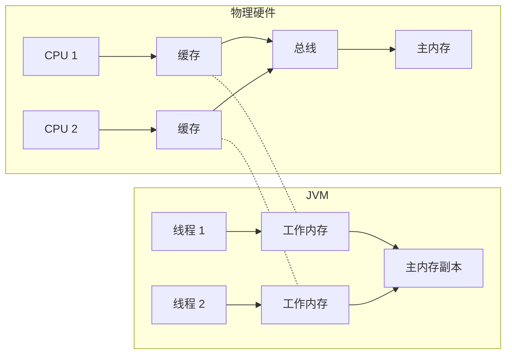
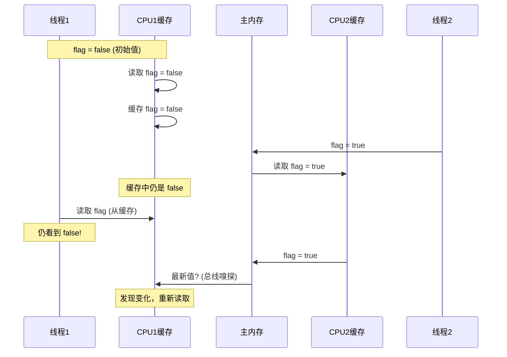
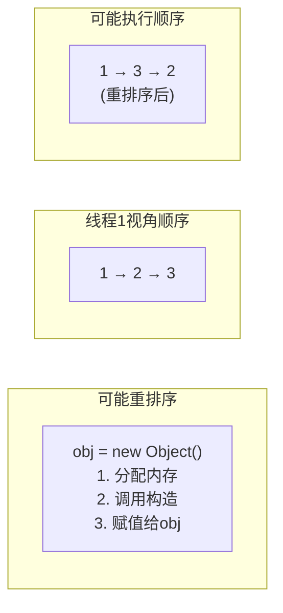
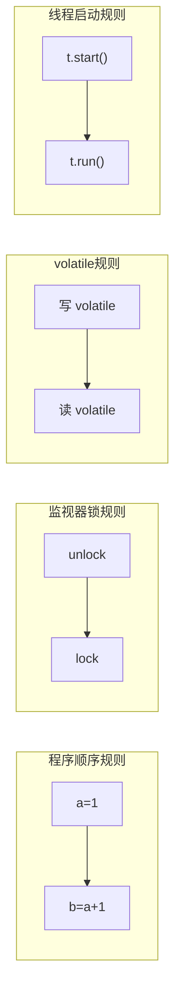
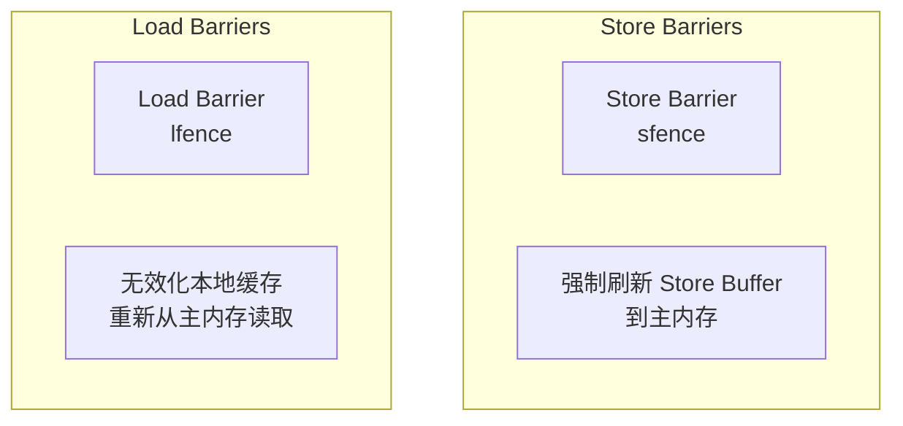
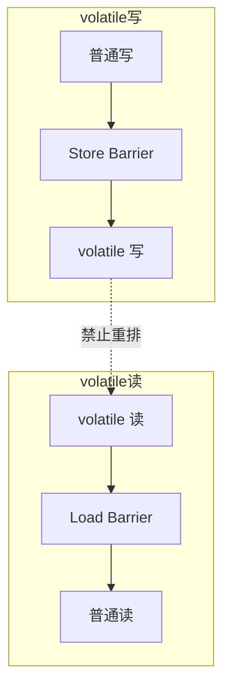

# Java 内存模型（JMM）

**目标级别**：P6

## 快速自测

面试官问：「什么是 happens-before？volatile 是如何保证可见性和有序性的？」

你能回答到第几层？

---

## 一、核心问题

### 🔴 什么是 JMM？为什么需要 JMM？

Java 内存模型（Java Memory Model，JMM）是 Java 并发编程的基础，它定义了 JVM 如何与计算机内存交互，规范了共享变量的读写行为。

### 为什么需要 JMM？



| 问题 | 说明 |
|------|------|
| **可见性** | 线程 A 修改了变量，线程 B 可能看不到 |
| **有序性** | 编译器/CPU 可能重排序指令 |
| **原子性** | 复合操作（如 i++）不是原子的 |

---

## 二、可见性与有序性问题

### 可见性问题演示

```java title="VisibilityProblem.java"
public class VisibilityProblem {
    
    private static boolean flag = false;
    private static int count = 0;
    
    public static void main(String[] args) throws InterruptedException {
        // 线程 1：修改 flag
        Thread t1 = new Thread(() -> {
            while (!flag) {
                count++;  // 无限循环，看不到 flag 的变化
            }
            System.out.println("线程1结束, count = " + count);
        });
        
        // 线程 2：设置 flag
        Thread t2 = new Thread(() -> {
            flag = true;
            System.out.println("线程2设置flag=true");
        });
        
        t1.start();
        t2.start();
        
        t1.join();
        t2.join();
    }
}
```

**问题原因**：



### 有序性问题演示

```java title="OrderingProblem.java"
public class OrderingProblem {
    
    private static Object obj = null;
    private static boolean initialized = false;
    
    public static void main(String[] args) throws InterruptedException {
        // 线程 1：创建对象
        Thread t1 = new Thread(() -> {
            obj = new Object();      // 指令 1
            initialized = true;      // 指令 2
        });
        
        // 线程 2：使用对象
        Thread t2 = new Thread(() -> {
            if (initialized) {       // 指令 3
                Object o = obj;      // 指令 4
                o.toString();        // 可能 NPE！
            }
        });
        
        t1.start();
        t2.start();
        
        t1.join();
        t2.join();
    }
}
```

**指令重排序**：



---

## 三、happens-before 原则

### 🔴 什么是 happens-before？

happens-before 是 JMM 最核心的概念，它定义了**可见性和有序性的规则**：如果操作 A happens-before 操作 B，那么 A 的结果对 B 可见，且 A 的执行顺序在 B 之前。

### 8 条基本原则

| 规则 | 说明 | 示例 |
|------|------|------|
| **程序顺序规则** | 单线程中，前面的代码 happens-before 后面的代码 | `a=1; b=2;` → a 先于 b |
| **监视器锁规则** | unlock happens-before lock | `synchronized` 释放锁先于获取锁 |
| **volatile 变量规则** | 写 happens-before 读 | `volatile` 写先于读 |
| **线程启动规则** | start() happens-before 线程内代码 | `t.start()` 先于 `t.run()` |
| **线程终止规则** | 线程内代码 happens-before 其他线程检测到终止 | `t.run()` 先于 `t.isAlive()==false` |
| **中断规则** | interrupt() happens-before 被中断线程检测到中断 | `t.interrupt()` 先于 `t.isInterrupted()` |
| **终结器规则** | 对象构造函数先于 finalize() | 构造先于垃圾回收 |
| **传递性规则** | A hb B，B hb C → A hb C | 推导复合规则 |

### happens-before 图解



### volatile happens-before 示例

```java title="HappensBeforeDemo.java"
public class HappensBeforeDemo {
    
    // volatile 保证：写 happens-before 读
    private volatile boolean flag = false;
    private int value = 0;
    
    public void writer() {
        value = 42;      // 1. 普通写
        flag = true;     // 2. volatile 写
        // 根据 volatile 规则：1 hb 2
    }
    
    public void reader() {
        if (flag) {      // 3. volatile 读
            int x = value;  // 4. 普通读
            // 根据 happens-before 传递性：
            // 1 hb 2 hb 3 hb 4
            // 所以 x 一定是 42
        }
    }
}
```

---

## 四、volatile 的内存语义

### 🔴 volatile 是如何保证可见性的？

volatile 通过**内存屏障**和**缓存一致性协议**保证可见性。

### 内存屏障



### volatile 写操作

```java
// volatile 写会插入 Store Barrier
public void volatileWrite() {
    this.value = 1;        // 普通写
    this.flag = true;      // volatile 写
}

// 编译后等价于：
public void volatileWrite() {
    this.value = 1;        // 普通写
    // Store Barrier：强制刷新到主内存
    // 锁总线/缓存行失效
}
```

### volatile 读操作

```java
// volatile 读会插入 Load Barrier
public void volatileRead() {
    boolean ready = this.flag;  // volatile 读
    if (ready) {
        int x = this.value;     // 普通读
    }
}

// 编译后等价于：
public void volatileRead() {
    // Load Barrier：清空无效化队列
    boolean ready = this.flag;  // volatile 读
    if (ready) {
        int x = this.value;     // 普通读（从主内存重新读取）
    }
}
```

### volatile 禁止重排序

| 操作 | 能重排序到 volatile 写之前？ | 能重排序到 volatile 写之后？ |
|------|-----------------------------|------------------------------|
| 普通读 | 是 | **否** |
| 普通写 | 是 | 是 |
| volatile 读 | **否** | **否** |
| volatile 写 | 是 | **否** |



---

## 五、面试题精讲

### 🔴 第一层：JMM 是什么？

> **参考答案**：
>
> JMM（Java Memory Model）是 Java 并发编程的基础，它定义了 JVM 如何与计算机内存交互。JMM 将内存分为主内存和工作内存，线程操作共享变量时需要从主内存复制到工作内存，修改后再写回主内存。

### 🟡 第二层：可见性和 happens-before

> **参考答案**：
>
> **可见性**：一个线程对共享变量的修改，对其他线程立即可见。
>
> **happens-before**：如果操作 A happens-before 操作 B，那么 A 的结果对 B 可见，且 A 的执行顺序在 B 之前。JMM 定义了 8 条 happens-before 规则，包括程序顺序规则、volatile 变量规则、监视器锁规则等。

### 🟡 第三层：volatile 的作用

> **参考答案**：
>
> volatile 保证**可见性**和**有序性**：
>
> 1. **可见性**：volatile 写后插入 Store Barrier，volatile 读前插入 Load Barrier，强制刷新缓存
> 2. **有序性**：禁止指令重排序到 volatile 写之后，禁止重排序到 volatile 读之前
>
> volatile **不保证原子性**（如 `i++`）。

### 💡 第四层：双重检查锁定与 volatile

> **参考答案**：
>
> ```java
> public class Singleton {
>     private static volatile Singleton instance;
>     
>     public static Singleton getInstance() {
>         if (instance == null) {           // 第一次检查
>             synchronized (Singleton.class) {
>                 if (instance == null) {  // 第二次检查
>                     instance = new Singleton();  // volatile 防止重排序
>                 }
>             }
>         }
>         return instance;
>     }
> }
> ```
>
> `instance = new Singleton()` 包含三步：
> 1. 分配内存
> 2. 调用构造
> 3. 赋值给 instance
>
> volatile 防止指令重排序，避免线程获取到未构造完成的对象。

---

## 六、常见错误与陷阱

### ⚠️ 陷阱 1：volatile 不能保证原子性

```java
// 错误：volatile 不能解决并发问题
private volatile int count = 0;

// 线程 A 和 B 同时执行
count++;  // 非原子操作！
// 可能丢失更新
```

### ⚠️ 陷阱 2：误用 happens-before

```java
// 错误：没有 happens-before 关系
// 线程 1
a = 1;  // 没有同步

// 线程 2
if (a == 1) {  // 可能看到 a = 0
    // ...
}
```

### ⚠️ 陷阱 3：long/double 的非原子性

```java
// JVM 允许将 64 位的 long/double 的读写分为两次 32 位操作
// 使用 volatile 可以保证原子性
private volatile long value = 0L;
```

---

## 七、对比总结表

| 关键字/机制 | 可见性 | 原子性 | 有序性 |
|-------------|--------|--------|--------|
| **synchronized** | 保证 | 保证 | 保证 |
| **volatile** | 保证 | 部分 | 保证 |
| **final** | 构造后可见 | - | 构造器内有序 |
| **CAS** | 保证 | 保证 | 保证 |

| happens-before 规则 | 示例 |
|---------------------|------|
| 程序顺序规则 | `a=1; b=2; // a hb b` |
| 监视器锁规则 | `unlock() // hb lock()` |
| volatile 规则 | `v=true // hb v` |
| 线程启动规则 | `t.start() // hb t.run()` |

---

## 八、扩展思考

> **追问**：final 字段的可见性？

对象构造完成后，final 字段对其他线程可见。这是因为 JMM 有一条**final 字段规则**：构造函数中对 final 字段的写入，happens-before 于其他线程获取该对象引用的操作。

> **追问**：JMM 与 CPU 缓存一致性的关系？

x86 使用 MESI 协议保证缓存一致性，但 JMM 比 MESI 更抽象：
- JMM 允许编译器优化（如重排序）
- CPU 保证最终一致性
- volatile 强制刷缓存，满足 JMM 的 happens-before

---

## 延伸阅读

- [happens-before 原则详解](./happens-before)
- [volatile 可见性与禁止重排序](./volatile)
- [synchronized 原理](./synchronized)
- [CAS 原理与 ABA 问题](./cas)
