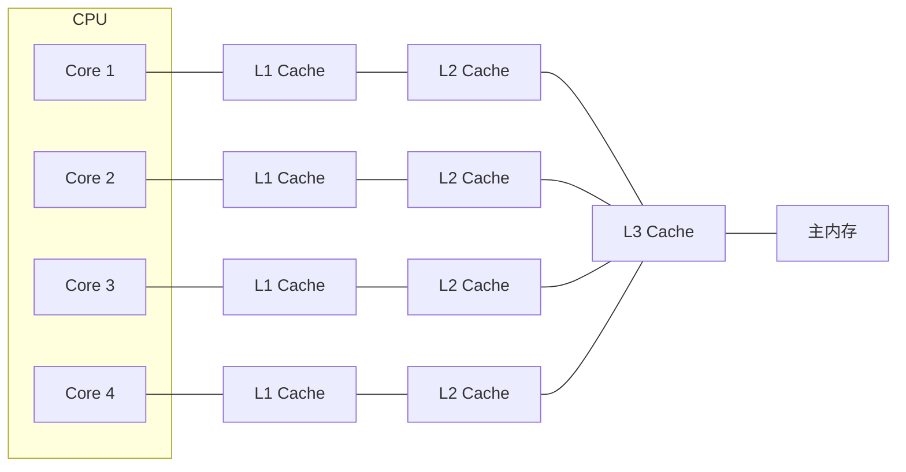
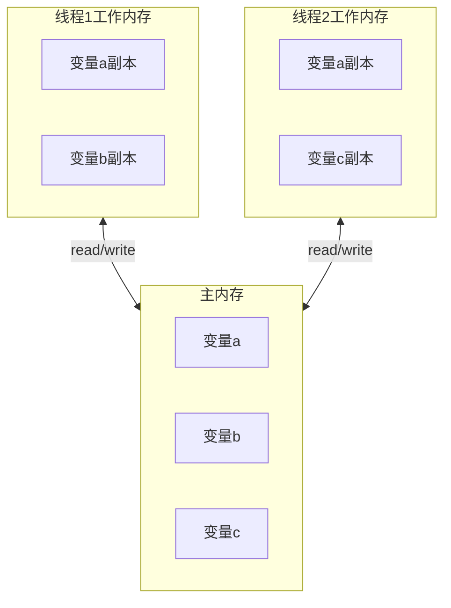
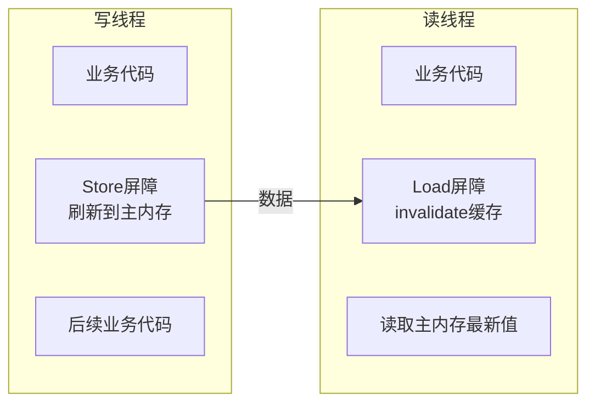

# Java内存模型（JMM）

## 一个让无数候选人翻车的面试题

候选人小李在字节面试中遇到了这个问题：

"我有两个线程，一个线程修改变量a，一个线程读取变量a，能保证读到最新值吗？"

小李说："能，因为Java内存模型保证了可见性。"

面试官追问："怎么保证的？"

小李停顿了两秒："用volatile..."

面试官："volatile是怎么保证可见性的？底层原理是什么？"

小李开始擦汗。

这个场景在面试中太常见了。很多同学知道"volatile保证可见性"、"synchronized保证原子性和可见性"，但被追问到底层原理时就懵了。

今天这篇文章，带你把JMM彻底搞清楚。

## 为什么需要JMM

### 物理世界的乱序问题

现代CPU为了提升性能，做了很多"小动作"：

1. **CPU指令重排序**：CPU会根据依赖关系调整指令执行顺序
2. **CPU缓存**：每个CPU核心有自己的L1、L2缓存，数据可能还在缓存里没写回主内存
3. **编译器优化**：JIT编译器会重排代码以提升性能

```java
public class ReorderingDemo {
    private int a = 0;
    private boolean flag = false;
    
    public void writer() {
        a = 1;           // 指令1
        flag = true;     // 指令2
    }
    
    public void reader() {
        if (flag) {      // 指令3
            int r = a;   // 指令4
            System.out.println(r);
        }
    }
}
```

这段代码看起来没问题吧？但实际执行时，CPU可能重排序成：

```java
public void writer() {
    flag = true;     // 先执行这条
    a = 1;           // 后执行这条
}
```

如果线程A执行writer，线程B执行reader，线程B可能看到`flag=true`，但`a=0`。

### CPU缓存导致的可见性问题

现代CPU架构：



每个CPU核心有自己的缓存（L1、L2），所有核心共享L3缓存和主内存。

当Core 1修改了变量a，写入自己的L1缓存后，Core 2可能还在使用旧的L1缓存中的a值。这就是**可见性问题**。

### 编译器的"自作聪明"

JIT编译器也会优化代码：

```java
public class CompilerOptimization {
    private int x = 0;
    private int y = 0;
    
    public void method() {
        x = 1;   // A线程写入
        y = 2;   // A线程写入
        
        // B线程读取
        if (y == 2) {
            System.out.println(x); // 可能打印0！
        }
    }
}
```

编译器可能认为x和y没有依赖关系，把`y=2`重排到`x=1`前面。

## JMM是什么

### JMM的定义

Java Memory Model（JMM）是Java语言规范的一部分（JSR-133），它定义了：
- 变量（字段、静态字段、数组元素）的访问规则
- 多线程环境下，线程间如何"看到"这些变量的变化
- 哪些重排序是允许的，哪些是不允许的

JMM的核心目标：**让程序员编写正确的多线程程序变得可行**。

### JMM的抽象模型

JMM将内存分为两部分：

1. **主内存（Main Memory）**：所有变量存储的地方，对所有线程可见
2. **工作内存（Working Memory）**：每个线程私有的内存区域，存储主内存中变量的副本



线程不能直接操作主内存，必须通过工作内存：
- **read**：从主内存读取变量到工作内存
- **load**：将read的值加载到工作内存的变量副本
- **use**：将工作内存中的变量值传递给执行引擎
- **assign**：将执行引擎的值赋给工作内存的变量
- **store**：将工作内存的变量值传送到主内存
- **write**：将store的值写入主内存的变量

### as-if-serial语义

JMM的核心原则之一：**as-if-serial语义**。

对于单个线程来说，无论怎么重排序，程序的执行结果不能改变。

```java
double pi = 3.14;      // A
double r = 10;         // B
double area = pi * r * r; // C
```

无论A和B怎么重排序，只要C在它们之后执行，结果就是正确的。

但是！如果有多个线程，情况就复杂了。

## happens-before原则

### 什么是happens-before

happens-before（先行发生）是JMM最核心的概念。它定义了：
- **可见性**：如果操作A happens-before 操作B，那么A对B可见
- **有序性**：如果操作A happens-before 操作B，那么A在B之前执行

注意：**happens-before不是指时间上的先后，而是指逻辑上的先后**。

### 8条happens-before规则

JMM定义了8条happens-before规则：

**1. 程序顺序规则（Program Order Rule）**
在同一线程内，每个操作happens-before该线程中后续的所有操作。

```java
int a = 1;      // A
int b = 2;      // B
int c = a + b;  // C

// A HB B, B HB C
// 也就是说，A的结果对B可见，B的结果对C可见
```

**2. 监视器锁规则（Monitor Lock Rule）**
对一个锁的解锁操作，happens-before后续对这个锁的加锁操作。

```java
synchronized (lock) {
    x = 10;  // A线程写入
} // 解锁

synchronized (lock) {
    int r = x;  // B线程读取
} // 加锁

// 解锁 HB 加锁，所以B一定能读到A写入的值
```

**3. volatile变量规则（Volatile Variable Rule）**
对volatile变量的写操作，happens-before后续对这个volatile变量的读操作。

```java
volatile boolean flag = false;

Thread A:
flag = true;  // 写

Thread B:
while (!flag) {  // 读
    Thread.sleep(100);
}
System.out.println("done");

// 写 HB 读，所以B一定能读到true
```

**4. 线程启动规则（Thread Start Rule）**
Thread.start()调用，happens-before被启动线程中的任何操作。

```java
Thread A:
x = 10;
thread.start();  // 启动B

Thread B:
int r = x;  // B一定能读到x=10

// start() HB B中的操作
```

**5. 线程终止规则（Thread Termination Rule）**
线程中的所有操作，happens-before其他线程检测到该线程终止。

```java
Thread A:
x = 10;
thread.join();  // 等待B结束

// A中join()之前的操作 HB join()返回
// 所以join()返回后，一定能看到B的所有操作结果
```

**6. 传递性规则（Transitivity）**
如果A happens-before B，B happens-before C，那么A happens-before C。

**7. volatile数组规则（Volatile Array Rule）**
对volatile数组的引用写入，happens-before后续对数组元素的读取。

```java
volatile int[] arr = new int[10];

Thread A:
arr[0] = 100;   // 写入数组元素
arr = new int[20]; // 写入数组引用

Thread B:
int[] localArr = arr;  // 读取数组引用
int x = localArr[0];  // 读取数组元素

// arr的写 HB arr的读
// 但arr[0]的写不一定 HB arr[0]的读
// 关键在于：先读引用还是先写引用
```

**8. Thread.interrupt()规则**
对线程interrupt()的调用，happens-before被中断线程检测到中断事件。

```java
Thread B:
while (!Thread.interrupted()) {
    // 执行业务逻辑
}
// 检测到中断后，可以在这里处理

Thread A:
thread.interrupt();  // 中断B

// interrupt() HB B检测到中断
```

### ❌ 错误理解：happens-before不是时间先后

很多同学误以为happens-before是"先执行的操作先发生"，这是错的。

```java
// 线程A:
a = 1;  // 操作1
b = 2;  // 操作2

// 线程B:
if (b == 2) {
    System.out.println(a);  // 可能打印0！
}
```

操作1和操作2在时间上：1先于2。
但由于没有happens-before关系，线程B可能看到a=0。

正确的理解是：**happens-before定义的是可见性和有序性，不是时间顺序**。

## volatile的底层原理

### 可见性保证

volatile通过**内存屏障（Memory Barrier）**实现可见性：



**volatile写的原理**：
1. 在写操作后插入Store屏障
2. 将数据刷新到主内存
3. 其他CPU核心的缓存行失效

**volatile读的原理**：
1. 在读操作前插入Load屏障
2. invalidate其他CPU核心的缓存
3. 从主内存重新读取最新值

### 禁止重排序

volatile还能防止重排序。编译器/JIT会在volatile读写前后插入内存屏障：

| 操作 | 屏障类型 | 作用 |
|------|----------|------|
| volatile读 | LoadLoad + LoadStore | 防止读重排序到volatile读之前 |
| volatile写 | StoreStore + StoreLoad | 防止写重排序到volatile写之后 |

```java
volatile boolean ready = false;
int result = 0;

Thread A:
result = 42;           // 普通写
ready = true;          // volatile写（有Store屏障）

Thread B:
while (!ready) {        // volatile读（有Load屏障）
    Thread.sleep(100);
}
System.out.println(result);  // 一定能打印42
```

## 生产中的JMM问题

### 问题1：双重检查锁定的单例模式

```java
public class Singleton {
    private static Singleton instance;
    
    public static Singleton getInstance() {
        if (instance == null) {  // 第一次检查
            synchronized (Singleton.class) {
                if (instance == null) {  // 第二次检查
                    instance = new Singleton();
                }
            }
        }
        return instance;
    }
}
```

这个单例模式在早期Java中是错误的！`instance = new Singleton()`不是原子操作：
1. 分配内存
2. 调用构造函数
3. 将引用赋值给instance

如果发生重排序，步骤3可能在步骤2之前执行，导致其他线程看到未构造完成的对象。

**解决方案：使用volatile**

```java
public class Singleton {
    private static volatile Singleton instance;
    
    public static Singleton getInstance() {
        if (instance == null) {
            synchronized (Singleton.class) {
                if (instance == null) {
                    instance = new Singleton();
                }
            }
        }
        return instance;
    }
}
```

volatile的禁止重排序保证了：instance引用写入前，对象完全构造完成。

### 问题2：long/double的非原子性

在JMM中，对非volatile的long和double变量的读写不是原子的：

```java
public class LongDemo {
    private long value = 0;  // 非volatile
    
    public void writer() {
        value = 0x12345678ABCDL;  // 可能读到中间状态！
    }
    
    public long reader() {
        return value;  // 可能读到"撕裂"的值
    }
}
```

在32位JVM上，这个赋值可能分两次完成，高32位和低32位分别写入，中间状态可能被其他线程看到。

**解决方案：使用volatile或synchronized**

```java
private volatile long value = 0;  // volatile long

// 或者
private synchronized void setValue(long v) {
    value = v;
}
```

### 问题3：竞态条件

```java
public class Counter {
    private long count = 0;
    
    public void increment() {
        count++;  // 不是原子操作！
    }
    
    public long getCount() {
        return count;
    }
}
```

`count++`分解为三步：
1. 读取count
2. 加1
3. 写回count

多线程环境下会丢失更新。

**解决方案：使用原子变量或锁**

```java
public class Counter {
    private AtomicLong count = new AtomicLong(0);
    
    public void increment() {
        count.incrementAndGet();
    }
    
    public long getCount() {
        return count.get();
    }
}
```

## 面试中的高频追问

### 追问1：synchronized和volatile的区别？

| 维度 | synchronized | volatile |
|------|--------------|----------|
| 原子性 | 保证 | 不保证 |
| 可见性 | 保证 | 保证 |
| 有序性 | 保证 | 保证（禁止重排序） |
| 阻塞 | 可能阻塞 | 不阻塞 |
| 性能 | 较重 | 轻量 |

synchronized既保证原子性又保证可见性，volatile只保证可见性和有序性。

### 追问2：为什么long/double需要volatile才能保证原子性？

因为long/double是64位，在32位JVM上需要两次写操作。volatile强制每次读/写都直接操作主内存，避免"撕裂"。

### 追问3：final字段能保证线程安全吗？

```java
public class FinalDemo {
    private final int x;
    private final int[] arr;
    
    public FinalDemo() {
        x = 10;
        arr = new int[]{1, 2, 3};
    }
}
```

构造函数中写入final字段的值，对其他线程可见（因为final字段不会变）。但**引用类型**的字段，其引用是final的，但**内容**不是。

### 追问4：String的intern()是线程安全的吗？

```java
String s1 = new String("hello");
String s2 = s1.intern();
```

intern()方法将字符串放入字符串常量池，在JDK7之前字符串常量池在Perm区，intern()可能有并发问题。JDK7之后在堆中，有JVM保证线程安全。

## 【学习小结】

1. **JMM存在的原因**：CPU缓存和编译器优化导致可见性/有序性问题，需要语言层面规范
2. **核心概念**：主内存 vs 工作内存，read/write操作
3. **happens-before**：定义可见性和有序性的规则，不是时间顺序
4. **8条规则**：程序顺序、监视器锁、volatile、线程启动/终止、传递性、volatile数组、interrupt
5. **volatile原理**：内存屏障，刷新缓存 + invalidate缓存
6. **生产注意**：单例模式用volatile long/double读写用volatile或锁

---

**延伸阅读**：
- [happens-before原则详解](/java/concurrent/happens-before)
- [volatile可见性与禁止重排序](/java/concurrent/volatile)
- [synchronized原理与锁升级](/java/concurrent/synchronized)