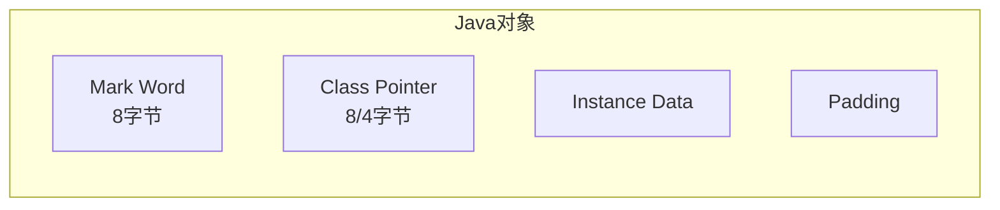

# synchronized对象头（Mark Word）

## 为什么面试官爱问Mark Word

面试官问："对象头包含哪些内容？"

候选人小王回答："包含Class Pointer和实例数据。"

面试官追问："Mark Word的结构是什么样的？偏向锁和轻量级锁在Mark Word中怎么表示？"

小王支支吾吾："好像是...用一个标志位？"

面试官继续追问："那为什么轻量级锁需要把Mark Word复制到线程栈？这两个Mark Word有什么区别？"

小王彻底卡住了。

这个问题看起来很偏，但它是理解synchronized锁机制的**根基**。不理解Mark Word，就不理解偏向锁为什么快、轻量级锁怎么实现的、重量级锁为什么开销大。

今天这篇文章，把Mark Word掰开揉碎讲清楚。

## 【直观类比】理解Mark Word

用一个生活中的比喻理解Mark Word：

Mark Word就像一个**行李标签**，贴在每个对象上。这个标签上写了很多信息：
- 行李的主人是谁（hashCode）
- 行李被检查过多少次（GC年龄）
- 行李现在被谁拿着（锁状态）
- 怎么找到拿行李的人（锁记录/Monitor指针）

但是！行李标签的空间是有限的（64位）。当行李被别人拿着时，标签上就写不下hashCode了，必须腾出空间来记录锁信息。

这就是Mark Word设计的精妙之处：**用不同的位编码，在有限的64位空间里存储不同的信息**。

## 对象内存布局回顾

### 对象的组成



HotSpot JVM中，对象由四部分组成：
1. **Mark Word**（8字节）：哈希码、GC信息、锁状态
2. **Class Pointer**（8字节，开启压缩后4字节）：指向方法区类元数据
3. **Instance Data**：对象的实例字段
4. **Padding**：对齐填充

### 对象头

```cpp
// HotSpot虚拟机中对象头的定义（简化版）
class oopDesc {
    markOop _mark;           // Mark Word
    klassOop _metadata;      // Class Pointer
};

class markOopDesc {
    volatile markWord _mark;  // 64位Mark Word
};
```

## 64位Mark Word详细结构

### 不同锁状态下的Mark Word

| 锁状态 | Mark Word（62位有效） | 标志位 |
|--------|----------------------|--------|
| **无锁** | 对象哈希码(31位) + GC年龄(4位) + 偏向标志(1位) + 锁标志(2位) | 01 |
| **偏向锁** | 线程ID(54位) + epoch(2位) + GC年龄(4位) + 偏向标志(1位) + 锁标志(2位) | 01 |
| **轻量级锁** | 指向线程栈中Lock Record的指针(62位) | 00 |
| **重量级锁** | 指向ObjectMonitor的指针(62位) | 10 |
| **GC标记** | 空(62位) | 11 |

### 无锁状态

```text
[63...............31][30..............23][22][21..16][15.....9][8.....1][0][1]
       hashCode           GC年龄    |偏向|    未使用   |    未使用   |标志位

实际存储的hashCode只有25位(31-6)，因为低6位被锁标志等占用
如果hashCode不满25位，高位用0补齐
```

**注意**：对象的hashCode只有第一次调用Object.hashCode()时才计算并存储。

### 偏向锁状态

```text
[63...............10][9...8][7...4][3][2][1..0]
    thread ID(54位)   |epoch| 年龄 | 1 |01|

thread ID: 54位，存储持有偏向锁的线程ID
epoch: 2位，用于批量重偏向
年龄: 4位，标记GC分代年龄
偏向标志: 1位，必须是1
锁标志: 2位，必须是01
```

**为什么thread ID只需要54位？**
- 线程ID是JVM内部编号，最大值不到2^54
- 即使以后线程数增加，也可以扩展

### 轻量级锁状态

```text
[63...............3][2][1..0]
    指向Lock Record的指针    |00|

指向线程栈帧中Lock Record的地址
Lock Record存储了对象的原始Mark Word
```

**为什么能存指针？**
- 64位系统指针也是64位
- 但堆内存不可能占用整个64位地址空间
- 实际上只使用低位来表示堆内偏移，高位被压缩

### 重量级锁状态

```text
[63...............3][2][1..0]
    指向ObjectMonitor的指针  |10|

指向方法区/堆中的ObjectMonitor对象
ObjectMonitor包含：
- _owner: 当前持有锁的线程
- _WaitSet: 等待队列
- _EntryList: 竞争队列
- _recursions: 重入次数
```

### GC标记状态

```text
[63...............0]
      63位全为0
          |11|

用于可达性分析时的标记
标记后对象不可达，等待GC回收
```

## 锁状态转换与Mark Word变化

### 完整转换图

```mermaid
graph TB
    UNLOCK["无锁状态<br/>[hashCode|age|0|01]"]
    BIASED["偏向锁状态<br/>[thread|epoch|age|1|01]"]
    LIGHT["轻量级锁状态<br/>[Lock Record ptr|00]"]
    HEAVY["重量级锁状态<br/>[Monitor ptr|10]"]
    GC["GC标记状态<br/>[0...0|11]"]
    
    UNLOCK -->|"首次进入synchronized"| BIASED
    BIASED -->|"其他线程竞争<br/>hashCode调用"| LIGHT
    BIASED -->|"撤销偏向锁"| LIGHT
    LIGHT -->|"自旋失败| LIGHT
    LIGHT -->|"膨胀"| HEAVY
    HEAVY -->|"释放锁"| UNLOCK
    LIGHT -->|"释放锁"| UNLOCK
    UNLOCK -.->|"可达性分析"| GC
```

### 各阶段Mark Word内容

```java
public class MarkWordTransformation {
    private final Object lock = new Object();
    
    public void stage1_unlocked() {
        // 无锁状态
        // Mark Word: [hashCode | age | 0 | 01]
        lock.hashCode();  // 调用后，Mark Word存储hashCode
    }
    
    public void stage2_biased() {
        synchronized (lock) {
            // 偏向锁状态
            // Mark Word: [thread ID | epoch | age | 1 | 01]
            // 如果同一个线程再次进入，不需要CAS
            
            synchronized (lock) {
                // 再次重入，还是偏向锁
                // 重入计数器++
            }
        }
    }
    
    public void stage3_lightweight() {
        // 其他线程来竞争
        // 偏向锁被撤销
        // Mark Word: [Lock Record ptr | 00]
        // 线程栈中创建Lock Record
        
        synchronized (lock) {
            // 自旋等待，尝试CAS获取轻量级锁
        }
    }
    
    public void stage4_heavyweight() {
        // 自旋失败
        // Mark Word: [Monitor ptr | 10]
        // 线程进入内核态，阻塞等待
    }
}
```

## Lock Record与Monitor的区别

### Lock Record（轻量级锁）

**位置**：线程栈帧中
**生命周期**：获取锁时创建，释放锁时销毁
**存储内容**：对象的原始Mark Word

```cpp
// Lock Record结构（伪代码）
class BasicLock {
    volatile markWord displaced_markword;  // 原始Mark Word
    Object* obj;                          // 锁对象指针
};

class BasicObjectLock {
    BasicLock lock;        // Lock Record
    oop* obj;              // 对象指针
};
```

### ObjectMonitor（重量级锁）

**位置**：堆内存（方法区/堆中分配）
**生命周期**：与JVM进程共存
**存储内容**：完整的等待队列和状态信息

```cpp
// ObjectMonitor结构（简化版）
class ObjectMonitor {
    volatile markOop _header;       // 原Mark Word（GC标记时使用）
    volatile void* _owner;          // 持有锁的线程
    ParkEvent* _WaitSet;            // 调用wait()的线程队列
    ObjectWaiter* _EntryList;       // 等待获取锁的线程队列
    volatile int _recursions;        // 重入次数
    volatile int _count;             // 等待线程计数
    void* _object;                  // 监视器关联的对象
};
```

### 两者的核心区别

| 维度 | Lock Record | ObjectMonitor |
|------|-------------|---------------|
| 位置 | 线程栈（用户态） | 堆内存 |
| 生命周期 | 锁持有期间 | JVM进程期间 |
| 创建时机 | 获取轻量级锁时 | 锁膨胀时 |
| 销毁时机 | 释放轻量级锁时 | 不销毁 |
| 线程阻塞 | 否（自旋） | 是（park） |
| 系统调用 | 否 | 是（切换内核态） |

## Mark Word的读取与写入

### 读取Mark Word

```cpp
// HotSpot读取Mark Word
markOop mark = obj->mark();
```

### 写入Mark Word（CAS操作）

```cpp
// 尝试设置偏向锁
markOop mark = obj->mark();
markOop new_mark = mark->setbiased(thread_id, epoch, age, unlocked_biased);
if (Atomic::cmpxchg(new_mark, &obj->_mark, mark) == mark) {
    // 偏向锁设置成功
} else {
    // 失败，需要其他处理
}

// 尝试设置轻量级锁
markOop new_mark = mark->encode_lightweight(thr);
if (Atomic::cmpxchg(new_mark, &obj->_mark, mark) == mark) {
    // 轻量级锁获取成功
}
```

### Mark Word的解码

```cpp
// 根据锁标志位解码Mark Word
markWord = obj->mark();
if (markWord::biased_lock_locked != markWord.lock_value()) {
    switch (markWord.lock_value()) {
        case lightweight:
            // 解码轻量级锁指针
            // 找到Lock Record
            break;
        case heavyweight:
            // 解码Monitor指针
            // 找到ObjectMonitor
            break;
        case unlocked:
            // 无锁状态
            break;
        case marked:
            // GC标记状态
            break;
    }
}
```

## 生产中的实际问题

### 问题1：hashCode导致锁降级失败

```java
public class HashCodeLockProblem {
    private final Object lock = new Object();
    
    public void demo() {
        // 调用hashCode后，Mark Word存储了hashCode
        lock.hashCode();
        
        // 现在无法变成偏向锁，因为hashCode已经占用了空间
        synchronized (lock) {
            // 只能从无锁直接升级轻量级锁
            // 无法使用偏向锁优化
        }
    }
}
```

**原因**：偏向锁需要用54位存储thread ID，而无锁状态需要用25位存储hashCode。两者互斥。

**解决方案**：
- 如果需要高性能，在第一次synchronized之前不要调用hashCode
- 或者接受这个开销

### 问题2：锁对象头复制开销

```java
public class LockOverheadDemo {
    private final Object lock = new Object();
    
    public void highContention() {
        for (int i = 0; i < 100000; i++) {
            synchronized (lock) {
                // 每次获取轻量级锁：
                // 1. 复制Mark Word到栈
                // 2. CAS更新对象头
                // 3. 如果失败，自旋重试
                
                // 高并发下，CAS失败率高
                // 建议：减少锁竞争，或直接用重量级锁
            }
        }
    }
}
```

### 问题3：关闭偏向锁的代价

```bash
# 禁用偏向锁
-XX:-UseBiasedLocking

# 后果：
# 1. 第一个线程进入synchronized时直接创建轻量级锁
# 2. 每次获取锁都需要CAS
# 3. 吞吐量可能下降5-10%
# 4. 但避免了偏向锁撤销的开销
```

## 32位 vs 64位 JVM

### 32位Mark Word

| 锁状态 | Mark Word（25位有效） | 标志位 |
|--------|----------------------|--------|
| 无锁 | hashCode(25位) + GC年龄(2位) + 锁标志(2位) | 01 |
| 偏向锁 | thread ID(23位) + epoch(2位) + 偏向标志 + 锁标志 | 01 |
| 轻量级锁 | 指向Lock Record的指针 | 00 |
| 重量级锁 | 指向Monitor的指针 | 10 |

**主要区别**：
- 32位只能用25位存储hashCode
- thread ID只能用23位
- GC年龄只有2位（最多4岁）

### 指针压缩（CompressedOops）

```bash
# 开启指针压缩（默认）
-XX:+UseCompressedOops

# 关闭指针压缩
-XX:-UseCompressedOops
```

指针压缩后：
- Class Pointer从8字节变为4字节
- Mark Word中的指针也压缩为4字节表示

## 面试中的高频追问

### 追问1：为什么轻量级锁要把Mark Word复制到线程栈？

因为轻量级锁需要**可逆**的操作：
1. 复制原始Mark Word到栈（备份）
2. 用CAS更新对象头的Mark Word
3. 解锁时，把栈中的原始Mark Word复制回对象头

如果直接覆盖，就无法恢复到无锁状态了。

### 追问2：Lock Record和ObjectMonitor各在什么时候创建？

- **Lock Record**：获取轻量级锁时，在线程栈帧中创建
- **ObjectMonitor**：锁膨胀时，在堆中分配（延迟分配）

### 追问3：Mark Word中的GC年龄为什么只有4位？

因为GC分代年龄最大是15（`-XX:MaxTenuringThreshold`），4位足够表示0-15。

### 追问4：偏向锁的epoch是什么？

epoch用于**批量重偏向**：
- 当大量线程偏向同一个对象，然后另一个线程竞争时，需要撤销偏向锁
- epoch记录偏向的"代数"
- 批量重偏向时，只需更新epoch，不需要遍历每个对象

## 【学习小结】

1. **Mark Word位置**：对象头的前8字节
2. **64位结构**：不同锁状态下，使用不同的位编码存储不同信息
3. **无锁**：hashCode(25位) + age(4位) + 偏向标志(1位) + 锁标志(2位)
4. **偏向锁**：thread ID(54位) + epoch(2位) + age(4位) + 偏向标志(1位) + 锁标志(2位)
5. **轻量级锁**：指向Lock Record的指针，Mark Word复制到线程栈备份
6. **重量级锁**：指向ObjectMonitor的指针，完整的等待队列
7. **GC标记**：全0 + 锁标志11
8. **核心设计**：有限空间内，用锁标志位区分不同状态，用不同位存储不同信息

---

**延伸阅读**：
- [synchronized原理与锁升级](/java/concurrent/synchronized)
- [synchronized vs ReentrantLock](/java/concurrent/sync-vs-reentrantlock)
- [Condition条件队列](/java/concurrent/condition)