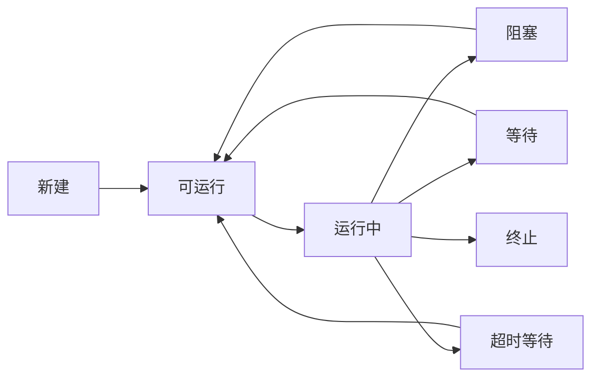
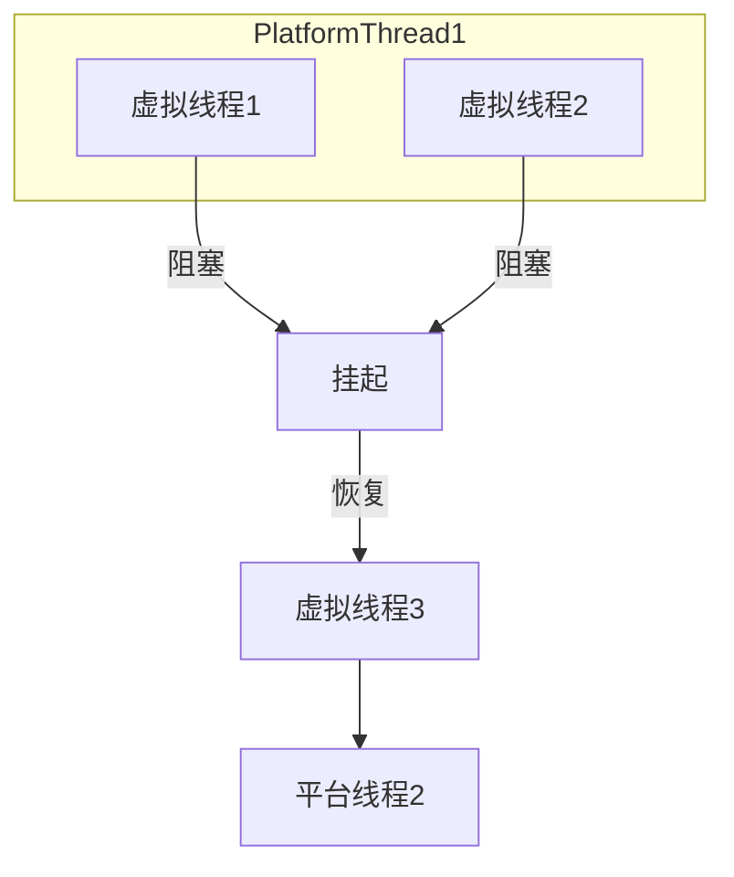

# 进程、线程与协程

## 一道面试题引发的思考

面试官问："进程、线程、协程有什么区别？"

很多人会这么回答："进程是资源分配的基本单位，线程是CPU调度的基本单位，协程是比线程更轻量的东西。"

这个回答对吗？技术上没错，但太干巴巴了。你只是背了概念，没有讲清楚**为什么**要有这三个东西，它们各自解决什么问题，以及在什么场景下该用哪个。

今天这篇文章，带你把这三个概念彻底搞清楚。

## 【直观类比】理解进程、线程、协程

用一个生活化的比喻来理解：

- **进程**就像一栋独立的办公楼。每栋楼有自己的地址、水电系统、保安系统。你在一栋楼里做的事，不会影响到另一栋楼。但如果你想从一个楼去另一个楼，必须通过大门、街道，走很远。

- **线程**就像办公楼里的会议室。同一个楼里的多个会议室共享楼的资源（电梯、厕所、空调），但每个会议室有自己的门禁。切换会议室比换一栋楼快多了。

- **协程**就像会议室里的座位安排。多个任务可以在同一个会议室里交替执行，但只有一个任务在"使用会议室"，其他任务在旁边等待。它不需要进出会议室，直接换人就行。

这个比喻告诉我们：**上下文切换的成本，进程 >> 线程 > 协程**。

## 进程：独立的王国

### 什么是进程

进程（Process）是操作系统分配资源的基本单位。每个进程都有自己独立的地址空间，包含：
- 代码段
- 数据段
- 堆
- 栈
- 文件描述符表
- 信号处理表

当你启动一个 Java 程序时，操作系统会创建一个 JVM 进程。JVM 进程有自己的内存空间，Java 代码运行在这个空间里。

### 进程的特点

1. **独立性**：每个进程的地址空间是隔离的，一个进程崩溃不会直接影响另一个进程
2. **开销大**：创建进程需要分配独立的资源，进程切换需要切换地址空间（TLB刷新、缓存失效）
3. **通信复杂**：进程间通信（IPC）需要额外的机制，如管道、消息队列、共享内存、Socket 等

### 进程切换的成本

进程切换（Context Switch）涉及：
- 保存当前进程的CPU状态（寄存器、程序计数器）
- 刷新TLB（Translation Lookaside Buffer，快表）
- 切换地址空间
- 加载新进程的CPU状态

这个过程在现代CPU上通常需要**几微秒到几十微秒**，对于高性能系统来说，这是不可忽视的开销。

### 生产场景中的进程

在 Java 生产环境中，进程级别的隔离体现在：
- 不同应用运行在不同进程中
- 容器化部署时，每个容器本质上是独立的进程命名空间
- JVM 本身就是一个进程

```java
public class ProcessDemo {
    public static void main(String[] args) {
        // 获取当前进程的 PID
        long pid = ProcessHandle.current().pid();
        System.out.println("Current Process ID: " + pid);
        
        // 启动新进程
        ProcessBuilder pb = new ProcessBuilder("ls", "-la");
        try {
            Process p = pb.start();
            int exitCode = p.waitFor();
            System.out.println("Process exit code: " + exitCode);
        } catch (Exception e) {
            e.printStackTrace();
        }
    }
}
```

## 线程：共享的团队

### 什么是线程

线程（Thread）是CPU调度的基本单位。同一个进程中的多个线程共享进程的地址空间，但每个线程有自己的：
- 程序计数器
- 寄存器
- 栈
- 本地变量

线程是进程的"轻量化"版本，因为创建线程不需要分配独立的地址空间。

### 线程的特点

1. **共享资源**：同一个进程的所有线程共享代码段、数据段、堆，线程间通信非常高效
2. **开销小**：线程切换不需要切换地址空间，只需要保存少量寄存器状态
3. **并发执行**：多线程可以在多核CPU上真正并行执行

### 线程切换的成本

线程切换只需要：
- 保存/恢复少量寄存器（PC、SP、通用寄存器）
- 更新线程调度队列

这个过程通常只需要**几百纳秒到几微秒**，比进程切换快了一个数量级。

### Java 中的线程

在 Java 中，线程直接对应操作系统内核线程（1:1模型）：

```java
public class ThreadDemo {
    public static void main(String[] args) {
        // 创建线程
        Thread thread = new Thread(() -> {
            System.out.println("Thread is running: " + Thread.currentThread().getName());
        }, "MyThread");
        
        thread.start();
        
        // 主线程继续执行
        System.out.println("Main thread continues: " + Thread.currentThread().getName());
    }
}
```

### Java 线程的状态



| 状态 | 含义 |
|------|------|
| NEW | 线程创建但未启动 |
| RUNNABLE | 正在JVM中运行或等待CPU |
| BLOCKED | 等待获取监视器锁 |
| WAITING | 无限期等待另一个线程 |
| TIMED_WAITING | 有限期等待 |
| TERMINATED | 线程执行完毕 |

### 生产中的线程问题

多线程带来了性能提升，但也带来了复杂度：

```java
public class ThreadProblemDemo {
    private int counter = 0;
    
    public void increment() {
        // 这个操作不是线程安全的！
        counter++;
    }
}
```

在多线程环境下，`counter++` 这个操作可能出问题：
1. 读取counter值
2. 增加1
3. 写回counter

如果两个线程同时执行，可能会丢失一次更新。这就是经典的**竞态条件（Race Condition）**。

## 协程：用户级的轻量

### 什么是协程

协程（Coroutine）是一种用户态的轻量级线程。与内核线程不同，协程的调度完全由程序控制，不需要内核参与。

协程的核心特点：
- **协作式调度**：协程主动让出CPU，而不是被抢占
- **单线程内多协程**：可以在一个线程内运行多个协程
- **极低的切换开销**：不需要陷入内核，切换只需要保存少量状态

### 协程 vs 线程

| 维度 | 线程 | 协程 |
|------|------|------|
| 调度方式 | 抢占式（内核控制） | 协作式（用户控制） |
| 切换成本 | 几百纳秒~微秒 | 几十~几百纳秒 |
| 创建成本 | 高（需要内核操作） | 低（纯用户态） |
| 并行性 | 可利用多核 | 单线程内不能利用多核 |
| 独立性 | 独立栈空间 | 共享栈（堆上分配） |

### Java 虚拟线程（Virtual Thread）

JDK 21 引入了虚拟线程（Virtual Thread），这是 Java 对协程的一次重大拥抱。

```java
public class VirtualThreadDemo {
    public static void main(String[] args) throws InterruptedException {
        // 创建虚拟线程
        Thread virtualThread = Thread.ofVirtual().name("virtual-1").start(() -> {
            System.out.println("Virtual thread running: " + Thread.currentThread());
        });
        
        virtualThread.join();
        
        // 使用线程工厂创建虚拟线程
        ThreadFactory factory = Thread.ofVirtual().factory();
        for (int i = 0; i < 10; i++) {
            factory.newThread(() -> {
                System.out.println("Task " + i + " in " + Thread.currentThread().getName());
            }).start();
        }
    }
}
```

### 虚拟线程的原理

虚拟线程的底层机制：

1. **平台线程作为载体**：虚拟线程并不直接对应内核线程，而是挂载在平台线程（Carrier Thread）上运行
2. **挂起/恢复**：当虚拟线程执行阻塞操作（如I/O）时，它会从平台线程上"摘下"，让平台线程去执行其他虚拟线程
3. ** Continuations**：JDK使用Continuations机制实现虚拟线程的挂起和恢复



### 虚拟线程 vs 传统线程

```java
// 传统线程模型：10000个并发连接需要10000个线程
public class TraditionalModel {
    public static void main(String[] args) {
        ExecutorService executor = Executors.newFixedThreadPool(10000);
        for (int i = 0; i < 10000; i++) {
            final int id = i;
            executor.submit(() -> {
                try {
                    // 模拟I/O操作
                    Thread.sleep(Duration.ofSeconds(10));
                } catch (InterruptedException e) {
                    e.printStackTrace();
                }
            });
        }
    }
}

// 虚拟线程模型：10000个并发连接只需要少量平台线程
public class VirtualThreadModel {
    public static void main(String[] args) {
        ExecutorService executor = Executors.newVirtualThreadPerTaskExecutor();
        for (int i = 0; i < 10000; i++) {
            final int id = i;
            executor.submit(() -> {
                try {
                    // 模拟I/O操作
                    Thread.sleep(Duration.ofSeconds(10));
                } catch (InterruptedException e) {
                    e.printStackTrace();
                }
            });
        }
    }
}
```

### 虚拟线程的适用场景

虚拟线程最适合**I/O密集型**任务：
- HTTP客户端调用
- 数据库连接
- 消息队列消费
- 文件读写

```java
public class VirtualThreadBestPractice {
    public static void main(String[] args) {
        try (ExecutorService executor = Executors.newVirtualThreadPerTaskExecutor()) {
            List<Future<String>> futures = new ArrayList<>();
            
            // 模拟1000个HTTP请求
            for (int i = 0; i < 1000; i++) {
                futures.add(executor.submit(() -> {
                    // 模拟HTTP调用
                    return fetchData("https://api.example.com/item/" + i);
                }));
            }
            
            // 收集结果
            for (Future<String> future : futures) {
                try {
                    String result = future.get();
                    System.out.println("Result: " + result);
                } catch (ExecutionException e) {
                    e.getCause().printStackTrace();
                }
            }
        }
    }
    
    private static String fetchData(String url) {
        // 模拟网络请求
        return "Data from: " + url;
    }
}
```

:::warning ⚠️
虚拟线程不适合**CPU密集型**任务。对于纯计算任务，多个虚拟线程共享一个CPU核心，并不能提升性能，反而增加调度开销。这时候应该使用传统的线程池或者 ForkJoinPool。
:::

## 面试中的高频追问

### 追问1：线程切换为什么比进程切换快？

进程切换需要切换地址空间，这会导致TLB（Translation Lookaside Buffer）刷新，CPU缓存失效。线程切换不需要切换地址空间，只需要保存少量寄存器状态。

### 追问2：协程和线程的适用场景是什么？

- **线程**：需要真正并行利用多核CPU，适合CPU密集型任务
- **协程**：高并发I/O场景，适合大量等待的任务

### 追问3：虚拟线程会取代线程池吗？

不会。虚拟线程主要用于I/O密集型任务，线程池（特别是ForkJoinPool）仍然用于CPU密集型任务。对于计算密集型的并行处理，仍然需要真正的并行。

### 追问4：Java的协程（虚拟线程）和Go的协程有什么区别？

Java虚拟线程采用** continuations + work-stealing** 模型，挂载在平台线程上运行。Go的协程（goroutine）采用** M:N 模型**，M个goroutine调度在N个操作系统线程上。两者都能高效处理高并发场景。

## 生产避坑

### 坑1：线程数量设置不当

很多同学用线程池时，核心线程数和最大线程数随手一写：

```java
// ❌ 错误示例：线程数设置不合理
ExecutorService bad = Executors.newFixedThreadPool(1000);
```

对于I/O密集型任务，线程数 = CPU核心数 × (1 + I/O时间/CPU时间)。对于CPU密集型任务，线程数 = CPU核心数 + 1。

### 坑2：不理解虚拟线程的挂起机制

虚拟线程的挂起是协作式的，不能在synchronized块中执行会导致线程 park 的操作：

```java
// ❌ 虚拟线程在synchronized中可能无法挂起
synchronized (lock) {
    // 如果这里调用阻塞操作，会阻塞底层的平台线程
    blockingOperation();
}

// ✅ 正确做法：使用 ReentrantLock
lock.lock();
try {
    // 使用可中断的锁
} finally {
    lock.unlock();
}
```

### 坑3：ThreadLocal在线程池中的泄漏

在传统线程池中，ThreadLocal的值会在线程复用时保留，可能导致内存泄漏。虚拟线程不复用，每个任务使用新的虚拟线程，不存在这个问题。

## 【学习小结】

1. **进程**是资源分配的基本单位，有独立地址空间，切换开销大
2. **线程**是CPU调度的基本单位，同进程内共享资源，切换开销小
3. **协程**是用户态轻量级调度，无需内核参与，切换极快
4. **上下文切换成本**：进程 >> 线程 > 协程
5. **Java虚拟线程**（JDK 21）是协程的现代实现，适合I/O密集型高并发场景
6. **选型原则**：CPU密集用线程池，I/O密集用虚拟线程

---

**延伸阅读**：
- [JMM内存模型](/java/concurrent/jmm)
- [synchronized原理](/java/concurrent/synchronized)
- [线程池参数](/java/concurrent/threadpool-params)