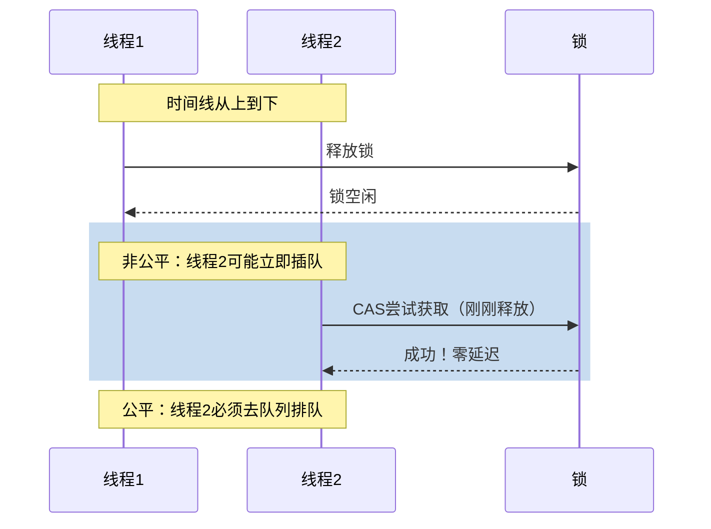

# ReentrantLock公平锁 vs 非公平锁

## 一个影响性能的细节问题

面试官问："ReentrantLock有公平锁和非公平锁，它们有什么区别？"

候选人小张说："公平锁按顺序获取，非公平锁不按顺序。"

面试官追问："那什么时候用公平锁，什么时候用非公平锁？"

小张说："呃...大部分时候用非公平？"

面试官继续问："为什么非公平锁吞吐量更高？非公平锁会导致饥饿吗？"

小张支支吾吾，没能说清楚。

这个问题看起来简单，但涉及到**公平与性能的权衡**、**饥饿问题**、**实际场景选择**。理解透了，对并发编程有更深的认识。

今天这篇文章，把公平锁和非公平锁讲透。

## 基本概念

### 创建方式

```java
public class LockCreation {
    // 非公平锁（默认）
    ReentrantLock unfairLock = new ReentrantLock();
    ReentrantLock unfairLock2 = new ReentrantLock(false);
    
    // 公平锁
    ReentrantLock fairLock = new ReentrantLock(true);
}
```

### 默认行为

```java
public class DefaultBehavior {
    public static void main(String[] args) {
        // 默认是非公平锁
        ReentrantLock lock = new ReentrantLock();
        System.out.println(lock.isFair());  // false
        
        // 公平锁
        ReentrantLock fairLock = new ReentrantLock(true);
        System.out.println(fairLock.isFair());  // true
    }
}
```

## 公平锁 vs 非公平锁实现

### AQS的tryAcquire

**公平锁**需要在tryAcquire中检查队列：

```java
// ReentrantLock.FairSync.tryAcquire
protected final boolean tryAcquire(int acquires) {
    Thread current = Thread.currentThread();
    int c = getState();
    
    if (c == 0) {
        // 关键区别：检查是否有等待更久的线程
        if (!hasQueuedPredecessor()) {
            // 队列中没有更早等待的线程，可以获取
            if (compareAndSetState(0, acquires)) {
                setExclusiveOwnerThread(current);
                return true;
            }
        }
    } else if (current == getExclusiveOwnerThread()) {
        // 可重入
        int nextc = c + acquires;
        if (nextc < 0) {
            throw new Error("Maximum lock count exceeded");
        }
        setState(nextc);
        return true;
    }
    return false;
}
```

**非公平锁**直接尝试获取：

```java
// ReentrantLock.NonfairSync.tryAcquire
protected final boolean tryAcquire(int acquires) {
    Thread current = Thread.currentThread();
    int c = getState();
    
    if (c == 0) {
        // 关键区别：直接尝试CAS，不检查队列
        if (compareAndSetState(0, acquires)) {
            setExclusiveOwnerThread(current);
            return true;
        }
    } else if (current == getExclusiveOwnerThread()) {
        // 可重入
        int nextc = c + acquires;
        if (nextc < 0) {
            throw new Error("Maximum lock count exceeded");
        }
        setState(nextc);
        return true;
    }
    return false;
}
```

### hasQueuedPredecessor的实现

```java
// AQS.hasQueuedPredecessor
public final boolean hasQueuedPredecessor() {
    Node h = head;
    Node t = tail;
    Node s;
    
    // 队列为空或只有一个节点，不需要检查
    if (h == t) {
        return false;
    }
    
    // 检查第二个节点（第一个等待的节点）
    // 如果当前线程不是第二个节点，说明有更早等待的线程
    if ((s = h.next) == null || s.thread != Thread.currentThread()) {
        return true;  // 有更早等待的线程
    }
    return false;
}
```

### lock()方法的区别

**非公平锁的lock()**：

```java
// NonfairSync.lock
final void lock() {
    // 直接尝试CAS，可能插队
    if (compareAndSetState(0, 1))
        setExclusiveOwnerThread(Thread.currentThread());
    else
        acquire(1);  // 如果CAS失败，走正常流程
}
```

**公平锁的lock()**：

```java
// FairSync.lock
final void lock() {
    // 没有特殊处理，直接acquire
    // acquire内部会调用tryAcquire，tryAcquire会检查hasQueuedPredecessor
    acquire(1);
}
```

## 公平 vs 非公平的权衡

### 性能对比

| 维度 | 非公平锁 | 公平锁 |
|------|----------|--------|
| 吞吐量 | 高 | 低 |
| 锁获取延迟 | 低（可立即获得） | 高（必须等待） |
| 线程唤醒 | 可能被插队 | 按顺序唤醒 |
| CPU开销 | 低 | 较高 |

### 非公平锁吞吐量高的原因



**非公平锁的"插队"优势**：

```java
public class UnfairAdvantage {
    private final ReentrantLock unfairLock = new ReentrantLock();
    
    public void scenario() {
        // 线程A持有锁
        synchronized (this) {
            // 执行业务
        }  // 释放锁
        
        // 如果此时线程B调用lock()
        // 非公平锁：线程B可能立即获取锁（插队成功）
        // 公平锁：线程B必须去队列尾部排队
        
        // 非公平锁的优势：减少了上下文切换和线程唤醒的开销
    }
}
```

### 饥饿问题

**非公平锁可能导致饥饿**：

```java
public class StarvationDemo {
    private final ReentrantLock unfairLock = new ReentrantLock();
    
    public void starvationScenario() {
        // 高优先级线程不断插队
        Thread highPriority = new Thread(() -> {
            while (true) {
                if (unfairLock.tryLock()) {
                    try {
                        // 快速执行
                    } finally {
                        unfairLock.unlock();
                    }
                }
            }
        }, "HighPriority");
        
        Thread lowPriority = new Thread(() -> {
            unfairLock.lock();
            try {
                // 可能永远得不到执行
            } finally {
                unfairLock.unlock();
            }
        }, "LowPriority");
        
        highPriority.setPriority(Thread.MAX_PRIORITY);
        lowPriority.setPriority(Thread.MIN_PRIORITY);
        
        highPriority.start();
        lowPriority.start();
    }
}
```

**公平锁保证无饥饿**：

```java
public class FairNoStarvation {
    private final ReentrantLock fairLock = new ReentrantLock(true);
    
    public void noStarvationScenario() {
        // 线程按FIFO顺序获取锁
        // 不会存在"一直插队"的问题
    }
}
```

## 实际场景选择

### 什么时候用非公平锁

```java
public class UnfairLockScenarios {
    // ✅ 场景1：高并发下的性能优化
    private final ReentrantLock counterLock = new ReentrantLock();
    private int counter = 0;
    
    public void increment() {
        counterLock.lock();
        try {
            counter++;
        } finally {
            counterLock.unlock();
        }
    }
    
    // ✅ 场景2：锁持有时间很短
    public void shortHoldTime() {
        ReentrantLock lock = new ReentrantLock();  // 非公平
        lock.lock();
        try {
            // 短暂操作，如更新计数器
        } finally {
            lock.unlock();
        }
    }
    
    // ✅ 场景3：只需要一个线程执行
    public void singletonPattern() {
        private final ReentrantLock lock = new ReentrantLock();
        
        public void getInstance() {
            lock.lock();
            try {
                if (instance == null) {
                    instance = new Singleton();
                }
            } finally {
                lock.unlock();
            }
        }
    }
}
```

### 什么时候用公平锁

```java
public class FairLockScenarios {
    // ✅ 场景1：需要严格的执行顺序
    private final ReentrantLock orderedLock = new ReentrantLock(true);
    
    public void processInOrder(int orderId) {
        orderedLock.lock();
        try {
            // 按orderId顺序处理
        } finally {
            orderedLock.unlock();
        }
    }
    
    // ✅ 场景2：防止线程饥饿
    private final ReentrantLock starvationFreeLock = new ReentrantLock(true);
    
    // ✅ 场景3：长时间持有的锁
    public void longHoldTime() {
        ReentrantLock lock = new ReentrantLock(true);  // 公平
        lock.lock();
        try {
            // 长时间操作，如文件IO
        } finally {
            lock.unlock();
        }
    }
}
```

### 生产案例：订单处理系统

```java
public class OrderProcessingSystem {
    // 订单号生成器 - 非公平锁，提高性能
    private final ReentrantLock orderIdLock = new ReentrantLock();
    private long orderIdCounter = 0;
    
    public long generateOrderId() {
        orderIdLock.lock();
        try {
            return ++orderIdCounter;
        } finally {
            orderIdLock.unlock();
        }
    }
    
    // 账户转账 - 公平锁，保证资金安全顺序
    private final ReentrantLock transferLock = new ReentrantLock(true);
    
    public void transfer(Account from, Account to, int amount) {
        transferLock.lock();
        try {
            // 转账操作，涉及资金，必须保证顺序
            from.withdraw(amount);
            to.deposit(amount);
        } finally {
            transferLock.unlock();
        }
    }
}
```

## 可重入特性

### 重入的实现

```java
public class ReentrantDemo {
    private final ReentrantLock lock = new ReentrantLock();
    
    public void outer() {
        lock.lock();  // 第1次获取
        try {
            // 业务逻辑
            
            inner();  // 调用inner
            
        } finally {
            lock.unlock();  // 第1次释放
        }
    }
    
    public void inner() {
        lock.lock();  // 第2次获取（同一个线程）
        try {
            // 业务逻辑
        } finally {
            lock.unlock();  // 第2次释放
        }
    }
}
```

**state记录重入次数**：

```java
protected final boolean tryAcquire(int acquires) {
    Thread current = Thread.currentThread();
    int c = getState();
    
    if (c == 0) {
        // 第一次获取锁
        if (compareAndSetState(0, acquires)) {
            setExclusiveOwnerThread(current);
            return true;
        }
    } else if (current == getExclusiveOwnerThread()) {
        // 同一个线程重入，增加计数
        int nextc = c + acquires;
        setState(nextc);  // state从1变成2
        return true;
    }
    return false;
}

protected final boolean tryRelease(int releases) {
    int c = getState() - releases;
    if (Thread.currentThread() != getExclusiveOwnerThread())
        throw new IllegalMonitorStateException();
    
    boolean free = (c == 0);  // 只有完全释放时才返回true
    if (free) {
        setExclusiveOwnerThread(null);
    }
    setState(c);  // state从2变成1
    return free;
}
```

### 公平锁的重入

```java
public class FairReentrant {
    private final ReentrantLock fairLock = new ReentrantLock(true);
    
    public void demo() {
        fairLock.lock();
        try {
            // 第一次获取
            
            fairLock.lock();  // 重入，仍然成功
            try {
                // 第二次获取
                
                fairLock.lock();  // 可以多次重入
                try {
                    // 第三次获取
                } finally {
                    fairLock.unlock();  // 必须对应重入次数释放
                }
            } finally {
                fairLock.unlock();
            }
        } finally {
            fairLock.unlock();
        }
    }
}
```

## tryLock的公平性

### tryLock()不考虑公平性

```java
public class TryLockFairness {
    private final ReentrantLock lock = new ReentrantLock(true);  // 公平锁
    
    public void tryLockBehavior() {
        // tryLock()不遵守公平性
        // 它直接尝试获取，不检查队列
        boolean acquired = lock.tryLock();
        
        // 如果获取成功，立即执行
        // 即使队列中有其他线程等待
        
        // tryLock()的这种行为在公平锁中也是允许的
        // 因为tryLock()是"尝试"获取，不是"必须"获取
    }
}
```

### tryLock(timeout)遵守公平性

```java
public class TryLockTimeoutFairness {
    private final ReentrantLock lock = new ReentrantLock(true);
    
    public void tryLockWithTimeout() throws InterruptedException {
        // tryLock(timeout)遵守公平性
        // 它会等待timeout时间，等待期间会按顺序排队
        boolean acquired = lock.tryLock(5, TimeUnit.SECONDS);
        
        // 如果超时获取失败，不执行
        // 不会插队
    }
}
```

## 面试中的高频追问

### 追问1：为什么非公平锁吞吐量更高？

1. **减少上下文切换**：刚释放的锁可能被同一线程立即获取，避免线程切换
2. **减少等待时间**：插队可以立即执行，不需要park/unpark
3. **提高CPU利用率**：减少线程等待时间，更多线程在工作

### 追问2：公平锁能完全避免饥饿吗？

公平锁按FIFO顺序获取，能保证每个线程最终都能获取锁。但以下情况仍可能导致长时间等待：
- 高优先级线程不断插队（如果是公平锁则不会）
- 持有锁时间过长

### 追问3：ReentrantLock默认为什么是非公平？

因为大多数场景下，我们更关心**吞吐量**而非**严格公平**。非公平锁性能更好，而且短期饥饿的情况很少发生。

### 追问4：synchronized是公平还是非公平？

synchronized是**非公平锁**。JDK 6引入偏向锁后，对单线程场景做了进一步优化。

## 【学习小结】

1. **核心区别**：非公平锁可插队，公平锁必须排队
2. **公平锁**：hasQueuedPredecessor检查，FIFO顺序，无饥饿
3. **非公平锁**：直接CAS插队，高吞吐量，可能饥饿
4. **默认选择**：非公平锁（性能优先）
5. **公平锁场景**：严格顺序、防止饥饿、长时间持有
6. **tryLock()**：不遵守公平性；tryLock(timeout)遵守公平性
7. **性能差异**：非公平锁吞吐量高10-50%（高竞争场景）

---

**延伸阅读**：
- [synchronized vs ReentrantLock](/java/concurrent/sync-vs-reentrantlock)
- [AQS抽象队列同步器原理](/java/concurrent/aqs)
- [ReadWriteLock读写锁](/java/concurrent/readwritelock)