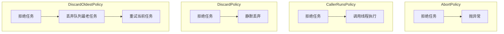

# 线程池拒绝策略对比

在项目中配置线程池时，很多同学会用默认的 AbortPolicy，但被问到"什么时候该用 CallerRunsPolicy"和"自定义策略怎么写"时，往往说不清楚。我自己在生产环境中也踩过这个坑——用了 DiscardPolicy 导致任务丢失，最后无法追溯问题。

今天我们就来把这四种拒绝策略彻底讲清楚。

## 一、四种内置策略

### 1.1 AbortPolicy（中止策略）

```java
// 默认策略
// 抛出 RejectedExecutionException
ThreadPoolExecutor executor = new ThreadPoolExecutor(
    10, 20,
    60L, TimeUnit.SECONDS,
    new ArrayBlockingQueue<>(100),
    Executors.defaultThreadFactory(),
    new ThreadPoolExecutor.AbortPolicy()
);

executor.execute(task);
// 当任务被拒绝时，抛出异常
```

**适用场景**：
- 需要快速失败、及时发现问题的场景
- 测试环境
- 业务允许失败但需要记录日志

### 1.2 CallerRunsPolicy（调用者运行策略）

```java
// 由调用线程执行被拒绝的任务
ThreadPoolExecutor executor = new ThreadPoolExecutor(
    10, 20,
    60L, TimeUnit.SECONDS,
    new ArrayBlockingQueue<>(100),
    Executors.defaultThreadFactory(),
    new ThreadPoolExecutor.CallerRunsPolicy()
);
```

**执行逻辑**：

```java
public static class CallerRunsPolicy implements RejectedExecutionHandler {
    public void rejectedExecution(Runnable r, ThreadPoolExecutor e) {
        if (!e.isShutdown()) {
            // 直接调用 r.run()，由调用线程执行
            r.run();
        }
    }
}
```

**特点**：
- 调用线程（提交任务的线程）会执行被拒绝的任务
- **背压机制（Back Pressure）**：减缓任务提交速度
- 不会丢失任务

### 1.3 DiscardPolicy（丢弃策略）

```java
// 静默丢弃被拒绝的任务
ThreadPoolExecutor executor = new ThreadPoolExecutor(
    10, 20,
    60L, TimeUnit.SECONDS,
    new ArrayBlockingQueue<>(100),
    Executors.defaultThreadFactory(),
    new ThreadPoolExecutor.DiscardPolicy()
);

executor.execute(task);
// 任务被静默丢弃，无任何提示
```

**特点**：
- 不抛异常，不执行任务
- 任务被静默丢弃
- **不适合关键业务**

### 1.4 DiscardOldestPolicy（丢弃最老策略）

```java
// 丢弃队列中最老的任务，然后重试当前任务
ThreadPoolExecutor executor = new ThreadPoolExecutor(
    10, 20,
    60L, TimeUnit.SECONDS,
    new ArrayBlockingQueue<>(100),
    Executors.defaultThreadFactory(),
    new ThreadPoolExecutor.DiscardOldestPolicy()
);
```

**执行逻辑**：

```java
public static class DiscardOldestPolicy implements RejectedExecutionHandler {
    public void rejectedExecution(Runnable r, ThreadPoolExecutor e) {
        if (!e.isShutdown()) {
            // 取出并丢弃队列中最早的任务
            e.getQueue().poll();
            // 重试当前任务
            e.execute(r);
        }
    }
}
```

**特点**：
- 丢弃队列中最老的任务
- 尝试重新执行被拒绝的任务
- 可能导致任务顺序变化

## 二、策略对比

### 2.1 对比表

| 策略 | 异常 | 任务执行 | 任务丢失 | 背压效果 |
| --- | --- | --- | --- | --- |
| `AbortPolicy` | 抛异常 | 不执行 | 丢失（抛异常） | 无 |
| `CallerRunsPolicy` | 不抛 | 调用线程执行 | 不丢失 | 有（减慢提交） |
| `DiscardPolicy` | 不抛 | 不执行 | 静默丢失 | 无 |
| `DiscardOldestPolicy` | 不抛 | 可能执行（丢弃老任务） | 丢弃老任务 | 有（丢弃老任务） |

### 2.2 流程图解



## 三、实战选择

### 3.1 快速失败场景

```java
// 场景：下单、支付等关键业务
// 失败时需要立即处理，不能静默丢弃
ThreadPoolExecutor executor = new ThreadPoolExecutor(
    20, 50,
    60L, TimeUnit.SECONDS,
    new ArrayBlockingQueue<>(500),
    new ThreadFactoryBuilder().setNameFormat("payment-pool-%d").build(),
    new ThreadPoolExecutor.AbortPolicy()  // 快速失败
);
```

### 3.2 背压控制场景

```java
// 场景：HTTP 请求处理
// 希望在高负载时自动减慢请求速度
ThreadPoolExecutor executor = new ThreadPoolExecutor(
    100, 200,
    60L, TimeUnit.SECONDS,
    new ArrayBlockingQueue<>(1000),
    new ThreadFactoryBuilder().setNameFormat("http-pool-%d").build(),
    new ThreadPoolExecutor.CallerRunsPolicy()  // 背压机制
);

// 当线程池满时，HTTP 线程会执行任务
// 相当于自动限流
```

### 3.3 日志记录场景

```java
// 自定义策略：记录日志 + 报警
RejectedExecutionHandler loggingHandler = (r, e) -> {
    log.warn("Task rejected: {}, pool: {}, queue: {}", 
        r, e.getPoolSize(), e.getQueue().size());
    alert.send("线程池拒绝任务，活跃线程: " + e.getActiveCount());
    // 然后执行 AbortPolicy 的行为
    throw new RejectedExecutionException("Task " + r + " rejected");
};

ThreadPoolExecutor executor = new ThreadPoolExecutor(
    10, 20,
    60L, TimeUnit.SECONDS,
    new ArrayBlockingQueue<>(100),
    new ThreadFactoryBuilder().setNameFormat("log-pool-%d").build(),
    loggingHandler
);
```

### 3.4 监控场景

```java
// 自定义策略：记录指标
RejectedExecutionHandler metricsHandler = (r, e) -> {
    metrics.increment("threadpool.rejected");
    metrics.gauge("threadpool.queue.size", e.getQueue().size());
    metrics.gauge("threadpool.active.count", e.getActiveCount());
    
    // 可以选择不同的处理方式
    if (metrics.isAlertEnabled()) {
        throw new RejectedExecutionException("High rejection rate");
    }
};

ThreadPoolExecutor executor = new ThreadPoolExecutor(
    10, 20,
    60L, TimeUnit.SECONDS,
    new ArrayBlockingQueue<>(100),
    new ThreadFactoryBuilder().setNameFormat("metrics-pool-%d").build(),
    metricsHandler
);
```

## 四、自定义拒绝策略

### 4.1 基本结构

```java
public class CustomRejectedPolicy implements RejectedExecutionHandler {
    @Override
    public void rejectedExecution(Runnable r, ThreadPoolExecutor e) {
        // 自定义处理逻辑
    }
}
```

### 4.2 放入队列重试

```java
public class QueueRetryPolicy implements RejectedExecutionHandler {
    private final BlockingQueue<Runnable> backupQueue;
    
    public QueueRetryPolicy(BlockingQueue<Runnable> backupQueue) {
        this.backupQueue = backupQueue;
    }
    
    @Override
    public void rejectedExecution(Runnable r, ThreadPoolExecutor e) {
        if (!e.isShutdown()) {
            // 放入备用队列
            if (!backupQueue.offer(r, 1, TimeUnit.SECONDS)) {
                log.error("Backup queue full, task dropped: {}", r);
                throw new RejectedExecutionException("Backup queue full");
            }
        }
    }
}

// 使用
BlockingQueue<Runnable> backupQueue = new LinkedBlockingQueue<>(1000);
ThreadPoolExecutor executor = new ThreadPoolExecutor(
    10, 20,
    60L, TimeUnit.SECONDS,
    new ArrayBlockingQueue<>(100),
    new ThreadFactoryBuilder().setNameFormat("retry-pool-%d").build(),
    new QueueRetryPolicy(backupQueue)
);
```

### 4.3 降级处理

```java
public class FallbackPolicy implements RejectedExecutionHandler {
    private final Executor fallbackExecutor;
    
    public FallbackPolicy(Executor fallbackExecutor) {
        this.fallbackExecutor = fallbackExecutor;
    }
    
    @Override
    public void rejectedExecution(Runnable r, ThreadPoolExecutor e) {
        log.warn("Using fallback executor for task: {}", r);
        fallbackExecutor.execute(r);
    }
}

// 使用：降级到单线程池
ExecutorService fallback = Executors.newSingleThreadExecutor();
ThreadPoolExecutor executor = new ThreadPoolExecutor(
    10, 20,
    60L, TimeUnit.SECONDS,
    new ArrayBlockingQueue<>(100),
    new ThreadFactoryBuilder().setNameFormat("primary-pool-%d").build(),
    new FallbackPolicy(fallback)
);
```

## 五、常见问题与避坑

### 5.1 DiscardPolicy 导致任务丢失

```java
// 错误：使用 DiscardPolicy 处理关键业务
ThreadPoolExecutor executor = new ThreadPoolExecutor(
    10, 20,
    60L, TimeUnit.SECONDS,
    new ArrayBlockingQueue<>(100),
    Executors.defaultThreadFactory(),
    new ThreadPoolExecutor.DiscardPolicy()  // 问题：静默丢弃关键任务
);

executor.execute(new CriticalOrderTask());  // 任务被静默丢弃！
// 没有日志，没有报警，不知道任务丢失了
```

### 5.2 CallerRunsPolicy 的性能问题

```java
// 问题：CallerRunsPolicy 会阻塞提交线程
executor.execute(() -> {
    // 这个线程会被用于执行被拒绝的任务
    // 如果大量任务被拒绝，可能导致死锁或性能下降
});
```

### 5.3 DiscardOldestPolicy 的任务乱序

```java
// 问题：可能丢失重要任务
executor.execute(new ImportantTask());
executor.execute(new LessImportantTask());
executor.execute(new ImportantTask());  // 如果被拒绝，重要任务被丢弃
// LessImportantTask 会优先被执行
```

## 【学习小结】

本篇文章的核心要点：

1. **AbortPolicy**：抛异常，快速失败，适合关键业务
2. **CallerRunsPolicy**：调用线程执行，背压机制，适合 HTTP 请求
3. **DiscardPolicy**：静默丢弃，不适合关键业务
4. **DiscardOldestPolicy**：丢弃老任务，可能导致任务乱序
5. **CallerRunsPolicy 的特点**：减缓提交速度，不会丢失任务
6. **自定义策略**：可以实现记录日志、降级处理、放入备用队列等
7. **选择依据**：关键业务用 AbortPolicy，需要背压用 CallerRunsPolicy
8. **最佳实践**：结合监控和报警，自定义策略记录指标
