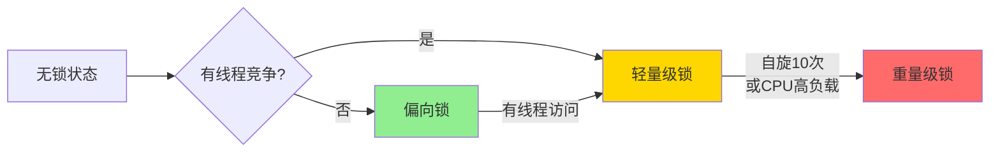
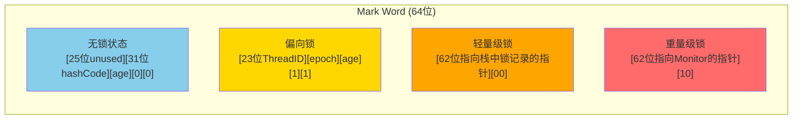
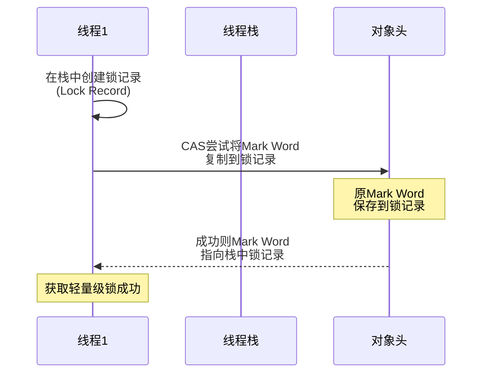
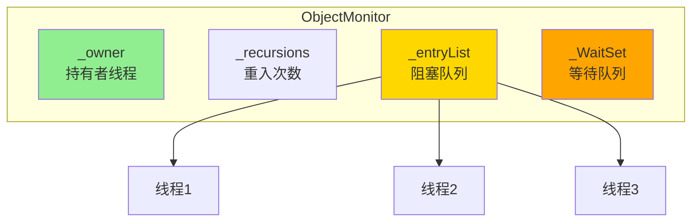
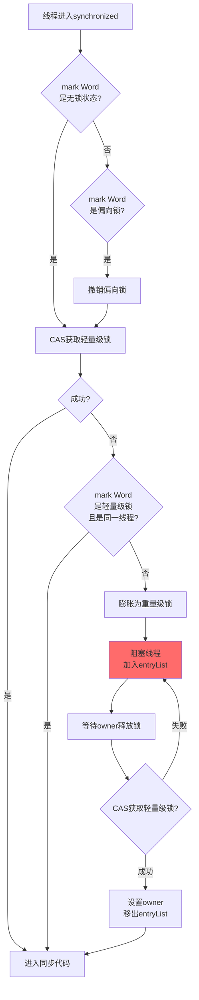

# synchronized 原理与锁升级

**目标级别**：P5 / P6

## 快速自测

面试官问：「synchronized 加锁时，对象头发生了什么变化？锁升级的过程是怎样的？」

你能回答到第几层？

---

## 一、核心问题

### 🔴 synchronized 是如何加锁的？

synchronized 通过 **对象头** 的 **Mark Word** 实现锁机制。Mark Word 存储对象的哈希码、分代年龄、锁状态等信息。

### 锁升级过程图解



---

## 二、对象头结构

### 64 位 Mark Word

| 锁状态 | 25 位 | 31 位 | 1 位 | 4 位 | 1 位 | 是否偏向锁 |
|--------|-------|-------|------|------|------|-----------|
| **无锁** | unused | hashCode | | age | 0 | 0 |
| **偏向锁** | Thread ID | epoch | | age | 1 | 1 |
| **轻量级锁** | 指向栈中锁记录的指针 | | | | 0 | 0 |
| **重量级锁** | 指向互斥量的指针 | | | | 0 | 0 |

### Mark Word 源码

```cpp title="markOop.hpp (HotSpot 虚拟机)"
// 32位 Mark Word
class markOopDesc: public oopDesc {
 private:
  // 锁状态枚举
  enum { locked_value             = 0,
         unlocked_value           = 1,
         monitor_value            = 2,    // 重量级锁
         markbit_for_biasing      = 3,    // 偏向锁标记
         biased_lock_pattern      = 5 };  // 偏向锁
         
 public:
  // 获取锁状态
  intptr_t discriminate(oop obj) {
    guarantee(this == obj->mark(), "should be this");
    if (has_bias_pattern()) {
      return biased_locker;
    }
    return value() & ~epoch_age_mask & lock_mask;
  }
};
```

### 对象头可视化



---

## 三、锁升级过程详解

### 1. 偏向锁（Biased Lock）

#### 原理

当一个线程第一次访问同步块时，在对象头的 Mark Word 中记录该线程 ID。之后该线程进入同步块时，只需检查 Mark Word 是否指向自己，无需任何同步操作。

#### 偏向锁源码

```cpp title="biasedLocking.cpp"
void ObjectSynchronizer::fast_enter(Handle obj, BasicLock* lock,
                                     bool attempt_rebias, TRAPS) {
    // 检查是否启用偏向锁
    if (UseBiasedLocking) {
        // 尝试获取偏向锁
        if (attempt_rebias) {
            // 重偏向
            mark = object->mark();
            if (mark->is_biased_anonymously() ||
                mark->biased_locker() != THREAD) {
                mark = object->mark_acquire(THREAD);
                if (mark->has_bias_pattern()) {
                    mark = mark-> Prototype () -> batch_rebias(epoch, THREAD);
                    object->release_set_mark(mark);
                }
            }
        } else {
            // 正常偏向
            mark = object->mark_acquire(THREAD);
            if (mark->has_bias_pattern() &&
                mark->biased_locker() == THREAD) {
                // 同一线程再次访问，跳过同步
                return;
            }
        }
    }
    
    // 偏向失败，膨胀为轻量级锁
    slow_enter(obj, lock, THREAD);
}
```

#### 偏向锁优缺点

| 优点 | 缺点 |
|------|------|
| 首次同步几乎无开销 | 撤销偏向锁有较高延迟 |
| 同一线程重复进入无需同步 | 多线程竞争时性能下降 |

### 2. 轻量级锁（Thin Lock）

#### 原理

当有线程竞争时，偏向锁会**撤销**（Biased Locking → Lightweight Lock），并通过 CAS 在对象头的 Mark Word 中设置指向栈中锁记录的指针。

#### 轻量级锁获取

```java title="synchronized 编译后生成的字节码"
public void method() {
    synchronized (this) {
        // 同步代码
    }
}
```

```asm
; 编译后的字节码
0: aload_0
1: dup
2: astore_1
3: monitorenter    ; 获取监视器锁
4: ...同步代码...
7: aload_1
8: monitorexit     ; 释放监视器锁
```

#### 获取轻量级锁的步骤



#### 轻量级锁源码（HotSpot）

```cpp title="synchronizer.cpp"
void ObjectSynchronizer::slow_enter(oop obj, BasicLock* lock, TRAPS) {
    markOop mark = obj->mark();
    
    // 无锁状态
    if (mark->is_neutral()) {
        // CAS 将 Mark Word 设置为指向栈中锁记录的指针
        if (mark == (markOop) Atomic::cmpxchg_ptr(
                lock, obj()->mark_addr(), mark)) {
            // 成功，对象头指向锁记录
            return;
        }
    }
    
    // 已有偏向锁或轻量级锁，重试或膨胀
    if (mark->has_locker() && THREAD == mark->locker()) {
        // 同一线程重入，计数器+1
        return;
    }
    
    // 膨胀为重量级锁
    lock->set_displaced_header(mark);
    if (Atomic::cmpxchg_ptr(lock, obj()->mark_addr(), mark) != mark) {
        return;
    }
}
```

### 3. 重量级锁（Fat Lock）

#### 原理

当轻量级锁自旋失败（自旋次数过多或CPU高负载），锁会**膨胀**为重量级锁。此时线程被阻塞，Mark Word 指向 Monitor 对象。

#### Monitor 对象结构

```cpp title="ObjectMonitor.hpp"
class ObjectMonitor {
 private:
    ObjectWaiter * volatile _entryList;    // 阻塞队列
    ObjectWaiter * volatile _next Claimant; // 下一个 Claimant
    Thread * volatile _owner;               // 持有者
    int _recursions;                        // 重入次数
    
 public:
    ObjectWaiter * volatile _WaitSet;       // 等待队列
    volatile int _waiters;                  // 等待线程数
};
```



#### 重量级锁获取流程



---

## 四、锁升级触发条件

| 锁状态 | 触发条件 |
|--------|----------|
| **偏向锁** | 无竞争，JVM 默认延迟 4 秒启用（-XX:BiasedLockingStartupDelay=0） |
| **轻量级锁** | 偏向锁被撤销 / 有竞争但不激烈 |
| **重量级锁** | 自旋失败 / CPU 高负载 / 竞争激烈 |

### JVM 参数

```bash
# 禁用偏向锁
-XX:-UseBiasedLocking

# 设置偏向锁延迟
-XX:BiasedLockingStartupDelay=0

# 设置自旋次数
-XX:PreBlockSpin=10

# JDK 11+ 自适应自旋
-XX:+UseAdaptiveSpinning
```

---

## 五、面试题精讲

### 🔴 第一层：synchronized 的锁升级过程

> **参考答案**：
>
> synchronized 锁有四种状态：**无锁 → 偏向锁 → 轻量级锁 → 重量级锁**，只会升级不会降级。
>
> 1. **偏向锁**：无竞争时，第一个访问的线程在 Mark Word 中记录自己的 ID，后续无需同步
> 2. **轻量级锁**：有竞争时，撤销偏向锁，线程在栈中创建锁记录，CAS 修改 Mark Word
> 3. **重量级锁**：自旋失败或竞争激烈，膨胀为重量级锁，线程阻塞等待

### 🟡 第二层：为什么要有锁升级？

> **参考答案**：
>
> 锁升级是为了**避免不必要的重量级锁开销**：
>
> 1. **偏向锁**：消除无竞争下的同步开销（JVM 启动后延迟 4 秒才启用）
> 2. **轻量级锁**：用 CAS 代替阻塞，避免线程切换开销
> 3. **重量级锁**：真正的互斥锁，线程阻塞等待
>
> 核心原则：**先乐观后悲观，先用户态后内核态**

### 🟡 第三层：synchronized 和 ReentrantLock 的区别

| 维度 | synchronized | ReentrantLock |
|------|--------------|---------------|
| **实现** | JVM 内置 | JDK 层面实现 |
| **锁粒度** | 粗粒度（代码块/方法） | 细粒度（可精确控制） |
| **等待可中断** | 不可中断 | 可中断（lockInterruptibly） |
| **公平锁** | 非公平（默认） | 可选公平/非公平 |
| **多条件变量** | 不支持 | 支持（多个 Condition） |
| **锁释放** | 自动释放 | 必须 finally/unlock() |

### 💡 第四层：偏向锁为什么延迟 4 秒？

> **参考答案**：
>
> JVM 启动时会有大量线程竞争，如果立即启用偏向锁，偏向锁撤销会带来额外开销。延迟 4 秒让 JVM 启动完成后再启用偏向锁，避免冷启动阶段的性能波动。

---

## 六、常见错误与陷阱

### ⚠️ 陷阱 1：synchronized 可以修饰静态方法

```java
// 修饰静态方法 = 锁住整个类（Class对象）
synchronized static void method() {
    // 锁住 Foo.class
}

// 修饰实例方法 = 锁住当前实例
synchronized void method() {
    // 锁住 this
}

// 两把不同的锁！
```

### ⚠️ 陷阱 2：锁对象不能改变

```java
Object lock = new Object();
synchronized (lock) {
    lock = new Object();  // 无效！锁已经获取，不会重新获取
}
```

### ⚠️ 陷阱 3：锁粒度太大

```java
// 错误：锁住整个方法，但实际只需要锁住部分代码
synchronized void process() {
    // 1. 查询数据库（不需要锁）
    // 2. 计算（需要锁）
    // 3. 保存结果（不需要锁）
}

// 正确：只锁需要的部分
void process() {
    // 1. 查询数据库
    // 2. 计算
    synchronized (this) {
        // 3. 保存结果
    }
}
```

### ⚠️ 陷阱 4：JVM 逃逸分析优化

```java
synchronized (new Object()) {
    // JIT 编译后可能直接消除这个锁
    // 因为锁对象不会逃逸出方法
}
```

---

## 七、手写 synchronized 原理演示

```java title="SynchronizedDemo.java"
public class SynchronizedDemo {
    
    // 偏向锁演示
    public synchronized void biasedLock() {
        // 第一次调用：记录线程ID，后续无需同步
        System.out.println("偏向锁");
    }
    
    // 轻量级锁演示
    public void thinLock() {
        synchronized (this) {
            // 竞争时：CAS修改Mark Word，失败后自旋
            // 多次自旋失败后膨胀为重量级锁
            System.out.println("轻量级锁");
        }
    }
    
    // 锁重入演示
    public synchronized void outer() {
        inner();  // 可以重入，因为是同一线程
    }
    
    public synchronized void inner() {
        // 重入次数+1
        System.out.println("重入");
    }
}
```

---

## 八、对比总结表

| 锁状态 | 线程是否阻塞 | 适用场景 | 性能 |
|--------|-------------|----------|------|
| **无锁** | 否 | 无竞争 | 最优 |
| **偏向锁** | 否 | 单线程重复访问 | 接近无锁 |
| **轻量级锁** | 否（自旋） | 短时间竞争 | 较好 |
| **重量级锁** | 是 | 长时间竞争 | 最差 |

| 维度 | 偏向锁 | 轻量级锁 | 重量级锁 |
|------|--------|----------|----------|
| **加锁原理** | Mark Word存线程ID | CAS修改Mark Word | Monitor互斥 |
| **Mark Word内容** | 线程ID | 栈中锁记录指针 | Monitor指针 |
| **是否自旋** | 否 | 是 | 否 |
| **线程状态** | 运行 | 运行（自旋） | 阻塞 |
| **用户态/内核态** | 用户态 | 用户态 | 内核态 |

---

## 九、扩展思考

> **追问**：synchronized 在 JDK8 做了哪些优化？

1. **偏向锁延迟**：JVM启动4秒后才启用
2. **自适应自旋**：自旋次数不再固定，由JVM动态调整
3. **锁粗化**：多个连续加锁合并为一次（如循环内的synchronized合并）
4. **锁消除**：JIT编译时分析，如果锁对象不会逃逸则消除

> **追问**：Mark Word 中存 hashCode 会影响锁升级吗？

会。对象创建时如果没有调用 hashCode()，Mark Word 是干净的，可用于偏向锁。如果调用过 hashCode()，对象头已存储 hashCode，偏向锁标志位为 0，无法偏向。

---

## 延伸阅读

- [Mark Word 对象头详解](./mark-word)
- [synchronized vs ReentrantLock](./sync-vs-reentrantlock)
- [AQS 抽象队列同步器](../concurrent/aqs)
- [CAS 原理与 ABA 问题](../concurrent/cas)
