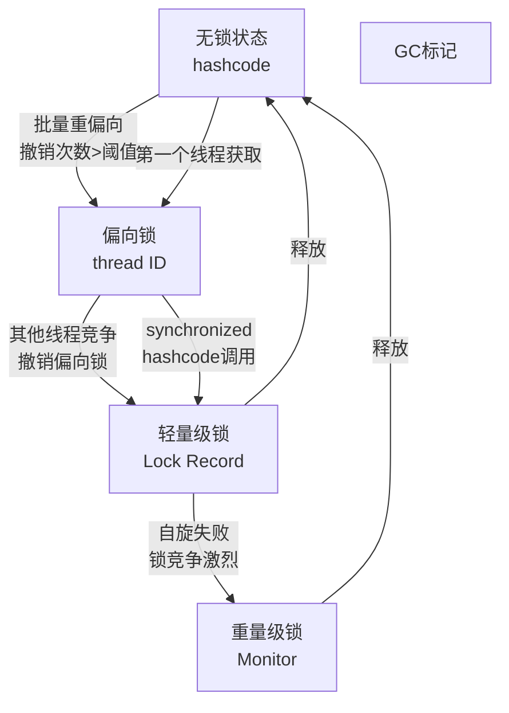
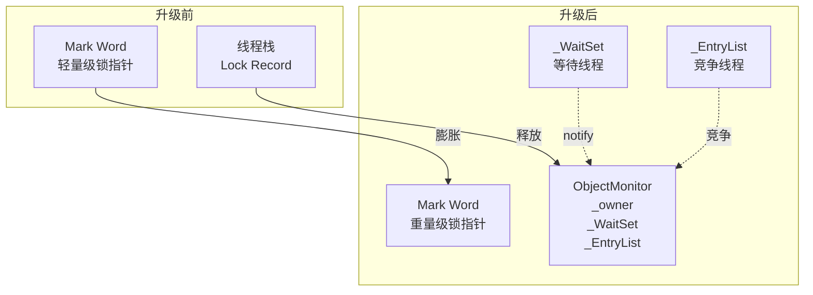
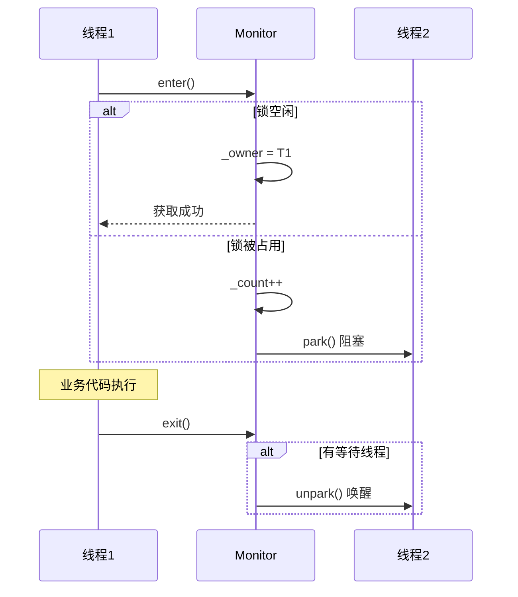

# synchronized原理与锁升级

## 一个让P6和P7拉开差距的问题

面试官问："synchronized是如何实现的？"

候选人小张回答："synchronized通过monitorenter和monitorexit指令实现，底层依赖操作系统mutex。"

面试官点点头，继续追问："那JDK 6对synchronized做了哪些优化？锁升级的过程是什么？"

小张愣了一下："好像有偏向锁、轻量级锁..."

面试官："具体说说升级过程？"

小张支支吾吾，没能说清楚。

这个问题是P6和P7拉开差距的关键。synchronized是Java中最基础的并发控制机制，但很多人只知道它"加锁"，不知道它**怎么加锁**、**怎么升级**、**为什么这么设计**。

今天这篇文章，把synchronized的锁升级机制彻底讲透。

## synchronized的基本使用

### 三种用法

```java
public class SyncUsage {
    private final Object lock = new Object();
    private int counter = 0;
    
    // 用法1：修饰实例方法，锁对象是this
    public synchronized void increment() {
        counter++;
    }
    
    // 用法2：修饰静态方法，锁对象是Class对象
    public static synchronized void staticMethod() {
        // 操作静态资源
    }
    
    // 用法3：修饰代码块，锁对象是指定的对象
    public void blockMethod() {
        synchronized (lock) {
            counter++;
        }
    }
}
```

### 编译后的字节码

```java
public class SyncDemo {
    public synchronized void method() {
        // 同步方法
    }
    
    public void block() {
        synchronized (this) {
            // 同步代码块
        }
    }
}
```

编译后的字节码：

```text
// synchronized方法
public synchronized void method();
  descriptor: ()V
  flags: ACC_SYNCHRONIZED

// synchronized代码块
public void block();
  descriptor: ()V
  Code:
    aload_0
    dup
    astore_1
    monitorenter    // 进入监视器
    aload_1
    monitorexit     // 退出监视器
    return
```

**关键点**：
- `ACC_SYNCHRONIZED`标志：方法级别的同步
- `monitorenter/monitorexit`：代码块级别的同步

## 对象的内存布局

### 对象的组成

在HotSpot JVM中，对象由三部分组成：

```mermaid
graph LR
    subgraph Object[Java对象]
        MW[Mark Word<br/>8字节]
        CP[Class Pointer<br/>8字节 (压缩4字节)]
        ID[Instance Data]
        PADDING[Padding对齐]
    end
```

1. **Mark Word**：存储对象的哈希码、GC年龄、锁状态等信息
2. **Class Pointer**：指向类元数据的指针，开启压缩后为4字节
3. **Instance Data**：对象的实例字段
4. **Padding**：对齐填充，保证对象大小是8字节的倍数

### Mark Word的结构（64位）

| 锁状态 | Mark Word内容（62位） | 额外存储 |
|--------|----------------------|----------|
| 无锁 | 对象哈希码 + 年龄 | - |
| 偏向锁 | thread ID + epoch + age + 1 | 偏向锁标志 |
| 轻量级锁 | 指向栈中锁记录的指针 | 00 |
| 重量级锁 | 指向monitor的指针 | 10 |
| GC标记 | 空 | 11 |

```text
无锁状态（正常对象）：
[31:25] [24:31] [23:22] [21:31] [00] = hashcode | age | 0 | 01

偏向锁状态：
[30:54] [54:63] [47:63] [2:54] [1:2] [0:1] = thread | epoch | age | 1 | 01

轻量级锁：
[62:3] [0:2] = 指向栈中锁记录的指针 | 00

重量级锁：
[62:3] [0:2] = 指向monitor的指针 | 10
```

## 锁升级的过程

### 锁状态转换图



### 第一阶段：无锁 → 偏向锁

**触发条件**：第一个线程访问synchronized代码块

**升级过程**：
1. 线程在对象头的Mark Word中写入自己的线程ID
2. 以后该线程进入同步块时，不需要任何CAS操作
3. 直接获取锁

**偏向锁的优点**：消除再进入同步块时的CAS操作

```java
public class BiasedLockDemo {
    private final Object lock = new Object();
    
    public void firstThread() {
        synchronized (lock) {
            // 第一次获取锁：升级为偏向锁
            // Mark Word: [thread ID | epoch | age | 1 | 01]
        }
    }
    
    public void sameThreadAgain() {
        synchronized (lock) {
            // 同一个线程再次进入：无需任何操作
            // 因为Mark Word中的thread ID就是自己
        }
    }
}
```

**偏向锁的延迟**：
- JVM启动后4秒才开启偏向锁（`-XX:BiasedLockingStartupDelay=4000`）
- 原因：JVM启动时有大量线程创建又销毁，不需要偏向锁

**撤销偏向锁的场景**：
1. 其他线程尝试获取锁
2. 调用对象的hashCode()（需要存储哈希码，偏向锁无法存储）
3. 调用wait/notify（重量级锁特性）

### 第二阶段：偏向锁 → 轻量级锁

**触发条件**：有其他线程尝试获取偏向锁，且发生竞争

**升级过程**：
1. 原持有偏向锁的线程到达安全点，停止运行
2. 遍历线程栈，查找偏向锁的锁记录（BiasedLockingRecord）
3. 如果还在同步块中，升级为轻量级锁
4. 其他线程开始自旋等待

```java
public class LightweightLockDemo {
    private final Object lock = new Object();
    
    public void threadA() {
        synchronized (lock) {
            // 线程A获取锁，偏向锁
        }
    }
    
    public void threadB() {
        synchronized (lock) {
            // 线程B来竞争，偏向锁被撤销
            // 升级为轻量级锁
            // 线程A和B在用户态自旋等待
        }
    }
}
```

### 第三阶段：轻量级锁 → 重量级锁

**触发条件**：自旋次数超过阈值，或自旋的线程超过CPU核心数

**升级过程**：
1. 自旋失败后，锁膨胀为重量级锁
2. Mark Word更新为指向Monitor的指针
3. 未获取锁的线程进入Monitor的等待队列
4. 线程切换到内核态，被阻塞



**重量级锁的开销**：
- 用户态 → 内核态切换（context switch）
- 线程阻塞和唤醒
- 约几百纳秒到几微秒的延迟

### 锁升级的触发条件总结

| 阶段 | 触发条件 |
|------|----------|
| 无锁 → 偏向锁 | 第一个线程进入synchronized块 |
| 偏向锁 → 轻量级锁 | 其他线程竞争偏向锁 |
| 轻量级锁 → 重量级锁 | 自旋失败（自旋次数超阈值或CPU繁忙） |

## 轻量级锁的原理

### 锁记录（Lock Record）

轻量级锁在**线程栈帧**中创建锁记录：

```java
// 线程栈帧结构
class StackFrame {
    DisplacedMarkWord displaced_mark_word;  // 存储对象头原Mark Word
    Object obj;                              // 指向锁对象
}
```

### 加锁过程

```java
public class LightweightLockProcess {
    private final Object lock = new Object();
    
    public void lock() {
        synchronized (lock) {
            // 1. 在线程栈中创建Lock Record
            // 2. 将对象头Mark Word复制到Lock Record
            // 3. CAS尝试将对象头Mark Word更新为指向Lock Record的指针
            //    - 成功：获取轻量级锁
            //    - 失败：自旋重试
        }
    }
}
```

**CAS操作**：

```text
对象头Mark Word（64位）：
[62:3] = 指向Lock Record的指针
[0:2] = 00（轻量级锁标志）

栈中Lock Record：
[62:3] = 原来的Mark Word
```

### 解锁过程

```java
public void unlock() {
    // 1. CAS将Lock Record中的Mark Word复制回对象头
    // 2. 如果成功：解锁完成
    // 3. 如果失败：说明有竞争，膨胀为重量级锁
}
```

## 重量级锁的原理

### Monitor（ObjectMonitor）的结构

```cpp
// HotSpot ObjectMonitor关键字段
class ObjectMonitor {
    volatile _Header;       // Mark Word
    volatile _WaitSet;     // 调用wait()的线程队列
    volatile _EntryList;   // 等待获取锁的线程队列
    Object _owner;         // 当前持有锁的线程
    int _recursions;       // 重入次数
    volatile int _count;   // 等待线程计数
};
```

### 加锁过程



### 自旋优化

```java
// JDK 6之前：固定自旋次数
for (int i = 0; i < 10; i++) {
    // 自旋等待
}

// JDK 6之后：自适应自旋
// - 如果上次自旋成功，本次自旋次数增加
// - 如果上次自旋失败，本次自旋次数减少
// - 极端情况下可能不自旋，直接膨胀
```

## 生产中的注意事项

### 减少锁粒度

```java
// ❌ 粗粒度锁：整个链表加锁
public class BadLinkedList {
    private final Object lock = new Object();
    private Node head;
    
    public void add(Node node) {
        synchronized (lock) {
            // 遍历链表
        }
    }
}

// ✅ 细粒度锁：每个节点独立锁
public class GoodLinkedList {
    private Node head;
    
    public void add(Node node) {
        // 分段锁策略
    }
}

// ✅ 更好的方案：ConcurrentHashMap
Map<String, Object> map = new ConcurrentHashMap<>();
map.put(key, value);  // 分段锁，高并发性能好
```

### 锁消除

JIT编译器会自动消除不必要的锁：

```java
public String concat(String a, String b) {
    // JIT识别出这是局部变量，不可能被其他线程访问
    // 消除synchronized
    synchronized (new Object()) {
        return a + b;
    }
}
```

### 锁粗化

```java
// ❌ 频繁加解锁
for (int i = 0; i < 1000; i++) {
    synchronized (lock) {
        list.add(i);
    }
}

// ✅ JIT优化为一次加锁
synchronized (lock) {
    for (int i = 0; i < 1000; i++) {
        list.add(i);
    }
}
```

### 避免热点数据竞争

```java
// ❌ 热点数据用同一把锁
public class HotDataProblem {
    private final Object lock = new Object();
    private int counter1 = 0;
    private int counter2 = 0;
    
    public void inc1() {
        synchronized (lock) {
            counter1++;
        }
    }
    
    public void inc2() {
        synchronized (lock) {
            counter2++;
        }
    }
}

// ✅ 分离热点数据
public class HotDataSolution {
    private AtomicInteger counter1 = new AtomicInteger(0);
    private AtomicInteger counter2 = new AtomicInteger(0);
    
    public void inc1() {
        counter1.incrementAndGet();
    }
    
    public void inc2() {
        counter2.incrementAndGet();
    }
}
```

## JDK 15之后的变化

### 废弃偏向锁

```bash
# JDK 15开始，偏向锁默认禁用
# -XX:+UseBiasedLocking 已废弃

# 如果需要开启（不推荐）
-XX:+UseBiasedLocking -XX:BiasedLockingStartupDelay=0
```

**原因**：
- 现代应用很少真正从偏向锁受益
- 偏向锁的维护成本高
- 简化JVM实现

### 轻量级锁优化

```text
JDK 15+ 的变化：
1. 偏向锁被禁用后，无锁直接升级轻量级锁
2. 锁状态简化：无锁 → 轻量级 → 重量级
3. 减少了锁状态的复杂度
```

## 面试中的高频追问

### 追问1：synchronized和ReentrantLock的区别？

| 维度 | synchronized | ReentrantLock |
|------|--------------|---------------|
| 实现 | JVM内置 | JDK API |
| 加解锁 | 自动 | 手动 |
| 中断 | 不能中断等待线程 | 可中断等待 |
| 超时 | 不能 | 可tryLock超时 |
| 条件 | 单一条件 | 多个Condition |
| 公平性 | 非公平 | 可公平/非公平 |

### 追问2：为什么synchronized在JDK 6之前性能差？

因为JDK 6之前只有重量级锁，每次加锁都要进入内核态（系统调用），即使没有实际竞争也要经历用户态→内核态的切换。JDK 6引入偏向锁和轻量级锁后，优化了无竞争和低竞争场景。

### 追问3：锁能降级吗？

不能。HotSpot JVM只实现了锁升级，没有实现锁降级。这是因为：
- 实现锁降级需要更多复杂度
- 大部分场景锁升级后不会再降级
- 简化实现，提高性能

### 追问4：synchronized的wait/notify为什么要在同步块中调用？

因为wait/notify需要获取对象的monitor，而synchronized是获取monitor的唯一方式。在同步块外调用会抛IllegalMonitorStateException。

## 【学习小结】

1. **synchronized实现**：monitorenter/monitorexit字节码指令
2. **对象内存布局**：Mark Word + Class Pointer + Instance Data
3. **锁升级流程**：无锁 → 偏向锁 → 轻量级锁 → 重量级锁
4. **偏向锁**：消除无竞争时的CAS操作，第一个线程ID存储在Mark Word
5. **轻量级锁**：CAS将Mark Word复制到栈，指向Lock Record
6. **重量级锁**：Monitor机制，涉及用户态→内核态切换
7. **生产建议**：减少锁粒度、避免热点竞争、善用并发工具

---

**延伸阅读**：
- [synchronized对象头（Mark Word）](/java/concurrent/mark-word)
- [synchronized vs ReentrantLock](/java/concurrent/sync-vs-reentrantlock)
- [AQS抽象队列同步器原理](/java/concurrent/aqs)