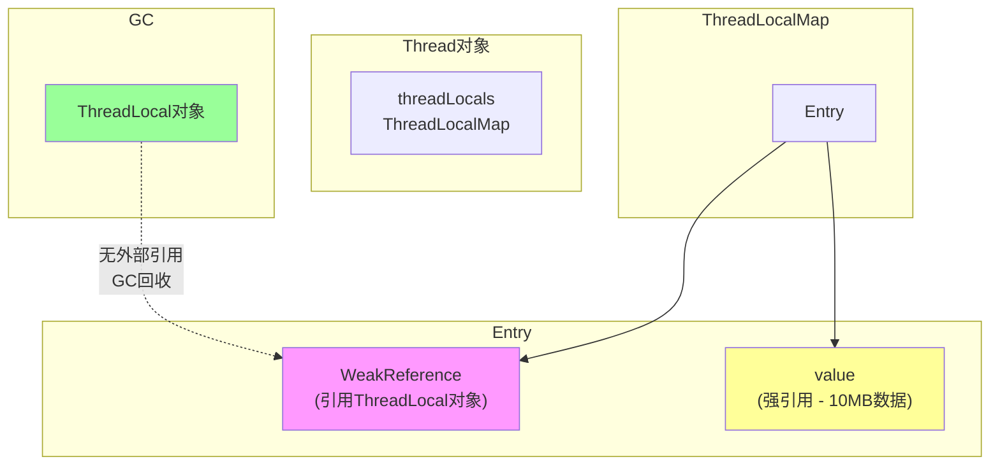

# ThreadLocal原理与内存泄漏

## 一个让P6翻车的面试题

面试官问候选人小张："ThreadLocal是什么？有什么内存泄漏风险？"

小张说："ThreadLocal是线程本地存储，每个线程有自己的变量副本。它用弱引用防止内存泄漏。"

面试官追问："既然用了弱引用，为什么还会有内存泄漏？"

小张愣住了。

这个问题是P6和P7拉开差距的关键。很多同学知道"ThreadLocal用弱引用"，但不知道为什么还会有泄漏，什么场景下会泄漏，怎么避免。

今天这篇文章，把ThreadLocal讲透。

## ThreadLocal是什么

### 基本概念

```java
public class ThreadLocalDemo {
    // 每个线程都有自己独立的值
    private static final ThreadLocal<String> THREAD_LOCAL = 
        new ThreadLocal<>();
    
    public void demo() {
        // 设置值，只对当前线程可见
        THREAD_LOCAL.set("main thread value");
        
        // 获取值
        String value = THREAD_LOCAL.get();
        
        // 移除值
        THREAD_LOCAL.remove();
    }
}
```

### 与普通变量的区别

```java
public class ComparisonDemo {
    private static String normalVar = "normal";  // 所有线程共享
    private static ThreadLocal<String> threadVar = new ThreadLocal<>();  // 线程隔离
    
    public void demo() {
        // 普通变量：所有线程看到同一个值
        normalVar = "modified";  // 其他线程也看到这个修改
        
        // ThreadLocal：每个线程看到自己的值
        threadVar.set("thread-specific");  // 只有当前线程能看到
        String local = threadVar.get();    // 其他线程获取不到这个值
    }
}
```

### 常见使用场景

```java
// 场景1：存储用户上下文
public class UserContext {
    private static final ThreadLocal<User> currentUser = new ThreadLocal<>();
    
    public static void set(User user) {
        currentUser.set(user);
    }
    
    public static User get() {
        return currentUser.get();
    }
    
    public static void clear() {
        currentUser.remove();
    }
}

// 场景2：存储线程ID
public class TraceId {
    private static final ThreadLocal<String> traceId = new ThreadLocal<>();
    
    public static void set(String id) {
        traceId.set(id);
    }
    
    public static String get() {
        return traceId.get();
    }
}

// 场景3：SimpleDateFormat线程安全
public class DateFormatter {
    // ❌ SimpleDateFormat不是线程安全的
    // private static SimpleDateFormat sdf = new SimpleDateFormat();
    
    // ✅ 使用ThreadLocal
    private static final ThreadLocal<DateFormat> dateFormat = 
        ThreadLocal.withInitial(() -> new SimpleDateFormat("yyyy-MM-dd"));
    
    public String format(Date date) {
        return dateFormat.get().format(date);
    }
}
```

## ThreadLocal的实现原理

### 核心数据结构

```java
// ThreadLocalMap - ThreadLocal的内部实现
public class ThreadLocal<T> {
    // ThreadLocalMap是Thread的成员变量
    static class ThreadLocalMap {
        // Entry数组
        private Entry[] table;
        
        // Entry：键值对
        static class Entry extends WeakReference<ThreadLocal<?>> {
            Object value;
            
            Entry(ThreadLocal<?> k, Object v) {
                super(k);
                value = v;
            }
        }
        
        private static final int INITIAL_CAPACITY = 16;
        private Entry[] table;
        private int size = 0;
        private int threshold;
    }
}
```

### Thread中的ThreadLocalMap

```java
public class Thread implements Runnable {
    // ThreadLocalMap存储在线程对象中
    ThreadLocal.ThreadLocalMap threadLocals;
    ThreadLocal.ThreadLocalMap inheritableThreadLocals;
}
```

### set()的实现

```java
public void set(T value) {
    // 获取当前线程
    Thread t = Thread.currentThread();
    
    // 获取当前线程的ThreadLocalMap
    ThreadLocalMap map = getMap(t);
    
    if (map != null) {
        // map已存在，存储Entry
        map.set(this, value);
    } else {
        // 第一次，创建map
        createMap(t, value);
    }
}

ThreadLocalMap getMap(Thread t) {
    // 返回线程的threadLocals
    return t.threadLocals;
}

void createMap(Thread t, T firstValue) {
    // 创建ThreadLocalMap
    t.threadLocals = new ThreadLocalMap(this, firstValue);
}
```

### get()的实现

```java
public T get() {
    // 获取当前线程
    Thread t = Thread.currentThread();
    
    // 获取ThreadLocalMap
    ThreadLocalMap map = getMap(t);
    
    if (map != null) {
        // 查找Entry
        ThreadLocalMap.Entry e = map.getEntry(this);
        if (e != null) {
            @SuppressWarnings("unchecked")
            T result = (T) e.value;
            return result;
        }
    }
    
    // 没有找到，返回初始值
    return setInitialValue();
}

private T setInitialValue() {
    // 获取初始值（默认返回null）
    T value = initialValue();
    
    // 获取当前线程
    Thread t = Thread.currentThread();
    
    // 获取或创建ThreadLocalMap
    ThreadLocalMap map = getMap(t);
    if (map != null) {
        map.set(this, value);
    } else {
        createMap(t, value);
    }
    
    return value;
}
```

### remove()的实现

```java
public void remove() {
    // 获取当前线程的ThreadLocalMap
    ThreadLocalMap m = getMap(Thread.currentThread());
    
    if (m != null) {
        // 从map中移除Entry
        m.remove(this);
    }
}
```

## 弱引用与内存泄漏

### 为什么要用弱引用

```java
static class Entry extends WeakReference<ThreadLocal<?>> {
    Object value;
    
    Entry(ThreadLocal<?> k, Object v) {
        super(k);  // 弱引用
        value = v;  // 强引用
    }
}
```

**为什么用弱引用**：
- 如果使用强引用，当ThreadLocal对象没有外部引用时，无法被GC回收
- 使用弱引用，ThreadLocal对象可以被GC回收
- 但Entry的value仍然是强引用

### 内存泄漏的场景

```java
public class MemoryLeakDemo {
    private static final ThreadLocal<byte[]> heavyData = 
        new ThreadLocal<>();
    
    public void leakScenario() {
        // 创建ThreadLocal，持有大量数据
        heavyData.set(new byte[1024 * 1024 * 10]);  // 10MB
        
        // 不调用remove
        // ... 其他操作
        // ... 方法结束
        
        // 场景1：ThreadLocal对象被回收
        // 因为没有外部强引用，ThreadLocal对象被GC
        // 但Entry.value仍然持有10MB数据！
        
        // 场景2：线程池中的线程复用
        // 如果线程不结束，ThreadLocalMap不会被清理
        // 数据一直存在，造成内存泄漏
    }
}
```

### 泄漏原因分析



**问题**：
1. ThreadLocal对象被回收（因为弱引用）
2. Entry.key变成null
3. 但Entry.value仍然持有强引用
4. 线程不结束，ThreadLocalMap一直存在
5. value无法被回收，造成内存泄漏

### ThreadLocalMap的清理机制

```java
// ThreadLocalMap的expungeStaleEntry
// 清理过期的Entry

private int expungeStaleEntry(int staleSlot) {
    Entry[] tab = table;
    int len = tab.length;
    
    // 清理过期的Entry
    tab[staleSlot].value = null;
    tab[staleSlot] = null;
    size--;
    
    // 重新hash，清理路上遇到的过期Entry
    Entry e;
    int i;
    for (i = nextIndex(staleSlot, len);
         (e = tab[i]) != null;
         i = nextIndex(i, len)) {
        ThreadLocal<?> k = e.get();
        if (k == null) {
            // 清理过期的Entry
            e.value = null;
            tab[i] = null;
            size--;
        } else {
            // 重新hash
            int h = k.threadLocalHashCode & (len - 1);
            if (h != i) {
                tab[i] = null;
                while (tab[h] != null)
                    h = nextIndex(h, len);
                tab[h] = e;
            }
        }
    }
    return i;
}
```

## 生产中的问题

### 线程池 + ThreadLocal

```java
public class ThreadPoolThreadLocalProblem {
    private static final ThreadLocal<User> userContext = new ThreadLocal<>();
    
    public void problemScenario() {
        ExecutorService executor = Executors.newFixedThreadPool(4);
        
        for (int i = 0; i < 10; i++) {
            final int taskId = i;
            executor.submit(() -> {
                try {
                    // 设置用户上下文
                    userContext.set(new User(taskId));
                    
                    // 执行业务
                    doBusiness();
                    
                    // ❌ 忘记remove
                } finally {
                    // 应该调用 userContext.remove();
                }
            });
        }
    }
    
    // 问题：线程复用时，旧的用户上下文可能泄漏
}
```

### ❌ 错误示例

```java
public class WrongUsage {
    private static final ThreadLocal<Connection> connection = 
        new ThreadLocal<>();
    
    public void wrong() {
        // 设置连接
        connection.set(db.getConnection());
        
        // 业务逻辑
        doWork();
        
        // ❌ 忘记关闭连接
        // ❌ 忘记remove
    }
}
```

### ✅ 正确用法

```java
public class CorrectUsage {
    private static final ThreadLocal<Connection> connection = 
        new ThreadLocal<>();
    
    public void correct() {
        Connection conn = db.getConnection();
        connection.set(conn);
        
        try {
            doWork();
        } finally {
            // 1. 清理ThreadLocal
            connection.remove();
            
            // 2. 关闭连接
            conn.close();
        }
    }
}
```

### 使用框架的ThreadLocal

```java
// Spring框架的RequestContextHolder
// 正确清理请求上下文

// 如果使用Filter
public class ThreadLocalFilter implements Filter {
    @Override
    public void doFilter(...) throws IOException, ServletException {
        try {
            chain.doFilter(request, response);
        } finally {
            // Spring已经处理，但最好显式清理
            RequestContextHolder.resetRequestAttributes();
        }
    }
}

// MyBatis的SqlSession
// SqlSessionManager已经处理ThreadLocal
```

## InheritableThreadLocal

### 与ThreadLocal的区别

```java
public class InheritableThreadLocalDemo {
    // 普通ThreadLocal：子线程看不到父线程的值
    private static final ThreadLocal<String> threadLocal = 
        new ThreadLocal<>();
    
    // InheritableThreadLocal：子线程继承父线程的值
    private static final ThreadLocal<String> inheritableThreadLocal = 
        new InheritableThreadLocal<>();
    
    public void demo() {
        threadLocal.set("main value");
        inheritableThreadLocal.set("main value");
        
        new Thread(() -> {
            // threadLocal.get() -> null
            String tl = threadLocal.get();
            
            // inheritableThreadLocal.get() -> "main value"
            String itl = inheritableThreadLocal.get();
        }).start();
    }
}
```

### 实现原理

```java
public class InheritableThreadLocal<T> extends ThreadLocal<T> {
    // Thread在创建时会复制父线程的inheritableThreadLocals
    Thread(ThreadGroup group, Runnable target, String name,
           long stackSize, AccessControlContext acc,
           boolean inheritThreadLocals) {
        // ...
        if (inheritThreadLocals && parent.inheritableThreadLocals != null)
            this.inheritableThreadLocals = 
                ThreadLocal.createInheritedMap(parent.inheritableThreadLocals);
    }
}
```

### 为什么不推荐在线程池中使用

```java
public class InheritableThreadLocalInPool {
    private static final InheritableThreadLocal<String> context = 
        new InheritableThreadLocal<>();
    
    public void problem() {
        ExecutorService executor = Executors.newFixedThreadPool(2);
        
        // 任务1：设置上下文
        executor.submit(() -> {
            context.set("Task1");
            // 异步执行
        });
        
        // 任务2：新线程创建时继承
        executor.submit(() -> {
            // 新线程继承的可能是任务1的值
            // 而不是预期的"未设置"
            String value = context.get();
        });
    }
}
```

## 最佳实践

### 1. 一定要在finally中remove

```java
public class BestPractice1 {
    private static final ThreadLocal<Connection> conn = 
        new ThreadLocal<>();
    
    public void demo() {
        Connection c = getConnection();
        conn.set(c);
        
        try {
            // 业务逻辑
        } finally {
            conn.remove();  // ✅ 必须
        }
    }
}
```

### 2. 使用initialValue或withInitial

```java
public class BestPractice2 {
    // 方式1：重写initialValue
    private static final ThreadLocal<DateFormat> df = 
        new ThreadLocal<DateFormat>() {
            @Override
            protected DateFormat initialValue() {
                return new SimpleDateFormat("yyyy-MM-dd");
            }
        };
    
    // 方式2：JDK 8+ 推荐
    private static final ThreadLocal<DateFormat> dfModern = 
        ThreadLocal.withInitial(() -> new SimpleDateFormat("yyyy-MM-dd"));
}
```

### 3. 避免存储大对象

```java
public class BestPractice3 {
    // ❌ 避免存储大对象
    private static final ThreadLocal<byte[]> largeData = 
        new ThreadLocal<>();
    
    // ✅ 只存储必要的数据
    private static final ThreadLocal<String> traceId = 
        new ThreadLocal<>();
}
```

### 4. 线程池场景

```java
public class BestPractice4 {
    private static final ThreadLocal<String> context = 
        new ThreadLocal<>();
    
    public void executeWithContext(Runnable task, String contextValue) {
        context.set(contextValue);
        try {
            task.run();
        } finally {
            context.remove();  // ✅ 关键：在线程归还前清理
        }
    }
}
```

## 面试中的高频追问

### 追问1：为什么ThreadLocalMap使用开放地址法？

ThreadLocalMap使用**线性探测**而非链表解决哈希冲突：

```java
private void set(ThreadLocal<?> key, Object value) {
    ThreadLocal<?>[] tab = table;
    int len = tab.length;
    int i = key.threadLocalHashCode & (len - 1);
    
    // 线性探测
    for (ThreadLocal<?> e = tab[i]; e != null; e = tab[i = nextIndex(i, len)]) {
        if (e.get() == key) {
            e.value = value;
            return;
        }
        if (e.get() == null) {
            // 清理过期的Entry
            replaceStaleEntry(key, value, i);
            return;
        }
    }
    
    tab[i] = new Entry(key, value);
    size++;
}
```

**原因**：ThreadLocalMap是线程私有的，访问频率不高，不需要链表那么复杂的结构。

### 追问2：ThreadLocalMap的负载因子是多少？

```java
private void setThreshold(int len) {
    threshold = len * 2 / 3;  // 负载因子 = 2/3 ≈ 0.67
}
```

当size >= threshold时，触发rehash/扩容。

### 追问3：父子线程共享数据的其他方式？

1. **InheritableThreadLocal**：子线程继承父线程的值
2. **TransmittableThreadLocal**：阿里开源，跨线程池传递
3. **手动传递**：作为参数传递

### 追问4：如何排查ThreadLocal内存泄漏？

```java
// 1. 使用weakHashMap替代ThreadLocalMap（不推荐）
// 2. 定期调用remove()
// 3. 使用监控工具
//    - jmap -heap <pid>
//    - MAT分析堆内存
//    - Arthas排查
```

## 【学习小结】

1. **ThreadLocal**：线程本地存储，每个线程有独立副本
2. **实现**：ThreadLocalMap存储在线程对象中，key是ThreadLocal弱引用
3. **弱引用目的**：ThreadLocal对象可以被GC回收
4. **泄漏原因**：value是强引用，ThreadLocal对象被回收后，value仍存在
5. **清理机制**：get/set时惰性清理过期的Entry
6. **高危场景**：线程池 + ThreadLocal（线程复用）
7. **最佳实践**：在finally中remove、避免存大对象
8. **InheritableThreadLocal**：子线程继承父线程的值，但不推荐在线程池中使用

---

**延伸阅读**：
- [volatile可见性与禁止重排序](/java/concurrent/volatile)
- [synchronized原理与锁升级](/java/concurrent/synchronized)
- [线程池7个核心参数](/java/concurrent/threadpool-params)