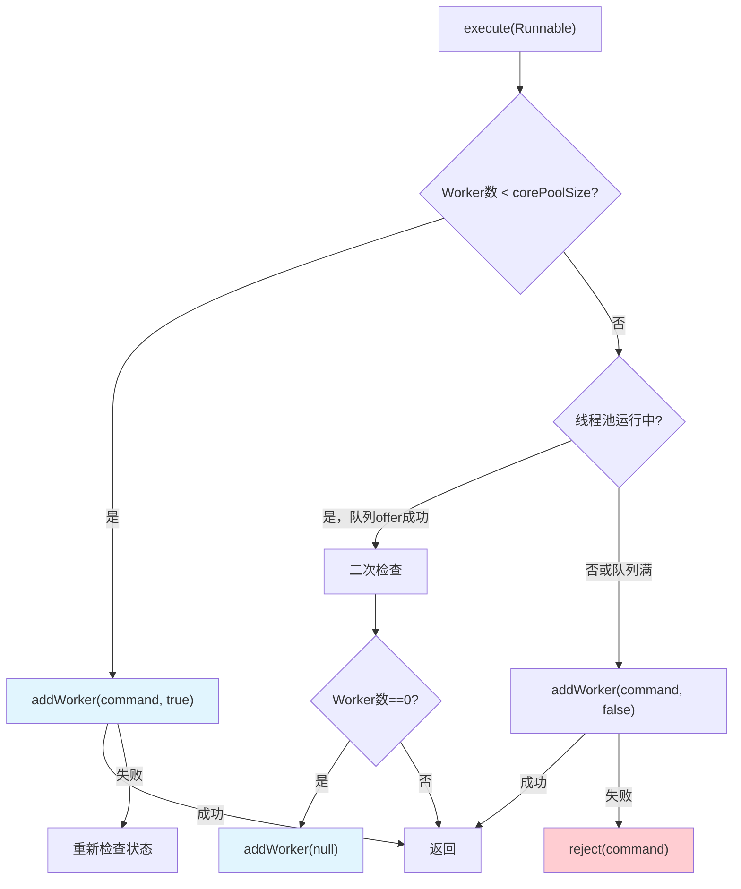
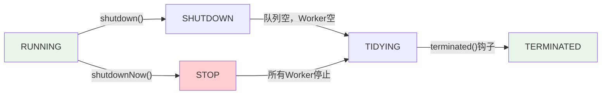

# 线程池 execute 流程

在项目中用线程池时，很多同学会疑惑：任务提交后到底是怎么执行的？"线程复用"是怎么实现的？我自己也踩过这个坑——不理解 getTask 逻辑，导致 keepAliveTime 设置无效。

今天我们就来把这个执行流程彻底讲清楚。

## 一、execute 方法的完整流程

### 1.1 execute 源码

```java
public void execute(Runnable command) {
    if (command == null)
        throw new NullPointerException();
    
    int c = ctl.get();
    
    // 1. 检查线程数是否小于核心线程数
    if (workerCountOf(c) < corePoolSize) {
        // 添加核心线程执行任务
        if (addWorker(command, true))
            return;
        c = ctl.get();
    }
    
    // 2. 检查线程池是否运行，尝试加入队列
    if (isRunning(c) && workQueue.offer(command)) {
        int recheck = ctl.get();
        // 二次检查：如果线程池停止，需退回队列
        if (! isRunning(recheck) && remove(command))
            reject(command);
        // 如果没有工作线程，需要添加一个
        else if (workerCountOf(recheck) == 0)
            addWorker(null, false);
        return;
    }
    
    // 3. 尝试添加临时线程
    else if (!addWorker(command, false))
        reject(command);
}
```

### 1.2 流程图解



### 1.3 三个关键分支

**分支1：添加核心线程**
```
当前状态：Worker数 < corePoolSize
执行动作：addWorker(command, true)
结果：创建新 Worker 执行任务
```

**分支2：加入队列**
```
当前状态：Worker数 >= corePoolSize，但 < maximumPoolSize
执行动作：workQueue.offer(command)
结果：任务进入队列，等待 Worker 取出
```

**分支3：添加临时线程**
```
当前状态：队列已满，无法添加
执行动作：addWorker(command, false)
结果：创建临时 Worker 执行任务
```

## 二、Worker 的执行机制

### 2.1 Worker 的定义

```java
private final class Worker extends AbstractQueuedSynchronizer 
    implements Runnable {
    
    final Thread thread;           // 执行任务的线程
    Runnable firstTask;            // 第一个任务（可选）
    volatile long completedTasks; // 完成的任务数
    
    Worker(Runnable firstTask) {
        this.firstTask = firstTask;
        this.thread = threadFactory.newThread(this);
    }
    
    public void run() {
        runWorker(this);
    }
}
```

### 2.2 runWorker 核心循环

```java
final void runWorker(Worker w) {
    Thread wt = Thread.currentThread();
    Runnable task = w.firstTask;
    w.firstTask = null;
    
    boolean completedAbruptly = true;
    try {
        // 核心循环：不断从队列获取任务执行
        while (task != null || (task = getTask()) != null) {
            // 获取到任务，执行前置钩子
            beforeExecute(wt, task);
            
            try {
                // 执行任务
                task.run();
                
                // 执行后置钩子
                afterExecute(task, null);
            } finally {
                task = null;  // 清除引用
                w.completedTasks++;  // 完成任务数 +1
            }
        }
        completedAbruptly = false;
    } finally {
        processWorkerExit(w, completedAbruptly);
    }
}
```

### 2.3 getTask 获取任务

```java
private Runnable getTask() {
    boolean timedOut = false;
    
    for (;;) {
        int c = ctl.get();
        int rs = runStateOf(c);
        
        // 1. 检查线程池状态
        if (rs >= SHUTDOWN && (rs >= STOP || workQueue.isEmpty())) {
            decrementWorkerCount();
            return null;  // 线程应该退出
        }
        
        int wc = workerCountOf(c);
        
        // 2. 决定是否需要超时控制
        boolean timed = allowCoreThreadTimeOut() || wc > corePoolSize;
        
        // 3. 尝试获取任务
        if ((wc > maximumPoolSize || (timed && timedOut))
            && wc > 0) {
            // 需要减少线程
            if (compareAndDecrementWorkerCount())
                return null;
            continue;
        }
        
        try {
            // 4. 从队列获取任务
            Runnable r = timed ?
                workQueue.poll(keepAliveTime, TimeUnit.NANOSECONDS) :
                workQueue.take();
            return r;
        } catch (InterruptedException retry) {
            timedOut = false;
        }
    }
}
```

### 2.4 getTask 逻辑详解

**两种取任务方式**：

| 方式 | 条件 | 行为 |
| --- | --- | --- |
| `take()` | 核心线程或不允许超时 | **阻塞等待**，直到有任务 |
| `poll(keepAliveTime)` | 临时线程（`timed=true`） | **超时等待**，超过时间返回 null |

**为什么临时线程会退出？**

```java
// 临时线程：wc > corePoolSize
// keepAliveTime 后 poll 返回 null
// getTask 返回 null
// runWorker 循环结束
// processWorkerExit 回收线程
```

**为什么核心线程不会退出？**

```java
// 核心线程：wc <= corePoolSize && !allowCoreThreadTimeOut()
// take() 阻塞等待，永远不会返回 null
// Worker 永远不会退出
```

## 三、线程池状态（ctl）

### 3.1 ctl 的结构

```java
// ctl 将线程池状态和线程数打包成一个 int
private final AtomicInteger ctl = new AtomicInteger(ctlOf(RUNNING, 0));

// 高3位：线程池状态
// 低29位：Worker 数量
private static final int COUNT_BITS = Integer.SIZE - 3;  // 29
private static final int CAPACITY   = (1 << COUNT_BITS) - 1;  // 2^29 - 1

// 线程池状态
private static final int RUNNING    = -1 << COUNT_BITS;  // -536870912
private static final int SHUTDOWN  =  0 << COUNT_BITS;  // 0
private static final int STOP      =  1 << COUNT_BITS;  // 536870912
private static final int TIDYING  =  2 << COUNT_BITS;  // 1073741824
private static final int TERMINATED = 3 << COUNT_BITS;  // 1610612736
```

### 3.2 状态转换



### 3.3 状态含义

| 状态 | 值 | 含义 |
| --- | --- | --- |
| `RUNNING` | 负数（高3位全1） | 接收新任务，执行队列任务 |
| `SHUTDOWN` | 0 | 不接收新任务，但执行队列任务 |
| `STOP` | 正数（高3位有0） | 不接收新任务，不执行队列任务，中断正在执行的任务 |
| `TIDYING` | - | 任务结束，准备终止 |
| `TERMINATED` | - | 完全终止 |

## 四、shutdown vs shutdownNow

### 4.1 shutdown

```java
public void shutdown() {
    lock.lock();
    try {
        advanceRunState(SHUTDOWN);
        interruptIdleWorkers();
    } finally {
        lock.unlock();
    }
    tryTerminate();
}

private void interruptIdleWorkers() {
    for (Worker w : workers) {
        Thread t = w.thread;
        if (!t.isInterrupted() && w.tryLock()) {
            t.interrupt();  // 只中断空闲的 Worker
        }
    }
}
```

**shutdown 特点**：
- 状态变为 `SHUTDOWN`
- 不接收新任务
- 继续执行队列中的任务
- 只中断空闲的 Worker（正在 `getTask()` 中 `take()/poll()` 的线程）

### 4.2 shutdownNow

```java
public List<Runnable> shutdownNow() {
    List<Runnable> tasks;
    lock.lock();
    try {
        advanceRunState(STOP);
        interruptWorkers();  // 中断所有 Worker
        tasks = drainQueue();  // 取出队列中未执行的任务
    } finally {
        lock.unlock();
    }
    tryTerminate();
    return tasks;
}

private void interruptWorkers() {
    for (Worker w : workers) {
        w.thread.interrupt();  // 中断所有线程
    }
}
```

**shutdownNow 特点**：
- 状态变为 `STOP`
- 不接收新任务
- 不执行队列任务
- **中断所有正在执行的 Worker**
- 返回队列中未执行的任务列表

### 4.3 对比

| 特性 | shutdown() | shutdownNow() |
| --- | --- | --- |
| 状态 | SHUTDOWN | STOP |
| 接收新任务 | 否 | 否 |
| 执行队列任务 | 是 | 否 |
| 中断空闲 Worker | 是 | 是 |
| 中断执行中 Worker | 否 | 是 |
| 返回未执行任务 | 否 | 是 |

### 4.4 tryTerminate

```java
final void tryTerminate() {
    // 只有当：
    // 1. 线程池已停止，或
    // 2. 线程池关闭且队列为空
    if (isRunning(c) || runStateAtLeast(c, TIDYING))
        return;
    
    if ((runStateOf(c) == SHUTDOWN && workQueue.isEmpty()) ||
        runStateOf(c) == STOP) {
        // 进入 TIDYING 状态
        // 调用 terminated() 钩子
        // 进入 TERMINATED 状态
    }
}
```

## 五、常见问题与避坑

### 5.1 任务在 getTask 中阻塞

```java
// 核心线程调用 take() 会一直阻塞
// 即使调用 shutdown()，核心线程也不会立即退出
// 因为 take() 还在等待任务

// 正确做法：
// 1. 调用 shutdown() 等待任务执行完毕
// 2. 或者调用 shutdownNow() 立即中断
```

### 5.2 线程池关闭后提交任务

```java
// 错误：线程池已关闭后提交任务
executor.shutdown();
executor.execute(task);  // 抛出 RejectedExecutionException

// 正确：检查状态
if (!executor.isShutdown()) {
    executor.execute(task);
}
```

### 5.3 任务抛异常导致 Worker 退出

```java
// 如果任务抛异常，Worker 会立即退出
while (task != null || (task = getTask()) != null) {
    task.run();  // 如果抛异常
    // Worker 循环结束
    // 线程被回收
}

// 注意：只有 Worker 的 firstTask 抛异常才会退出
// 从队列获取的任务抛异常，getTask 会继续返回 null
// Worker 正常退出
```

### 5.4 线程池泄露

```java
// 如果 getTask 永远返回 null，Worker 会慢慢被回收
// 线程池线程数逐渐减少

// 常见原因：
// 1. keepAliveTime 设置太短
// 2. allowCoreThreadTimeOut 误开启
// 3. 任务提交频率太低
```

## 六、生产实践

### 6.1 优雅关闭

```java
public class GracefulShutdown {
    private final ThreadPoolExecutor executor;
    
    public GracefulShutdown(ThreadPoolExecutor executor, int timeout, TimeUnit unit) {
        this.executor = executor;
        
        // 添加 shutdown 钩子
        Runtime.getRuntime().addShutdownHook(new Thread(() -> {
            try {
                executor.shutdown();
                if (!executor.awaitTermination(timeout, unit)) {
                    executor.shutdownNow();
                }
            } catch (InterruptedException e) {
                executor.shutdownNow();
            }
        }));
    }
}
```

### 6.2 监控线程池

```java
public class ThreadPoolMonitor {
    public static void monitor(ThreadPoolExecutor executor) {
        ScheduledExecutorService scheduler = 
            Executors.newScheduledThreadPool(1);
        
        scheduler.scheduleAtFixedRate(() -> {
            ThreadPoolExecutor e = executor;
            System.out.println("Pool size: " + e.getPoolSize());
            System.out.println("Active count: " + e.getActiveCount());
            System.out.println("Completed count: " + e.getCompletedTaskCount());
            System.out.println("Queue size: " + e.getQueue().size());
        }, 0, 10, TimeUnit.SECONDS);
    }
}
```

### 6.3 动态调整

```java
// 动态调整核心线程数
executor.setCorePoolSize(20);

// 动态调整最大线程数
executor.setMaximumPoolSize(50);

// 动态调整 keepAliveTime
executor.setKeepAliveTime(30, TimeUnit.SECONDS);
```

## 【学习小结】

本篇文章的核心要点：

1. **execute 流程**：检查 Worker 数 → 添加核心线程或入队 → 添加临时线程或拒绝
2. **Worker 结构**：继承 AQS，实现 Runnable，通过 runWorker 循环执行任务
3. **getTask 机制**：核心线程用 `take()` 阻塞，临时线程用 `poll()` 超时
4. **ctl 结构**：高3位存状态，低29位存 Worker 数
5. **线程池状态**：RUNNING → SHUTDOWN → STOP → TIDYING → TERMINATED
6. **shutdown**：不接收新任务，执行队列任务，只中断空闲 Worker
7. **shutdownNow**：不接收新任务，不执行队列任务，中断所有 Worker，返回未完成任务
8. **优雅关闭**：shutdown + awaitTermination + shutdownNow
