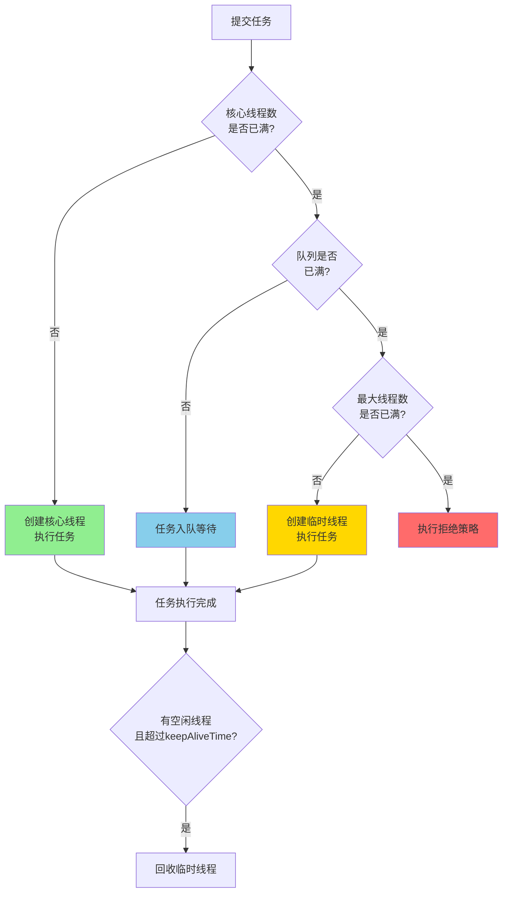
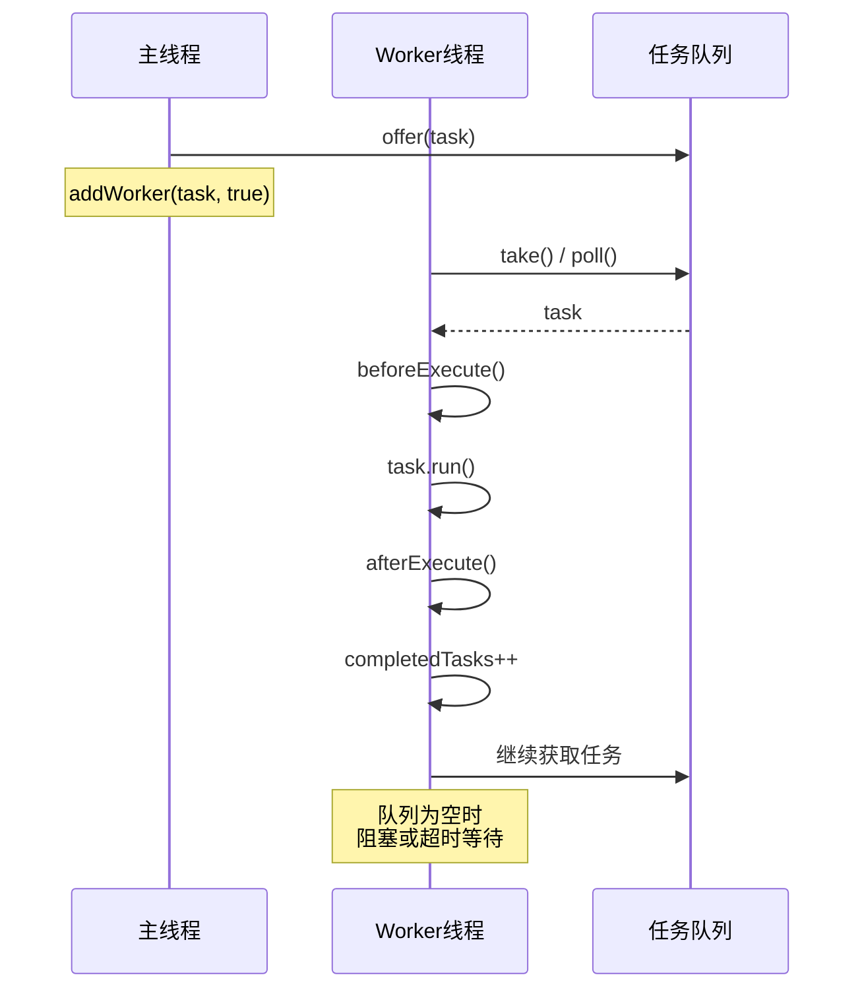
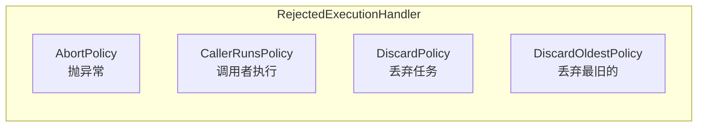

# 线程池核心参数与原理

**目标级别**：P5 / P6

## 快速自测

面试官问：「线程池的核心参数有哪些？线程池的工作流程是怎样的？如何合理设置线程池大小？」

你能回答到第几层？

---

## 一、核心问题

### 🔴 线程池的 7 个核心参数

```java title="ThreadPoolExecutor.java"
public ThreadPoolExecutor(
    int corePoolSize,              // 核心线程数
    int maximumPoolSize,           // 最大线程数
    long keepAliveTime,            // 空闲线程存活时间
    TimeUnit unit,                 // 时间单位
    BlockingQueue<Runnable> workQueue,    // 任务队列
    ThreadFactory threadFactory,   // 线程工厂
    RejectedExecutionHandler handler  // 拒绝策略
) { ... }
```

### 参数详解

| 参数 | 说明 | 默认值 |
|------|------|--------|
| **corePoolSize** | 核心线程数，即使空闲也不会回收 | - |
| **maximumPoolSize** | 最大线程数，核心线程 + 临时线程 | - |
| **keepAliveTime** | 空闲线程存活时间（临时线程） | - |
| **unit** | keepAliveTime 的时间单位 | - |
| **workQueue** | 任务队列 | - |
| **threadFactory** | 创建线程的工厂 | DefaultThreadFactory |
| **handler** | 拒绝策略 | AbortPolicy |

---

## 二、线程池工作流程

### 工作流程图解



### execute 源码解析

```java title="ThreadPoolExecutor.java"
public void execute(Runnable command) {
    if (command == null) throw new NullPointerException();
    
    int c = ctl.get();
    
    // 1. 核心线程数未满，创建核心线程
    if (workerCountOf(c) < corePoolSize) {
        if (addWorker(command, true))  // true = 核心线程
            return;
        c = ctl.get();
    }
    
    // 2. 核心线程满了，尝试入队
    if (isRunning(c) && workQueue.offer(command)) {
        int recheck = ctl.get();
        
        // 再次检查线程池状态（防止入队后被shutdown）
        if (!isRunning(recheck) && remove(command))
            reject(command);
        
        // 核心线程数为0时，需要一个线程处理队列
        else if (workerCountOf(recheck) == 0)
            addWorker(null, false);
    }
    
    // 3. 队列满了，创建临时线程
    else if (!addWorker(command, false))  // false = 临时线程
        reject(command);
}

// 添加工作线程
private boolean addWorker(Runnable firstTask, boolean core) {
    // 循环更新 workerCount
    for (;;) {
        int wc = workerCountOf(ctl.get());
        
        // 检查是否超过容量
        if (wc >= CAPACITY ||
            wc >= (core ? corePoolSize : maximumPoolSize))
            return false;
        
        // CAS 增加 workerCount
        if (compareAndIncrementWorkerCount(c))
            break;
    }
    
    // 创建 Worker 并启动
    Worker w = new Worker(firstTask);
    Thread t = w.thread;
    workers.add(w);
    t.start();
}
```

---

## 三、Worker 线程运行机制

### Worker 类的实现

```java title="ThreadPoolExecutor.java"
private final class Worker extends AbstractQueuedSynchronizer
        implements Runnable {
    
    final Thread thread;           // 执行线程
    Runnable firstTask;           // 第一个任务
    long completedTasks;           // 完成的任务数
    
    Worker(Runnable firstTask) {
        this.firstTask = firstTask;
        this.thread = getThreadFactory().newThread(this);
    }
    
    public void run() {
        runWorker(this);
    }
}

// Worker 运行循环
final void runWorker(Worker w) {
    Thread wt = Thread.currentThread();
    Runnable task = w.firstTask;
    w.firstTask = null;
    
    try {
        while (task != null || (task = getTask()) != null) {
            // 获取任务前加锁（防止中断）
            w.lock();
            
            // 确保线程未停止
            if ((runStateAtLeast(c, STOP) ||
                 (Thread.interrupted() && runStateAtLeast(c, STOP))) &&
                !wt.isInterrupted())
                wt.interrupt();
            
            try {
                beforeExecute(wt, task);
                try {
                    task.run();  // 执行任务
                    afterExecute(task, null);
                } catch (RuntimeException ex) {
                    afterExecute(task, ex);
                    throw ex;
                }
            } finally {
                task = null;
                w.completedTasks++;
                w.unlock();
            }
        }
    } finally {
        processWorkerExit(w, completedAbruptly);
    }
}

// 从队列获取任务
private Runnable getTask() {
    for (;;) {
        int c = ctl.get();
        int rs = runStateOf(c);
        
        // 线程池已停止，返回null
        if (rs >= SHUTDOWN && (rs >= STOP || workQueue.isEmpty()))
            return null;
        
        int wc = workerCountOf(c);
        
        // 是否需要回收
        boolean timed = allowCoreThreadTimeOut || wc > corePoolSize;
        
        if ((wc > maximumPoolSize || (timed && timedOut))
            && (wc > 1 || workQueue.isEmpty())) {
            if (compareAndDecrementWorkerCount(c))
                return null;
            continue;
        }
        
        try {
            // 从队列取任务
            Runnable r = timed ?
                workQueue.poll(keepAliveTime, TimeUnit.NANOSECONDS) :
                workQueue.take();
            
            if (r != null) return r;
            timedOut = true;
        } catch (InterruptedException retry) {
            timedOut = false;
        }
    }
}
```

### Worker 执行流程图



---

## 四、拒绝策略

### JDK 内置的 4 种策略



### 各策略实现

```java title="RejectedExecutionHandler.java"

// 1. AbortPolicy（默认）- 抛异常
public static class AbortPolicy implements RejectedExecutionHandler {
    public void rejectedExecution(Runnable r, ThreadPoolExecutor e) {
        throw new RejectedExecutionException(
            "Task " + r + " rejected from " + e);
    }
}

// 2. CallerRunsPolicy - 由调用者执行
public static class CallerRunsPolicy implements RejectedExecutionHandler {
    public void rejectedExecution(Runnable r, ThreadPoolExecutor e) {
        if (!e.isShutdown()) {
            r.run();  // 由调用线程执行
        }
    }
}

// 3. DiscardPolicy - 静默丢弃
public static class DiscardPolicy implements RejectedExecutionHandler {
    public void rejectedExecution(Runnable r, ThreadPoolExecutor e) {
        // 什么都不做，直接丢弃
    }
}

// 4. DiscardOldestPolicy - 丢弃队列最旧的任务
public static class DiscardOldestPolicy implements RejectedExecutionHandler {
    public void rejectedExecution(Runnable r, ThreadPoolExecutor e) {
        if (!e.isShutdown()) {
            e.getQueue().poll();  // 丢弃队头
            e.execute(r);          // 重新提交
        }
    }
}
```

### 拒绝策略对比

| 策略 | 行为 | 适用场景 |
|------|------|----------|
| **AbortPolicy** | 抛 `RejectedExecutionException` | 需要明确知道任务被拒绝 |
| **CallerRunsPolicy** | 调用者执行 | 任务积压时让调用者分担压力 |
| **DiscardPolicy** | 静默丢弃 | 允许丢失任务，不关心失败 |
| **DiscardOldestPolicy** | 丢弃最旧的 | 优先执行新任务，丢弃老任务 |

:::tip 自定义拒绝策略
实现 `RejectedExecutionHandler` 接口即可：
```java
ThreadPoolExecutor executor = new ThreadPoolExecutor(
    corePoolSize, maximumPoolSize, keepAliveTime, TimeUnit.SECONDS,
    new LinkedBlockingQueue<>(100),
    Executors.defaultThreadFactory(),
    (r, e) -> {
        // 自定义处理：写入日志、发送告警等
        log.warn("Task rejected: {}", r);
    }
);
```
:::

---

## 五、线程池状态


| 状态 | 值 | 说明 |
|------|-----|------|
| **RUNNING** | 111 | 接受新任务，处理队列任务 |
| **SHUTDOWN** | 000 | 不接受新任务，处理队列任务 |
| **STOP** | 001 | 不接受新任务，不处理队列任务，中断正在执行的任务 |
| **TIDYING** | 010 | 所有任务终止，workerCount = 0 |
| **TERMINATED** | 011 | terminated() 执行完成 |

---

## 六、Executors 工厂方法

### 常用线程池

```java title="Executors.java"

// 1. 固定大小线程池
ExecutorService fixed = Executors.newFixedThreadPool(10);
// core = max = 10，队列无限大

// 2. 单线程池
ExecutorService single = Executors.newSingleThreadExecutor();
// core = max = 1，队列无限大

// 3. 缓存线程池
ExecutorService cached = Executors.newCachedThreadPool();
// core = 0，max = Integer.MAX_VALUE，队列为 SynchronousQueue

// 4. 调度线程池
ScheduledExecutorService scheduled = Executors.newScheduledThreadPool(5);
```

### ⚠️ 潜在问题

| 线程池 | 问题 | 原因 |
|--------|------|------|
| **FixedThreadPool/SingleThreadExecutor** | 内存风险 | 队列 `LinkedBlockingQueue` 容量 `Integer.MAX_VALUE` |
| **CachedThreadPool** | 线程过多 | `maximumPoolSize = Integer.MAX_VALUE` |

```java title="推荐写法"
public class ThreadPoolUtils {
    
    // CPU 密集型：core = CPU核数 + 1
    // IO 密集型：core = CPU核数 * 2（或其他倍数）
    
    private static final int CPU_COUNT = Runtime.getRuntime().availableProcessors();
    
    public static ExecutorService newFixedThreadPool(int nThreads) {
        return new ThreadPoolExecutor(
            nThreads, nThreads,
            0L, TimeUnit.MILLISECONDS,
            new LinkedBlockingQueue<>(1024),  // 设置队列容量
            new ThreadFactoryBuilder().setNameFormat("pool-%d").build(),
            new ThreadPoolExecutor.AbortPolicy()
        );
    }
}
```

---

## 七、面试题精讲

### 🔴 第一层：线程池的核心参数

> **参考答案**：
>
> 线程池有 7 个核心参数：
> 1. **corePoolSize**：核心线程数
> 2. **maximumPoolSize**：最大线程数
> 3. **keepAliveTime**：空闲线程存活时间
> 4. **unit**：时间单位
> 5. **workQueue**：任务队列
> 6. **threadFactory**：线程工厂
> 7. **handler**：拒绝策略

### 🟡 第二层：线程池工作流程

> **参考答案**：
>
> 1. 提交任务后，先检查核心线程数是否已满
> 2. 未满，创建核心线程执行任务
> 3. 已满，尝试将任务加入队列
> 4. 队列未满，入队等待
> 5. 队列已满，检查最大线程数是否已满
> 6. 未满，创建临时线程执行任务
> 7. 已满，执行拒绝策略

### 🟡 第三层：如何设置线程池大小？

> **参考答案**：
>
> | 类型 | 公式 | 说明 |
> |------|------|------|
> | **CPU 密集型** | `CPU 核数 + 1` | 线程不会阻塞，主要做计算 |
> | **IO 密集型** | `CPU 核数 * 2`（或更多） | 线程会阻塞，等待 IO |
> | **混合型** | `CPU 核数 * (1 + 平均等待时间/平均执行时间)` | 根据实际比例调整 |
>
> 实际项目中，需要根据任务特性、性能监控调优。

### 💡 第四层：为什么阿里 Java 规范不推荐 Executors？

> **参考答案**：
>
> 阿里规范要求使用 `ThreadPoolExecutor` 手动创建线程池，原因是：
> 1. **FixedThreadPool/SingleThreadExecutor**：队列 `LinkedBlockingQueue` 默认 `Integer.MAX_VALUE`，可能导致 OOM
> 2. **CachedThreadPool**：`maximumPoolSize = Integer.MAX_VALUE`，可能导致创建过多线程
> 3. **可预测性**：手动创建可以明确线程池参数，便于排查问题

---

## 八、常见错误与陷阱

### ⚠️ 陷阱 1：使用有界队列还是无界队列？

```java
// 无界队列 - 可能 OOM
new LinkedBlockingQueue<>();  // Integer.MAX_VALUE

// 有界队列 - 更安全
new LinkedBlockingQueue<>(100);

// 队列满时创建临时线程
new ThreadPoolExecutor(
    corePoolSize, maximumPoolSize,
    keepAliveTime, TimeUnit.SECONDS,
    new ArrayBlockingQueue<>(100)
);
```

### ⚠️ 陷阱 2：线程池内的线程异常丢失

```java
// 异常被吞掉，线程不会退出
executor.execute(() -> {
    int x = 1 / 0;  // 异常被 catch 吞掉
});

// 正确做法：使用 Future
Future<?> future = executor.submit(() -> {
    int x = 1 / 0;
});
try {
    future.get();
} catch (ExecutionException e) {
    // 处理异常
}
```

### ⚠️ 陷阱 3：不复用线程池

```java
// 错误：每次都创建新的线程池
for (int i = 0; i < 100; i++) {
    new Thread(() -> doWork()).start();  // 创建 100 个线程
}

// 正确：使用线程池复用
ExecutorService executor = Executors.newFixedThreadPool(10);
for (int i = 0; i < 100; i++) {
    executor.execute(() -> doWork());
}
```

---

## 九、对比总结表

| 线程池类型 | corePoolSize | maximumPoolSize | 队列 |
|-----------|--------------|------------------|------|
| **FixedThreadPool** | n | n | LinkedBlockingQueue |
| **SingleThreadExecutor** | 1 | 1 | LinkedBlockingQueue |
| **CachedThreadPool** | 0 | Integer.MAX_VALUE | SynchronousQueue |
| **ScheduledThreadPool** | coreSize | Integer.MAX_VALUE | DelayedWorkQueue |

| 拒绝策略 | 行为 | 线程安全 |
|---------|------|----------|
| **AbortPolicy** | 抛异常 | 是 |
| **CallerRunsPolicy** | 调用者执行 | 是 |
| **DiscardPolicy** | 静默丢弃 | 是 |
| **DiscardOldestPolicy** | 丢弃最旧的 | 是 |

---

## 十、扩展思考

> **追问**：线程池如何实现线程复用？

Worker 线程从队列 `getTask()` 获取任务，执行完成后不销毁，而是继续从队列获取新任务。核心线程不会被 `keepAliveTime` 回收。

> **追问**：为什么需要两个计数器（ctl）？

`ctl` 使用 32 位 int，高 3 位表示线程池状态，低 29 位表示 worker 数量。一条 CAS 操作同时更新状态和数量，保证原子性。

---

## 延伸阅读

- [线程池 execute 流程](./threadpool-execute)
- [线程池大小设置](./threadpool-size)
- [拒绝策略对比](./reject-policy)
- [AQS 抽象队列同步器](./aqs)
