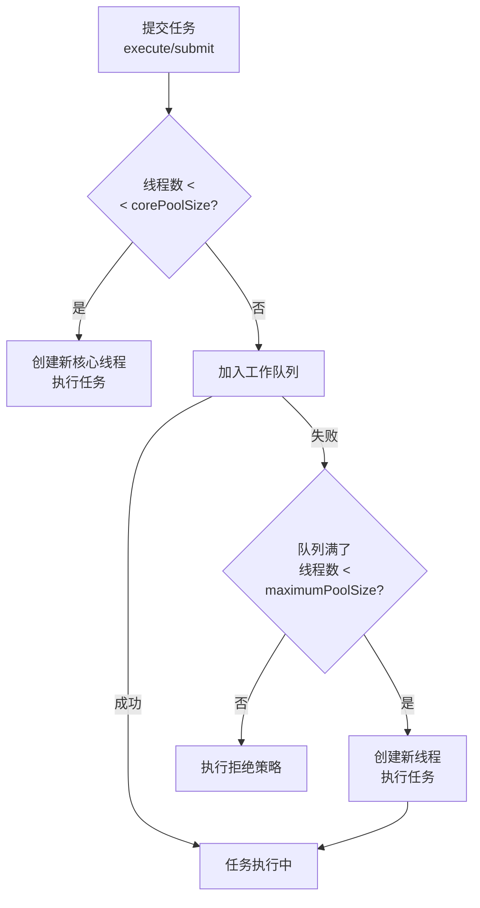

# 线程池7个核心参数

## 面试中的灵魂拷问

面试官问候选人小张："线程池有哪些核心参数？"

小张说："有corePoolSize、maximumPoolSize，还有...队列？"

面试官追问："线程池的执行流程是什么？什么时候会创建新线程？"

小张想了想："任务来了就执行..."

这个问题看似简单，但能完整说出7个参数并且理解它们关系的人不多。线程池是Java并发编程中最常用的工具，理解它的参数对写出高性能代码至关重要。

今天这篇文章，把线程池的7个参数讲透。

## 线程池的7个核心参数

### 参数一览

```java
public class ThreadPoolExecutor extends AbstractExecutorService {
    public ThreadPoolExecutor(
        int corePoolSize,              // 核心线程数
        int maximumPoolSize,           // 最大线程数
        long keepAliveTime,             // 存活时间
        TimeUnit unit,                 // 时间单位
        BlockingQueue<Runnable> workQueue,      // 工作队列
        ThreadFactory threadFactory,    // 线程工厂
        RejectedExecutionHandler handler  // 拒绝策略
    ) {
        // ...
    }
}
```

### 参数详解

| 参数 | 说明 | 作用 |
|------|------|------|
| **corePoolSize** | 核心线程数 | 池中保持的最小线程数 |
| **maximumPoolSize** | 最大线程数 | 池中允许的最大线程数 |
| **keepAliveTime** | 空闲线程存活时间 | 超过核心线程数的线程，空闲多久后终止 |
| **unit** | 时间单位 | keepAliveTime的单位 |
| **workQueue** | 工作队列 | 用于存放待执行任务的阻塞队列 |
| **threadFactory** | 线程工厂 | 创建线程的工厂，可以设置线程名、daemon等 |
| **handler** | 拒绝策略 | 当队列满了且达到最大线程数时的处理策略 |

## 线程池的执行流程

### 流程图



### 核心规则

```
1. 如果运行的线程数 < corePoolSize
   → 创建新核心线程处理任务

2. 如果运行的线程数 >= corePoolSize
   → 尝试将任务加入workQueue

3. 如果队列满了，无法加入
   → 如果运行的线程数 < maximumPoolSize
     → 创建新线程处理任务

4. 如果队列满了，且运行的线程数 >= maximumPoolSize
   → 执行拒绝策略
```

### 代码实现

```java
public void execute(Runnable command) {
    if (command == null)
        throw new NullPointerException();
    
    int c = ctl.get();
    
    // 1. 如果核心线程数未满，创建新核心线程
    if (workerCountOf(c) < corePoolSize) {
        if (addWorker(command, true))
            return;
        c = ctl.get();
    }
    
    // 2. 尝试加入队列
    if (isRunning(c) && workQueue.offer(command)) {
        int recheck = ctl.get();
        if (!isRunning(recheck) && remove(command))
            reject(command);
        else if (workerCountOf(recheck) == 0)
            addWorker(null, false);
        return;
    }
    
    // 3. 队列满了，尝试创建新线程
    else if (!addWorker(command, false))
        reject(command);
}
```

## 核心线程数（corePoolSize）

### 什么是核心线程

```java
public class CorePoolSizeDemo {
    public void demo() {
        ThreadPoolExecutor executor = new ThreadPoolExecutor(
            5,           // 核心线程数：5
            10,          // 最大线程数：10
            60L,         // 空闲存活时间
            TimeUnit.SECONDS,
            new LinkedBlockingQueue<>(100),
            Executors.defaultThreadFactory(),
            new ThreadPoolExecutor.AbortPolicy()
        );
        
        // 即使没有任务，线程池也会保持5个线程
        // 这些就是"核心线程"
    }
}
```

### 核心线程会被销毁吗？

```java
public class CorePoolBehavior {
    public void demo() {
        ThreadPoolExecutor executor = new ThreadPoolExecutor(
            5,    // 核心线程数
            10,   // 最大线程数
            60L,  TimeUnit.SECONDS,
            new LinkedBlockingQueue<>()
        );
        
        // 默认情况下：核心线程不会因为空闲而被销毁
        // 只有超过corePoolSize的部分，才会受keepAliveTime限制
        
        // 如果想回收核心线程：
        // executor.allowCoreThreadTimeOut(true);
    }
}
```

### 预启动核心线程

```java
public class PrestartDemo {
    public void demo() {
        ThreadPoolExecutor executor = new ThreadPoolExecutor(
            5, 10, 60L, TimeUnit.SECONDS,
            new LinkedBlockingQueue<>()
        );
        
        // 预启动所有核心线程
        executor.prestartAllCoreThreads();
        
        // 或者预启动单个
        executor.prestartCoreThread();
    }
}
```

## 最大线程数（maximumPoolSize）

### 与corePoolSize的关系

```java
public class MaxPoolSizeDemo {
    public void demo() {
        ThreadPoolExecutor executor = new ThreadPoolExecutor(
            5,    // 核心线程数
            10,   // 最大线程数
            60L,  TimeUnit.SECONDS,
            new LinkedBlockingQueue<>(100)
        );
        
        // 线程数范围：[5, 10]
        // 正常情况下：保持5个核心线程
        // 任务高峰：最多扩展到10个线程
        // 任务减少：核心线程不会被回收（默认）
    }
}
```

### 为什么需要两个值？

```java
// 单一线程池（假设core=max=10）
// 问题：即使没有任务，也会保持10个线程，浪费资源

// 分离核心和最大
// 优点：
// 1. 正常情况下只占用少量资源（core线程）
// 2. 任务高峰时可以扩展（max线程）
// 3. 任务减少后可以回收（超过core的部分）
```

## 空闲存活时间（keepAliveTime）

### 概念

```java
public class KeepAliveTimeDemo {
    public void demo() {
        ThreadPoolExecutor executor = new ThreadPoolExecutor(
            5,    // 核心线程数
            10,   // 最大线程数
            60L,  // 空闲存活时间
            TimeUnit.SECONDS,
            new LinkedBlockingQueue<>()
        );
        
        // 当线程数 > 5时
        // 超过60秒没有任务，线程会被销毁
        // 直到线程数降到5
        
        // 关键：只影响超过corePoolSize的线程
        // 核心线程（5个）默认不会被回收
    }
}
```

### 允许核心线程超时

```java
public class AllowCoreTimeoutDemo {
    public void demo() {
        ThreadPoolExecutor executor = new ThreadPoolExecutor(
            5, 10, 60L, TimeUnit.SECONDS,
            new LinkedBlockingQueue<>()
        );
        
        // 允许核心线程也被回收
        executor.allowCoreThreadTimeOut(true);
        
        // 现在所有线程都会在空闲60秒后被回收
        // 线程数范围：[0, 10]
    }
}
```

## 工作队列（workQueue）

### 队列类型

| 队列类型 | 特点 | 适用场景 |
|----------|------|----------|
| **LinkedBlockingQueue** | 可选有界/无界，链表实现 | 吞吐量优先 |
| **ArrayBlockingQueue** | 必须有界，数组实现 | 固定大小，防止OOM |
| **SynchronousQueue** | 不存储元素，直接交付 | 零延迟，高吞吐 |
| **PriorityBlockingQueue** | 无界，优先级顺序 | 任务优先级 |

### 无界队列的问题

```java
public class UnboundedQueueProblem {
    public void mistake() {
        // ❌ 危险：无界队列可能导致OOM
        ThreadPoolExecutor executor = new ThreadPoolExecutor(
            2,    // 核心线程数
            2,    // 最大线程数
            60L,  TimeUnit.SECONDS,
            new LinkedBlockingQueue<>()  // 无界！
        );
        
        // 问题：
        // 1. 任务持续堆积
        // 2. 队列无限增长
        // 3. 最终OOM
        
        // 线程数永远是2，不会扩展
    }
}
```

### 有界队列的选择

```java
public class BoundedQueueDemo {
    public void correct() {
        // ✅ 合理配置
        ThreadPoolExecutor executor = new ThreadPoolExecutor(
            10,   // 核心线程数
            50,   // 最大线程数
            60L,  TimeUnit.SECONDS,
            new ArrayBlockingQueue<>(1000),  // 有界
            new ThreadPoolExecutor.CallerRunsPolicy()  // 拒绝策略
        );
        
        // 流程：
        // 1. 10个核心线程处理
        // 2. 队列积压到1000
        // 3. 创建新线程，最多到50个
        // 4. 超过50个+队列满，执行拒绝策略
    }
}
```

### SynchronousQueue

```java
public class SynchronousQueueDemo {
    public void demo() {
        ThreadPoolExecutor executor = new ThreadPoolExecutor(
            0,              // 核心线程数0
            Integer.MAX_VALUE,  // 最大线程数
            60L, TimeUnit.SECONDS,
            new SynchronousQueue<>()  // 不存储
        );
        
        // 特点：
        // 1. put()必须等待take()
        // 2. take()必须等待put()
        // 3. 没有缓冲，直接交付
        
        // 用途：Executors.newCachedThreadPool()
    }
}
```

## 线程工厂（threadFactory）

### 默认工厂

```java
public class DefaultThreadFactory implements ThreadFactory {
    private static final AtomicInteger poolNumber = new AtomicInteger(1);
    private final ThreadGroup group;
    private final AtomicInteger threadNumber = new AtomicInteger(1);
    private final String namePrefix;
    
    public Thread newThread(Runnable r) {
        Thread t = new Thread(group, r,
            namePrefix + threadNumber.getAndIncrement(),
            0);
        if (t.isDaemon())
            t.setDaemon(false);
        if (t.getPriority() != Thread.NORM_PRIORITY)
            t.setPriority(Thread.NORM_PRIORITY);
        return t;
    }
}
```

### 自定义工厂

```java
public class CustomThreadFactory implements ThreadFactory {
    private final ThreadGroup group;
    private final AtomicInteger threadNumber = new AtomicInteger(1);
    private final String namePrefix;
    
    public CustomThreadFactory(String namePrefix) {
        SecurityManager s = System.getSecurityManager();
        group = (s != null) ? s.getThreadGroup() : Thread.currentThread().getThreadGroup();
        this.namePrefix = namePrefix;
    }
    
    @Override
    public Thread newThread(Runnable r) {
        Thread thread = new Thread(group, r,
            namePrefix + "-thread-" + threadNumber.getAndIncrement(), 0);
        
        // 设置为非守护线程
        thread.setDaemon(false);
        
        // 设置优先级
        thread.setPriority(Thread.NORM_PRIORITY);
        
        // 设置未捕获异常处理器
        thread.setUncaughtExceptionHandler((t, e) -> {
            System.err.println("线程 " + t.getName() + " 异常: " + e.getMessage());
        });
        
        return thread;
    }
}

// 使用
ThreadPoolExecutor executor = new ThreadPoolExecutor(
    10, 50, 60L, TimeUnit.SECONDS,
    new LinkedBlockingQueue<>(1000),
    new CustomThreadFactory("MyPool"),
    new ThreadPoolExecutor.AbortPolicy()
);
```

## 拒绝策略（handler）

### 内置策略

| 策略 | 行为 |
|------|------|
| **AbortPolicy** | 抛出RejectedExecutionException（默认） |
| **CallerRunsPolicy** | 由提交任务的线程执行 |
| **DiscardPolicy** | 静默丢弃任务 |
| **DiscardOldestPolicy** | 丢弃队列最旧的任务，重试当前 |

### 详细说明

```java
public class RejectionPolicies {
    // AbortPolicy：默认策略，抛异常
    public void abortPolicy() {
        ThreadPoolExecutor executor = new ThreadPoolExecutor(
            2, 2, 0L, TimeUnit.MILLISECONDS,
            new SynchronousQueue<>(),
            new ThreadPoolExecutor.AbortPolicy()
        );
        
        try {
            executor.execute(() -> System.out.println("task"));
        } catch (RejectedExecutionException e) {
            System.out.println("任务被拒绝");
        }
    }
    
    // CallerRunsPolicy：由调用线程执行
    public void callerRunsPolicy() {
        ThreadPoolExecutor executor = new ThreadPoolExecutor(
            2, 2, 0L, TimeUnit.MILLISECONDS,
            new SynchronousQueue<>(),
            new ThreadPoolExecutor.CallerRunsPolicy()
        );
        
        // 任务被拒绝时，由提交任务的线程执行
        // 起到限流作用：提交速度会被迫减慢
    }
    
    // DiscardPolicy：静默丢弃
    public void discardPolicy() {
        ThreadPoolExecutor executor = new ThreadPoolExecutor(
            2, 2, 0L, TimeUnit.MILLISECONDS,
            new SynchronousQueue<>(),
            new ThreadPoolExecutor.DiscardPolicy()
        );
        
        // 任务被静默丢弃，没有任何通知
    }
    
    // DiscardOldestPolicy：丢弃最旧的
    public void discardOldestPolicy() {
        ThreadPoolExecutor executor = new ThreadPoolExecutor(
            2, 2, 0L, TimeUnit.MILLISECONDS,
            new SynchronousQueue<>(),
            new ThreadPoolExecutor.DiscardOldestPolicy()
        );
        
        // 丢弃队列最老的任务，然后重试当前任务
    }
}
```

### 自定义策略

```java
public class CustomRejection implements RejectedExecutionHandler {
    @Override
    public void rejectedExecution(Runnable r, ThreadPoolExecutor executor) {
        // 记录日志
        System.err.println("任务被拒绝: " + r);
        
        // 发送告警
        alertService.send("线程池拒绝任务");
        
        // 持久化任务
        taskRepository.save((Task) r);
        
        // 或者重试其他线程池
        backupExecutor.execute(r);
    }
}
```

## 常用线程池配置

### CPU密集型

```java
public class CpuIntensiveConfig {
    public ThreadPoolExecutor create() {
        // CPU密集型：线程数 = CPU核心数 + 1
        int cores = Runtime.getRuntime().availableProcessors();
        
        return new ThreadPoolExecutor(
            cores + 1,
            cores + 1,
            0L, TimeUnit.MILLISECONDS,
            new LinkedBlockingQueue<>(1000),
            new CustomThreadFactory("CPU-"),
            new ThreadPoolExecutor.AbortPolicy()
        );
    }
}
```

### IO密集型

```java
public class IoIntensiveConfig {
    public ThreadPoolExecutor create() {
        // IO密集型：线程数 = CPU核心数 * 2
        int cores = Runtime.getRuntime().availableProcessors();
        
        return new ThreadPoolExecutor(
            cores * 2,
            cores * 2,
            60L, TimeUnit.SECONDS,
            new LinkedBlockingQueue<>(1000),
            new CustomThreadFactory("IO-"),
            new ThreadPoolExecutor.AbortPolicy()
        );
    }
}
```

### 混合型

```java
public class MixedConfig {
    public ThreadPoolExecutor create() {
        int cores = Runtime.getRuntime().availableProcessors();
        
        // 核心线程处理IO，最大线程处理CPU
        return new ThreadPoolExecutor(
            cores,
            cores * 2,
            60L, TimeUnit.SECONDS,
            new ArrayBlockingQueue<>(500),
            new CustomThreadFactory("Mixed-"),
            new ThreadPoolExecutor.CallerRunsPolicy()
        );
    }
}
```

## 【学习小结】

1. **7个参数**：corePoolSize、maximumPoolSize、keepAliveTime、unit、workQueue、threadFactory、handler
2. **执行流程**：核心线程 → 队列 → 最大线程 → 拒绝
3. **corePoolSize**：保持的最小线程数
4. **maximumPoolSize**：允许的最大线程数
5. **keepAliveTime**：超过core的线程空闲多久后终止
6. **workQueue**：无界队列可能导致OOM，有界队列更安全
7. **threadFactory**：自定义线程创建过程
8. **handler**：队列满且达到最大线程数时的处理策略

---

**延伸阅读**：
- [线程池execute流程](/java/concurrent/threadpool-execute)
- [线程池大小如何设置](/java/concurrent/threadpool-size)
- [线程池拒绝策略对比](/java/concurrent/reject-policy)